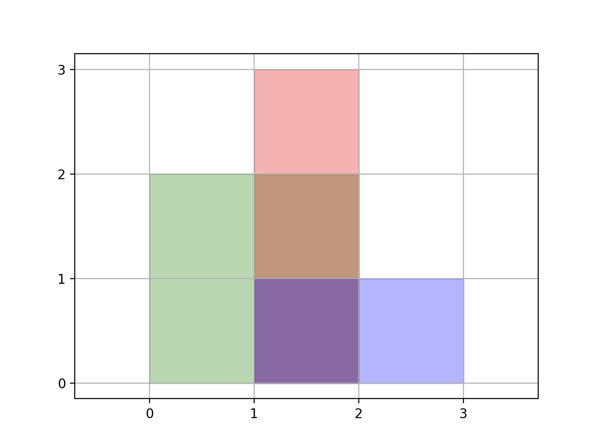

[TOC]

## Solution
---

### Approach 1: Coordinate Compression

#### Intuition

<center>
    
</center>

Suppose instead of $rectangles = [[0,0,2,2],[1,0,2,3],[1,0,3,1]]$, we had `[[0,0,200,200],[100,0,200,300],[100,0,300,100]]`.  The answer would just be 100 times bigger.

What about if $rectangles = [[0,0,2,2],[1,0,2,3],[1,0,30002,1]]$ ?  Only the blue region would have area `30000` instead of `1`.

Our idea is this: we'll take all the `x` and `y` coordinates, and re-map them to `0, 1, 2, ...` etc.  For example, if $rectangles = [[0,0,200,200],[100,0,200,300],[100,0,300,100]]$, we could re-map it to `[[0,0,2,2],[1,0,2,3],[1,0,3,1]]`.  Then, we can solve the problem with brute force.  However, each region may actually represent some larger area, so we'll need to adjust for that at the end.

#### Algorithm

Re-map each `x` coordinate to `0, 1, 2, ...`.  Independently, re-map all `y` coordinates too.

We then have a problem that can be solved by brute force: for each rectangle with re-mapped coordinates `(rx1, ry1, rx2, ry2)`, we can fill the grid $\text{grid}[x][y] = True$ for $rx1 \le x < rx2$ and $ry1 \le y < ry2$.

Afterwards, each $\text{grid}[rx][ry]$ represents the area $(imapx(rx+1) - imapx(rx)) * (imapy(ry+1) - imapy(ry))$, where if `x` got remapped to `rx`, then $imapx(rx) = x$ ("inverse-map-x of remapped-x equals x"), and similarly for `imapy`.

#### Implementation

```python
class Solution:
    def rectangleArea(self, rectangles: List[List[int]]) -> int:
        N = len(rectangles)
        x_vals, y_vals = set(), set()
        for x1, y1, x2, y2 in rectangles:
            x_vals.add(x1)
            x_vals.add(x2)
            y_vals.add(y1)
            y_vals.add(y2)

        imapx = sorted(x_vals)
        imapy = sorted(y_vals)
        mapx = {x: i for i, x in enumerate(imapx)}
        mapy = {y: i for i, y in enumerate(imapy)}

        grid = [[0] * len(imapy) for _ in imapx]
        for x1, y1, x2, y2 in rectangles:
            for x in range(mapx[x1], mapx[x2]):
                for y in range(mapy[y1], mapy[y2]):
                    grid[x][y] = 1

        ans = 0
        for x, row in enumerate(grid):
            for y, val in enumerate(row):
                if val:
                    ans += (imapx[x+1] - imapx[x]) * (imapy[y+1] - imapy[y])
        return ans % (10**9 + 7)
```

#### Complexity Analysis

* Time Complexity:  $O(N^3)$, where $N$ is the number of rectangles.

* Space Complexity:  $O(N^2)$.
<br />
<br />

---

### Approach 2: Line Sweep

#### Intuition

Imagine we pass a horizontal line from bottom to top over the shape.  We have some active intervals on this horizontal line, which gets updated twice for each rectangle.  In total, there are $2 * N$ events, and we can update our (up to $N$) active horizontal intervals for each update.

#### Algorithm

For a rectangle like $rec = [1,0,3,1]$, the first update is to add `[1, 3]` to the active set at $y = 0$, and the second update is to remove `[1, 3]` at $y = 1$.  Note that adding and removing respects multiplicity - if we also added `[0, 2]` at $y = 0$, then removing `[1, 3]` at $y = 1$ will still leave us with `[0, 2]` active.

This gives us a plan: create these two events for each rectangle, then process all the events in sorted order of `y`.  The issue now is deciding how to process the events `add(x1, x2)` and `remove(x1, x2)` such that we are able to `query()` the total horizontal length of our active intervals.

We can use the fact that our `remove(...)` operation will always be on an interval that was previously added.  Let's store all the `(x1, x2)` intervals in sorted order.  Then, we can `query()` in linear time using a technique similar to a classic LeetCode problem, [Merge Intervals](https://leetcode.com/problems/merge-intervals/).

#### Implementation

```python
class Solution:
    def rectangleArea(self, rectangles: List[List[int]]) -> int:
        # Populate events
        OPEN, CLOSE = 0, 1
        events = []
        for x1, y1, x2, y2 in rectangles:
            events.append((y1, OPEN, x1, x2))
            events.append((y2, CLOSE, x1, x2))
        events.sort()

        def query():
            ans = 0
            cur = -1
            for x1, x2 in active:
                cur = max(cur, x1)
                ans += max(0, x2 - cur)
                cur = max(cur, x2)
            return ans

        active = []
        cur_y = events[0][0]
        ans = 0
        for y, typ, x1, x2 in events:
            # For all vertical ground covered, update answer
            ans += query() * (y - cur_y)

            # Update active intervals
            if typ is OPEN:
                active.append((x1, x2))
                active.sort()
            else:
                active.remove((x1, x2))

            cur_y = y

        return ans % (10**9 + 7)
```

#### Complexity Analysis

* Time Complexity:  $O(N^2 \log N)$, where $N$ is the number of rectangles.

* Space Complexity:  $O(N)$.
<br />
<br />

---

### Approach 3: Segment Tree

#### Intuition and Algorithm

As in *Approach #3*, we want to support `add(x1, x2)`, `remove(x1, x2)`, and `query()`.  While outside the scope of a typical interview, this is the perfect setting for using a *segment tree*.  For completeness, we include the following implementation.

You can learn more about Segment Trees by visiting the articles of these problems: [Falling Squares](https://leetcode.com/problems/falling-squares/), [Number of Longest Increasing Subsequence](https://leetcode.com/problems/number-of-longest-increasing-subsequence/).

#### Implementation

```python
class Node:
    def __init__(self, start: int, end: int, X: List[int]) -> None:
        self.start, self.end = start, end
        self.total = self.count = 0
        self._left = self._right = None
        self.X = X

    @property
    def mid(self):
        return (self.start + self.end) // 2

    @property
    def left(self):
        self._left = self._left or Node(self.start, self.mid, self.X)
        return self._left

    @property
    def right(self):
        self._right = self._right or Node(self.mid, self.end, self.X)
        return self._right

    def update(self, i: int, j: int, val: int) -> int:
        if i >= j: return 0
        if self.start == i and self.end == j:
            self.count += val
        else:
            self.left.update(i, min(self.mid, j), val)
            self.right.update(max(self.mid, i), j, val)

        if self.count > 0:
            self.total = self.X[self.end] - self.X[self.start]
        else:
            self.total = self.left.total + self.right.total

        return self.total

class Solution:
    def rectangleArea(self, rectangles: List[List[int]]) -> int:
        OPEN, CLOSE = 1, -1
        events = []

        X = set()
        for x1, y1, x2, y2 in rectangles:
            if (x1 < x2) and (y1 < y2):
                events.append((y1, OPEN, x1, x2))
                events.append((y2, CLOSE, x1, x2))
                X.add(x1)
                X.add(x2)
        events.sort()

        X = sorted(X)
        x_index = {x: i for i, x in enumerate(X)}
        active = Node(0, len(X) - 1, X)
        ans = 0
        cur_x_sum = 0
        cur_y = events[0][0]

        for y, typ, x1, x2 in events:
            ans += cur_x_sum * (y - cur_y)
            cur_x_sum = active.update(x_index[x1], x_index[x2], typ)
            cur_y = y

        return ans % (10**9 + 7)
```

#### Complexity Analysis

Let $N$ be the number of rectangles.

* Time Complexity: $O(N^2)$

    The update operation takes $O(\log N)$ in the average case and $O(N)$ in the worst case when the segment tree is unbalanced. `update()` is called $N$ times, so the overall time complexity is $O(N \log N)$ in the average case and $O(N^2)$ in the worst case.

* Space Complexity:  $O(N)$.
<br />
<br />