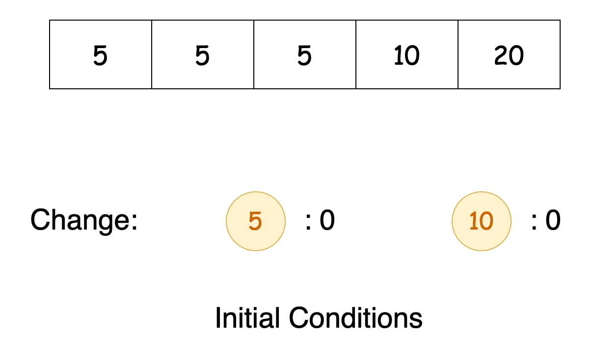
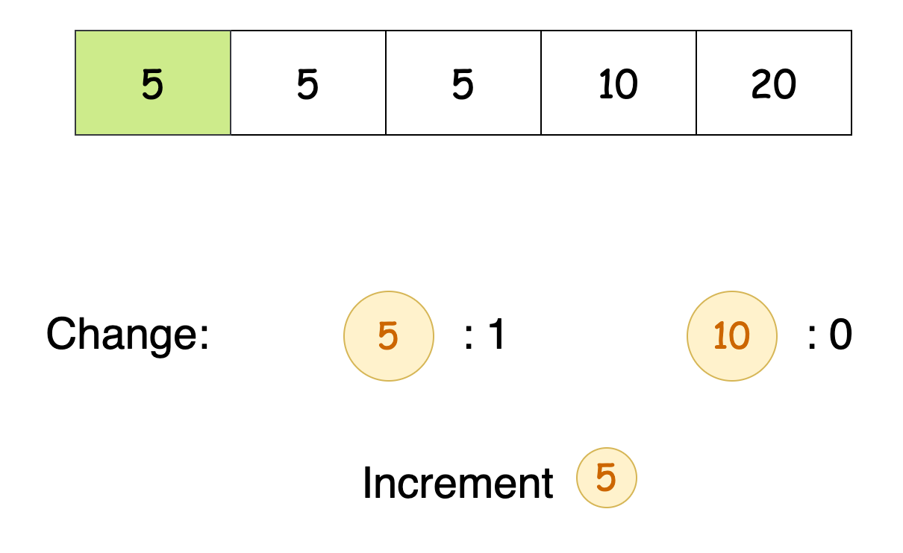
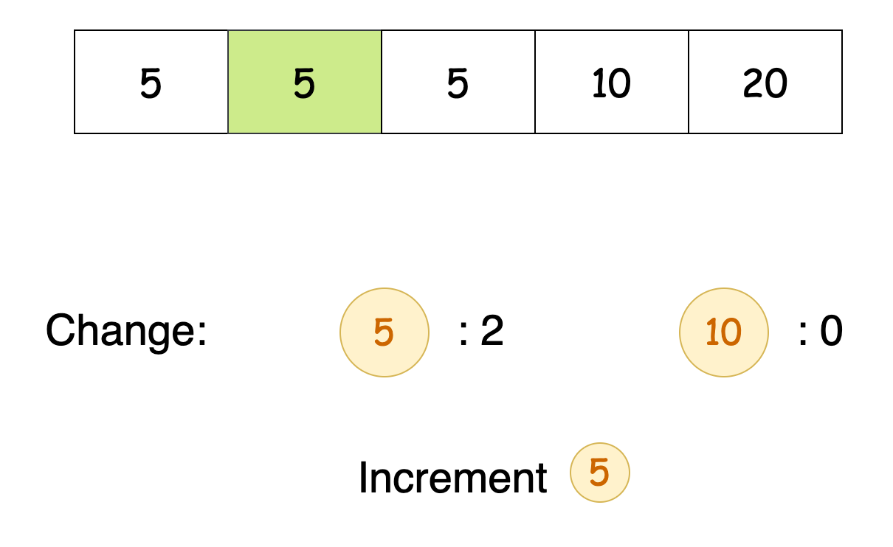
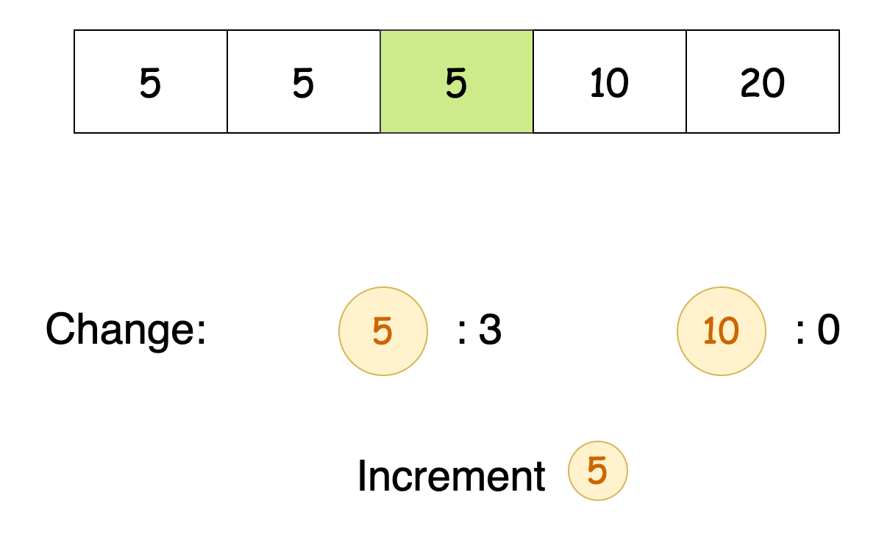
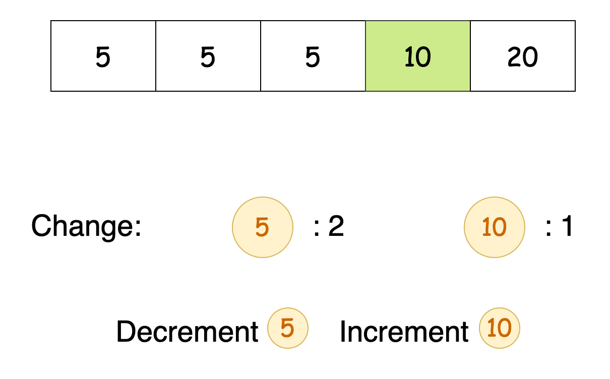
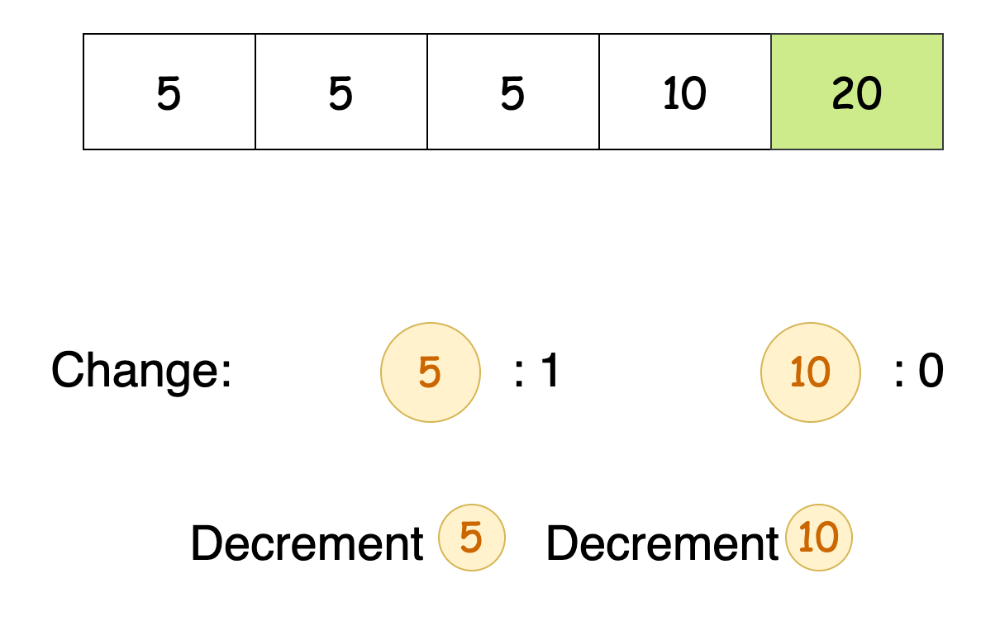
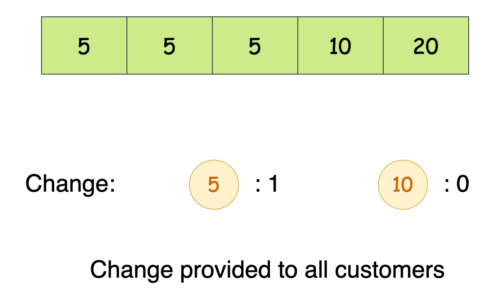

[TOC]

## Solution

---

### Approach: Simulation

#### Intuition

Customers can pay in three ways:

1. 5-dollar bill: Since each lemonade costs 5 dollars, no change is necessary. We simply add the 5-dollar bill to our collection.

2. 10-dollar bill: We need to provide 5 dollars in change. If we have a 5-dollar bill available, we give it to the customer and add the 10-dollar bill to our collection. If we lack a 5-dollar bill, the transaction fails and we can return `false`.

3. 20-dollar bill: We must provide 15 dollars in change. We can do this in two ways:
   - Give one 10-dollar bill and one 5-dollar bill.
   - Give three 5-dollar bills.

To solve this problem, we'll iterate through the `bills` array and keep track of the available change we have at any given turn. This means tracking the number of 5-dollar and 10-dollar bills. Interestingly, we won't need to track the 20-dollar bills since they aren't needed to make change.

Since the 5-dollar bill is required for **both** the 10-dollar and 20-dollar transactions and the 10-dollar bill can only be used in the 20-dollar transactions, we want to prioritize using the 10-dollar bill when possible.

The solution to this problem involves making a series of individual decisions to optimize the final outcome. We don't need to revisit past choices, and by conserving critical resources (like 5-dollar bills), we increase the chances of completing all transactions. This straightforward, resource-conserving approach aligns perfectly with the principles of a greedy algorithm.

The slideshow below demonstrates this algorithm in action:















<details>
  <summary>Proof by Induction</summary>

    Claim: The greedy algorithm succeeds for n customers if and only if it's possible to make change for n customers.

    Base case (n=0): Trivially true.

    Inductive Hypothesis: Assume the claim holds for n customers. This means:

    If the greedy algorithm succeeds for the first n customers, then it is possible to make change for all n customers.
    If it is possible to make change for the first n customers, then the greedy algorithm succeeded for all n customers.
    In other words, for any sequence of n customers, the greedy algorithm will have succeeded in making change if and only if it was possible to do so.

    We consider three cases for the (n+1)th customer:

    5-dollar bill: Always accepted, preserving the inductive hypothesis.

    10-dollar bill: Requires one 5-dollar bill. If available, the greedy algorithm succeeds. If unavailable, no solution could exist (contradicting the possibility of making change), preserving the hypothesis.

    20-dollar bill: Requires either (1x10 + 1x5) dollars or (3x5) dollars. If available, the greedy algorithm succeeds. If unavailable, no solution could exist, preserving the hypothesis.

    In all cases, the greedy algorithm succeeds for the (n+1)th customer if and only if it's possible to make change, extending our hypothesis to n+1 customers.

    Therefore, by induction, the claim holds for all n.

</details>

#### Algorithm

- Initialize two variables, `fiveDollarBills` and `tenDollarBills`, to keep track of the count of 5-dollar and 10-dollar bills, respectively.
- Iterate through each bill `customerBill` in the `bills` array:
  - If `customerBill` is `5`, increment `fiveDollarBills`.
  - If `customerBill` is `10`:
- Check if there is at least one `fiveDollarBills`:
      - If there is, decrement `fiveDollarBills` by `1` and increment `tenDollarBills` by `1`.
      - Otherwise, return `false`.
  - If `customerBill` is `20`:
- Check if there are at least one `fiveDollarBills` and one `tenDollarBills`:
      - If there are, decrement `fiveDollarBills` and `tenDollarBills` by `1`.
- Else, check if there are at least three  `fiveDollarBills` available:
      - If so, decrement `fiveDollarBills` by `3`.
- If neither conditions are met, return `false`.
- Return `true` as our answer.

#### Implementation

```python
class Solution:
    def lemonadeChange(self, bills: List[int]) -> bool:
        # Count of $5 and $10 bills in hand
        five_dollar_bills = 0
        ten_dollar_bills = 0

        # Iterate through each customer's bill
        for customer_bill in bills:
            if customer_bill == 5:
                # Just add it to our count
                five_dollar_bills += 1
            elif customer_bill == 10:
                # We need to give $5 change
                if five_dollar_bills > 0:
                    five_dollar_bills -= 1
                    ten_dollar_bills += 1
                else:
                    # Can't provide change, return false
                    return False
            else:  # customer_bill == 20
                # We need to give $15 change
                if ten_dollar_bills > 0 and five_dollar_bills > 0:
                    # Give change as one $10 and one $5
                    five_dollar_bills -= 1
                    ten_dollar_bills -= 1
                elif five_dollar_bills >= 3:
                    # Give change as three $5
                    five_dollar_bills -= 3
                else:
                    # Can't provide change, return false
                    return False
        # If we've made it through all customers, return true
        return True
```

#### Complexity Analysis

Let $n$ be the length of the `bills` array.

- Time complexity: $O(n)$

    The algorithm loops over the length of `bills` once, taking $O(n)$ time. All operations within the loop are constant time operations.

    Thus, the time complexity of the algorithm is $O(n)$.

- Space complexity: $O(1)$

    The algorithm does not use any additional data structures that scale with the input size. Thus, the space complexity remains constant.

---