[TOC]

## Solution

---

### Overview

We are given an array `nums` that contains both positive and negative values, along with an integer `k`. Our goal is to find the shortest non-empty subarray whose sum is greater than or equal to `k`.

This problem is very similar to [209. Minimum Size Subarray Sum](https://leetcode.com/problems/minimum-size-subarray-sum/description/) with one key difference: we have negative values here. We strongly suggest solving the original problem first, as our solution will build upon that approach.

The original problem was solved using a variable-length sliding window, but that approach will no longer work here. Let's take an example to understand why:

Consider `nums = [2, -1, 1, 3]` and $k = 4$.

Let's walk through a naive variable-size sliding window approach step by step:

1. Start with window `[2]`: sum = 2 (not $\geq$ 4)
2. Expand to `[2, -1]`: sum = 1 (not $\geq$ 4)
3. Expand to `[2, -1, 1]`: sum = 2 (not $\geq$ 4)
4. Expand to `[2, -1, 1, 3]`: sum = 5 ($\geq$ 4)

Now, we try to minimize the window size by shrinking the window from the left.

1. Remove the first element. Window: `[-1, 1, 3]`: sum = 3 (not $\geq$ 4)

The sliding window now stops because it assumes reducing the window further would only decrease the sum value. However, if it shrinks once more:

2. Remove the second element. Window: `[1, 3]`: sum = 4 ($\geq$ 4)

We find that our condition is satisfied again, and we find our required answer.

The negative value -1 breaks the monotonic sum property that a standard sliding window relies on, making a simple variable-length sliding window approach unreliable.

---

### Approach 1: Priority Queue

#### Intuition

The brute force approach would be to loop over all subarrays in `nums` and check if their sums exceed `k`. The smallest one among them is our answer. However, this approach is too slow for our constraints.

Let's identify the redundancies in the above approach. One major issue is that we keep recalculating the same subarray sums multiple times. We can solve this by creating a prefix sum array, which lets us quickly find the sum of any subarray. Using this array, we can look at each element and find an earlier prefix sum that, when subtracted from our current sum, gives us a value of at least k.

However, searching for the best prefix sum for each index is still too slow. What we really need is a way to quickly find the "best" prefix sum – one with the lowest value that's also closest to our current position.

This is where a heap (also called a priority queue) becomes useful. We can store pairs of [prefix sum, ending index] in the heap, arranged so that the lowest sum is always at the top. This helps us quickly find the best previous sum to use.

Let's loop over the `nums` array now, keeping track of the running sum in a variable called `cumulativeSum`. We'll also keep track of our result in the variable `shortestSubarrayLength`. If the `cumulativeSum` meets our constraints, we consider it as a potential result. Otherwise, we'll loop over the top elements of the heap while the difference between `cumulativeSum` and the sum of the top element is $\geq k$. For each such element, we check if it is the minimum length subarray we've found till now. After checking an element in the heap, it can be discarded since all further sums in the loop will result in longer subarrays (and can never be the answer). Once we've exhausted all valid previous prefix sums, we can add the current sum and the index to the heap.

After the loop completes, we can return `cumulativeSum` as the required shortest subarray with a sum of at least `k`.

The algorithm is visualized in the slideshow below:

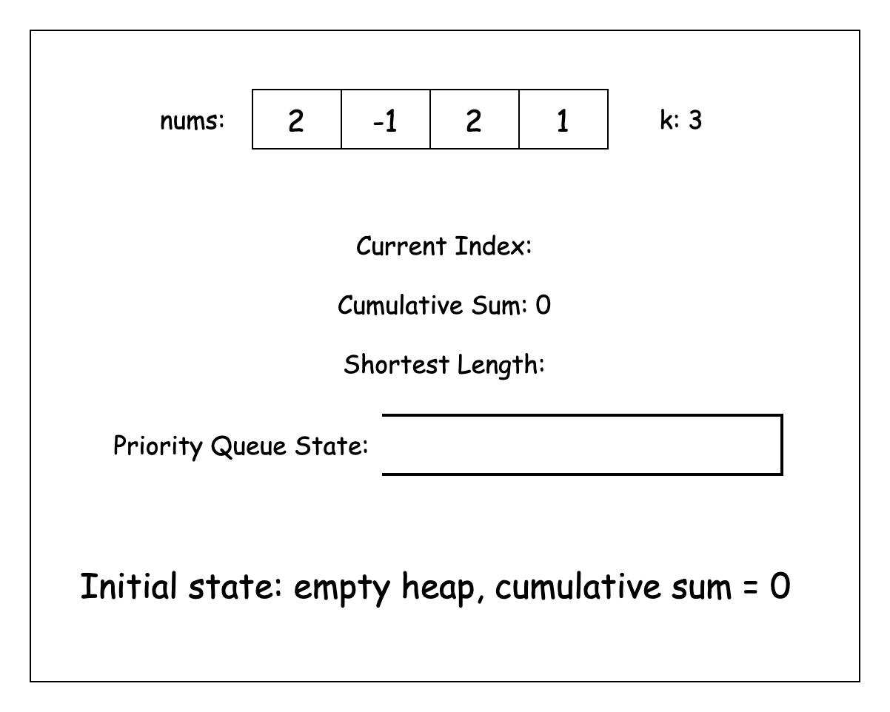

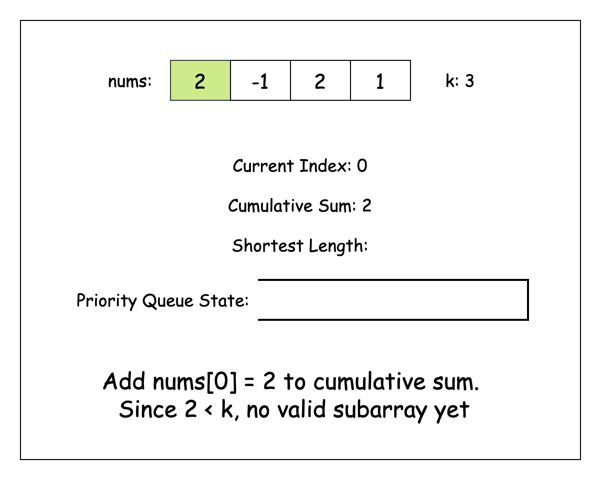

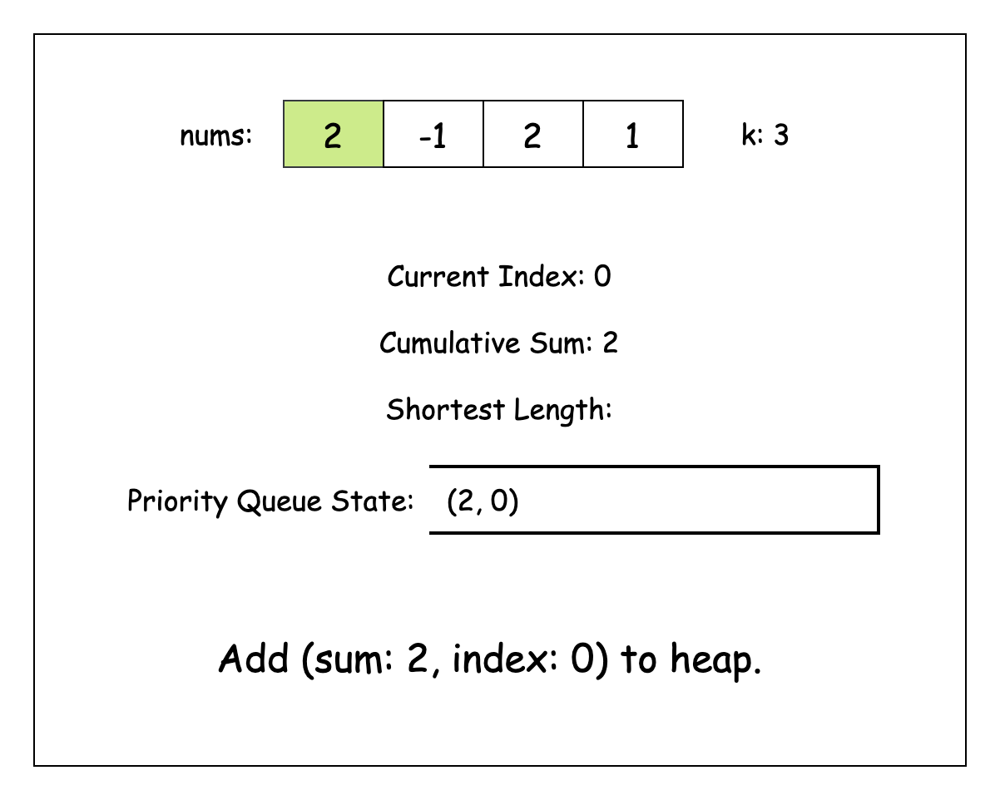


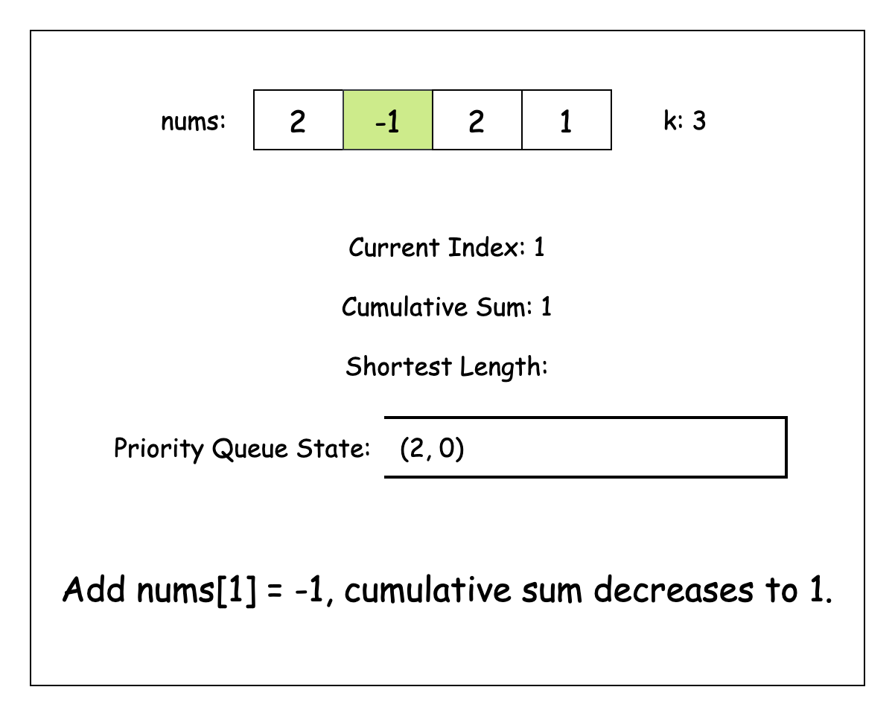

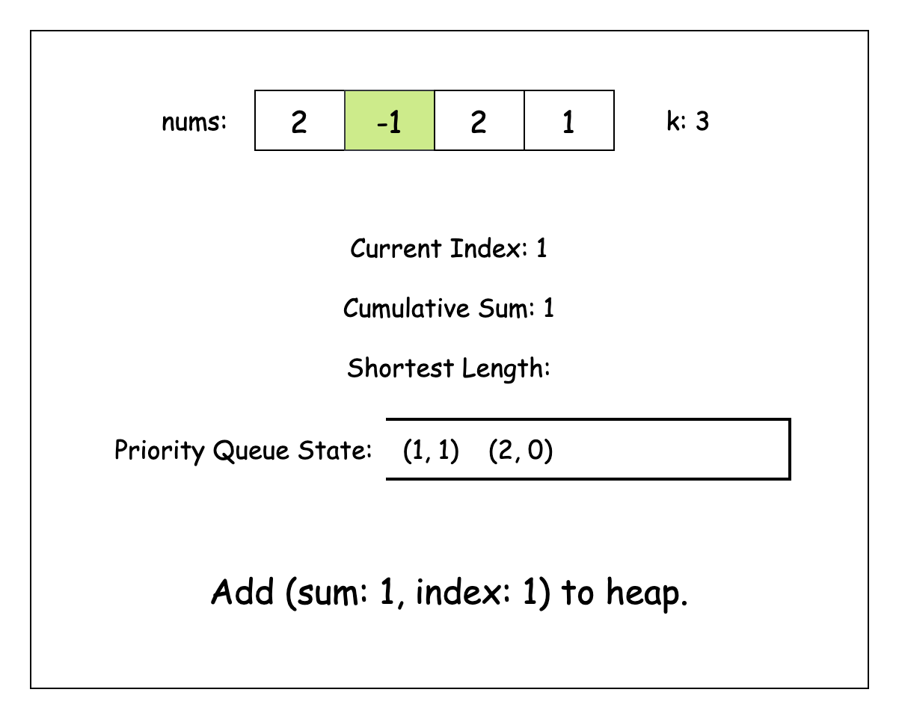

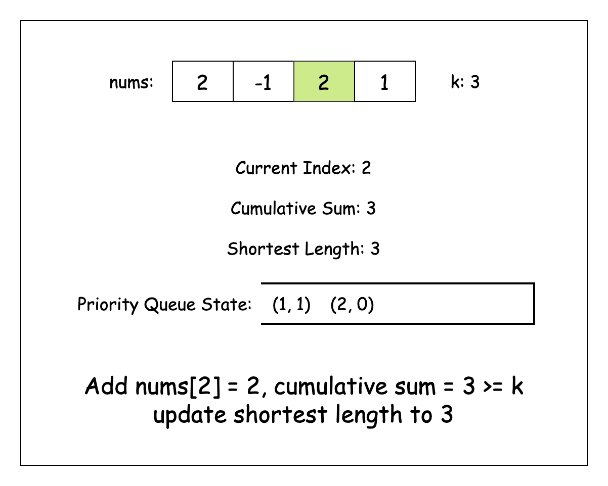

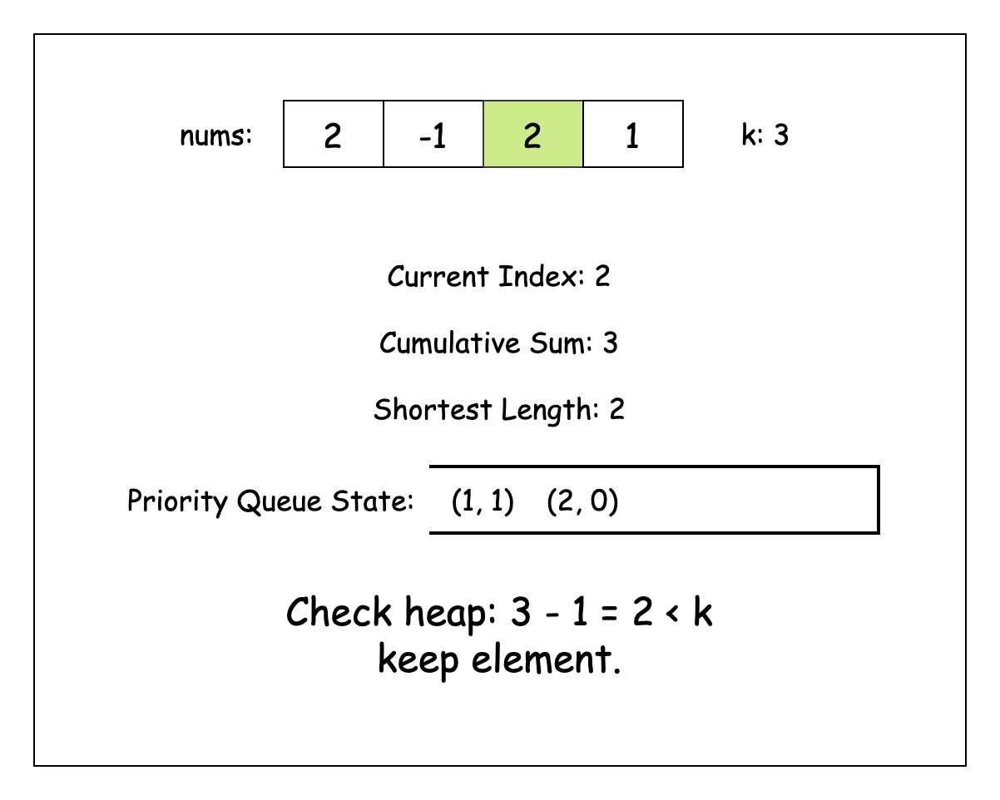

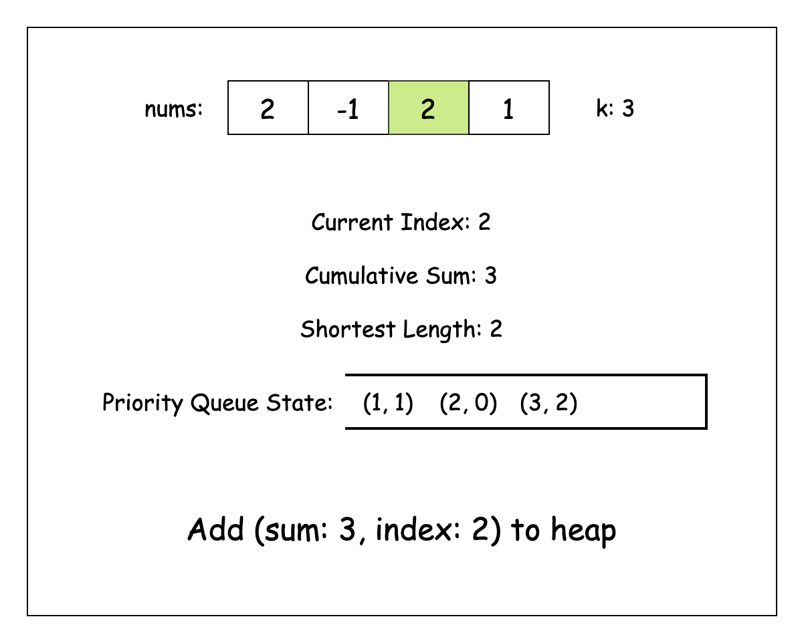

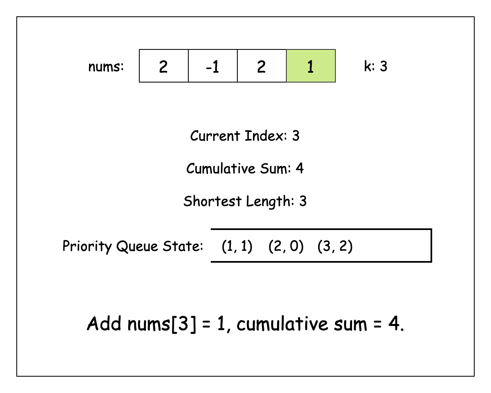

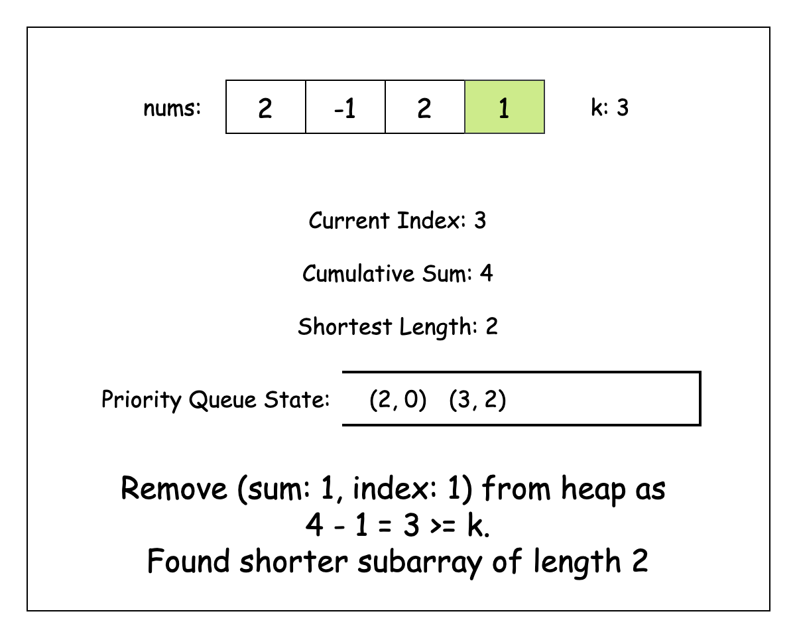

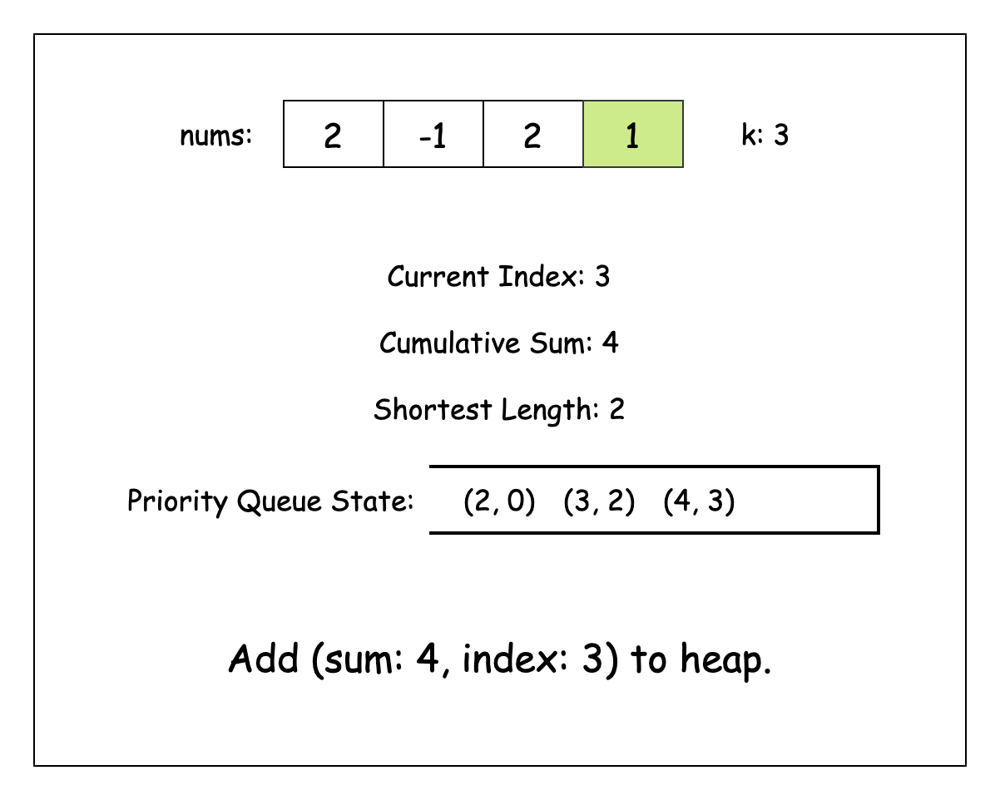

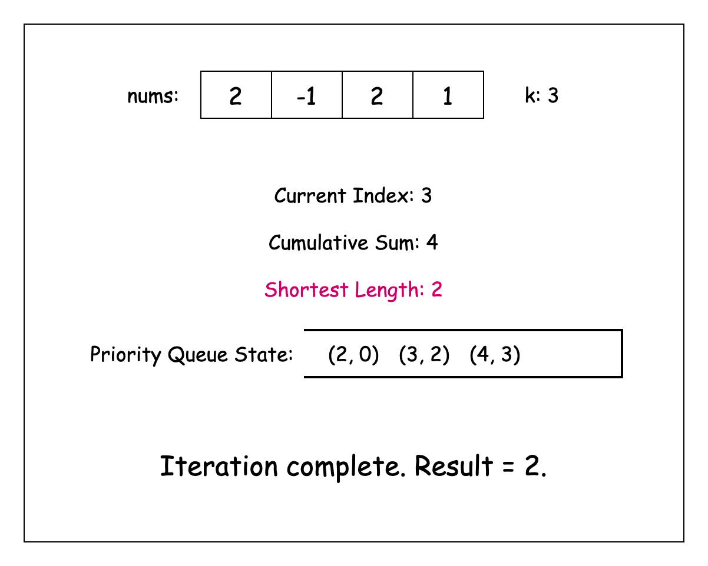

#### Algorithm

- Initialize a variable:
  - `n` to store the length of the input array.
  - `shortestSubarrayLength` to store the minimum length of a valid subarray, setting it to the maximum possible integer value.
  - `cumulativeSum` to 0, which will maintain the running sum of elements.
- Initialize a min-heap `prefixSumHeap` to store pairs of cumulative sum and their corresponding indices, with pairs ordered by cumulative sum.
- Iterate through each index `i` from 0 to `n-1`:
  - Add the current element to `cumulativeSum`.
  - If `cumulativeSum` is greater than or equal to `k`:
- Update `shortestSubarrayLength` with the minimum of itself and $i + 1$.
  - While the heap is not empty and the difference between the current `cumulativeSum` and heap's minimum cumulative sum is greater than or equal to `k`:
- Remove the minimum element from the heap and update `shortestSubarrayLength` with the minimum of itself and (current index - removed element's index)
  - Add current `cumulativeSum` and index as a pair to the heap.
- Return -1 if `shortestSubarrayLength` remains unchanged at maximum integer value, otherwise return `shortestSubarrayLength`.

#### Implementation

```python
class Solution:
    def shortestSubarray(self, nums: List[int], k: int) -> int:
        n = len(nums)

        # Initialize result to the maximum possible integer value
        shortest_subarray_length = float("inf")

        cumulative_sum = 0

        # Min-heap to store cumulative sum and its corresponding index
        prefix_sum_heap = []

        # Iterate through the array
        for i, num in enumerate(nums):
            # Update cumulative sum
            cumulative_sum += num

            # If cumulative sum is already >= k, update shortest length
            if cumulative_sum >= k:
                shortest_subarray_length = min(shortest_subarray_length, i + 1)

            # Remove subarrays from heap that can form a valid subarray
            while (
                prefix_sum_heap and cumulative_sum - prefix_sum_heap[0][0] >= k
            ):
                # Update shortest subarray length
                shortest_subarray_length = min(
                    shortest_subarray_length, i - heappop(prefix_sum_heap)[1]
                )

            # Add current cumulative sum and index to heap
            heappush(prefix_sum_heap, (cumulative_sum, i))

        # Return -1 if no valid subarray found
        return (
-1
            if shortest_subarray_length == float("inf")
            else shortest_subarray_length
        )
```

#### Complexity Analysis

Let $n$ be the length of the `nums` array.

- Time complexity: $O(n \cdot \log n)$

    For each element in `nums`, we may perform heap operations (push and poll) which take $O(\log n)$ time. In the worst case, at each index, we might need to poll multiple elements from the heap, but each element can only be pushed and popped once throughout the entire process. So, the total number of heap operations across all iterations is bounded by $O(n)$, each taking $O(\log n)$ time.

    Thus, the overall time complexity of the algorithm is $O(n \cdot \log n)$.

- Space complexity: $O(n)$

    The algorithm uses additional space for the min-heap (`prefixSumHeap`) which, in the worst case, might need to store all prefix sums and their indices. As each element in the input array corresponds to at most one entry in the heap, the space required is linear with respect to the input size.

    Thus, the space complexity is $O(n)$.

---

### Approach 2: Monotonic Stack + Binary Search

#### Intuition

We can also implement this idea of using the "best" prefix sum efficiently using a binary search approach. Instead of a priority queue, let's maintain a stack-like data structure to hold the prefix sums for each index as we iterate over `nums`. Each element of the stack will hold a pair [prefix sum, index] where we'll maintain the prefix sum monotonically increasing. The monotonically increasing property works because at each step, all prefix sums which are valid candidates to be used to find the shortest sub-array, have to be less than the current running sum.

To make this work, we start by updating the running total for each number in the array. Then, to keep our structure ordered, we remove any entries from the top that are greater than or equal to the current sum. This approach ensures that both the prefix sums and their indices stay in strict increasing order. Once we have this ordering, we can use binary search to efficiently find the rightmost entry where the sum is at least $\text{current}_{sum} - k$. The difference between our current position and the index we find gives us the length of a valid sub-array. By keeping track of the shortest length we find, we’ll get our answer.

> Note: It's a bit unusual to perform searches within a stack, as we typically only access the top element in a true stack. So while our data structure isn't a classic stack, it behaves similarly to a monotonic stack in this case.

#### Algorithm

- Initialize:
  - a variable `n` to store the length of the input array.
  - a list `cumulativeSumStack` to store pairs of cumulative sums and their corresponding indices, adding an initial pair (0, -1) to handle subarrays starting from index 0.
  - a variable `runningCumulativeSum` to 0 to maintain the running sum of elements.
  - a variable `shortestSubarrayLength` to store the minimum length of a valid subarray, setting it to the maximum possible integer value.
- Iterate through each index `i` from 0 to `n-1`:
  - Add the current element to `runningCumulativeSum`
  - While the stack is not empty and the current `runningCumulativeSum` is less than or equal to the last element's cumulative sum:
- Remove the last element from the stack.
  - Add current `runningCumulativeSum` and index as a pair to the stack.
  - Find the largest index where the cumulative sum is less than or equal to ($runningCumulativeSum - k$) using binary search
  - If a valid index is found, update `shortestSubarrayLength` with the minimum of itself and (current index - found index's value)
- Return -1 if `shortestSubarrayLength` remains unchanged at maximum integer value, otherwise return `shortestSubarrayLength`.

- The binary search helper function:
  - Initialize a left pointer to 0 and a right pointer to the last index.
  - While the left pointer is less than or equal to the right pointer:
- Calculate the middle index.
- If the middle element's cumulative sum is less than or equal to the target:
      - Move the left pointer to `mid` + 1.
- Else:
      - Move the right pointer to `mid` - 1.
  - Return the right pointer as the found index.

#### Implementation

```python
class Solution:
    def shortestSubarray(self, nums: List[int], k: int) -> int:
        n = len(nums)

        # Stack-like list to store cumulative sums and their indices
        cumulative_sum_stack = [(0, -1)]

        running_cumulative_sum = 0
        shortest_subarray_length = float("inf")

        for i in range(n):
            # Update cumulative sum
            running_cumulative_sum += nums[i]

            # Remove entries from stack that are larger than current cumulative sum
            while (
                cumulative_sum_stack
                and running_cumulative_sum <= cumulative_sum_stack[-1][0]
            ):
                cumulative_sum_stack.pop()

            # Add current cumulative sum and index to stack
            cumulative_sum_stack.append((running_cumulative_sum, i))

            candidate_index = self._find_candidate_index(
                cumulative_sum_stack, running_cumulative_sum - k
            )

            # If a valid candidate is found, update the shortest subarray length
            if candidate_index != -1:
                shortest_subarray_length = min(
                    shortest_subarray_length,
                    i - cumulative_sum_stack[candidate_index][1],
                )

        # Return -1 if no valid subarray found
        return (
            shortest_subarray_length
            if shortest_subarray_length != float("inf")
            else -1
        )

    # Binary search to find the largest index where cumulative sum is <= target
    def _find_candidate_index(
        self, nums: List[Tuple[int, int]], target: int
    ) -> int:
        left, right = 0, len(nums) - 1

        while left <= right:
            mid = left + (right - left) // 2

            if nums[mid][0] <= target:
                left = mid + 1
            else:
                right = mid - 1

        return right
```

#### Complexity Analysis

Let $n$ be the length of the `nums` array.

* Time complexity: $O(n \cdot \log n)$

    The algorithm processes each element once in the main loop, which takes $O(n)$ time. For each element, we perform two main operations: maintaining the monotonic property of the stack and binary search. While stack maintenance operations (adding and removing elements) take amortized $O(1)$ time per element since each element can be added and removed at most once, the binary search operation takes $O(\log n)$ time for each element as we search through a list that can grow up to size $n$.

    Thus, the overall time complexity becomes $O(n) +$\mathcal{O}(n \cdot \\log n)$= O(n \cdot \log n)$.

* Space complexity: $O(n)$

    The algorithm uses additional space primarily for the `cumulativeSumStack` list, which stores pairs of cumulative sums and their indices. In the worst case, this list could store all indices if the input array is strictly increasing, leading to $O(n)$ space usage.

    Thus, the space complexity of the algorithm is $O(n)$.

---

### Approach 3: Deque

#### Intuition

If we take a look at our previous approaches, we notice a recurring challenge: we need to find both the smallest sum and the largest index before our current position. This brings us to the question—can we use a data structure that helps us track both of these elements at the same time?

The answer lies in using a deque, or double-ended queue. A deque allows us to add or remove items from either end, which is perfect for our needs. In this case, our deque will hold the indices of the prefix sums that might serve as the starting point for our target subarray. We also make sure that these sums form a monotonically increasing sequence. This monotonicity is important because if we encounter an earlier prefix sum that is greater than or equal to a later one, that later index will always give us a shorter subarray with an equal or greater sum for any future ending position.

As we iterate through each position, we start by checking if we can find valid subarrays using the indices stored in our deque. We do this by calculating the difference between the current prefix sum and the prefix sum at the front of the deque. If this difference meets or exceeds our target sum, we’ve found a valid subarray. At this point, we update our `shortestSubarrayLength` and remove that starting index from the deque, since it won't help us find a shorter subarray with any future ending positions.

Next, we need to maintain the monotonicity of our deque. We remove indices from the back of the deque if their prefix sums are greater than or equal to our current prefix sum. This step is crucial because any removed positions would only yield longer subarrays with the same or smaller sums, making them unnecessary for our purposes.

Finally, we add our current index to the back of the deque because it could potentially be the starting point of a valid subarray in the future.

By the time we finish iterating through the array, the variable `shortestSubarrayLength` will contain the length of the shortest subarray that meets our criteria.

#### Algorithm

- Initialize:
  - a variable `n` to store the length of the input array.
  - an array `prefixSums` of size `n+1` to store cumulative sums, where $\text{prefixSums}[i]$ will represent the sum of elements from index 0 to `i-1`.
- Calculate prefix sums by iterating from 1 to `n`:
   - Set $\text{prefixSums}[i]$ as the sum of `prefixSums[i-1]` and `nums[i-1]`
- Initialize:
  - a deque `candidateIndices` to store indices that could form valid subarrays.
  - a variable `shortestSubarrayLength` to store the minimum length of a valid subarray, setting it to the maximum possible integer value.
- Iterate through each index `i` from 0 to `n`:
  - While the deque is not empty and the difference between $\text{prefixSums}[i]$ and `prefixSums[first element of deque]` is greater than or equal to `targetSum`:
- Update `shortestSubarrayLength` with the minimum of itself and (i - first element of deque).
- Remove the first element from the deque.
  - While deque is not empty and $\text{prefixSums}[i]$ is less than or equal to `prefixSums[last element of deque]`:
- Remove the last element from the deque.
  - Add current index `i` to the end of the deque.
- Return -1 if `shortestSubarrayLength` remains unchanged at maximum integer value, otherwise return `shortestSubarrayLength`.

#### Implementation

```python
class Solution:
    def shortestSubarray(self, nums: List[int], target_sum: int) -> int:
        n = len(nums)

        # Size is n+1 to handle subarrays starting from index 0
        prefix_sums = [0] * (n + 1)

        # Calculate prefix sums
        for i in range(1, n + 1):
            prefix_sums[i] = prefix_sums[i - 1] + nums[i - 1]

        candidate_indices = deque()

        shortest_subarray_length = float("inf")

        for i in range(n + 1):
            # Remove candidates from front of deque where subarray sum meets target
            while (
                candidate_indices
                and prefix_sums[i] - prefix_sums[candidate_indices[0]]
                >= target_sum
            ):
                # Update shortest subarray length
                shortest_subarray_length = min(
                    shortest_subarray_length, i - candidate_indices.popleft()
                )

            # Maintain monotonicity by removing indices with larger prefix sums
            while (
                candidate_indices
                and prefix_sums[i] <= prefix_sums[candidate_indices[-1]]
            ):
                candidate_indices.pop()

            # Add current index to candidates
            candidate_indices.append(i)

        # Return -1 if no valid subarray found
        return (
            shortest_subarray_length
            if shortest_subarray_length != float("inf")
            else -1
        )
```

#### Complexity Analysis

Let $n$ be the length of the `nums` array.

* Time complexity: $O(n)$

    The algorithm first calculates prefix sums in $O(n)$ time. Then, it processes each index exactly once in the main loop. Within this loop, each index can be added to the deque once and removed at most once from either end of the deque. Since deque operations take $O(1)$ time, the amortized time complexity for all deque operations is $O(n)$.

    Thus, the overall time complexity is $O(n)$.

* Space complexity: $O(n)$

    The algorithm uses additional space for two main data structures. First, the prefix sums array requires $O(n+1)$ space to store cumulative sums. Second, the deque of candidate indices, in the worst case, might need to store $O(n)$ indices.

    Thus, the space complexity of the algorithm is $O(n+1) +$\mathcal{O}(n)$= O(n)$.

---