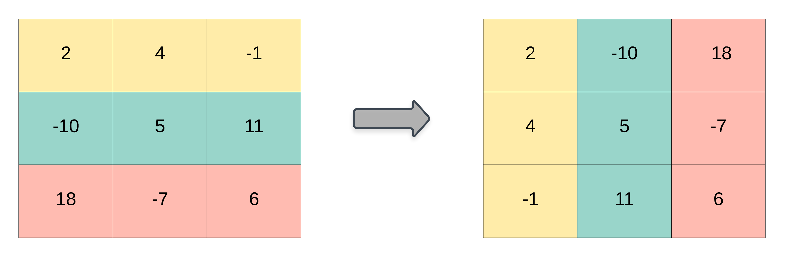

### 1. Description

Given a 2D integer array `matrix`, return *the **transpose** of* `matrix`.

The **transpose** of a matrix is the matrix flipped over its main diagonal, switching the matrix's row and column indices.

### 2. Function Contract

- `n`: Input parameter.
- Returns expected result.

### 3. Examples

#### Example 1

- **Input:** $matrix = [[1,2,3],[4,5,6],[7,8,9]]$
- **Output:** `[[1,4,7],[2,5,8],[3,6,9]]`
#### Example 2

- **Input:** $matrix = [[1,2,3],[4,5,6]]$
- **Output:** `[[1,4],[2,5],[3,6]]`

### 4. Constraints

- $m = \text{matrix.length}$

- $n = \text{matrix}[i].length$

- $1 \le m, n \le 1000$

- $1 \le m * n \le 10^{5}$

- $-10^{9} \le \text{matrix}[i][j] \le 10^{9}$