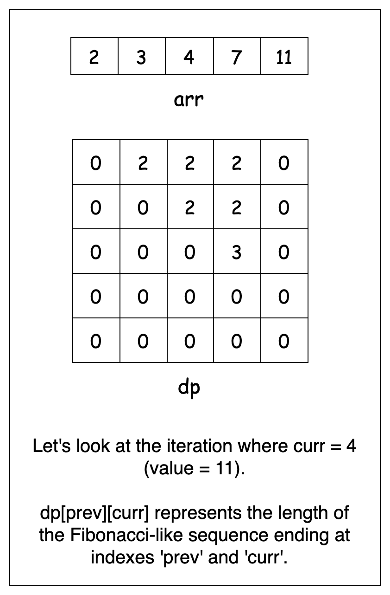
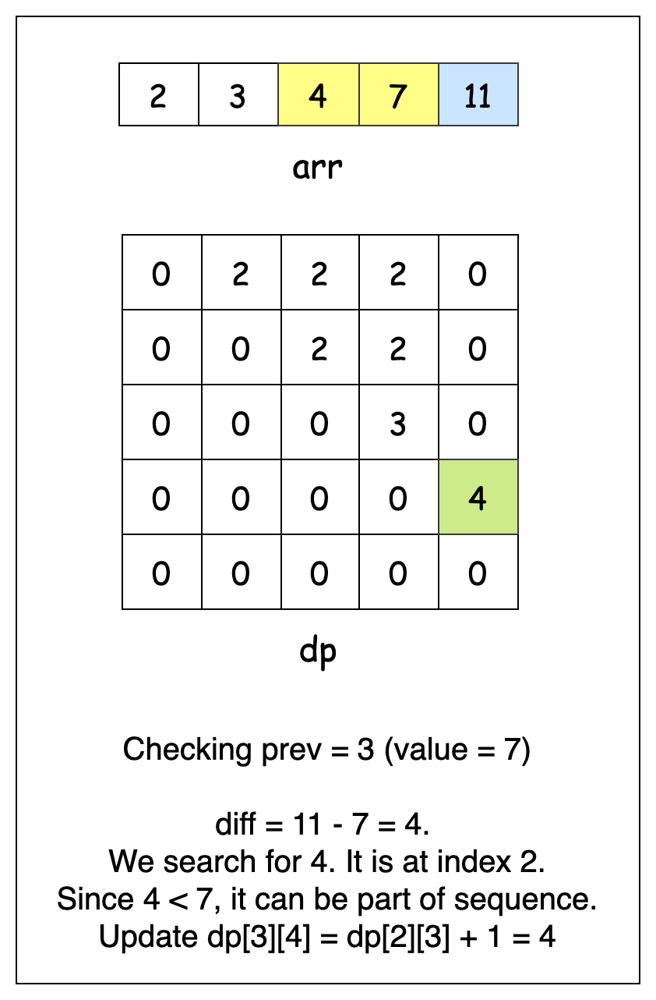
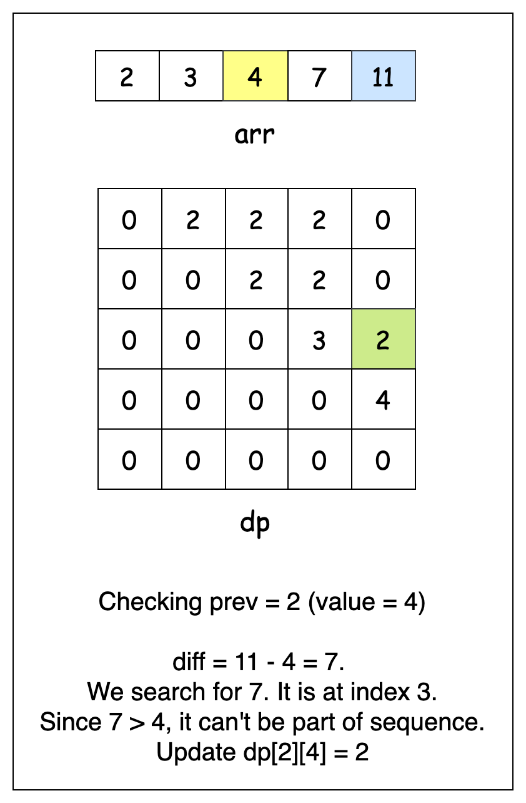
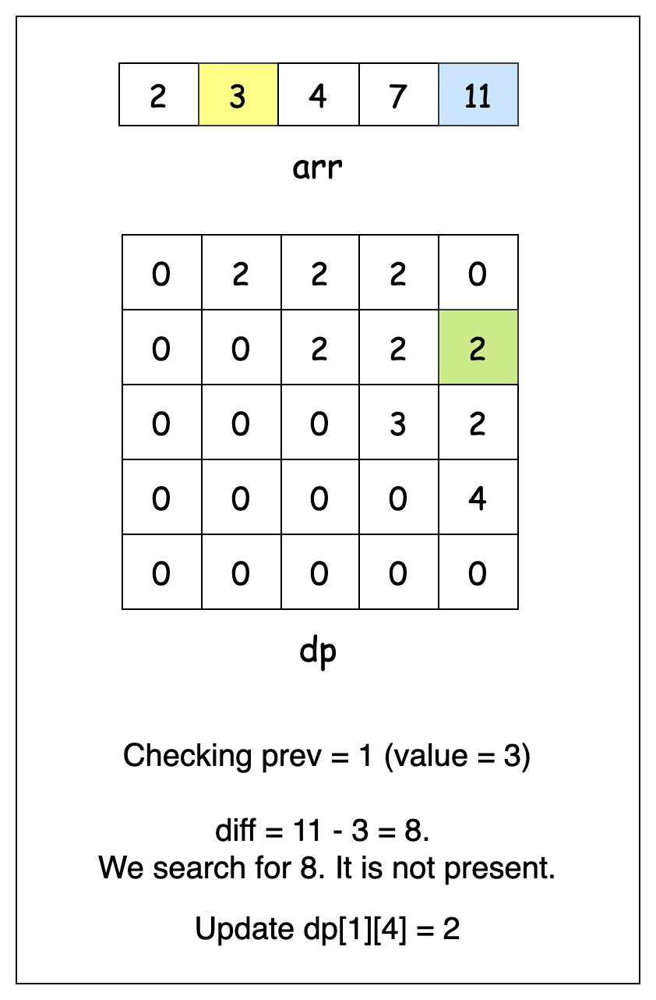
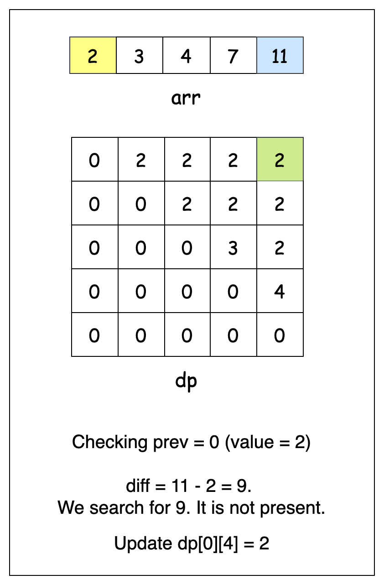

## Solution

---

### Approach 1: Brute Force

#### Intuition

To understand how we can construct Fibonacci sequence, we should first recall the defining property of a Fibonacci sequence: every number is the sum of the two preceding numbers. This means that once we have two numbers as a starting point, all subsequent numbers in the sequence are uniquely determined. For example, if we start with 2 and 3, the next number must be 5, then 8, then 13, and so on. This gives us our first insight: if we know the first two numbers of our subsequence, we can calculate all possible next numbers in the sequence.

So, our core strategy becomes: we'll try every possible pair of numbers from our array as starting points. For each pair, we'll attempt to build the longest possible Fibonacci-like sequence.

However, repeatedly searching through an array to check whether a number exists is inefficient. A simple optimization is to store all numbers in a hash set, allowing us to check for existence in constant time instead of scanning through the array repeatedly.

Now, let's walk through how we build sequences. We pick two numbers from the array — let's call them `start` and `next`—and consider them as the first two numbers of our Fibonacci-like sequence.

Since each new number in the sequence must be the sum of the previous two, we compute this sum and check whether it exists in our set. If it does, we have successfully extended the sequence, and we shift our window forward — our new pair now consists of the previous second number and the sum we just found. We repeat this process until we can no longer extend the sequence.

Throughout this process, we keep track of the longest sequence found using a variable `maxLen`. Once all loops are complete, `maxLen` holds the length of the longest Fibonacci-like sequence found, which we return as our answer.

#### Algorithm

- Initialize:
  - a variable `n` to store the length of the input array
  - an empty hash set `numSet` to store the array elements.
- Iterate through `arr` and add each element to the `numSet`.
- Initialize a variable `maxLen` to `0` to track the length of the longest Fibonacci-like subsequence.
- Use nested loops to try all possible combinations of the first two numbers, with outer loop variable `start` and inner loop variable `next`:
  - Initialize variables:
- `prev` to store the second number ($\text{arr}[next]$).
- `curr` to store the sum of first two numbers.
- `len` to `2` (counting the first two numbers).
  - While the current sum exists in the `numSet`:
- Store the current sum in a temporary variable.
- Update `curr` to be the sum of previous two numbers.
- Update `prev` to be the stored temporary value.
- Increment `len` by 1 and update `maxLen` if the current length is greater.
- Return the final value of `maxLen` (returns `0` if no valid subsequence was found).

#### Implementation

```python
class Solution:
    def lenLongestFibSubseq(self, arr: list[int]) -> int:
        # Store array elements in set for O(1) lookup
        num_set = set(arr)
        max_len = 0
        n = len(arr)

        # Try all possible first two numbers of sequence
        for start in range(n):
            for next in range(start + 1, n):
                # Start with first two numbers
                prev = arr[next]
                curr = arr[start] + arr[next]
                curr_len = 2

                # Keep finding next Fibonacci number
                while curr in num_set:
                    prev, curr = curr, curr + prev
                    curr_len += 1
                    max_len = max(max_len, curr_len)

        return max_len
```

#### Complexity Analysis

Let $n$ be the length of the input array `arr`.

- Time complexity: $O(n^2 \log M)$

    The time complexity of this algorithm is determined by how many times the loops run. The outer two loops iterate over all pairs of numbers in `arr`, which results in $O(n^2)$ iterations. Within these loops, we attempt to build a Fibonacci-like sequence by repeatedly checking if the next number exists in the set.

    Since Fibonacci numbers grow exponentially, a sequence that stays within a maximum value of $10^9$ can have at most 43 terms. This is because the Fibonacci sequence increases so rapidly that it reaches $10^9$ in at most 43 steps. As a result, the inner loop can run at most 43 times, meaning it runs in $O(\log M)$ time, where $M$ is the largest number in `arr`.

    Thus, combining the outer $O(n^2)$ loops with the $O(\log M)$ inner loop, the final time complexity is $O(n^2 \log M)$.

  > Note: Some might consider the complexity to be $O(n^3)$, but that assumption holds only if we consider the worst case where the sequence length is $O(n)$. However, since Fibonacci numbers grow exponentially, the maximum sequence length is actually bounded by $O(\log M)$ rather than $O(n)$.

  > The Fibonacci sequence growth rate: $F_k \approx \varphi^k$, where $\varphi$ is the golden ratio $\approx 1.618$.

- Space complexity: $O(n)$

    The algorithm uses a hash set to store all elements of `arr` for $O(1)$ lookups. The space required for the set is proportional to the size of `arr`, which is $n$. Thus, the space complexity is $O(n)$.

---

### Approach 2: Dynamic Programming

#### Intuition

In a Fibonacci-like sequence, each number depends on the two numbers that came before it. This suggests that if we know the length of a Fibonacci-like sequence ending with two particular numbers, we can use that information to find longer sequences that might include these numbers. This aspect of building larger sequences from information collected from smaller ones suggests a dynamic programming approach.

To structure this approach, we define a 2D DP array `dp`, where $\text{dp}[i][j]$ represents the length of the longest Fibonacci-like sequence that ends with $\text{arr}[i]$ and $\text{arr}[j]$. The indices `i` and `j` correspond to positions in our input array, with `j` always greater than `i` to maintain the strictly increasing order of the sequence.

The key idea is to determine whether a sequence ending in $\text{arr}[i]$ and $\text{arr}[j]$ can be extended. If these are the last two numbers of our sequence, then the number that came before them must be $\text{arr}[j] - \text{arr}[i]$. If this difference exists in our array and occurs before $\text{arr}[i]$, we can extend a previous sequence to include $\text{arr}[j]$.

For example, consider the array `[3, 4, 5, 7, 9, 12]`. Suppose we are examining `7` and `12` (at positions `3` and `5`):
1. We compute the difference: $12 - 7 = 5$.
2. We check whether `5` exists in the array and find it at position `2`. Since `5` appears before `7`, it can be part of a valid sequence.
3. This means we can extend an existing sequence that ended with `[5, 7]` by adding `12`.

The length of the sequence ending with `[7, 12]` will then be one more than the length of the sequence ending with `[5, 7]`, which we have already stored in our `dp` array.

To efficiently check for the existence of $\text{arr}[j] - \text{arr}[i]$ in our array, we use a hash map `valToIdx`, which maps each value to its index. This allows quick lookups instead of searching the array repeatedly.

Now, to populate the `dp` array, we iterate over all pairs of indices `(prev, curr)` where `curr > prev`. We compute the difference $\text{arr}[curr] - \text{arr}[prev]$ and check if it exists in the array. If it does, we extend the previously computed sequence; otherwise, we initialize a new sequence of length `2`.

As we build `dp`, we maintain a variable `maxLen` to track the longest sequence found. Once we process all pairs, `maxLen` holds the length of the longest Fibonacci-like subsequence. If no valid sequence of at least three elements exists, we return `0`.

> For a more comprehensive understanding of hash tables, check out the [Hash Table Explore Card](https://leetcode.com/explore/learn/card/hash-table/). This resource provides an in-depth look at hash tables, explaining their key concepts and applications with a variety of problems to solidify understanding of the pattern.

#### Algorithm

- Initialize:
  - a variable `maxLen` to `0` to track the length of the longest Fibonacci-like subsequence.
  - a 2D array `dp` of size `arr.length × arr.length` where $\text{dp}[prev][curr]$ stores the length of the Fibonacci sequence ending at indexes `prev` and `curr`.
- Initialize a hash map `valToIdx` to map each value in the array to its index.
- For each current position `curr` in the array:
  - Add the mapping of the current value to its index in the `valToIdx` map.
  - For each previous position `prev` less than `curr`:
- Calculate the difference `diff` between the current and previous values.
- Look up the index `prevIdx` of `diff` in the `valToIdx` map (`-1` if not found).
- If `diff` is less than the previous value (ensuring strictly increasing sequence) and `prevIdx` exists:
      - Update $\text{dp}[prev][curr]$ by adding `1` to the length of the sequence ending at `[prevIdx][prev]`.
- Otherwise:
      - Set $\text{dp}[prev][curr]$ to `2` (representing just the two numbers).
- Update `maxLen` if the current sequence length is greater.
- Return `maxLen` if it's greater than `2`, otherwise return `0` (as sequences of length 2 are not valid).

Here's a slideshow to visualize one iteration of the outer loop:











#### Implementation

```python
class Solution:
    def lenLongestFibSubseq(self, arr: list[int]) -> int:
        n = len(arr)
        max_len = 0
        # dp[prev][curr] stores length of Fibonacci sequence ending at indexes prev,curr
        dp = [[0] * n for _ in range(n)]

        # Map each value to its index for O(1) lookup
        val_to_idx = {num: idx for idx, num in enumerate(arr)}

        # Fill dp array
        for curr in range(n):
            for prev in range(curr):
                # Find if there exists a previous number to form Fibonacci sequence
                diff = arr[curr] - arr[prev]
                prev_idx = val_to_idx.get(diff, -1)

                # Update dp if valid Fibonacci sequence possible
                # diff < arr[prev] ensures strictly increasing sequence
                dp[prev][curr] = (
                    dp[prev_idx][prev] + 1
                    if diff < arr[prev] and prev_idx >= 0
                    else 2
                )
                max_len = max(max_len, dp[prev][curr])

        # Return 0 if no sequence of length > 2 found
        return max_len if max_len > 2 else 0
```

#### Complexity Analysis

Let $n$ be the length of the input array `arr`.

- Time complexity: $O(n^2)$

    The algorithm uses two nested loops - the outer loop runs for all positions `curr` from $0$ to $n - 1$, and for each `curr`, the inner loop runs for all `prev` from `0` to `curr-1`. This results in $O(n^2)$ iterations. Inside these loops, all operations (hash map lookups, array accesses, and comparisons) take $O(1)$ time. Therefore, the total time complexity is $O(n^2)$.

- Space complexity: $O(n^2)$

    The algorithm uses a 2D array `dp` of size $n \times n$ to store the lengths of Fibonacci sequences ending at different pairs of indices, requiring $O(n^2)$ space. Additionally, it uses a hash map `valToIdx` to store the index for each value in the array, which requires $O(n)$ space. The total space complexity is dominated by the `dp` array, resulting in $O(n^2)$ space complexity.

---

### Approach 3: Optimized Dynamic Programming

#### Intuition

We can further optimize our dynamic programming approach by eliminating the hash map lookup. Since our array is strictly increasing, we can take advantage of this ordering to locate valid number pairs more efficiently.

Think about what happens when we're looking for numbers that could precede our current number in a Fibonacci-like sequence. If we have a current number, say 13, we're looking for two previous numbers that sum to 13. This subproblem is actually a very popular problem by itself, known as the [Two-Sum](https://leetcode.com/problems/two-sum/description/) problem.

The core idea remains the same: given a number $\text{arr}[curr]$, we need to determine whether there exist two numbers $\text{arr}[start]$ and $\text{arr}[end]$ such that their sum equals $\text{arr}[curr]$. Instead of relying on a hash map to find $\text{arr}[curr] - \text{arr}[end]$, we can use a two-pointer approach, which is a well-known technique for solving the [Two-Sum problem](https://leetcode.com/problems/two-sum/description/).

Let's understand this with an example. Suppose we have the array `[2, 3, 4, 6, 9, 13, 19]`. When we're looking at `13` (position `5`):
1. We start with two pointers: `start` at `2` and `end` at `9`.
2. If their sum is too large (like $9 + 6 = 15 > 13$), we move `end` left.
3. If their sum is too small (like $2 + 4 = 6 < 13$), we move `start` right.
4. When we find a sum that equals `13` ($4 + 9 = 13$), we've found a valid pair!

This two-pointer approach allows us to get rid of the hash map entirely, saving significant space.

As we iterate through `arr`, we treat each element as a potential end of a Fibonacci-like sequence. When we find a valid pair `(start, end)` where $\text{arr}[start] + \text{arr}[end] = \text{arr}[curr]$, we can extend an existing sequence ending at `[arr[start], arr[end]]` by adding $\text{arr}[curr]$. We track this in a DP table $\text{dp}[end][curr]$, setting it to $\text{dp}[start][end] + 1$. This way, we're building longer sequences from shorter ones we've already found.

A subtle but important detail is that we continue searching even after finding a valid pair. This is crucial because there might be multiple pairs that sum to our current number, and we need to consider all of them to find the longest possible sequence.

Similar to the previous approach, we keep track of the maximum value stored in the `dp` array using a variable `maxLen`. Remember that `dp`, and by extension `maxLen`, stores lengths without counting the first two numbers. So, we need to add 2 to our final answer to include them. If we haven't found any valid sequences (`maxLen` is 0), we return 0 instead.

#### Algorithm

- Initialize:
  - a variable `n` to store the length of the input array.
  - a 2D array `dp` of size `n × n` where $\text{dp}[prev][curr]$ stores the length of the Fibonacci sequence ending at indexes `prev` and `curr` (excluding the first two numbers).
  - a variable `maxLen` to `0` to track the maximum length found (excluding the first two numbers).
- For each position `curr` starting from index `2`:
  - Initialize two pointers:
- The `start` pointer at index `0`.
- The `end` pointer at $curr - 1$.
  - While the `start` pointer is less than the `end` pointer:
- Calculate the sum of values at `start` and `end` positions.
- If the sum is greater than the value at `curr`:
      - Decrement the `end` pointer to try a smaller sum.
- If the sum is less than the value at `curr`:
      - Increment the `start` pointer to try a larger sum.
- If the sum equals the value at `curr`:
      - Update $\text{dp}[end][curr]$ by adding `1` to the length of the sequence ending at `[start][end]`.
      - Update `maxLen` if the current sequence length is greater.
      - Move both pointers (increment `start` and decrement `end`) to find other possible pairs.
- Return $maxLen + 2$ if `maxLen` is non-zero (adding 2 to include the first two numbers), otherwise return `0`.

#### Implementation

```python
class Solution:
    def lenLongestFibSubseq(self, arr: list[int]) -> int:
        n = len(arr)
        # dp[prev][curr] stores length of Fibonacci sequence ending at indexes prev,curr
        dp = [[0] * n for _ in range(n)]
        max_len = 0

        # Find all possible pairs that sum to arr[curr]
        for curr in range(2, n):
            # Use two pointers to find pairs that sum to arr[curr]
            start = 0
            end = curr - 1

            while start < end:
                pair_sum = arr[start] + arr[end]

                if pair_sum > arr[curr]:
                    end -= 1
                elif pair_sum < arr[curr]:
                    start += 1
                else:
                    # Found a valid pair, update dp
                    dp[end][curr] = dp[start][end] + 1
                    max_len = max(dp[end][curr], max_len)
                    end -= 1
                    start += 1

        # Add 2 to include first two numbers, or return 0 if no sequence found
        return max_len + 2 if max_len else 0
```

#### Complexity Analysis

Let $n$ be the length of the input array `arr`.

- Time complexity: $O(n^2)$

    The algorithm iterates through all positions from index $2$ to $n - 1$ using the outer loop, which takes $O(n)$ time.

    For each position, it uses two pointers to find pairs that sum to the current value. The two pointers start at opposite ends and move towards each other, examining each pair at most once. This inner two-pointer loop takes $O(n)$ time for each iteration of the outer loop. All operations inside the loops (comparisons, array accesses, and updates) take $O(1)$ time.

    Therefore, the total time complexity is $O(n \cdot n) = O(n^2)$.

- Space complexity: $O(n^2)$

    The algorithm uses a 2D array `dp` of size $n \times n$ to store the lengths of Fibonacci sequences ending at different pairs of indices. This requires $O(n^2)$ space. All other variables (`n`, `maxLen`, `start`, `end`, `pairSum`) use constant space. Therefore, the total space complexity is dominated by the `dp` array, resulting in $O(n^2)$ space complexity.

---