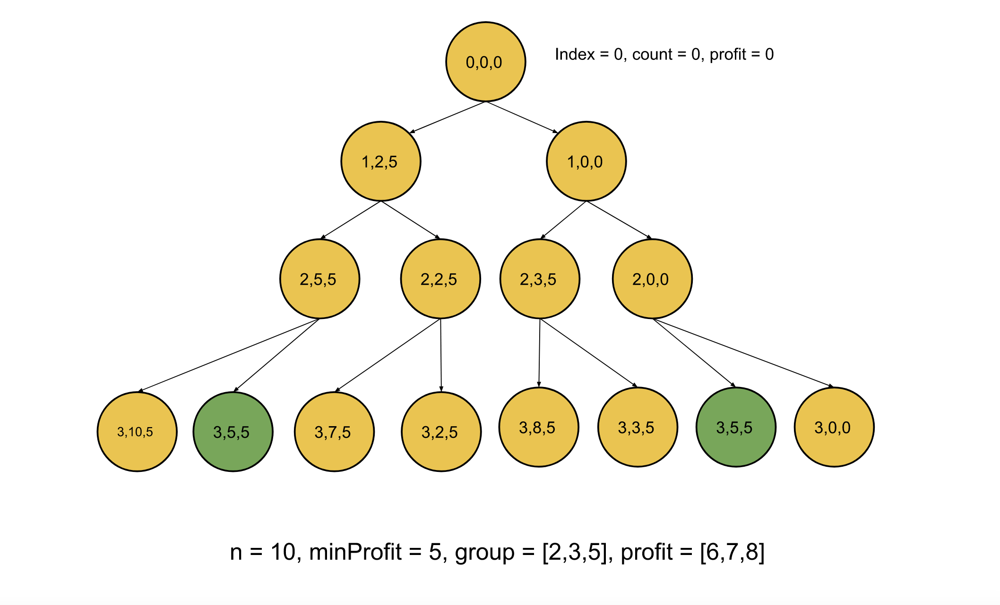

[TOC]

## Solution

---

### Overview

We have two lists, each of size $M$; the first list, `group`, represents the number of members that each of the $M$ crimes needs, and the second list `profits`, represents the profit that each crime generates. We need to find the number of subsets of these crimes such that a subset has no more than $N$ criminals in it, and the total profit has to be at least `minProfit`. Also, since the number could be huge, we need to return it modulo $10^9 + 7$.
</br>

---

### Approach 1: Top-Down Dynamic Programming

**Intuition**

Each of the $M$ crimes in the list has two options, either we consider it in the current subset, or we don't. If we add this crime to the subset, we need to ensure first that the number of members doesn't exceed $N$; also, the total profit will be increased by the profit of this crime. If we don't consider this crime, there would be no change in the number of members or the total profit. The total number of such subsets would be the sum of the count of these two choices for each crime. Let's consider what parameters we need to have in this recursive approach:

1. `index`: The index of the crime that we are considering currently.
2. `count`: The total number of members we have in the current subset we have selected.
3. `profit`: The total profit we have generated so far with the current subset we selected.

We start with $index = 0$, i.e. from the first crime, $count = 0$ denotes we have used no members so far, and $profit = 0$ as the total profit so far is zero. Now, for each crime, we make one of the two choices that we discussed before and sum the count of both these choices modulo $10^9 + 7$.

The only problem with this approach is that we are iterating over each of the two possibilities, and for $M$ crimes, there could be $2^M$ possible scenarios. Hence, this approach isn't efficient. If we observe the below figure, there are repeated subproblems. Notice the green nodes are repeated subproblems signifying that we have already solved these subproblems before. To avoid recalculating results for previously seen subproblems, we will memoize the result for each subproblem. The next time we need to calculate the result for the same set of parameters `{index, count, profit}`, we can look up the result in constant time instead of recalculating the result.



One more observation that could help us reduce the number of states is that once the total profit exceeds `minProfit`, it doesn't matter what the actual profit is anymore because we only care about making **at least** `minProfit`. If the profit is at least `minProfit`, we will mark the current selection as a profitable scheme; otherwise, not. Therefore, the `profit` in the states can be stored as `min(profit, minProfit)` so that the possible values for `profit` always remains less than or equal to`minProfit`, which can potentially save us many states in the memoization.

**Algorithm**

1. Initialize the array `memo` with `-1`; this array will keep the calculated results, and `-1` represents that the answer has not been calculated for these states yet.
2. Start with all the parameters `index`, `count` and `profit` as `0`.
3. If we have already calculated the answer for these parameters, i.e. the value in `memo` is `-1` then return that value. If not, then go into the recursion.
4. First, store the number of ways to get a profitable scheme if we don't consider this crime into the variable `totalWays`, in this case, the new recursion state would be ${index + 1, count, profit}$.
5. If we have enough criminals remaining, add the number of ways to get a profitable scheme by considering the crime at `index` to `totalWays`. The new recursion state would be ${index + 1, count + \text{group}[index], min(profit + \text{profits}[index], minProfit)}$.
6. The base condition would be, if we reach the end of the list, i.e. the `index` is equal to $M$, then we can return `1` if the `profit` is more than `minProfit` otherwise we return `0`.
7. Return `totalWays`.

**Implementation**

```cpp
class Solution {
public:
    int mod = 1e9 + 7;
    int memo[101][101][101];

    int find(int pos, int count, int profit, int n, int minProfit, vector<int>& group, vector<int>& profits) {
        if (pos == group.size()) {
            // If profit exceeds the minimum required; it's a profitable scheme.
            return profit >= minProfit;
        }

        if (memo[pos][count][profit] != -1) {
            // Repeated subproblem, return the stored answer.
            return memo[pos][count][profit];
        }

        // Ways to get a profitable scheme without this crime.
        int totalWays = find(pos + 1, count, profit, n, minProfit, group, profits);
        if (count + group[pos] <= n) {
            // Adding ways to get profitable schemes, including this crime.
            totalWays += find(pos + 1, count + group[pos], min(minProfit, profit + profits[pos]), n, minProfit, group, profits);
        }

        return memo[pos][count][profit] = totalWays % mod;
    }

    int profitableSchemes(int n, int minProfit, vector<int>& group, vector<int>& profit) {
        memset(memo, -1,sizeof(memo));
        return find(0, 0, 0, n, minProfit, group, profit);
    }
};
```

**Complexity Analysis**

Here, $N$ is the maximum number of criminals allowed in a scheme, $M$ is the size of the list `group`, and $K$ is the value of `minProfit`.

* Time complexity: $O(N \cdot M  \cdot K)$.

  We have three parameters `index`, `count` and `profit`. The `index` can vary from `0` to $M - 1$, and the `count` can again vary from `0` to $N - 1$ (as we consider crime only if it doesn't exceed the limit of $N$), the last param `profit` can vary largely but since we cap its value to `minProfit` it values can vary from `0` to `minProfit`. We need to calculate the answer to each of these states to solve the original problem; hence the total computation would be $O(N \cdot M  \cdot K)$.

* Space complexity: $O(N \cdot M  \cdot K)$.

  The size of `memo` would equal the number of states as $(N \cdot M  \cdot K)$. Although we used the maximum value of $101$ in the code to simplify things, we can also use the original values in the input as the size of `memo`. Also, there would be some space in the recursion as well, the total number of active recursion calls could be $N$ one for each crime, and hence the total recursion space would be $O(N)$.

### Approach 2: Bottom-Up Dynamic Programming

**Intuition**

In the previous approach, the recursive calls incurred stack space. This can be avoided by applying the same approach iteratively, which is generally faster than the top-down approach. We will follow a similar approach as the previous one, just in a reverse manner.

We will start with the previous approach's base case and build up the answers for the remaining states using the recursive equation that we will derive from the previous approach.

The previous approach had three states `{index, count, profit}`, and the value for these states is stored in, let's say, $\text{dp}[index][count][profit]$, now according to our previous solution, the number of ways to get profitable scheme by not including the crime at `index` is equal to $dp[index + 1][count][profit]$. Similarly, the number of ways to get a profitable scheme by including the crime at `index` (only if it doesn't make the member count more than $N$) is equal to $dp[index + 1][count + \text{group}[index]][min(profit + \text{profits}[index], minProfit)]$.

Hence the recursive equation could be written as:

> dp[index][count][profit] = dp[index + 1][count][profit] + take
>
> Where $take = dp[index + 1][count + \text{group}[index]][min(profit + \text{profits}[index], minProfit)]$ if $count + \text{group}[index] \le N$, otherwise `0`

Since we need to start from the previous approach's base condition, we will initialize the values $\text{dp}[M][count][minProfit]$ as `1s` and the rest as `0s`. This is because if we reach the end of the list (`index` is `M`), and the count is any value less than $N$ with profit `minProfit`, this is a profitable scheme; otherwise, it is not.

**Algorithm**

1. Initialize the `dp` array with states as  $index = \text{group.size}$, $profit = minProfit$, and count with any value from `0` to `N` as `1`; the remaining values would be `0`.
2. Loop over `index` from `group.size()` to `0`, nested with `count` from `0` to $N$ and nested with `profit` from `0` to `minProfit`, for each state:

- The number of ways to get a profitable scheme without including this crime would be = $dp[index + 1][count][profit]$; hence initialize $\text{dp}[index][count][profit]$ with this.
- If adding crime at `index` won't exceed the member's threshold of $N$, add the ways
      $dp[index + 1][count + \text{group}[index]][min(minProfit, profit + \text{profits}[index])]$.
3. Return $\text{dp}[0][0][0]$.

**Implementation**

```cpp
class Solution {
public:
    int mod = 1e9 + 7;
    int dp[101][101][101];

    int profitableSchemes(int n, int minProfit, vector<int>& group, vector<int>& profits) {
        // Initializing the base case.
        for (int count = 0; count <= n; count++) {
            dp[group.size()][count][minProfit] = 1;
         }

        for (int index = group.size() - 1; index >= 0; index--) {
            for (int count = 0; count <= n; count++) {
                for(int profit = 0; profit <= minProfit; profit++) {
                    // Ways to get a profitable scheme without this crime.
                    dp[index][count][profit] = dp[index + 1][count][profit];
                    if (count + group[index] <= n) {
                        // Adding ways to get profitable schemes, including this crime.
                        dp[index][count][profit]
                            = (dp[index][count][profit] + dp[index + 1][count + group[index]][min(minProfit, profit + profits[index])]) % mod;
                    }
                }
            }
        }

        return dp[0][0][0];
    }
};
```

**Complexity Analysis**

Here, $N$ is the maximum member allowed in the subset, $M$ is the size of the list `group`, $K$ is the maximum value of `minProfit`.

* Time complexity: $O(N \cdot M  \cdot K)$.

  Similar to the previous approach, we would still need to process each of the states to solve the problem, and hence the total time complexity would remain the same as $O(N \cdot M  \cdot K)$.

* Space complexity: $O(N \cdot M  \cdot K)$.

  This time there won't be any stack space consumption, but the array `dp` would still be of the size $(N \cdot M  \cdot K)$ and hence the space complexity would be $O(N \cdot M  \cdot K)$.
  <br/>

---