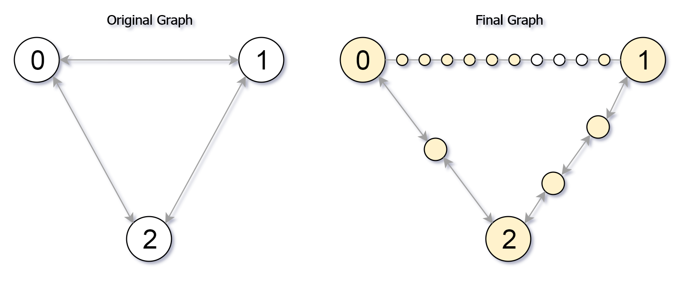

### 1. Description

You are given an undirected graph (the **"original graph"**) with `n` nodes labeled from `0` to $n - 1$. You decide to **subdivide** each edge in the graph into a chain of nodes, with the number of new nodes varying between each edge.

The graph is given as a 2D array of `edges` where $\text{edges}[i] = [u_{i}, v_{i}, \text{cnt}_{i}]$ indicates that there is an edge between nodes $u_{i}$ and $v_{i}$ in the original graph, and $\text{cnt}_{i}$ is the total number of new nodes that you will **subdivide** the edge into. Note that $\text{cnt}_{i} = 0$ means you will not subdivide the edge.

To **subdivide** the edge $[u_{i}, v_{i}]$, replace it with $(\text{cnt}_{i} + 1)$ new edges and $\text{cnt}_{i}$ new nodes. The new nodes are $x_{1}$, $x_{2}$, ..., $x_{cnt}i$, and the new edges are $[u_{i}, x_{1}]$, `[x_1, x_2]`, `[x_2, x_3]`, ..., `[x_cnti-1, x_cnti]`, $[x_{cnt}i, v_{i}]$.

In this **new graph**, you want to know how many nodes are **reachable** from the node `0`, where a node is **reachable** if the distance is `maxMoves` or less.

Given the original graph and `maxMoves`, return *the number of nodes that are **reachable** from node *`0`* in the new graph*.

### 2. Function Contract

- `n`: Input parameter.
- Returns expected result.

### 3. Examples

#### Example 1

- **Input:** $edges = [[0,1,10],[0,2,1],[1,2,2]], maxMoves = 6, n = 3$
- **Output:** `13`
- **Explanation:** The edge subdivisions are shown in the image above.
The nodes that are reachable are highlighted in yellow.
#### Example 2

- **Input:** $edges = [[0,1,4],[1,2,6],[0,2,8],[1,3,1]], maxMoves = 10, n = 4$
- **Output:** `23`
#### Example 3

- **Input:** $edges = [[1,2,4],[1,4,5],[1,3,1],[2,3,4],[3,4,5]], maxMoves = 17, n = 5$
- **Output:** `1`
- **Explanation:** Node 0 is disconnected from the rest of the graph, so only node 0 is reachable.

### 4. Constraints

- $0 \le \text{edges.length} \le min(n * (n - 1) / 2, 10^{4})$

- $\text{edges}[i].length = 3$

- $0 \le u_{i} < v_{i} < n$

- There are **no multiple edges** in the graph.

- $0 \le \text{cnt}_{i} \le 10^{4}$

- $0 \le maxMoves \le 10^{9}$

- $1 \le n \le 3000$