## Solution

---

### Approach 1: Simulation

#### Intuition

Initially, we are located at the coordinates `rStart` and `cStart` and must make our first movement toward the East. Let's simulate the clockwise movement and note the distances moved with each direction to identify any patterns:

- Move 1 unit towards the East.
- Move 1 unit towards the South.
- Move 2 units towards the West.
- Move 2 units towards the North.
- Move 3 units towards the East.
- Move 3 units towards the South.
- Move 4 units towards the West.
- Move 4 units towards the North.
- and so on...

We observe a pattern where distances are covered in pairs of directions, increasing the distance by 1 after each pair. Specifically, we move in the order of East, South, West, and North, increasing the distance after every pair.

To implement this, we can store the directional movements in an array: for instance, East corresponds to `(x+0, y+1)` and South to `(x+1, y+0)`. We then simulate the process by taking two directions simultaneously and increasing the step size after every pair. If the current cell lies within the matrix, we append it to the `traversed` matrix. We return `traversed` once all matrix cells have been covered.

#### Algorithm

1. Initialize an array `dir` with all possible directional movements in the movement.
2. Initialize a matrix `traversed` to store the coordinates of cells.
3. Initialize the integers $step = 1$, $direction = 0$ and iterate until all cells have been traversed:
- Iterate `i` from `0` to `1`:
- Iterate `j` from `0` to $step - 1$:
- If $rStart \ge 0$, `rStart < rows`, $cStart \ge 0$, `cStart < cols`:
- Append `{rStart,cstart}` to `traversed`.
- Add $\text{dir}[direction][0]$ to `rStart` and $\text{dir}[direction][1]$ to `cStart`.
- Increment `step` by 1.
4. Return `traversed`.

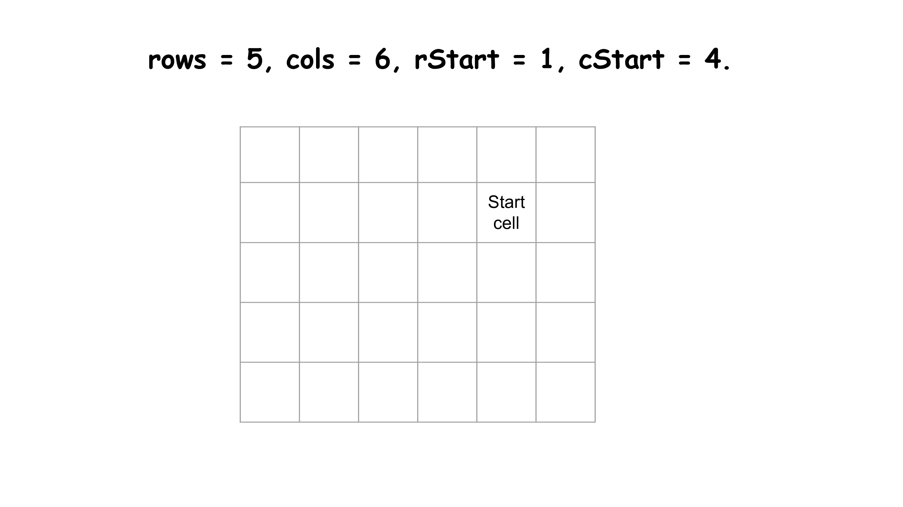

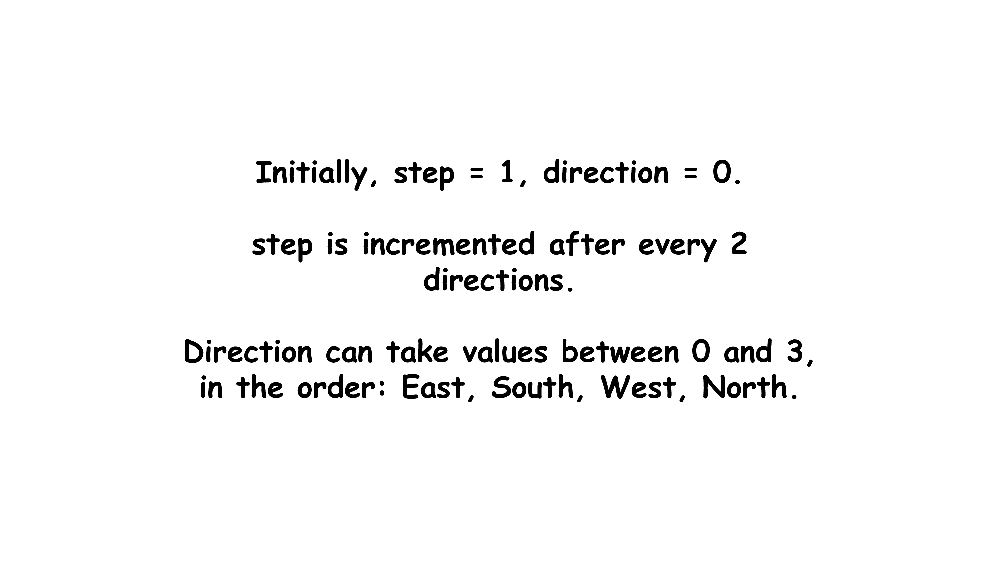

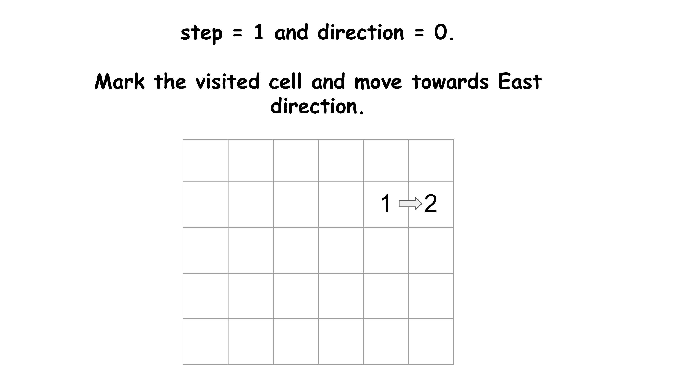

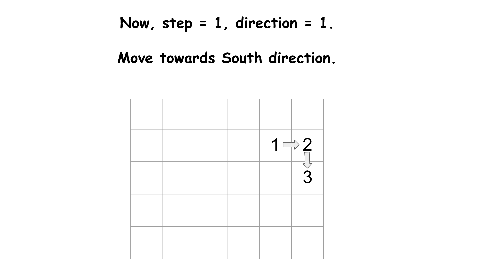

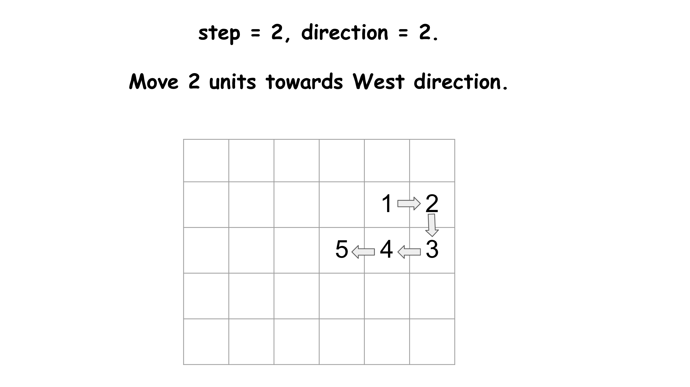

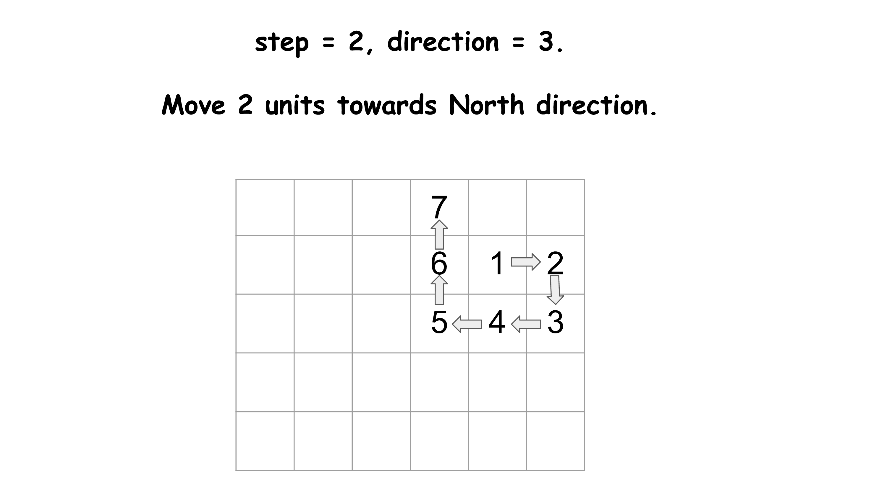

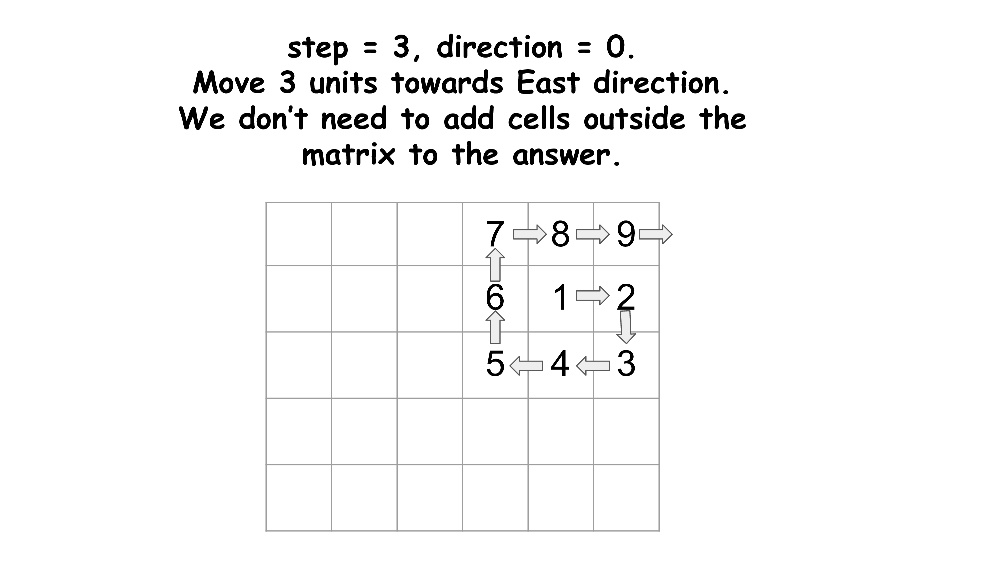

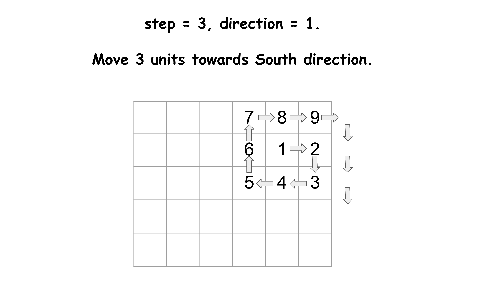

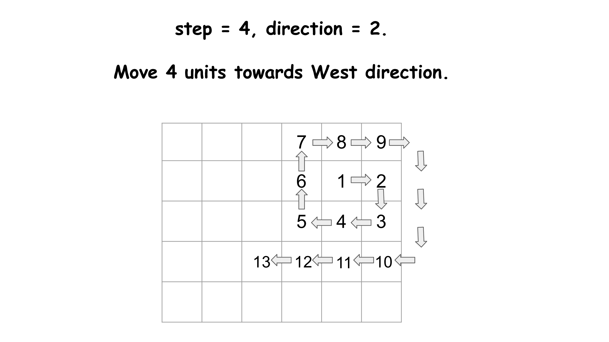

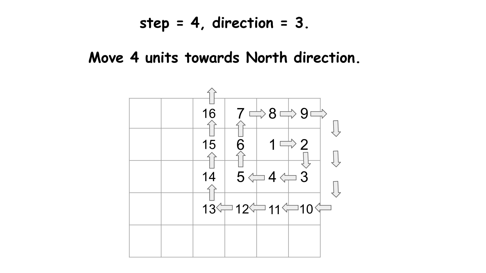

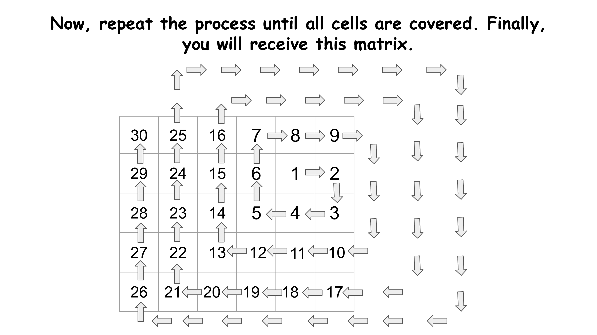

#### Implementation

```python
class Solution:
    def spiralMatrixIII(
        self, rows: int, cols: int, rStart: int, cStart: int
    ) -> List[List[int]]:
        # Store all possible directions in an array.
        dir = [[0, 1], [1, 0], [0, -1], [-1, 0]]
        traversed = []

        # Initial step size is 1, value of d represents the current direction.
        step = 1
        direction = 0
        while len(traversed) < rows * cols:
            # direction = 0 -> East, direction = 1 -> South
            # direction = 2 -> West, direction = 3 -> North
            for _ in range(2):
                for _ in range(step):
                    # Validate the current position
                    if (
                        rStart >= 0
                        and rStart < rows
                        and cStart >= 0
                        and cStart < cols
                    ):
                        traversed.append([rStart, cStart])
                    # Make changes to the current position.
                    rStart += dir[direction][0]
                    cStart += dir[direction][1]

                direction = (direction + 1) % 4
            step += 1
        return traversed
```

#### Complexity Analysis

Let $rows$ be the number of rows and $cols$ be the number of columns in the matrix.

- Time complexity: $O(\max(\text{rows}, \text{cols})^2)$

    We fill the `traversed` matrix with the values on the simulated path. However, we might also move out of the matrix during traversal. The total distance covered depends on $\max(\text{rows}, \text{cols})^2$. Can you think of some cases with the worst case time complexity? An example is shown below for the 2x2 matrix:

    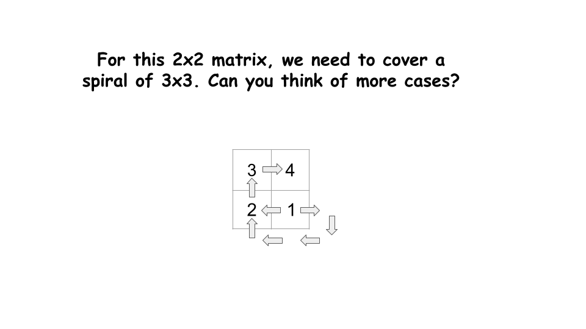

    Therefore, the total time complexity is $O(\max(\text{rows}, \text{cols})^2)$.

- Space complexity: $O(\text{rows} \cdot \text{cols})$

    Apart from the `traversed` matrix, no additional memory is used. The `traversed` matrix stores all the cells of the matrix, so its size is $\text{rows} \times \text{cols}$. Therefore, the total space complexity is $O(\text{rows} \cdot \text{cols})$.

---