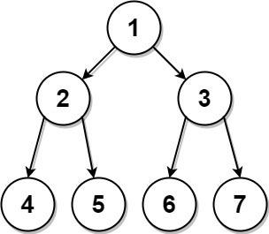

## Description

Given two integer arrays, `preorder` and `postorder` where `preorder` is the preorder traversal of a binary tree of **distinct** values and `postorder` is the postorder traversal of the same tree, reconstruct and return *the binary tree*.

If there exist multiple answers, you can **return any** of them.
### Function Contract

- `n`: Input parameter.
- Returns expected result.

### Examples

#### Example 1

- **Input:** $preorder = [1,2,4,5,3,6,7], postorder = [4,5,2,6,7,3,1]$
- **Output:** `[1,2,3,4,5,6,7]`
#### Example 2

- **Input:** $preorder = [1], postorder = [1]$
- **Output:** `[1]`
### Constraints

- $1 \le \text{preorder.length} \le 30$

- $1 \le \text{preorder}[i] \le \text{preorder.length}$

- All the values of `preorder` are **unique**.

- $\text{postorder.length} = \text{preorder.length}$

- $1 \le \text{postorder}[i] \le \text{postorder.length}$

- All the values of `postorder` are **unique**.

- It is guaranteed that `preorder` and `postorder` are the preorder traversal and postorder traversal of the same binary tree.