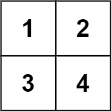
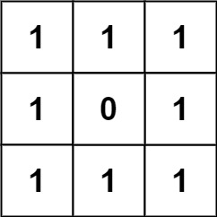
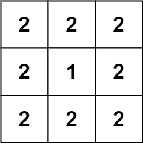

## Description

You are given an `n x n` `grid` where you have placed some `1 x 1 x 1` cubes. Each value $v = \text{grid}[i][j]$ represents a tower of `v` cubes placed on top of cell `(i, j)`.

After placing these cubes, you have decided to glue any directly adjacent cubes to each other, forming several irregular 3D shapes.

Return *the total surface area of the resulting shapes*.

**Note:** The bottom face of each shape counts toward its surface area.
### Function Contract

- `n`: Input parameter.
- Returns expected result.

### Examples

#### Example 1

- **Input:** `grid = [[1,2],[3,4]]`
- **Output:** `34`
#### Example 2

- **Input:** `grid = [[1,1,1],[1,0,1],[1,1,1]]`
- **Output:** `32`
#### Example 3

- **Input:** `grid = [[2,2,2],[2,1,2],[2,2,2]]`
- **Output:** `46`
### Constraints

- $n = \text{grid.length} = \text{grid}[i].length$

- $1 \le n \le 50$

- $0 \le \text{grid}[i][j] \le 50$