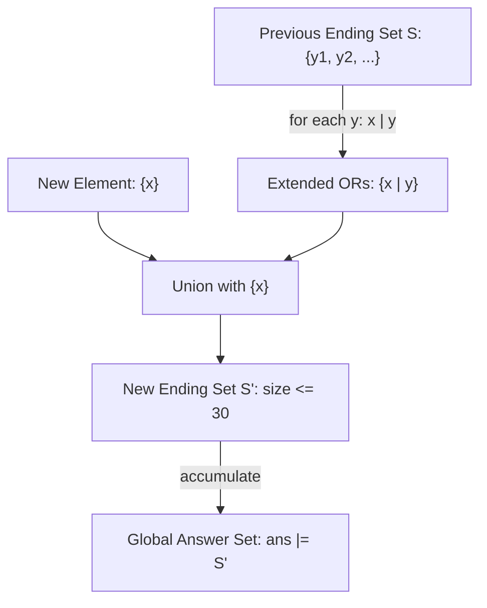

# Guided Example: Bitwise ORs of Subarrays

We trace the step-by-step rolling evaluation of subarray bitwise OR sets, prove the logarithmic cardinality bound ($|S_i| \le 30$) arising from bit-inclusion monotonicity, and derive the total count of distinct bitwise OR values across all contiguous subarrays on representative integer sequences:

- **Representative Input Array:**
  $$
  arr = [1, 1, 2]
  $$
- **Required Output:** `3`
  - All contiguous subarrays and their bitwise OR evaluations:
    - Length 1:
      - $arr[0 \dots 0] = [1] \implies 1$
      - $arr[1 \dots 1] = [1] \implies 1$
      - $arr[2 \dots 2] = [2] \implies 2$
    - Length 2:
      - $arr[0 \dots 1] = [1, 1] \implies 1 \mid 1 = 1$
      - $arr[1 \dots 2] = [1, 2] \implies 1 \mid 2 = 3$ (binary: $01_2 \mid 10_2 = 11_2$)
    - Length 3:
      - $arr[0 \dots 2] = [1, 1, 2] \implies 1 \mid 1 \mid 2 = 3$
  - Set of distinct results:
    $$
    \{1, 2, 3\} \implies \text{Total Count} = \mathbf{3}
    $$
- **Secondary Instance:** $arr = [1, 2, 4]$
  - Distinct OR values generated:
    $$
    \{1, 2, 4, 1 \mid 2 = 3, 2 \mid 4 = 6, 1 \mid 2 \mid 4 = 7\} = \{1, 2, 3, 4, 6, 7\} \implies \text{Count} = \mathbf{6}
    $$

---

## 1. Instance & Teaching Goal

Given the array $arr = [1, 1, 2]$:

Find the number of distinct values obtained by taking the bitwise OR of every non-empty contiguous subarray.

```text
Subarrays ending at index:
  i = 0: [1]                -> OR = 1
  i = 1: [1], [1, 1]        -> ORs = {1}
  i = 2: [2], [1, 2], [1, 1, 2] -> ORs = {2, 3}

Global Unique Bitwise OR Set:
  ans = {1} U {1} U {2, 3} = {1, 2, 3} -> Size = 3
```

A naive brute-force approach inspects all $\mathcal{O}(n^2)$ subarrays, taking $\mathcal{O}(n^2)$ time and risking time-limit expiration for $n = 50{,}000$.

The decisive pedagogical goal is to prove why dynamic rolling sets do not explode in size. Although there are $i+1$ subarrays ending at index $i$, the number of **distinct** bitwise OR values ending at index $i$ cannot exceed $30$ (the bit-width of $10^9$). This shrinks the runtime from $\mathcal{O}(n^2)$ to $\mathcal{O}(30 \cdot n)$.

---

## 2. Conceptual Foundation & The 30-Bit Monotonicity Invariant



### The Logarithmic Cardinality Bound Theorem

Let $S_i = \{ \text{OR}(arr[k \dots i]) \mid 0 \le k \le i \}$ be the set of distinct bitwise OR values for all subarrays ending at index $i$.

1. **Bit Monotonicity:**
   For any integer sequence, as we extend a subarray backwards from $i$ to $k$ ($k$ decreasing from $i$ down to $0$):
   $$
   \text{OR}(arr[k \dots i]) = arr[k] \mid \text{OR}(arr[k+1 \dots i])
   $$
   The bitwise OR operation is monotone with respect to the set of set bits (1-bits):
   $$
   \text{bits}(A \mid B) \supseteq \text{bits}(B)
   $$
2. **Strict Bit Saturation:**
   As $k$ decreases, the numerical value $\text{OR}(arr[k \dots i])$ can either stay identical (if $arr[k]$ introduces no new 1-bits) or strictly increase by setting at least one previously unset bit from $0 \to 1$.
3. **Upper Bound:**
   Since any integer in $arr$ satisfies $0 \le arr[j] \le 10^9 < 2^{30}$, there are at most 30 available bit positions. Therefore, the number of strictly distinct values encountered as we move backwards from index $i$ cannot exceed $30$ (or at most $32$ for arbitrary 32-bit words):
   $$
   |S_i| \le 30, \quad \forall i
   $$

---

## 3. Step-by-Step Worked Execution

We trace $arr = [1, 1, 2]$ using rolling sets $S$ and global accumulator $ans$.

| Index $i$ | Element $arr[i]$ | Binary of $arr[i]$ | Active Ending Set Before Step $S_{i-1}$ | Extending Operations ($x \mid y$ for $y \in S$) | New Ending Set $S_i$ | Global Accumulated Set $ans$ | Running Unique Count |
|:---:|:---:|:---:|:---:|:---:|:---:|:---:|:---:|
| Init | — | — | — | — | $\emptyset$ | $\emptyset$ | 0 |
| **0** | $1$ | $001_2$ | $\emptyset$ | None (base element) | $\{1\}$ | $\{1\}$ | 1 |
| **1** | $1$ | $001_2$ | $\{1\}$ | $1 \mid 1 = 1$ | $\{1\} \cup \{1\} = \{1\}$ | $\{1\}$ | 1 |
| **2** | $2$ | $010_2$ | $\{1\}$ | $2 \mid 1 = 3$ ($010_2 \mid 001_2 = 011_2$) | $\{3\} \cup \{2\} = \{2, 3\}$ | $\{1, 2, 3\}$ | **3** |

### Detailed Transition Analysis

1. **At $i = 0$ ($arr[0] = 1$):**
   - Subarray ending at $0$: $[1] \implies 1$.
   - $S_0 = \{1\}$.
   - $ans = \{1\}$.
2. **At $i = 1$ ($arr[1] = 1$):**
   - Subarrays ending at $1$:
     - $[1, 1] \implies 1 \mid 1 = 1$.
     - $[1] \implies 1$.
   - Deduped set $S_1 = \{1\}$. Notice how duplicate values collapse automatically!
   - $ans = \{1\} \cup \{1\} = \{1\}$.
3. **At $i = 2$ ($arr[2] = 2$):**
   - Subarrays ending at $2$:
     - Combining with $S_1 = \{1\}$: $2 \mid 1 = 3$.
     - Standalone $[2]$: $2$.
   - $S_2 = \{2, 3\}$.
   - $ans = \{1\} \cup \{2, 3\} = \{1, 2, 3\}$.
4. Final answer: $|ans| = |\{1, 2, 3\}| = \mathbf{3}$.

---

## 4. Execution on Distinct Powers of Two: $arr = [1, 2, 4]$

To observe the maximum expansion of $S_i$, trace $arr = [1, 2, 4]$:

| Index $i$ | $arr[i]$ | $S_{i-1}$ | Extensions $x \mid y$ | New Ending Set $S_i$ | Accumulated $ans$ |
|:---:|:---:|:---:|:---:|:---:|:---|
| 0 | $1$ ($001_2$) | $\emptyset$ | Base | $\{1\}$ | $\{1\}$ |
| 1 | $2$ ($010_2$) | $\{1\}$ | $2 \mid 1 = 3$ | $\{2, 3\}$ | $\{1, 2, 3\}$ |
| 2 | $4$ ($100_2$) | $\{2, 3\}$ | $4 \mid 2 = 6$, $4 \mid 3 = 7$ | $\{4, 6, 7\}$ | $\{1, 2, 3, 4, 6, 7\}$ |

Final unique count: $|ans| = 6$. At every index $i$, $|S_i| = i + 1 \le 30$.

---

## 5. Algorithmic Correctness

### Completeness and Soundness

1. **Soundness:**
   Every element added to $S_i$ is formed either as $arr[i]$ (a single-element subarray) or as $arr[i] \mid v$ where $v \in S_{i-1}$. By induction on subarray length, every value in $S_i$ is the bitwise OR of some contiguous subarray $arr[k \dots i]$ for $0 \le k \le i$.
2. **Completeness:**
   Any contiguous subarray $arr[j \dots i]$ ($j \le i$) has bitwise OR equal to $arr[j \dots i-1] \mid arr[i]$ (for $j < i$) or $arr[i]$ (for $j = i$).
   Since $S_{i-1}$ contains the OR values of all subarrays ending at $i-1$, extending each value by $\mid arr[i]$ and including $arr[i]$ guarantees that all subarrays ending at $i$ are represented.
3. Because $ans = \bigcup_{i=0}^{n-1} S_i$, $ans$ contains the exact set of bitwise OR values across all contiguous subarrays of $arr$.

---

## 6. Edge Cases & Traps

| Scenario | Input | Behavior | Trapped Risk |
|---|---|---|---|
| Single Element | $arr = [0]$ | $S_0 = \{0\}, ans = \{0\}$. Returns $1$. | Handling $0$ correctly in bitwise operations. |
| All Identical Elements | $arr = [7, 7, 7, 7]$ | $7 \mid 7 = 7$. $S_i = \{7\}$ for all $i$. $ans = \{7\}$. Returns $1$. | Avoid generating $N(N+1)/2$ duplicates. |
| Zeroes Interspersed | $arr = [1, 0, 2]$ | $x \mid 0 = x$. Zeroes pass prior values through without setting new bits. | Zero values causing infinite set growth or missed values. |
| Max Elements ($10^9$) | Values with 30 bits | $|S_i| \le 30$ guaranteed; runtime never exceeds $30 \cdot 50{,}000$ operations. | Exceeding time limits due to excessive set sizes. |

---

## 7. Complexity Derivation

- **Time Complexity:** $\mathcal{O}(n \cdot \log(\max(arr)))$, where $\log(\max(arr)) \le 30$.
  - At each index $i$, the size of the rolling set $S_{i-1}$ is at most $30$.
  - Performing bitwise OR between $arr[i]$ and each element of $S_{i-1}$ requires at most $30$ operations.
  - Total bitwise operations across $n$ steps: $\le 30n \approx 1.5 \times 10^6$, running in under $0.05$ seconds.
- **Auxiliary Space:** $\mathcal{O}(n \cdot \min(n, 30))$.
  - The rolling set $S$ uses $\mathcal{O}(30) = \mathcal{O}(1)$ memory.
  - The global set $ans$ stores at most $30n$ distinct values in the worst case, fitting comfortably within memory limits.