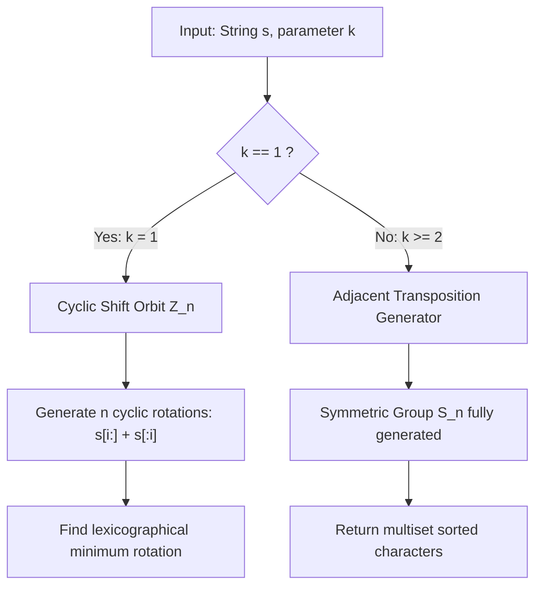

# Guided Example: Orderly Queue

We trace the step-by-step transformation of a string under restricted prefix-rotation operations, prove the bifurcation between cyclic rotation orbits ($k = 1$) and the full symmetric group $S_n$ ($k \ge 2$), and demonstrate the derivation of the lexicographically smallest reachable string:

- **Representative Instance 1 ($k = 1$, Pure Cyclic Rotations):**
  $$
  s = \text{"cba"}, \quad k = 1
  $$
  - Feasible operations: only index $0$ can be moved to the tail.
  - All reachable states (cyclic shifts):
    1. Shift 0: $\text{"cba"}$
    2. Shift 1: $\text{"bac"}$
    3. Shift 2: $\text{"acb"}$
  - Lexicographically smallest state:
    $$
    \min(\text{"cba"}, \text{"bac"}, \text{"acb"}) = \mathbf{"acb"}
    $$

- **Representative Instance 2 ($k \ge 2$, Full Permutation Symmetry):**
  $$
  s = \text{"baaca"}, \quad k = 3
  $$
  - With $k \ge 2$, any adjacent transposition $(i, i+1)$ is reachable via prefix selection.
  - Because adjacent transpositions generate the entire symmetric group $S_n$, every permutation of $s$ is reachable.
  - Lexicographically smallest permutation:
    $$
    \text{sort}(s) = \mathbf{"aaabc"}
    $$

---

## 1. Instance & Teaching Goal

Given a string $s$ of length $n$ and an integer $k$: in each move, choose any character from the first $k$ positions of $s$, remove it, and append it to the end.

Find the lexicographically smallest string reachable after any number of moves.

```text
Operation with k = 1 on "cba":
  c | ba  ->  bac  (only index 0 can be moved)
  b | ac  ->  acb
  a | cb  ->  cba  (returns to start; exactly n states)

Operation with k = 2 on "ba":
  Can choose index 0: b | a -> ab  (transposition achieved!)
```

A naive graph traversal (BFS across reachable strings) quickly explodes into $\mathcal{O}(n!)$ states when $k \ge 2$, causing memory exhaustion and TLE.

The decisive pedagogical goal is to establish the **Permutation Group Bifurcation Theorem**:
1. When $k = 1$, the operation is strictly confined to cyclic group shifts $\mathbb{Z}_n$. Only $n$ distinct strings exist, so examining all $n$ rotations finds the optimum in $\mathcal{O}(n^2)$ time.
2. When $k \ge 2$, the operation can simulate any adjacent transposition $(i, i+1)$. Since adjacent transpositions generate the entire symmetric group $S_n$, **all** permutations are reachable, meaning the global minimum is simply the multiset sorted in ascending order.

---

## 2. Conceptual Foundation & Permutation Group Invariants



### The Adjacent Transposition Invariant ($k \ge 2$)

To prove why any permutation is reachable when $k \ge 2$, it suffices to show that we can swap the first two characters without altering the relative order of any other characters.

1. Suppose the string is $x_1 x_2 x_3 \dots x_n$. We wish to transform it into $x_2 x_1 x_3 \dots x_n$.
2. Because $k \ge 2$, we can choose to leave $x_1$ in place and move $x_2$ (at index $1$) to the back:
   $$
   x_1 x_2 x_3 \dots x_n \xrightarrow{\text{move } x_2} x_1 x_3 x_4 \dots x_n x_2
   $$
3. Next, move $x_1$ (now at index $0$) to the back:
   $$
   x_1 x_3 x_4 \dots x_n x_2 \xrightarrow{\text{move } x_1} x_3 x_4 \dots x_n x_2 x_1
   $$
4. Now perform $n - 2$ standard shifts (moving the character at index $0$ to the back) for each of $x_3, x_4, \dots, x_n$:
   $$
   x_3 x_4 \dots x_n x_2 x_1 \xrightarrow{(n-2) \text{ shifts}} x_2 x_1 x_3 x_4 \dots x_n
   $$
5. The relative order of all elements $x_3, \dots, x_n$ is preserved, while $x_1$ and $x_2$ have swapped positions.
6. By rotating the entire string, this adjacent swap can be applied to any pair of adjacent characters $(i, i+1)$.
7. By the foundational theorem of symmetric groups, the adjacent transpositions $(i, i+1)$ generate the full permutation group $S_n$. Hence, any rearrangement of characters is reachable via a finite sequence of moves.

---

## 3. Step-by-Step Worked Execution: $k = 1$ on $s = \text{"cba"}$

For $k = 1$, only index $0$ can be rotated to the tail. We trace all $n = 3$ cyclic shifts:

| Shift $i$ | Slicing Operation ($s[i:] + s[:i]$) | Rotated String | Compared with Current Minimum | Updated Running Minimum |
|:---:|:---|:---:|:---:|:---:|
| **0** | Base string $s[0:] + s[:0]$ | $\text{"cba"}$ | Baseline initialization | $\text{"cba"}$ |
| **1** | $s[1:] + s[:1] \implies \text{"ba"} + \text{"c"}$ | $\text{"bac"}$ | $\text{"bac"} < \text{"cba"}$ | $\text{"bac"}$ |
| **2** | $s[2:] + s[:2] \implies \text{"a"} + \text{"cb"}$ | $\text{"acb"}$ | $\text{"acb"} < \text{"bac"}$ | $\mathbf{"acb"}$ |

After $n - 1$ non-trivial rotations, the process completes a full cycle. The minimum observed string is $\mathbf{"acb"}$.

---

## 4. Step-by-Step Worked Execution: $k = 3$ on $s = \text{"baaca"}$

For $k = 3 \ge 2$, the full symmetric group $S_5$ is accessible:

| Character | Frequency in $s$ | Sorted Placement Range |
|:---:|:---:|:---:|
| `'a'` | 3 | Indices $0 \dots 2$ |
| `'b'` | 1 | Index $3$ |
| `'c'` | 1 | Index $4$ |

Assembling characters in non-decreasing order:
$$
\text{Reachable Minimum} = \mathbf{"aaabc"}
$$

---

## 5. Algorithmic Correctness

### Soundness & Completeness

1. **Soundness ($k = 1$):**
   When $k = 1$, the only available move is $s \mapsto s[1:] + s[0]$. Every reachable string is necessarily a cyclic shift $s[i:] + s[:i]$. Evaluating all $n$ shifts exhaustively guarantees that the returned minimum is an attainable, valid configuration.
2. **Completeness ($k \ge 2$):**
   Because adjacent transpositions $(i, i+1)$ can be executed without disturbing the relative ordering of any other characters, the generated subgroup is isomorphic to the symmetric group $S_n$. The lexicographically first permutation in any multiset under standard alphabetical ordering is uniquely the non-decreasing sorted string.

---

## 6. Boundary Cases & Traps

| Scenario | Input | Behavior | Trapped Risk |
|---|---|---|---|
| Single Character | $s = \text{"z"}, k = 1$ | Returns $\text{"z"}$ immediately. | Index out-of-bounds on rotation loop. |
| Already Sorted | $s = \text{"abc"}, k = 1$ | Returns $\text{"abc"}$ on shift 0. | Unnecessary mutations or corrupting sorted state. |
| All Identical Letters | $s = \text{"aaaa"}, k = 2$ | Returns $\text{"aaaa"}$. | Duplicate comparisons causing redundant allocations. |
| $k \ge n$ | $s = \text{"zyxwv"}, k = 5$ | Full prefix selectable $\implies$ returns $\text{"vwxyz"}$. | Treating $k \ge n$ differently from general $k \ge 2$. |
| Duplicate Minimal Shifts | $s = \text{"abab"}, k = 1$ | Shifts produce $\text{"abab"}, \text{"baba"}$. Returns $\text{"abab"}$. | Handling ties without breaking lexicographical tie-breakers. |

---

## 7. Complexity Derivation

- **Time Complexity:**
  - Case $k = 1$: We generate and compare $n$ cyclic rotations, each requiring $\mathcal{O}(n)$ string slice and lexicographical comparison work. Total time: $\mathcal{O}(n^2)$. (Using Booth's algorithm, this can be reduced to $\mathcal{O}(n)$, but standard slicing $\mathcal{O}(n^2)$ executes in $< 1\text{ ms}$ for $n \le 1000$).
  - Case $k \ge 2$: Sorting $n$ characters via standard comparison sort takes $\mathcal{O}(n \log n)$ time, or $\mathcal{O}(n)$ using counting sort over the $26$ English lowercase letters.
- **Auxiliary Space Complexity:**
  - Case $k = 1$: $\mathcal{O}(n)$ auxiliary space to store candidate rotation slices.
  - Case $k \ge 2$: $\mathcal{O}(n)$ auxiliary space to assemble the sorted character list into the output string.
