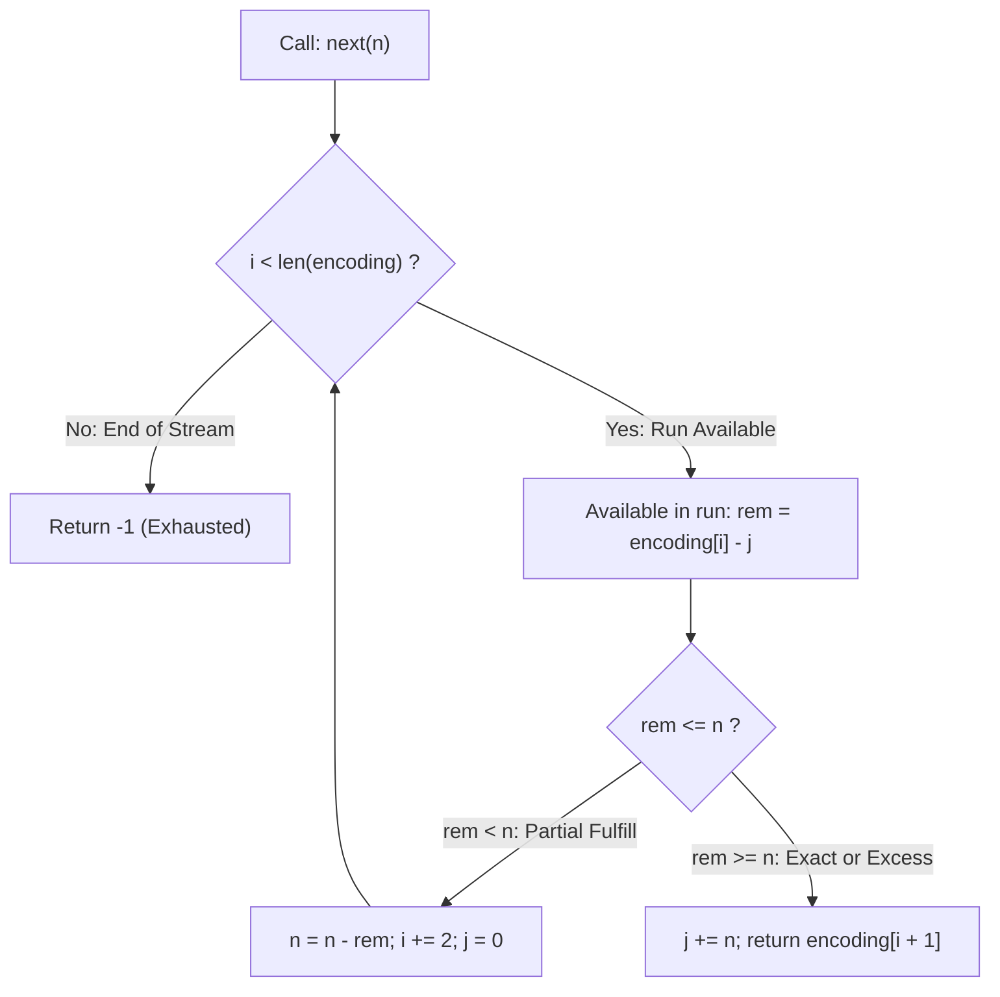

# Guided Example: RLE Iterator

We trace the step-by-step state evolution of a run-length encoded stream iterator, demonstrate lazy consumption without sequence decompression, and evaluate run transitions, boundary expirations, and empty-run skips on a representative instance:

- **Representative Encoded Stream:**
  $$
  \text{encoding} = [3, 8, \; 0, 9, \; 2, 5]
  $$
  - Pairs $\langle \text{count}, \text{value} \rangle$:
    - $\langle 3, 8 \rangle$: three copies of $8 \implies [8, 8, 8]$
    - $\langle 0, 9 \rangle$: zero copies of $9 \implies []$ (degenerate empty run)
    - $\langle 2, 5 \rangle$: two copies of $5 \implies [5, 5]$
  - Total conceptual sequence length: $3 + 0 + 2 = 5$ elements.
- **Operations Sequence:**
  $$
  [\text{next}(2), \; \text{next}(1), \; \text{next}(1), \; \text{next}(2)]
  $$
- **Required Output:**
  $$
  [8, \; 8, \; 5, \; -1]
  $$

---

## 1. Instance & Teaching Goal

Run-length encoding compresses consecutive identical values into pairs $\langle \text{count}_k, \text{val}_k \rangle$.

We design an iterator that supports $\text{next}(n)$, consuming the next $n$ elements from the uncompressed sequence and returning the **last** consumed element. If fewer than $n$ elements remain, all remaining elements are exhausted and the call returns $-1$.

```text
Decoded stream:  [ 8,  8,  8,  5,  5 ]
Index positions:   0   1   2   3   4
Call 1: next(2) -> [ 8,  8 ]           => last: 8
Call 2: next(1) -> [ 8 ]               => last: 8
Call 3: next(1) -> [ 5 ]               => last: 5  (0 copies of 9 skipped!)
Call 4: next(2) -> [ 5 ] exhausted!    => -1
```

A naive implementation decompressing the stream into an explicit array fails catastrophically because individual run counts can reach $10^9$, requiring gigabytes of memory and triggering immediate Out-Of-Memory / Memory Limit Exceeded errors.

The decisive pedagogical goal is to model stream consumption **lazily** using two state coordinates:
1. An even index $i$ tracking the active run $\langle \text{encoding}[i], \text{encoding}[i+1] \rangle$.
2. An offset $j$ recording how many items of the current run have already been consumed.

---

## 2. Conceptual Foundation & Pointer Invariants



### State Invariants

- **Run Index Parity:** Index $i$ is always even ($i \equiv 0 \pmod 2$), pointing directly to the count field of the active pair.
- **Offset Bounds:** The consumed offset $j$ satisfies $0 \le j \le \text{encoding}[i]$ at all stable call boundaries.
- **Available Capacity:** The unconsumed elements in the active run equal:
  $$
  \text{rem}(i, j) = \text{encoding}[i] - j
  $$
- **Monotone Exhaustion:** Every iteration of the consumption loop either strictly decreases the remaining demand $n$ or advances $i$ by $+2$, guaranteeing termination in at most $\mathcal{O}(\text{runs})$ steps.

---

## 3. Step-by-Step Worked Execution

Initial state: $i = 0$, $j = 0$, $\text{encoding} = [3, 8, \; 0, 9, \; 2, 5]$.

| Step | Operation | Active Pair $\langle \text{count}, \text{val} \rangle$ | Prior $j$ | Remaining in Run ($\text{count} - j$) | Demand $n$ | State Transition | Returned Value |
|:---:|:---:|:---:|:---:|:---:|:---:|:---|:---:|
| **Init** | Setup | $\langle 3, 8 \rangle$ at $i = 0$ | $0$ | $3 - 0 = 3$ | — | $i = 0, j = 0$ | — |
| **1** | $\text{next}(2)$ | $\langle 3, 8 \rangle$ ($i = 0$) | $0$ | $3$ | $2$ | $\text{rem} \ge n \implies j \leftarrow 0 + 2 = 2$ | $\mathbf{8}$ |
| **2** | $\text{next}(1)$ | $\langle 3, 8 \rangle$ ($i = 0$) | $2$ | $3 - 2 = 1$ | $1$ | $\text{rem} = n \implies j \leftarrow 2 + 1 = 3$ (run exhausted) | $\mathbf{8}$ |
| **3a** | $\text{next}(1)$ | $\langle 3, 8 \rangle$ ($i = 0$) | $3$ | $3 - 3 = 0$ | $1$ | $\text{rem} < n \implies n \leftarrow 1 - 0 = 1, i \leftarrow 2, j \leftarrow 0$ | (looping) |
| **3b** | (cont.) | $\langle 0, 9 \rangle$ ($i = 2$) | $0$ | $0 - 0 = 0$ | $1$ | $\text{rem} < n \implies n \leftarrow 1 - 0 = 1, i \leftarrow 4, j \leftarrow 0$ | (looping) |
| **3c** | (cont.) | $\langle 2, 5 \rangle$ ($i = 4$) | $0$ | $2 - 0 = 2$ | $1$ | $\text{rem} \ge n \implies j \leftarrow 0 + 1 = 1$ | $\mathbf{5}$ |
| **4a** | $\text{next}(2)$ | $\langle 2, 5 \rangle$ ($i = 4$) | $1$ | $2 - 1 = 1$ | $2$ | $\text{rem} < n \implies n \leftarrow 2 - 1 = 1, i \leftarrow 6, j \leftarrow 0$ | (looping) |
| **4b** | (cont.) | Stream ended ($i = 6 \ge 6$) | — | $0$ | $1$ | Reached boundary with $n = 1 > 0$ | $\mathbf{-1}$ |

Final consolidated outputs: $[8, 8, 5, -1]$.

---

## 4. Execution Trace Details

### Operation 1: $\text{next}(2)$
- Active run: $\langle 3, 8 \rangle$.
- Unconsumed items: $3 - 0 = 3$.
- Demand is $n = 2 \le 3$.
- We consume $2$ items from this run: $j \leftarrow 0 + 2 = 2$.
- The last item consumed is $\text{encoding}[i + 1] = \mathbf{8}$.

### Operation 2: $\text{next}(1)$
- Active run: $\langle 3, 8 \rangle$.
- Unconsumed items: $3 - 2 = 1$.
- Demand is $n = 1 \le 1$.
- We consume $1$ item: $j \leftarrow 2 + 1 = 3$.
- The last item consumed is $\text{encoding}[i + 1] = \mathbf{8}$. Run $0$ is now fully spent.

### Operation 3: $\text{next}(1)$
- Run $i = 0$: $3 - 3 = 0$ items remain. Advance $i \leftarrow 2, j \leftarrow 0$.
- Run $i = 2$: $\langle 0, 9 \rangle$ has $0$ items. Skip zero-length run! Advance $i \leftarrow 4, j \leftarrow 0$.
- Run $i = 4$: $\langle 2, 5 \rangle$ has $2 - 0 = 2$ items. Demand $n = 1 \le 2$.
- Consume $1$ item: $j \leftarrow 0 + 1 = 1$.
- The last item consumed is $\text{encoding}[4 + 1] = \mathbf{5}$.

### Operation 4: $\text{next}(2)$
- Run $i = 4$: $2 - 1 = 1$ item remains. Demand is $2$.
- We consume the remaining $1$ item: $n \leftarrow 2 - 1 = 1$, advance $i \leftarrow 6, j \leftarrow 0$.
- Now $i = 6 = \text{len}(\text{encoding})$. No more runs exist, but $n = 1 > 0$.
- The request cannot be satisfied. Return $\mathbf{-1}$.

---

## 5. Algorithmic Correctness

### Soundness & Completeness
1. **Soundness:**
   Whenever the loop terminates at run $i$ with $\text{rem}(i, j) \ge n$, exactly $n$ items have been deducted from the conceptual stream prefix, and the last item in that chunk is guaranteed to be $\text{encoding}[i + 1]$.
2. **Completeness:**
   If the cumulative sum of all remaining run counts is strictly less than $n$, the while loop exhausts every run in sequence until $i \ge \text{len}(\text{encoding})$. In this state, it is mathematically impossible to supply $n$ elements, and returning $-1$ is provably correct.

---

## 6. Boundary Cases & Traps

| Scenario | Input | Behavior | Trapped Risk |
|---|---|---|---|
| Leading Zero Run | $\text{encoding} = [0, 7, 2, 3]$ | $i$ advances past index $0$ without decrementing $n$. | Dividing by zero or halting on count $= 0$. |
| Exact Run Depletion | Count matches $n$ exactly | $j$ equals count; next call cleanly advances to next pair. | Off-by-one errors leaving phantom unconsumed items. |
| Call Beyond Exhaustion | Consecutive calls after $-1$ | $i \ge \text{len}$ holds immediately; returns $-1$ on every future call. | Crashing on out-of-bounds access after stream depletion. |
| Large Run Counts ($10^9$) | Single count $= 10^9$ | Arithmetic subtraction handles $10^9$ in $\mathcal{O}(1)$ time. | Out-of-memory errors from explicit array decompression. |
| Adjacent Equal Runs | $[2, 4, 3, 4]$ | Handled as two separate runs producing continuous sequence of $4$s. | Erroneously merging indices or resetting offset. |

---

## 7. Complexity Derivation

- **Time Complexity:**
  - Initialization: $\mathcal{O}(1)$ to record references and pointers.
  - Across $Q$ calls to $\text{next}(n)$: Each run is visited and discarded at most once because pointer $i$ only advances ($i \leftarrow i + 2$) and never retreats.
  - Amortized time per $\text{next}$ call: $\mathcal{O}\left(1 + \frac{M}{Q}\right)$, where $M$ is the number of encoded pairs ($M \le 500$). Total time for all calls: strictly $\mathcal{O}(M + Q)$.
- **Auxiliary Space Complexity:**
  - $\mathcal{O}(1)$ auxiliary space: Only two scalar integer pointers ($i, j$) are maintained. No decompressed arrays are allocated.
