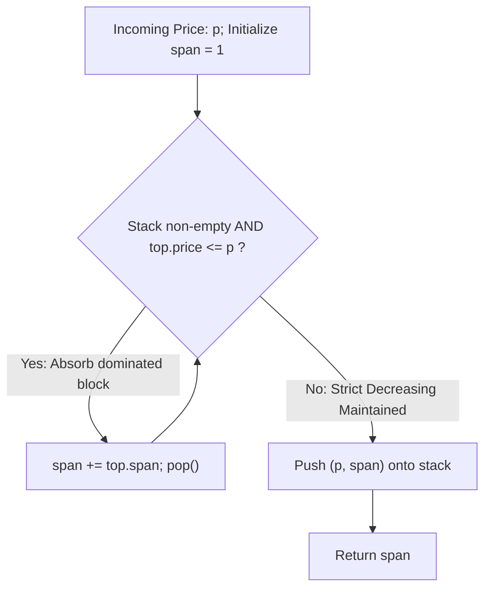

# Guided Example: Online Stock Span

We trace the step-by-step state of an online monotonic decreasing stack, prove the amortized $\mathcal{O}(1)$ time bound via token accounting, and demonstrate how span compression merges dominated historical price intervals on representative market quote streams:

- **Representative Stream 1 (Official Multi-Peak Series):**
  $$
  \text{quotes} = [100, \; 80, \; 60, \; 70, \; 60, \; 75, \; 85]
  $$
- **Required Output:**
  $$
  [1, \; 1, \; 1, \; 2, \; 1, \; 4, \; 6]
  $$
  - Daily spans:
    - Day 1: $100 \implies [100] \implies \mathbf{1}$
    - Day 2: $80 \le 100 \implies [80] \implies \mathbf{1}$
    - Day 3: $60 \le 80 \implies [60] \implies \mathbf{1}$
    - Day 4: $70 \ge 60 \implies [70, 60] \implies \mathbf{2}$
    - Day 5: $60 \le 70 \implies [60] \implies \mathbf{1}$
    - Day 6: $75 \ge 60, 70, 60 \implies [75, 60, 70, 60] \implies \mathbf{4}$
    - Day 7: $85 \ge 75, 60, 70, 60, 80 \implies [85, 75, 60, 70, 60, 80] \implies \mathbf{6}$

- **Secondary Instance (Immediate Valley Absorption):**
  $$
  \text{quotes} = [7, 2, 1, 2] \implies [1, 1, 1, 3]
  $$

---

## 1. Instance & Teaching Goal

Given a stream of daily stock prices, for each new price $p$, determine its **span**: the maximum number of consecutive preceding days (including today) for which the stock price was less than or equal to $p$.

```text
Day index:   0    1    2    3    4    5    6
Price:     100   80   60   70   60   75   85
Span:        1    1    1    2    1    4    6
                        ^              ^
                    70 absorbs 60     75 absorbs (60, 70, 60)
```

A naive approach scans backward from today through all historical prices until encountering a price strictly greater than $p$. On monotonically increasing sequences (e.g., $1, 2, 3, \dots, n$), this requires $\sum_{i=1}^n i = \Theta(n^2)$ comparisons, resulting in quadratic time and TLE for $10^5$ queries.

The decisive pedagogical goal is to maintain a **Monotonic Decreasing Stack of Compressed Intervals** $\langle \text{price}, \text{span} \rangle$. By storing the cumulative span directly with each price, any dominated price is popped and subsumed in constant amortized time.

---

## 2. Conceptual Foundation & The Monotonic Decreasing Invariant



### The Monotonic Decreasing Invariant

1. **Strict Ordering:** At every step, the stack elements are strictly decreasing in price from bottom to top:
   $$
   \text{stk}[0].\text{price} > \text{stk}[1].\text{price} > \dots > \text{stk}[k].\text{price}
   $$
2. **Span Invariance:** Each entry $\langle p_j, w_j \rangle$ on the stack asserts:
   - There are exactly $w_j$ consecutive historical days ending at $p_j$'s arrival whose prices were all $\le p_j$.
3. **Domination Principle:** If an incoming price $p$ satisfies $p \ge \text{top}.\text{price}$, then any future price that could be blocked by $\text{top}.\text{price}$ will also be blocked by $p$. Thus, $\text{top}$ can be permanently subsumed into $p$'s span without losing historical boundaries.

---

## 3. Step-by-Step Worked Execution

We trace the arrival of each price across the official sample sequence:

| Day | Quote $p$ | Top Before Inspection | Pop Decisions ($p \ge \text{top}.\text{price}$) | Accumulated Span $cnt$ | Resulting Stack State (Bottom $\to$ Top) | Returned Span |
|:---:|:---:|:---:|:---:|:---:|:---|:---:|
| **Init** | — | — | — | — | `[]` | — |
| **0** | $100$ | (empty) | None | $1$ | `[(100, 1)]` | **1** |
| **1** | $80$ | $(100, 1)$ | $80 < 100 \implies$ No pop | $1$ | `[(100, 1), (80, 1)]` | **1** |
| **2** | $60$ | $(80, 1)$ | $60 < 80 \implies$ No pop | $1$ | `[(100, 1), (80, 1), (60, 1)]` | **1** |
| **3** | $70$ | $(60, 1)$ | $70 \ge 60 \implies$ pop $(60, 1)$, $cnt = 1 + 1 = 2$ | $2$ | `[(100, 1), (80, 1), (70, 2)]` | **2** |
| **4** | $60$ | $(70, 2)$ | $60 < 70 \implies$ No pop | $1$ | `[(100, 1), (80, 1), (70, 2), (60, 1)]` | **1** |
| **5** | $75$ | $(60, 1)$ | $75 \ge 60 \implies$ pop $(60, 1)$, $cnt = 1 + 1 = 2$<br>$75 \ge 70 \implies$ pop $(70, 2)$, $cnt = 2 + 2 = 4$ | $4$ | `[(100, 1), (80, 1), (75, 4)]` | **4** |
| **6** | $85$ | $(75, 4)$ | $85 \ge 75 \implies$ pop $(75, 4)$, $cnt = 1 + 4 = 5$<br>$85 \ge 80 \implies$ pop $(80, 1)$, $cnt = 5 + 1 = 6$ | $6$ | `[(100, 1), (85, 6)]` | **6** |

---

## 4. Secondary Trace: Rapid Absorption in $quotes = [7, 2, 1, 2]$

| Step | Price | Action | Stack State After Step | Span |
|:---:|:---:|:---|:---|:---:|
| 1 | $7$ | Push $(7, 1)$ | `[(7, 1)]` | **1** |
| 2 | $2$ | Push $(2, 1)$ | `[(7, 1), (2, 1)]` | **1** |
| 3 | $1$ | Push $(1, 1)$ | `[(7, 1), (2, 1), (1, 1)]` | **1** |
| 4 | $2$ | Pop $(1, 1) \implies cnt = 1 + 1 = 2$<br>Pop $(2, 1) \implies cnt = 2 + 1 = 3$<br>Top is now $7 > 2$ (barrier reached!). Push $(2, 3)$ | `[(7, 1), (2, 3)]` | **3** |

Notice that the final price $2$ subsumed both $1$ and the previous $2$ to produce span $3$, while stopping cleanly before the barrier $7$.

---

## 5. Algorithmic Correctness

### Soundness & Completeness
1. **Soundness:**
   Every popped element $\langle p', w' \rangle$ satisfies $p' \le p$. By induction, each $w'$ accounts for an unbroken contiguous sequence of past days with prices $\le p' \le p$. Summing these weights into $cnt$ yields a strictly contiguous interval of preceding days bounded below by the current day.
2. **Completeness:**
   Popping halts as soon as the stack becomes empty or $\text{top}.\text{price} > p$. Because the stack maintains all un-dominated historical peaks, the element remaining at the top is the most recent past price strictly greater than $p$. Thus, the span cannot extend any further, proving that the calculated span is maximal.

---

## 6. Boundary Cases & Traps

| Scenario | Input Pattern | Behavior | Trapped Risk |
|---|---|---|---|
| Strictly Decreasing | $[9, 8, 7, 6]$ | No elements are ever popped; every span is $1$. | Stack overflow or linear scans per step. |
| Strictly Increasing | $[1, 2, 3, 4]$ | Each incoming element pops the entire stack. Spans grow $1, 2, 3, 4$. | Inefficient rescanning of previous elements. |
| Duplicate Prices | $[5, 5, 5]$ | Equality ($p \ge \text{top}.\text{price}$) triggers pop $\implies$ spans are $1, 2, 3$. | Using strict inequality ($>$) instead of non-strict ($\ge$). |
| Single Large Spike | $[10, 1, 2, 3, 10]$ | Final $10$ pops $3, 2, 1$ and equal $10$, reaching span $5$. | Stopping prematurely at equal-priced boundary. |

---

## 7. Complexity Derivation

- **Time Complexity:**
  - Amortized $\mathcal{O}(1)$ time per `next` operation across any sequence of $Q$ calls.
  - Potential / Token Accounting Proof:
    - Each price is pushed onto the stack exactly once ($+1$ token deposited).
    - Each stack element is popped at most once over the entire object lifetime (consuming its $1$ token).
    - Across $Q$ calls, total pushes $= Q$, total pops $\le Q$. Total loop operations $\le 2Q \implies \mathcal{O}(Q)$ total time.
- **Auxiliary Space Complexity:**
  - $\mathcal{O}(Q)$ in the worst case (e.g. strictly decreasing quotes where no elements are popped).
  - Memory stores at most $Q$ tuples of two integers $\langle \text{price}, \text{span} \rangle$.
