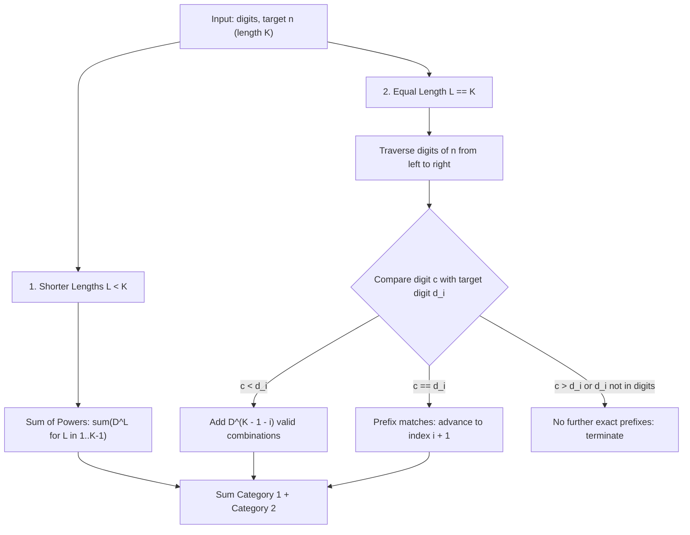

# Guided Example: Numbers At Most N Given Digit Set

We trace the step-by-step combinatorial digit construction, prove the separation between length-bounded geometric series and prefix-constrained positional counting, and evaluate tight boundary matching across representative instances:

- **Representative Instance 1 (Boundary Exceeds Digits):**
  $$
  \text{digits} = [\text{"1"}, \text{"3"}, \text{"5"}, \text{"7"}], \quad n = 100
  $$
- **Required Output:** `20`
  - $n = 100$ has $K = 3$ decimal digits. Available digit pool size $D = 4$.
  - Numbers with length $< 3$:
    - Length $1$: $4^1 = 4$ numbers ($\{1, 3, 5, 7\}$)
    - Length $2$: $4^2 = 16$ numbers ($\{11, 13, \dots, 77\}$)
  - Numbers with length $3$:
    - Smallest constructible 3-digit number is $111 > 100$. Exactly $0$ valid numbers.
  - Total valid numbers:
    $$
    4 + 16 + 0 = \mathbf{20}
    $$

- **Representative Instance 2 (Prefix-Constrained Traversal):**
  $$
  \text{digits} = [\text{"1"}, \text{"3"}, \text{"5"}, \text{"7"}], \quad n = 531
  $$
  - Length $< 3$: $4^1 + 4^2 = 20$.
  - Length $3$ ($d_1 = 5, d_2 = 3, d_3 = 1$):
    - Position 1 ($d_1 = 5$):
      - Digits $< 5$: $\{1, 3\}$ ($2$ choices) $\implies 2 \times 4^2 = 32$ numbers.
      - Digit $= 5$: $5 \in \text{digits} \implies$ proceed to position 2.
    - Position 2 ($d_2 = 3$):
      - Digits $< 3$: $\{1\}$ ($1$ choice) $\implies 1 \times 4^1 = 4$ numbers.
      - Digit $= 3$: $3 \in \text{digits} \implies$ proceed to position 3.
    - Position 3 ($d_3 = 1$):
      - Digits $< 1$: $\emptyset$ ($0$ choices).
      - Digit $= 1$: $1 \in \text{digits} \implies$ exact match $+1$.
  - Total: $20 + 32 + 4 + 0 + 1 = \mathbf{57}$.

---

## 1. Instance & Teaching Goal

Given a sorted array of unique non-zero digits `digits` and a positive integer $n$:

Count how many positive integers $\le n$ can be written using only characters from `digits` (allowing repeated use of digits).

```text
Digits: {1, 3, 5, 7}  (D = 4)
Target: n = 100        (K = 3 digits: "1", "0", "0")

Category A: Length < 3 (strictly fewer digits than n)
  Length 1: _        -> 4 choices               = 4
  Length 2: _ _      -> 4 * 4 choices           = 16
                                                 ---
                                    Subtotal A  = 20

Category B: Length == 3 (same number of digits as n)
  First digit can only be 1, 3, 5, 7.
  Any choice >= 1 makes number >= 111 > 100.
                                    Subtotal B  = 0
                                                 ===
                                    Total       = 20
```

A brute-force loop testing all integers $1, 2, \dots, n$ requires $\mathcal{O}(n \log n)$ checks. For $n = 10^9$, this requires over $10^9$ operations and immediately exceeds time limits.

The decisive pedagogical goal is to partition the problem into two orthogonal counting spaces:
1. **Unconstrained Shorter Lengths ($L < K$):** Because every number with $L < K$ digits is strictly smaller than any $K$-digit number, every combination of $L$ digits from $D$ is automatically valid, giving a geometric sum $\sum_{L=1}^{K-1} D^L$.
2. **Prefix-Constrained Equal Length ($L = K$):** Digits are evaluated from left to right. At position $i$, any digit strictly smaller than $n$'s $i$-th digit frees all subsequent positions to take any of the $D$ digits.

---

## 2. Conceptual Foundation & Positional Invariants



### Invariants of Positional Counting

Let $S = \text{str}(n)$ with length $K$, and let $D = |\text{digits}|$.

1. **Length Dominance:**
   $$
   \forall x \in \mathbb{N}, \quad \text{len}(\text{str}(x)) < K \implies x < 10^{K-1} \le n
   $$
   Therefore, every number of length $1, 2, \dots, K-1$ formed from `digits` is strictly less than $n$. The count is:
   $$
   N_{\text{shorter}} = \sum_{L=1}^{K-1} D^L
   $$
2. **Prefix Tightness:**
   For length $K$, we process index $i \in [0, K-1]$:
   - For each $c \in \text{digits}$:
     - If $c < S[i]$, any suffix of length $K - 1 - i$ forms a valid number $< n$. This adds $D^{K - 1 - i}$ solutions.
     - If $c == S[i]$, the prefix continues to match $S[0 \dots i]$ tightly.
   - If $S[i] \notin \text{digits}$, no number can match prefix $S[0 \dots i]$, so the equal-length traversal terminates immediately.
   - If all $K$ digits find exact matches in `digits`, the number $n$ itself is constructible, contributing $+1$.

---

## 3. Step-by-Step Worked Execution: $n = 100, \text{digits} = [1, 3, 5, 7]$

We trace $n = 100$ ($K = 3$, $S = \text{"100"}$) with $D = 4$:

### Phase 1: Shorter Lengths ($L < 3$)
- Length $L = 1$: $4^1 = 4$
- Length $L = 2$: $4^2 = 16$
- Accumulated from shorter lengths: $4 + 16 = 20$.

### Phase 2: Equal Length ($L = 3$, target prefix $S = \text{"100"}$)

| Index $i$ | Target Char $S[i]$ | Digits in Set $c < S[i]$ | Count Added ($|\{c < S[i]\}| \times D^{K-1-i}$) | Exact Match $S[i] \in \text{digits}$? | Action / State Transition |
|:---:|:---:|:---:|:---:|:---:|:---|
| **0** | `'1'` | None ($c < 1$ is empty) | $0 \times 4^2 = 0$ | Yes (`'1'` is in set) | Prefix matches `'1'`. Advance to index $1$. |
| **1** | `'0'` | None ($c < 0$ is empty) | $0 \times 4^1 = 0$ | **No** (`'0'` not in digits!) | Prefix broken. **Halt Phase 2.** |

Phase 2 contributes $0$. Total count $= 20 + 0 = \mathbf{20}$.

---

## 4. Secondary Worked Execution: $n = 531, \text{digits} = [1, 3, 5, 7]$

Here $K = 3$, $S = \text{"531"}$, $D = 4$:

- **Phase 1 (Shorter):** $4^1 + 4^2 = 20$.
- **Phase 2 (Length 3):**

| Position $i$ | Target $S[i]$ | Suffix Length $K - 1 - i$ | Digits $c < S[i]$ | Subtotal Added | Match? | Transition |
|:---:|:---:|:---:|:---:|:---:|:---:|:---|
| 0 | `'5'` | 2 | $\{'1', '3'\}$ ($2$ choices) | $2 \times 4^2 = 32$ | Yes (`'5'`) | Advance to $i = 1$ |
| 1 | `'3'` | 1 | $\{'1'\}$ ($1$ choice) | $1 \times 4^1 = 4$ | Yes (`'3'`) | Advance to $i = 2$ |
| 2 | `'1'` | 0 | $\emptyset$ ($0$ choices) | $0 \times 4^0 = 0$ | Yes (`'1'`) | All $K$ matched! Add $+1$ for $531$ |

Total valid count:
$$
20 + 32 + 4 + 0 + 1 = \mathbf{57}
$$

---

## 5. Algorithmic Correctness

### Soundness & Completeness
1. **Soundness:**
   Every counted integer is composed exclusively of characters in `digits`. Shorter numbers are strictly $< 10^{K-1} \le n$. Equal-length numbers either strictly diverge at the first differing index $i$ where $c < S[i]$ (guaranteeing the value is $< n$), or match $S$ at all $K$ positions (meaning the value equals $n \le n$).
2. **Completeness:**
   Every integer $\le n$ formed from `digits` has length $L \le K$. If $L < K$, it is counted in Phase 1. If $L = K$, it either shares a prefix with $n$ up to some index $i$ and has a smaller digit at $i$, or equals $n$. Every such configuration is uniquely accounted for with zero double-counting.

---

## 6. Boundary Cases & Traps

| Scenario | Input | Behavior | Trapped Risk |
|---|---|---|---|
| Single Digit $n$ | $\text{digits} = [7], n = 8$ | Phase 1 empty ($K=1$). Phase 2: $7 < 8 \implies 1$. Returns $1$. | Off-by-one in shorter length loop bounds. |
| Upper Boundary ($10^9$) | $\text{digits} = [1, 4, 9], n = 10^9$ | $K = 10$. Phase 1 sums $3^1 + \dots + 3^9 = 29523$. Phase 2 halts at $S[1] = '0'$. | 32-bit integer overflow during power calculations. |
| Zero in Target $n$ | $n = 100$ | `'0'` never exists in `digits` (allowed digits are $1 \dots 9$), causing immediate halt in Phase 2. | Assuming '0' can be matched or infinite loop. |
| All Digits Match $n$ | $\text{digits} = [1], n = 1$ | Phase 1 empty. Phase 2 matches '1' at end $\implies$ returns $1$. | Forgetting the $+1$ exact match bonus. |

---

## 7. Complexity Derivation

- **Time Complexity:** $\mathcal{O}(K \cdot D)$, where $K = \log_{10}(n) \le 10$ and $D = |\text{digits}| \le 9$.
  - Shorter lengths calculation takes $\mathcal{O}(K)$ iterations.
  - Phase 2 evaluates at most $K$ positions, each checking at most $D$ candidate digits.
  - Total operations: at most $10 \times 9 = 90$ operations, executing in $< 0.01\text{ ms}$.
- **Auxiliary Space Complexity:** $\mathcal{O}(K)$ auxiliary space to store the string representation of $n$, or $\mathcal{O}(1)$ if traversing digits via arithmetic division.