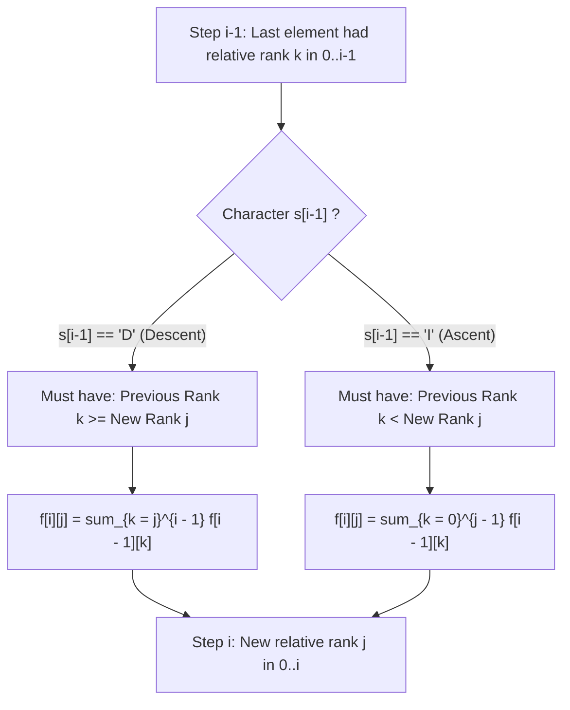

# Guided Example: Valid Permutations for DI Sequence

We trace the step-by-step evaluation of the relative-rank dynamic programming recurrence, prove the order-isomorphism property that reduces full permutation tracking to local ranks, and demonstrate state transitions on representative signature strings:

- **Representative Instance:**
  $$
  s = \text{"DID"} \quad (n = 3)
  $$
- **Required Output:** `5`
- **Universe:** Permutations $P$ of $\{0, 1, 2, 3\}$ of length $4$ satisfying:
  $$
  P[0] > P[1] < P[2] > P[3]
  $$
  - All $5$ valid permutations:
    1. $[1, 0, 3, 2] \implies 1 > 0 < 3 > 2$
    2. $[2, 0, 3, 1] \implies 2 > 0 < 3 > 1$
    3. $[2, 1, 3, 0] \implies 2 > 1 < 3 > 0$
    4. $[3, 0, 2, 1] \implies 3 > 0 < 2 > 1$
    5. $[3, 1, 2, 0] \implies 3 > 1 < 2 > 1$
  - Distinct valid count: $\mathbf{5} \pmod{10^9 + 7}$.

- **Secondary Boundary Cases:**
  - $s = \text{"D"} \implies [1, 0] \implies \mathbf{1}$
  - $s = \text{"I"} \implies [0, 1] \implies \mathbf{1}$
  - $s = \text{"IIII"} \implies [0, 1, 2, 3, 4] \implies \mathbf{1}$
  - $s = \text{"ID"} \implies [1, 2, 0], [0, 2, 1] \implies \mathbf{2}$

---

## 1. Instance & Teaching Goal

Given a string $s$ of length $n$ containing only `'I'` (increasing) and `'D'` (decreasing), count the number of permutations $P$ of $\{0, 1, \dots, n\}$ such that for all $i$:
- If $s[i] == \text{'I'}$, then $P[i] < P[i+1]$
- If $s[i] == \text{'D'}$, then $P[i] > P[i+1]$

```text
Permutation indices:    0       1       2       3
Relationship from s:       >       <       >
                        (s[0]='D') (s[1]='I') (s[2]='D')
Candidate: [2, 0, 3, 1]
Check:     2 > 0  (valid)
               0 < 3  (valid)
                   3 > 1  (valid)
```

A brute-force permutation search examines $(n+1)!$ configurations. For $n = 200$, $(201)! \approx 10^{377}$, which is impossible to compute.

The decisive pedagogical goal is to establish the **Relative Rank Invariant**:
When inserting the $(i+1)$-th element, its exact historical values do not matter—only its **relative rank** $j \in [0, i]$ among the $i+1$ elements placed so far determines whether the comparison with the preceding element is satisfied.

---

## 2. Conceptual Foundation & The Relative Rank Recurrence



### Order-Isomorphism & Rank Shifting

Let $f[i][j]$ be the number of valid prefixes of length $i+1$ (permuting some subset of size $i+1$) such that the last placed element has **relative rank** $j$ among those $i+1$ elements ($0 \le j \le i$).

When placing an element at relative rank $j \in [0, i]$:
- Any previously placed element whose prior relative rank was $k \ge j$ is shifted up by $+1$ to rank $k + 1 > j$.
- Any previously placed element whose prior relative rank was $k < j$ remains at rank $k < j$.

Therefore:
1. **Case `'D'` ($P[i-1] > P[i]$):**
   The previous element must end up strictly greater than the new element.
   This occurs if and only if its prior rank was $k \ge j$:
   $$
   f[i][j] = \sum_{k=j}^{i-1} f[i-1][k] \pmod{10^9 + 7}
   $$
2. **Case `'I'` ($P[i-1] < P[i]$):**
   The previous element must end up strictly less than the new element.
   This occurs if and only if its prior rank was $k < j$:
   $$
   f[i][j] = \sum_{k=0}^{j-1} f[i-1][k] \pmod{10^9 + 7}
   $$

---

## 3. Step-by-Step Worked Execution: $s = \text{"DID"}$

We track the DP table $f[i][j]$ for $i \in [0, 3]$ and ranks $j \in [0, i]$:

### Step 0: Base Initialization ($i = 0$, length $1$)
A single element has only one possible rank: $j = 0$.
$$
f[0][0] = 1
$$

---

### Step 1: Character $s[0] = \text{'D'}$ ($i = 1$, length $2$)
We transition using $f[1][j] = \sum_{k=j}^{0} f[0][k]$:
- $j = 0: k \in [0, 0] \implies f[1][0] = f[0][0] = 1$
- $j = 1: k \in [1, 0]$ (empty) $\implies f[1][1] = 0$

State vector:
$$
f[1] = [1, \; 0]
$$

---

### Step 2: Character $s[1] = \text{'I'}$ ($i = 2$, length $3$)
We transition using $f[2][j] = \sum_{k=0}^{j-1} f[1][k]$:
- $j = 0: k \in [0, -1]$ (empty) $\implies f[2][0] = 0$
- $j = 1: k \in [0, 0] \implies f[2][1] = f[1][0] = 1$
- $j = 2: k \in [0, 1] \implies f[2][2] = f[1][0] + f[1][1] = 1 + 0 = 1$

State vector:
$$
f[2] = [0, \; 1, \; 1]
$$

---

### Step 3: Character $s[2] = \text{'D'}$ ($i = 3$, length $4$)
We transition using $f[3][j] = \sum_{k=j}^{2} f[2][k]$:
- $j = 0: k \in [0, 2] \implies f[3][0] = f[2][0] + f[2][1] + f[2][2] = 0 + 1 + 1 = \mathbf{2}$
- $j = 1: k \in [1, 2] \implies f[3][1] = f[2][1] + f[2][2] = 1 + 1 = \mathbf{2}$
- $j = 2: k \in [2, 2] \implies f[3][2] = f[2][2] = \mathbf{1}$
- $j = 3: k \in [3, 2]$ (empty) $\implies f[3][3] = \mathbf{0}$

State vector:
$$
f[3] = [2, \; 2, \; 1, \; 0]
$$

---

## 4. Final Aggregation & Path Interpretation

Summing over all possible terminal ranks $j \in [0, 3]$:
$$
\text{Total Valid Permutations} = \sum_{j=0}^3 f[3][j] = 2 + 2 + 1 + 0 = \mathbf{5}
$$

### Mapping Terminal Ranks to Exact Permutations

| Terminal Rank $j$ | Count $f[3][j]$ | Corresponding Permutations $P$ |
|:---:|:---:|:---|
| **$j = 0$** (last element smallest) | $2$ | $[2, 1, 3, \mathbf{0}]$, $[3, 1, 2, \mathbf{0}]$ |
| **$j = 1$** (last element 2nd smallest) | $2$ | $[2, 0, 3, \mathbf{1}]$, $[3, 0, 2, \mathbf{1}]$ |
| **$j = 2$** (last element 3rd smallest) | $1$ | $[1, 0, 3, \mathbf{2}]$ |
| **$j = 3$** (last element largest) | $0$ | (None, impossible because $s[2] = \text{'D'}$ requires $P[2] > P[3]$) |

---

## 5. Algorithmic Correctness

### Soundness & Completeness
1. **Soundness:**
   Every transition preserves the local inequality demanded by $s[i-1]$. Because the shifting mechanism maintains a strict bijection between rank choices and actual element values, every combination counted in $f[n][j]$ corresponds to a valid, distinct permutation.
2. **Completeness:**
   Any valid permutation of length $n+1$ has a unique sequence of relative ranks when built from left to right. Because the DP visits every valid rank at each step, no valid permutation can be omitted.

---

## 6. Boundary Cases & Traps

| Scenario | Input | Behavior | Trapped Risk |
|---|---|---|---|
| Monotone Increasing | $s = \text{"IIII"}$ | Only $j = i$ receives positive value. Always returns $1$ ($[0, 1, 2, 3, 4]$). | Assuming multiple permutations can be sorted. |
| Monotone Decreasing | $s = \text{"DDDD"}$ | Only $j = 0$ receives positive value. Always returns $1$ ($[4, 3, 2, 1, 0]$). | Handling rank $0$ base case incorrectly. |
| Alternating Signature | $s = \text{"IDID"}$ | Ranks oscillate across center; returns Euler zig-zag count. | Forgetting modulo arithmetic on running sums. |
| Modulo Overflow | Long strings ($n = 200$) | Intermediate sums require modulo $(10^9 + 7)$ at every addition. | 32-bit integer overflow in intermediate additions. |

---

## 7. Complexity Derivation

- **Time Complexity:**
  - Standard Implementation: At step $i$, computing each of the $i+1$ states takes $\mathcal{O}(i)$ summation, yielding $\sum_{i=1}^n \mathcal{O}(i^2) = \mathcal{O}(n^3)$.
  - With Prefix Sums: Notice that $\sum_{k=0}^{j-1}$ and $\sum_{k=j}^{i-1}$ are contiguous interval sums of row $f[i-1]$. By maintaining a running prefix sum, each transition takes $\mathcal{O}(1)$, reducing total time to $\mathcal{O}(n^2)$.
  - For $n \le 200$, $n^2 = 40{,}000$ operations, running in under $10\text{ ms}$.
- **Auxiliary Space Complexity:**
  - A 2D table uses $\mathcal{O}(n^2)$ space.
  - Since row $i$ depends only on row $i-1$, rolling 1D buffers reduce space to $\mathcal{O}(n)$.
