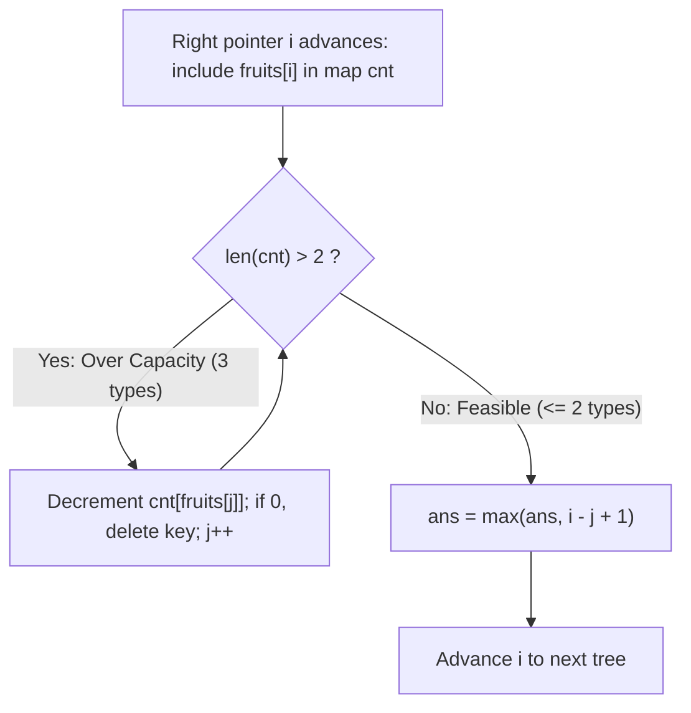

# Guided Example: Fruit Into Baskets

We trace the step-by-step expansion and contraction of a two-pointer sliding window, prove the at-most-two distinct key invariant, and demonstrate boundary evictions on representative orchard fruit sequences:

- **Representative Instance 1 (Internal Contraction & Dominant Suffix):**
  $$
  \text{fruits} = [1, \; 2, \; 3, \; 2, \; 2]
  $$
- **Required Output:** `4`
  - Longest contiguous subarray containing at most $2$ distinct fruit types:
    $$
    [2, \; 3, \; 2, \; 2] \quad (\text{types } \{2, 3\}, \text{ length } \mathbf{4})
    $$

- **Representative Instance 2 (Alternating Types):**
  $$
  \text{fruits} = [1, \; 2, \; 1] \implies \text{types } \{1, 2\} \implies \text{length } \mathbf{3}
  $$

- **Representative Instance 3 (Prefix Pruning):**
  $$
  \text{fruits} = [0, \; 1, \; 2, \; 2] \implies [1, \; 2, \; 2] \implies \text{length } \mathbf{3}
  $$

---

## 1. Instance & Teaching Goal

You are visiting a row of fruit trees represented by an integer array `fruits`, where `fruits[i]` is the type of fruit on tree $i$.
You have two baskets, and each basket can only carry **one single type** of fruit. You can pick exactly one fruit from each tree, moving from left to right, but you must stop as soon as you encounter a tree with a fruit type that cannot fit in either basket.

Find the maximum number of fruits you can pick continuously (i.e. the length of the longest contiguous subarray with at most **$2$ distinct values**).

```text
Orchard:   [ 1,   2,   3,   2,   2 ]
Index:       0    1    2    3    4
Window 0..1: [1, 2]         types: {1, 2}       len: 2
Window 0..2: [1, 2, 3]      types: {1, 2, 3} > 2! INVALID
Contract L:  eject 1 at index 0
Window 1..2: [2, 3]         types: {2, 3}       len: 2
Window 1..4: [2, 3, 2, 2]   types: {2, 3}       len: 4 (MAXIMUM!)
```

A brute-force search tests all $\mathcal{O}(n^2)$ subarrays, checking the distinct count of each in $\mathcal{O}(n)$ time, which scales as $\mathcal{O}(n^3)$ or $\mathcal{O}(n^2)$ and exceeds time limits for $n = 10^5$.

The decisive pedagogical goal is to maintain a **Flexible Sliding Window $[j, i]$** governed by a dynamic frequency map `cnt`.
The right pointer $i$ expands monotonically, and whenever $|\text{cnt}| > 2$, the left pointer $j$ advances until one of the fruit counts drops to zero and is evicted from the map.

---

## 2. Conceptual Foundation & The 2-Type Window Invariant



### Sliding Window Invariants

1. **At-Most-Two Invariant:** At the conclusion of each outer loop step $i$, the window $[j, i]$ satisfies:
   $$
   |\text{keys}(\text{cnt})| \le 2
   $$
2. **Exact Window Consistency:** For every distinct fruit type $u \in \text{cnt}$, $\text{cnt}[u]$ strictly equals the exact number of occurrences of $u$ in the slice $\text{fruits}[j \dots i]$.
3. **Monotonic Two-Pointer Progress:**
   - The right pointer $i$ advances from $0$ to $n - 1$ exactly once.
   - The left pointer $j$ only advances forward ($j \le i$). Across the entire execution, $j$ increments at most $n$ times.

---

## 3. Step-by-Step Worked Execution: $\text{fruits} = [1, 2, 3, 2, 2]$

We trace the algorithm on $[1, 2, 3, 2, 2]$:

| Step $i$ | Incoming Fruit | Action on Window | Left Pointer $j$ | Active Frequency Map `cnt` | Window Slice | Window Length ($i - j + 1$) | Max Length `ans` |
|:---:|:---:|:---|:---:|:---|:---:|:---:|:---:|
| **Init** | — | Baseline setup | $0$ | `{}` | `[]` | $0$ | $0$ |
| **0** | $1$ | Add $1$ | $0$ | `{1: 1}` | `[1]` | $1$ | $1$ |
| **1** | $2$ | Add $2$ | $0$ | `{1: 1, 2: 1}` | `[1, 2]` | $2$ | $2$ |
| **2** | $3$ | Add $3$ $\implies 3$ types! Contract $j$:<br>Eject $\text{fruits}[0]=1 \implies \text{cnt}[1]=0$ (removed), $j \leftarrow 1$ | $1$ | `{2: 1, 3: 1}` | `[2, 3]` | $2$ | $2$ |
| **3** | $2$ | Add $2$ | $1$ | `{2: 2, 3: 1}` | `[2, 3, 2]` | $3$ | $3$ |
| **4** | $2$ | Add $2$ | $1$ | `{2: 3, 3: 1}` | `[2, 3, 2, 2]` | $4$ | **4** |

---

## 4. Transition Analysis Across Key Events

### Event A: Ingestion of New Types ($i = 0, 1$)
- At $i = 0$, tree type $1$ is placed in basket 1. Window: $[0 \dots 0]$, length $1$.
- At $i = 1$, tree type $2$ is placed in basket 2. Window: $[0 \dots 1]$, length $2$. Both baskets are now occupied with distinct types $\{1, 2\}$.

### Event B: The Capacity Crisis at $i = 2$
- Tree type $3$ arrives. Map now contains $\{1: 1, 2: 1, 3: 1\}$ (3 types $> 2$).
- The while loop initiates:
  - $j = 0$: fruit is $\text{fruits}[0] = 1$. Decrement $\text{cnt}[1] \to 0$.
  - Remove key $1$ completely from `cnt`.
  - Advance $j \leftarrow 1$.
- Now `cnt` contains $\{2: 1, 3: 1\}$ (size $2 \le 2$). Feasibility restored!
- Valid window $[1 \dots 2]$ has length $2 - 1 + 1 = 2$.

### Event C: Suffix Expansion ($i = 3, 4$)
- At $i = 3$, fruit $2$ already matches basket 1. `cnt` becomes $\{2: 2, 3: 1\}$. Window length $3 - 1 + 1 = 3$.
- At $i = 4$, fruit $2$ matches basket 1 again. `cnt` becomes $\{2: 3, 3: 1\}$. Window length $4 - 1 + 1 = 4$.
- Global maximum updated to $\mathbf{4}$.

---

## 5. Algorithmic Correctness

### Soundness & Completeness
1. **Soundness:**
   The while loop guarantees that whenever `ans = max(ans, i - j + 1)` is called, the map contains at most $2$ distinct keys. Therefore, every evaluated candidate slice $\text{fruits}[j \dots i]$ is a strictly valid two-type subarray.
2. **Completeness:**
   For each right endpoint $i$, the while loop advances $j$ by the minimum distance required to eliminate the oldest exceeding fruit type. Hence, $j$ represents the earliest possible starting index that can pair with $i$ to form a valid window. Because every valid subarray ending at $i$ is a subsegment of $[j, i]$, no longer valid subarray ending at $i$ can exist.

---

## 6. Boundary Cases & Traps

| Scenario | Input Pattern | Behavior | Trapped Risk |
|---|---|---|---|
| Single Tree | $\text{fruits} = [0]$ | Window $[0 \dots 0]$ valid, returns $1$. | Index out-of-bounds on array length 1. |
| All Same Type | $\text{fruits} = [1, 1, 1, 1]$ | Map size remains $1 \le 2$; $j$ never advances. Returns $4$. | Assuming two distinct types must be picked. |
| Alternating Single Run | $\text{fruits} = [1, 2, 1, 2, 1]$ | Map size remains $2$; returns full array length $5$. | Unnecessary contraction on recurring types. |
| Key Eviction Trap | Count drops to zero | Must explicitly remove key (`del cnt[y]`), otherwise `len(cnt)` remains $3$. | Off-by-one errors from retained zero-count keys. |

---

## 7. Complexity Derivation

- **Time Complexity:** $\mathcal{O}(n)$.
  - The right pointer $i$ iterates from $0$ to $n - 1$ ($n$ steps).
  - The left pointer $j$ starts at $0$ and only increments ($j \le n$).
  - Total pointer increments $\le 2n$.
  - Hash map operations take $\mathcal{O}(1)$ time because the map holds at most $3$ entries at any point.
  - Overall runtime: strictly $\mathcal{O}(n)$, completing in $< 0.05\text{ s}$ for $n = 10^5$.
- **Auxiliary Space Complexity:** $\mathcal{O}(1)$.
  - The frequency hash map contains at most $3$ keys at any moment. Memory overhead is strictly bounded and independent of $n$.