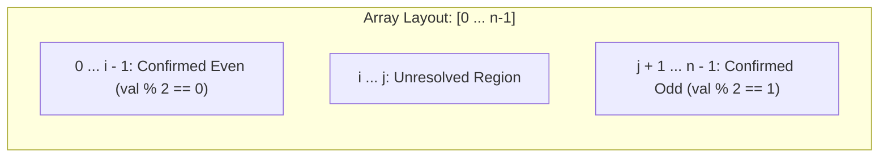

# Guided Example: Sort Array By Parity

We trace the step-by-step execution of bidirectional two-pointer in-place partitioning (Hoare's parity partition), prove the tripartite classification invariant, and demonstrate pointer convergence on representative integer arrays:

- **Representative Instance:**
  $$
  \text{nums} = [3, \; 1, \; 2, \; 4]
  $$
- **Required Output:** Any valid partition where all even integers precede all odd integers, such as:
  $$
  [4, \; 2, \; 1, \; 3] \quad \text{or} \quad [2, \; 4, \; 3, \; 1]
  $$
  - Even group: $\{2, 4\}$
  - Odd group: $\{1, 3\}$
  - Valid partition boundary: all elements in the first partition have remainder $0 \pmod 2$, and all elements in the second partition have remainder $1 \pmod 2$.

- **Secondary Boundary Instances:**
  - Already partitioned: $[0, 2, 4, 1, 3, 5] \implies [0, 2, 4, 1, 3, 5]$ ($0$ swaps needed)
  - Reversed parity blocks: $[1, 3, 5, 0, 2, 4] \implies [4, 2, 0, 5, 3, 1]$ ($3$ swaps needed)
  - Single zero: $[0] \implies [0]$ ($0 \pmod 2 == 0$, trivially even)

---

## 1. Instance & Teaching Goal

Given an integer array `nums`, move all the even integers to the front of the array followed by all the odd integers. The problem does not require stable ordering—any permutation satisfying the parity partition is accepted.

```text
Initial Array:   [  3,    1,    2,    4  ]
Indices:            0     1     2     3
                  ^                   ^
                 i=0                 j=3
                 (odd)              (even) -> SWAP!

After Swap 1:    [  4,    1,    2,    3  ]
                         ^     ^
                        i=1   j=2
                        (odd) (even)        -> SWAP!

After Swap 2:    [  4,    2,    1,    3  ]
                         ^     ^
                        j=1   i=2           -> i > j: TERMINATE!
```

A naive approach allocates two auxiliary arrays (one for evens, one for odds) and concatenates them. While linear in time, this uses $\mathcal{O}(n)$ extra space.

The decisive pedagogical goal is to execute an **In-Place Hoare Partition**:
Two pointers $i$ and $j$ start at opposite ends. Pointer $i$ advances past confirmed even elements, pointer $j$ retreats past confirmed odd elements, and whenever $i$ spots an odd number while $j$ spots an even number, their values are swapped in place in $\mathcal{O}(1)$ time.

---

## 2. Conceptual Foundation & The Tripartite Partition Invariant



### The Tripartite Invariant

At every step of the while loop ($i \le j$):
1. **Left Invariant:** Every element in index range $[0, i - 1]$ is strictly even:
   $$
   \forall k \in [0, i - 1], \quad \text{nums}[k] \equiv 0 \pmod 2
   $$
2. **Right Invariant:** Every element in index range $[j + 1, n - 1]$ is strictly odd:
   $$
   \forall k \in [j + 1, n - 1], \quad \text{nums}[k] \equiv 1 \pmod 2
   $$
3. **Unresolved Middle:** Only indices in $[i, j]$ remain uninspected.
4. **Monotone Contraction:** Every iteration either increments $i$, decrements $j$, or performs a swap and updates both, shrinking the unresolved interval $j - i + 1$ by at least $1$ (or $2$).
5. **Termination:** When $i \ge j$, the unresolved region is empty or a single element whose position relative to the boundary is already consistent. The entire array is partitioned.

---

## 3. Step-by-Step Worked Execution: $\text{nums} = [3, 1, 2, 4]$

We trace the algorithm on $[3, 1, 2, 4]$:

| Step | Left Pointer $i$ | Right Pointer $j$ | Element at $i$ | Element at $j$ | Parity Evaluation | Action Taken | Array State After Step | Unresolved Region $[i, j]$ |
|:---:|:---:|:---:|:---:|:---:|:---|:---|:---:|:---:|
| **Init** | $0$ | $3$ | $3$ | $4$ | — | Initialize boundaries | $[3, 1, 2, 4]$ | $[0, 3]$ |
| **1** | $0$ | $3$ | $3$ (odd) | $4$ (even) | Misplaced pair! | Swap $\text{nums}[0] \leftrightarrow \text{nums}[3]$, $i \leftarrow 1, j \leftarrow 2$ | $[4, 1, 2, 3]$ | $[1, 2]$ |
| **2** | $1$ | $2$ | $1$ (odd) | $2$ (even) | Misplaced pair! | Swap $\text{nums}[1] \leftrightarrow \text{nums}[2]$, $i \leftarrow 2, j \leftarrow 1$ | $[4, 2, 1, 3]$ | $\emptyset$ ($i > j$) |
| **3** | $2$ | $1$ | — | — | $i > j$ holds | Halt loop | $[4, 2, 1, 3]$ | (Terminated) |

Final output array: $[4, 2, 1, 3]$ (evens: $\{4, 2\}$; odds: $\{1, 3\}$).

---

## 4. Secondary Trace: Array with Self-Advancement ($[0, 1, 2]$)

| Step | $i$ | $j$ | $\text{nums}[i]$ | $\text{nums}[j]$ | Decision | Updated State |
|:---:|:---:|:---:|:---:|:---:|:---|:---:|
| 0 | $0$ | $2$ | $0$ (even) | $2$ (even) | $\text{nums}[0]$ is already even $\implies$ advance $i \leftarrow 1$ | $i=1, j=2$ |
| 1 | $1$ | $2$ | $1$ (odd) | $2$ (even) | Misplaced pair $\implies$ swap $\text{nums}[1], \text{nums}[2]$, $i \leftarrow 2, j \leftarrow 1$ | $[0, 2, 1]$ |
| 2 | $2$ | $1$ | — | — | $i > j \implies$ Halt | $[0, 2, 1]$ |

Notice that when $\text{nums}[i]$ is already even, it is preserved without swapping, advancing $i$ directly.

---

## 5. Algorithmic Correctness

### Soundness & Completeness
1. **Soundness:**
   A swap is performed if and only if $\text{nums}[i]$ is odd and $\text{nums}[j]$ is even. Placing the even value at $i$ and the odd value at $j$ places each element in its correct partition zone. When an element is already in its correct partition zone, the corresponding pointer advances past it without swapping. Thus, every element in $[0, i-1]$ is even, and every element in $[j+1, n-1]$ is odd.
2. **Completeness:**
   Since the length of the unresolved window $[i, j]$ decreases by at least $1$ on every iteration, $i$ and $j$ must eventually cross ($i \ge j$). At that moment, the union of $[0, i-1]$ and $[j+1, n-1]$ covers the entire array, guaranteeing that every element in the array has been correctly partitioned.

---

## 6. Boundary Cases & Traps

| Scenario | Input | Behavior | Trapped Risk |
|---|---|---|---|
| Single Element | $\text{nums} = [0]$ or $[5]$ | $i = 0, j = 0 \implies i < j$ is false immediately. Returns input unchanged. | Crashing on bounds $i < j$. |
| All Even | $[2, 4, 6, 8]$ | $i$ increments continuously until $i = 4 > j = 3$. Zero swaps made. | Redundant self-swapping. |
| All Odd | $[1, 3, 5, 7]$ | $j$ decrements continuously until $j = -1 < i = 0$. Zero swaps made. | Decrementing $j$ past index 0 without halting. |
| Negative Numbers | $[-2, 3, -4]$ | In Python, `-2 % 2 == 0`. In languages with truncated modulo, use `(x & 1) == 0`. | Bitwise check `x & 1` avoids sign discrepancies. |
| Zeros | $[0, 0, 1]$ | $0$ is an even number ($0 \pmod 2 == 0$) and correctly stays in the left partition. | Incorrectly treating zero as neither or odd. |

---

## 7. Complexity Derivation

- **Time Complexity:** $\mathcal{O}(n)$.
  - On every step of the while loop, at least one of $i$ increments or $j$ decrements.
  - The sum of increments to $i$ plus decrements to $j$ is strictly bounded by $n$.
  - Number of swaps is at most $\lfloor n / 2 \rfloor$.
  - Total time is strictly linear $\mathcal{O}(n)$, completing in $< 0.01\text{ s}$ for $n = 5000$.
- **Auxiliary Space Complexity:** $\mathcal{O}(1)$.
  - The array is mutated strictly in place using two scalar integer index pointers $i$ and $j$. Zero heap allocations are made.
