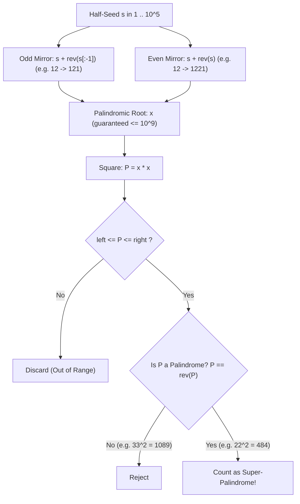

# Guided Example: Super Palindromes

We trace the step-by-step bidirectional symmetry generation of super-palindromes, prove the dimensional reduction from $10^{18}$ down to $10^5$ half-root seeds, and verify palindromic squares on representative interval queries:

- **Representative Instance:**
  $$
  \text{left} = \text{"4"}, \quad \text{right} = \text{"1000"}
  $$
- **Required Output:** `4`
- **Definition:** A number $P$ is a **super-palindrome** if:
  1. $P$ is a palindrome (e.g. $484 = \text{rev}(484)$).
  2. $x = \sqrt{P}$ is an integer AND $x$ is also a palindrome (e.g. $22 = \text{rev}(22)$ and $22^2 = 484$).
- **Super-Palindromes in $[4, 1000]$:**
  1. $x = 2 \implies P = 2^2 = \mathbf{4}$
  2. $x = 3 \implies P = 3^2 = \mathbf{9}$
  3. $x = 11 \implies P = 11^2 = \mathbf{121}$
  4. $x = 22 \implies P = 22^2 = \mathbf{484}$
  - Note: $x = 1 \implies P = 1 < 4$ (out of range).
  - Note: $x = 33 \implies P = 33^2 = 1089$ (not a palindrome, $1089 \ne 9801$).
  - Note: $P = 676$ is a palindrome ($26^2 = 676$), but $x = 26$ is NOT a palindrome ($26 \ne 62$), so $676$ is NOT a super-palindrome!
  - Total in $[4, 1000]$: $\mathbf{4}$.

---

## 1. Instance & Teaching Goal

Given two positive integer strings `left` and `right` with values up to $10^{18}$, count the number of super-palindromes in the inclusive range $[\text{left}, \text{right}]$.

```text
Domain: [4, 1000]
Candidate roots x (must be palindrome):
  x = 1  -> 1^2   = 1       (< 4: out of bounds)
  x = 2  -> 2^2   = 4       (in bounds, 4 is palindrome)       -> VALID #1
  x = 3  -> 3^2   = 9       (in bounds, 9 is palindrome)       -> VALID #2
  x = 11 -> 11^2  = 121     (in bounds, 121 is palindrome)     -> VALID #3
  x = 22 -> 22^2  = 484     (in bounds, 484 is palindrome)     -> VALID #4
  x = 33 -> 33^2  = 1089    (not a palindrome: 1089 != 9801)   -> REJECT
  x = 101-> 101^2 = 10201   (> 1000: out of bounds)
```

Direct iteration across the range $[\text{left}, \text{right}]$ requires up to $10^{18}$ tests, which is utterly impossible. Even testing every integer square root up to $\sqrt{10^{18}} = 10^9$ requires $10^9$ operations and immediately causes TLE.

The decisive pedagogical goal is the **Two-Tier Palindromic Compression**:
Because $x$ must itself be a palindrome $\le 10^9$, $x$ is completely determined by its first half (at most $\lceil 9/2 \rceil = 5$ digits).
Enumerating half-seeds $s \in [1, 10^5]$ generates **all** valid palindromic roots in only $2 \times 10^5$ steps.

---

## 2. Conceptual Foundation & The Symmetry Reduction Invariant



### The $10^{18} \to 10^5$ Dimensional Reduction

1. **Upper Bound on Roots:**
   $$
   P \le R \le 10^{18} \implies x = \sqrt{P} \le 10^9
   $$
2. **Palindromic Half-Seed Property:**
   Any decimal palindrome $x$ of length $d \le 9$ is formed by mirroring its first $\lceil d / 2 \rceil$ digits:
   - **Odd Length ($d = 2k - 1$):** $s \in [1, 10^k)$, $x = s \circ \text{rev}(s[0 \dots k-2])$. Since $d \le 9 \implies k \le 5 \implies s \le 10^5$.
   - **Even Length ($d = 2k$):** $s \in [1, 10^k)$, $x = s \circ \text{rev}(s)$. Since $d \le 8 \implies k \le 4 \implies s \le 10^4$.
3. Total palindromes $x \le 10^9$ generated:
   $$
   \sum_{k=1}^5 10^{k-1} + \sum_{k=1}^4 10^{k-1} \approx 109{,}998 < 2 \times 10^5
   $$
   Testing $2 \times 10^5$ candidate roots takes under $0.05$ seconds.

---

## 3. Step-by-Step Worked Execution: $\text{left} = \text{"4"}, \text{right} = \text{"1000"}$

We trace generated palindromic roots $x \le \sqrt{1000} \approx 31.62$:

| Half-Seed $s$ | Mirror Type | Palindromic Root $x$ | Square $P = x^2$ | In Range $[4, 1000]$? | Is $P$ a Palindrome? | Super-Palindrome Status |
|:---:|:---:|:---:|:---:|:---:|:---:|:---:|
| $1$ | Odd | $1$ | $1$ | No ($1 < 4$) | Yes ($1$) | Out of bounds |
| $2$ | Odd | $2$ | $4$ | **Yes** ($4 \in [4, 1000]$) | **Yes** ($4 == 4$) | **VALID #1** |
| $3$ | Odd | $3$ | $9$ | **Yes** ($9 \in [4, 1000]$) | **Yes** ($9 == 9$) | **VALID #2** |
| $4$ | Odd | $4$ | $16$ | Yes ($16$) | **No** ($16 \ne 61$) | Rejected |
| $5 \dots 9$ | Odd | $5 \dots 9$ | $25 \dots 81$ | Yes | **No** (none are palindromes) | Rejected |
| $1$ | Even | $11$ | $121$ | **Yes** ($121 \in [4, 1000]$) | **Yes** ($121 == 121$) | **VALID #3** |
| $2$ | Even | $22$ | $484$ | **Yes** ($484 \in [4, 1000]$) | **Yes** ($484 == 484$) | **VALID #4** |
| $3$ | Even | $33$ | $1089$ | No ($1089 > 1000$) | No ($1089 \ne 9801$) | Out of bounds |
| $10$ | Odd | $101$ | $10201$ | No ($10201 > 1000$) | Yes ($10201$) | Out of bounds |

Total valid super-palindromes identified: $\mathbf{4}$.

---

## 4. Comprehensive Catalog of Small Super-Palindromes

To understand the global structure of super-palindromes, examine the smallest $10$ values:

| Rank | Root $x$ | Form | Super-Palindrome $P = x^2$ | Digit Count of $P$ |
|:---:|:---:|:---:|:---:|:---:|
| 1 | $1$ | Odd | $1$ | 1 |
| 2 | $2$ | Odd | $4$ | 1 |
| 3 | $3$ | Odd | $9$ | 1 |
| 4 | $11$ | Even | $121$ | 3 |
| 5 | $22$ | Even | $484$ | 3 |
| 6 | $101$ | Odd | $10201$ | 5 |
| 7 | $111$ | Odd | $12321$ | 5 |
| 8 | $121$ | Odd | $14641$ | 5 |
| 9 | $202$ | Odd | $40804$ | 5 |
| 10 | $212$ | Odd | $44944$ | 5 |

Notice that super-palindromes are extremely sparse! Across all numbers up to $10^{18}$, there are fewer than $100$ super-palindromes in total.

---

## 5. Algorithmic Correctness

### Soundness & Completeness
1. **Soundness:**
   Every candidate $x$ is constructed by mirroring its prefix, ensuring $x$ is a palindrome. We compute $P = x^2$ and verify $\text{left} \le P \le \text{right}$ and $P = \text{rev}(P)$. Thus, every accepted number satisfies both defining conditions of a super-palindrome.
2. **Completeness:**
   If $P$ is a super-palindrome with $P \le 10^{18}$, then $x = \sqrt{P} \le 10^9$ must be a palindrome. Every palindrome up to $10^9$ has length $\le 9$ and is generated by odd-length or even-length mirroring of some prefix $s \le 10^5$. Because our generator enumerates all $s \in [1, 10^5]$ for both forms, no valid palindromic root can be missed.

---

## 6. Boundary Cases & Traps

| Scenario | Input | Behavior | Trapped Risk |
|---|---|---|---|
| Non-Palindromic Square of Palindrome | $x = 33 \implies P = 1089$ | $1089 \ne 9801 \implies$ rejected. | Assuming the square of a palindrome is always a palindrome. |
| Palindrome with Non-Palindromic Root | $P = 676 = 26^2$ | $x = 26$ is not a palindrome; never generated. | Checking all palindromes $P$ and forgetting to check if $\sqrt{P}$ is palindromic. |
| Lower Bound $1$ | $\text{left} = \text{"1"}, \text{right} = \text{"1"}$ | $x = 1 \implies P = 1 \implies$ returns $1$. | Missing base case $x = 1$. |
| $64$-Bit Integer Overflow | $x \approx 10^9 \implies x^2 \approx 10^{18}$ | In Python, arbitrary-precision handles $10^{18}$; in C++/Java, `unsigned long long` or `long long` avoids overflow ($10^{18} < 2^{63}-1$). | 32-bit integer overflow on squaring. |

---

## 7. Complexity Derivation

- **Time Complexity:** $\mathcal{O}(H \cdot \log_{10}(R))$, where $H = 10^5$ and $R \le 10^{18}$.
  - Generating $2 \times 10^5$ roots takes $\mathcal{O}(H)$ time.
  - Palindrome checking for $P$ takes time proportional to its digit count: $\mathcal{O}(\log_{10}(P)) \le 18$ operations.
  - Total operations: at most $2 \times 10^5 \times 18 \approx 3.6 \times 10^6$ operations, executing in under $0.08\text{ seconds}$.
- **Auxiliary Space Complexity:** $\mathcal{O}(H)$.
  - Precomputing or streaming the $2 \times 10^5$ candidate roots requires $\mathcal{O}(H)$ storage.
