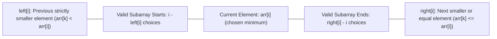

# Guided Example: Sum of Subarray Minimums

We trace the step-by-step calculation of subarray minimum contributions, prove the asymmetric tie-breaking invariant that partitions the subarray space bijectively without duplicate counts, and evaluate monotonic stack spans on representative integer sequences:

- **Representative Instance:**
  $$
  arr = [3, \; 1, \; 2, \; 4]
  $$
- **Required Output:** `17`
  - All $10$ contiguous subarrays and their minimum values:
    - Subarrays containing only $3$:
      - $[3] \implies \min = 3$
    - Subarrays where $1$ is the minimum:
      - $[3, 1] \implies 1$
      - $[3, 1, 2] \implies 1$
      - $[3, 1, 2, 4] \implies 1$
      - $[1] \implies 1$
      - $[1, 2] \implies 1$
      - $[1, 2, 4] \implies 1$
      - (Subtotal for minimum $1$: $6 \times 1 = 6$)
    - Subarrays where $2$ is the minimum:
      - $[2] \implies 2$
      - $[2, 4] \implies 2$
      - (Subtotal for minimum $2$: $2 \times 2 = 4$)
    - Subarrays where $4$ is the minimum:
      - $[4] \implies 4$
      - (Subtotal for minimum $4$: $1 \times 4 = 4$)
  - Total sum:
    $$
    3 + 6 + 4 + 4 = \mathbf{17} \pmod{10^9 + 7}
    $$

- **Duplicate Boundary Instance:**
  $$
  arr = [1, \; 1] \implies [1] \text{ (at 0)}, \; [1] \text{ (at 1)}, \; [1, 1] \implies 1 + 1 + 1 = \mathbf{3}
  $$

---

## 1. Instance & Teaching Goal

Given an array of integers $arr$, find the sum of $\min(b)$ where $b$ ranges over every contiguous subarray of $arr$. Return the result modulo $10^9 + 7$.

```text
Array:               [  3,    1,    2,    4  ]
Index:                  0     1     2     3

Contribution Method:
  For each index i, how many subarrays have arr[i] as their unique minimum?
  Subarrays = (i - left[i]) * (right[i] - i)
  i = 0 (val 3): span [0..0]          -> 1 * 1 = 1 subarray  -> 1 * 3 = 3
  i = 1 (val 1): span [0..3]          -> 2 * 3 = 6 subarrays -> 6 * 1 = 6
  i = 2 (val 2): span [2..3]          -> 1 * 2 = 2 subarrays -> 2 * 2 = 4
  i = 3 (val 4): span [3..3]          -> 1 * 1 = 1 subarray  -> 1 * 4 = 4
                                                                ----
                                                      Sum    = 17
```

A brute-force evaluation inspects all $\mathcal{O}(n^2)$ subarrays, taking $\mathcal{O}(n^3)$ or $\mathcal{O}(n^2)$ time and causing immediate TLE for $n = 30{,}000$.

The decisive pedagogical goal is the **Principle of Element Contribution**:
Invert the summation from "sum of minima over all subarrays" to "sum of (element value $\times$ number of subarrays where that element is the chosen minimum)".
To avoid double-counting subarrays with multiple identical minima, we enforce an **Asymmetric Boundary Invariant**.

---

## 2. Conceptual Foundation & Asymmetric Tie-Breaking



### The Asymmetric Tie-Breaking Theorem

Suppose an array contains duplicate minimal elements, such as $[2, 2, 2]$. Which index $i$ "owns" the subarray $[2, 2, 2]$?
- If both left and right boundaries allow equal elements ($\le$), multiple indices claim the same subarray, causing massive **overcounting**.
- If both left and right boundaries require strict inequality ($<$), no index claims the subarray, causing **undercounting**.
- **Resolution:** Enforce strict inequality on one side and non-strict inequality on the other:
  1. $left[i]$: the index of the previous **strictly smaller** element ($arr[k] < arr[i]$), with sentinel $-1$.
  2. $right[i]$: the index of the next **smaller or equal** element ($arr[k] \le arr[i]$), with sentinel $n$.

By this rule, in any subarray containing multiple identical minimal elements, exactly the **first** (leftmost) occurrence is designated as the unique representative minimum, creating a strict bijection over the set of all subarrays.

---

## 3. Step-by-Step Worked Execution: $arr = [3, 1, 2, 4]$

### Phase 1: Forward Monotonic Stack ($left[i]$: Previous Strictly Smaller)
Maintain a monotonic strictly increasing stack of indices.
Pop while $arr[\text{top}] \ge arr[i]$:

| Index $i$ | Element $arr[i]$ | Stack Before Step | Popped Indices ($arr[\text{top}] \ge arr[i]$) | Stack Top After Pops | Recorded $left[i]$ | Stack After Push |
|:---:|:---:|:---:|:---:|:---:|:---:|:---:|
| **0** | $3$ | `[]` | None | (empty) | $\mathbf{-1}$ | `[0]` |
| **1** | $1$ | `[0]` | $0$ ($arr[0]=3 \ge 1$) | (empty) | $\mathbf{-1}$ | `[1]` |
| **2** | $2$ | `[1]` | None ($arr[1]=1 < 2$) | $1$ | $\mathbf{1}$ | `[1, 2]` |
| **3** | $4$ | `[1, 2]` | None ($arr[2]=2 < 4$) | $2$ | $\mathbf{2}$ | `[1, 2, 3]` |

Computed $left = [-1, \; -1, \; 1, \; 2]$.

---

### Phase 2: Backward Monotonic Stack ($right[i]$: Next Smaller or Equal)
Iterate $i$ from $n - 1$ down to $0$. Pop while $arr[\text{top}] > arr[i]$:

| Index $i$ | Element $arr[i]$ | Stack Before Step | Popped Indices ($arr[\text{top}] > arr[i]$) | Stack Top After Pops | Recorded $right[i]$ | Stack After Push |
|:---:|:---:|:---:|:---:|:---:|:---:|:---:|
| **3** | $4$ | `[]` | None | (empty) | $\mathbf{4}$ | `[3]` |
| **2** | $2$ | `[3]` | $3$ ($arr[3]=4 > 2$) | (empty) | $\mathbf{4}$ | `[2]` |
| **1** | $1$ | `[2]` | $2$ ($arr[2]=2 > 1$) | (empty) | $\mathbf{4}$ | `[1]` |
| **0** | $3$ | `[1]` | None ($arr[1]=1 \le 3$) | $1$ | $\mathbf{1}$ | `[1, 0]` |

Computed $right = [1, \; 4, \; 4, \; 4]$.

---

### Phase 3: Contribution Synthesis

| Index $i$ | $arr[i]$ | $left[i]$ | $right[i]$ | Left Span ($i - left[i]$) | Right Span ($right[i] - i$) | Subarrays Dominated | Contribution to Total |
|:---:|:---:|:---:|:---:|:---:|:---:|:---:|:---:|
| **0** | $3$ | $-1$ | $1$ | $0 - (-1) = 1$ | $1 - 0 = 1$ | $1 \times 1 = 1$ | $1 \times 3 = \mathbf{3}$ |
| **1** | $1$ | $-1$ | $4$ | $1 - (-1) = 2$ | $4 - 1 = 3$ | $2 \times 3 = 6$ | $6 \times 1 = \mathbf{6}$ |
| **2** | $2$ | $1$ | $4$ | $2 - 1 = 1$ | $4 - 2 = 2$ | $1 \times 2 = 2$ | $2 \times 2 = \mathbf{4}$ |
| **3** | $4$ | $2$ | $4$ | $3 - 2 = 1$ | $4 - 3 = 1$ | $1 \times 1 = 1$ | $1 \times 4 = \mathbf{4}$ |

Total Subarray Count: $1 + 6 + 2 + 1 = 10 = \frac{4 \times 5}{2}$ (all subarrays accounted for!).
$$
\text{Total Sum} = 3 + 6 + 4 + 4 = \mathbf{17}
$$

---

## 4. Duplicate Disambiguation: $arr = [1, 1]$

To see how asymmetric tie-breaking prevents double-counting on identical values:

| $i$ | $arr[i]$ | $left[i]$ ($<$) | $right[i]$ ($\le$) | Left Span | Right Span | Subarrays Counted | Subarray Realization |
|:---:|:---:|:---:|:---:|:---:|:---:|:---:|:---|
| 0 | $1$ | $-1$ | $1$ ($arr[1]=1 \le 1$) | $1$ | $1$ | $1 \times 1 = 1$ | $[1]$ at index 0 |
| 1 | $1$ | $-1$ ($arr[0]=1 \not< 1$) | $2$ | $2$ | $1$ | $2 \times 1 = 2$ | $[1]$ at index 1, and $[1, 1]$ |

Notice that the combined subarray $[1, 1]$ is attributed uniquely to index $1$. The total count is $1 + 2 = 3 = \frac{2 \times 3}{2}$, with zero duplication.

---

## 5. Algorithmic Correctness

### Soundness & Completeness
1. **Soundness:**
   For any subarray $arr[L \dots R]$ where $left[i] < L \le i \le R < right[i]$, every element $arr[k]$ for $k \in [L, R]$ satisfies $arr[k] \ge arr[i]$ by definition of the nearest smaller boundaries. Thus, $arr[i]$ is indeed the minimum of subarray $arr[L \dots R]$.
2. **Completeness:**
   Every non-empty contiguous subarray $arr[L \dots R]$ has at least one minimum element. Among all indices achieving this minimum, exactly the leftmost index satisfies $L > left[i]$ and $R < right[i]$. Therefore, each of the $\frac{n(n+1)}{2}$ subarrays is counted for exactly one index $i$.

---

## 6. Boundary Cases & Traps

| Scenario | Input | Behavior | Trapped Risk |
|---|---|---|---|
| Single Element | $arr = [5]$ | $left = [-1], right = [1]$. Span: $1 \times 1 \times 5 = 5$. | Boundary index out-of-bounds. |
| All Equal Elements | $arr = [2, 2, 2]$ | Asymmetric rules allocate $1, 2, 3$ subarrays respectively $\implies$ sum $= 12$. | Using symmetric $\le$ on both sides causing $3 \times 3$ double-counting. |
| Strictly Decreasing | $arr = [3, 2, 1]$ | Left spans are $1, 2, 3$; right spans are $1, 1, 1$. Total $= 3+4+3=10$. | Miscalculating backward stack pops. |
| Integer Overflow | $n = 30{,}000$, elements $30{,}000$ | Unbounded sum reaches $\approx 30{,}000^3 \approx 2.7 \times 10^{13}$. Requires modulo $10^9 + 7$. | 32-bit signed integer overflow prior to modulo reduction. |

---

## 7. Complexity Derivation

- **Time Complexity:** $\mathcal{O}(n)$.
  - Phase 1 (Forward pass): Each index is pushed onto the stack once and popped at most once $\implies \mathcal{O}(n)$.
  - Phase 2 (Backward pass): Each index is pushed onto the stack once and popped at most once $\implies \mathcal{O}(n)$.
  - Phase 3 (Summation): A single linear pass computes contributions in $\mathcal{O}(n)$.
  - Total time: strictly $\mathcal{O}(n)$, completing in $< 0.02\text{ s}$ for $n = 30{,}000$.
- **Auxiliary Space Complexity:** $\mathcal{O}(n)$.
  - Arrays `left` and `right` and the index stack each consume $\mathcal{O}(n)$ memory.
