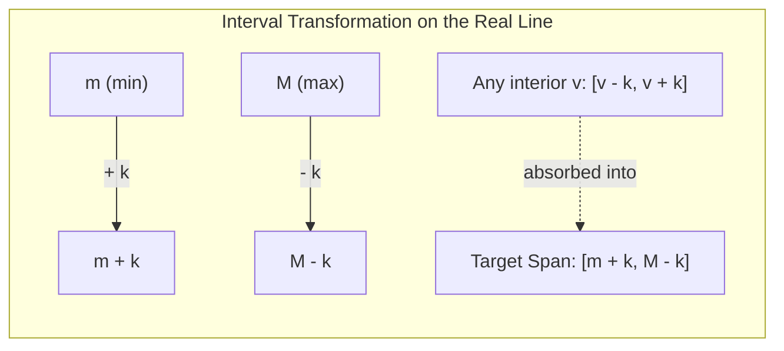

# Guided Example: Smallest Range I

We trace the step-by-step interval contraction of extremal elements, prove the universal interior absorption theorem, and evaluate threshold convergence on representative integer arrays:

- **Representative Instance 1 (Positive Remaining Gap):**
  $$
  nums = [0, \; 10], \quad k = 2
  $$
- **Required Output:** `6`
  - Extremal values: $m = \min(nums) = 0$, $M = \max(nums) = 10$.
  - Reachable range for $m$: $[0 - 2, 0 + 2] = [-2, \mathbf{2}]$. Maximum upward shift sets $m' = 2$.
  - Reachable range for $M$: $[10 - 2, 10 + 2] = [\mathbf{8}, 12]$. Minimum downward shift sets $M' = 8$.
  - Minimum achievable score:
    $$
    M' - m' = 8 - 2 = \mathbf{6}
    $$

- **Representative Instance 2 (Interval Overlap & Zero Score):**
  $$
  nums = [1, \; 3, \; 6], \quad k = 3
  $$
  - $m = 1 \implies [1 - 3, 1 + 3] = [-2, 4]$.
  - $M = 6 \implies [6 - 3, 6 + 3] = [3, 9]$.
  - Middle element $3 \implies [3 - 3, 3 + 3] = [0, 6]$.
  - Intersection of all intervals:
    $$
    [-2, 4] \cap [0, 6] \cap [3, 9] = [3, 4] \ne \emptyset
    $$
  - Choosing common value $c = 3$ (or $4$) allows all elements to become identical:
    $$
    \text{score} = \max(nums') - \min(nums') = 3 - 3 = \mathbf{0}
    $$

---

## 1. Instance & Teaching Goal

Given an integer array `nums` and an integer $k$: for each index $i$, select an integer $x_i \in [-k, k]$ and set $nums'[i] = nums[i] + x_i$.
The score of $nums'$ is $\max(nums') - \min(nums')$.

Find the minimum possible score achievable.

```text
Original Array:      [ 0,  10 ],  k = 2
Initial Difference:  10 - 0 = 10

Reachable Intervals:
  nums[0] = 0   can reach: [ -2,   2 ]  -> shift to 2
  nums[1] = 10  can reach: [  8,  12 ]  -> shift to 8

New Array:           [ 2,  8 ]
Minimal Score:       8 - 2 = 6  (reduced by exactly 2*k = 4)
```

A brute-force search enumerates $(2k+1)^n$ modified arrays, which is exponential and computationally infeasible.

The decisive pedagogical goal is to prove the **Extremal Gap Theorem**:
The spread of the transformed array depends strictly on the initial minimum $m = \min(nums)$ and maximum $M = \max(nums)$.
Because $m$ can rise by at most $+k$ and $M$ can fall by at most $-k$, the gap shrinks by at most $2k$.
Every interior value $v \in [m, M]$ can always be adjusted into the range $[m+k, M-k]$, meaning interior elements never enlarge the final spread.

---

## 2. Conceptual Foundation & The Interior Absorption Invariant



### The Universal Interior Absorption Theorem

Let $m = \min(nums)$ and $M = \max(nums)$. For each $v \in nums$, the allowable modified value lies in $I_v = [v - k, v + k]$.

1. **Upper Bound on Minimum:**
   The new minimum can be at most $m + k$. Any smaller choice for $m'$ would only increase the gap $M' - m'$.
2. **Lower Bound on Maximum:**
   The new maximum can be at least $M - k$. Any larger choice for $M'$ would only increase the gap.
3. **Interior Element Containment:**
   For any interior element $v$ satisfying $m \le v \le M$:
   - The left endpoint of $I_v$ is $v - k \le M - k$.
   - The right endpoint of $I_v$ is $v + k \ge m + k$.
   Therefore, the interval $I_v$ always contains or intersects $[m + k, M - k]$.
   Consequently, every interior element can choose $v' \in [m + k, M - k]$.
4. **Closed Form Result:**
   - If $M - k > m + k \implies M - m > 2k$, the minimal score is $(M - k) - (m + k) = M - m - 2k$.
   - If $M - m \le 2k$, the intervals overlap, meaning a single common integer $c \in [M - k, m + k]$ exists. Setting all $v' = c$ yields a score of $0$.
   $$
   \text{Score}_{\min} = \max(0, \; M - m - 2k)
   $$

---

## 3. Step-by-Step Worked Execution

We trace three representative configurations:

| Case | Input Array $nums$ | Adjustment $k$ | Min $m$ | Max $M$ | Initial Spread $M - m$ | Total Reduction $2k$ | Formula Evaluation $\max(0, M - m - 2k)$ | Optimal Modified Array $nums'$ | Minimum Score |
|:---:|:---|:---:|:---:|:---:|:---:|:---:|:---:|:---|:---:|
| **1** | $[0, 10]$ | $2$ | $0$ | $10$ | $10$ | $4$ | $\max(0, 10 - 4) = 6$ | $[2, 8]$ | **6** |
| **2** | $[1, 3, 6]$ | $3$ | $1$ | $6$ | $5$ | $6$ | $\max(0, 5 - 6) = 0$ | $[4, 4, 3]$ (all equal to $3$ or $4$) | **0** |
| **3** | $[1]$ | $0$ | $1$ | $1$ | $0$ | $0$ | $\max(0, 0 - 0) = 0$ | $[1]$ | **0** |
| **4** | $[8, 1, 5, 9]$ | $2$ | $1$ | $9$ | $8$ | $4$ | $\max(0, 8 - 4) = 4$ | $[6, 3, 5, 7]$ | **4** |

---

## 4. Geometric Overlap Analysis ($[1, 3, 6], k = 3$)

To visualize why $\text{score} = 0$ is achievable when $M - m \le 2k$:
- Number line ranges for each element:
  - $nums[0] = 1 \implies [1 - 3, 1 + 3] = [-2, 4]$
  - $nums[1] = 3 \implies [3 - 3, 3 + 3] = [0, 6]$
  - $nums[2] = 6 \implies [6 - 3, 6 + 3] = [3, 9]$
- The intersection of all three intervals is:
  $$
  [-2, 4] \cap [0, 6] \cap [3, 9] = [3, 4]
  $$
- We pick any integer in $[3, 4]$, say $c = 3$:
  - $x_0 = 3 - 1 = +2 \in [-3, 3] \implies nums'[0] = 3$
  - $x_1 = 3 - 3 = 0 \in [-3, 3] \implies nums'[1] = 3$
  - $x_2 = 3 - 6 = -3 \in [-3, 3] \implies nums'[2] = 3$
- Modified array: $[3, 3, 3] \implies \max - \min = 3 - 3 = \mathbf{0}$.

---

## 5. Algorithmic Correctness

### Soundness & Completeness
1. **Soundness:**
   The construction demonstrates that setting $m' = m + k$ and $M' = M - k$ is always legal since $+k, -k \in [-k, k]$. By the Interior Absorption Theorem, every other element can be placed inside $[m', M']$, guaranteeing that no element exceeds $M'$ or falls below $m'$. Thus, score $\max(0, M - m - 2k)$ is always achievable.
2. **Completeness:**
   Since any modification is bounded by $x_i \ge -k$ and $x_j \le k$, the maximum of the new array cannot be less than $M - k$, and the minimum cannot exceed $m + k$. Therefore:
   $$
   \max(nums') - \min(nums') \ge (M - k) - (m + k) = M - m - 2k
   $$
   Since the score cannot be negative, $\max(0, M - m - 2k)$ is a strict lower bound.

---

## 6. Boundary Cases & Traps

| Scenario | Input | Behavior | Trapped Risk |
|---|---|---|---|
| Single Element | $nums = [5], k = 10$ | $M = 5, m = 5 \implies M - m = 0$. Returns $0$. | Edge-case crashes on length 1. |
| Zero Adjustment | $k = 0$ | $2k = 0 \implies$ returns original spread $M - m$. | Incorrect division or negative offsets. |
| Over-Shrinking | $M - m < 2k$ | Raw difference $M - m - 2k < 0$. Must clamp with $\max(0, \dots)$. | Returning negative score values. |
| Identical Elements | $[7, 7, 7], k = 2$ | $M = m = 7 \implies 0 - 4 = -4 \implies 0$. | Unnecessary loops or array copies. |

---

## 7. Complexity Derivation

- **Time Complexity:** $\mathcal{O}(n)$.
  - A single pass over $nums$ finds both $M = \max(nums)$ and $m = \min(nums)$ in linear time.
  - Computing $\max(0, M - m - 2k)$ takes $\mathcal{O}(1)$ arithmetic operations.
  - Total time: strictly $\mathcal{O}(n)$, completing in $< 0.005\text{ s}$ for $n = 10{,}000$.
- **Auxiliary Space Complexity:** $\mathcal{O}(1)$.
  - Only two scalar integers ($M, m$) are tracked. No modified arrays are created.
