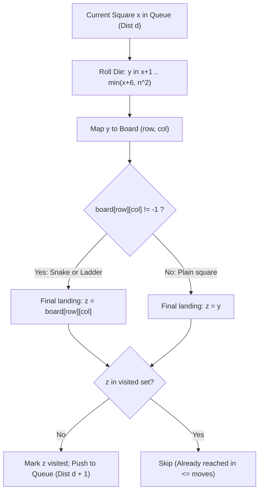

# Guided Example: Snakes and Ladders

We trace the step-by-step breadth-first search on an unweighted state graph, derive the Boustrophedon coordinate mapping bijection, and demonstrate shortest-path discovery—including strategic descent via snakes—on representative game boards:

- **Representative Instance (Official 6x6 Board with Snake Short-Cut):**
  $$
  n = 6, \quad n^2 = 36
  $$
  $$
  \text{board} = \begin{bmatrix}
  -1 & -1 & -1 & -1 & -1 & -1 \\
  -1 & -1 & -1 & -1 & -1 & -1 \\
  -1 & -1 & -1 & -1 & -1 & -1 \\
  -1 & 35 & -1 & -1 & 13 & -1 \\
  -1 & -1 & -1 & -1 & -1 & -1 \\
  -1 & 15 & -1 & -1 & -1 & -1
  \end{bmatrix}
  $$
- **Required Output:** `4` moves
- **Optimal Path Breakdown (Length 4):**
  1. **Move 1:** From square $1$, roll to square $2$. Square $2$ has a ladder leading to $15$. Land on **$15$**.
  2. **Move 2 (The Strategic Snake):** From square $15$, roll $2$ to land on square $17$. Square $17$ has a snake leading backward to **$13$**!
  3. **Move 3:** From square $13$, roll $1$ to square $14$. Square $14$ has a ladder launching directly to **$35$**!
  4. **Move 4:** From square $35$, roll $1$ to land on square **$36$** (target $n^2$ reached!).
  - Minimum moves: $\mathbf{4}$.

---

## 1. Instance & Teaching Goal

You are given an $n \times n$ grid labeled $1$ to $n^2$ in **Boustrophedon style** (ox-plowing alternating order) starting from the bottom-left corner ($board[n-1][0]$).
Starting at square $1$, in each move you roll a 6-sided die to choose a destination $y \in [x + 1, \min(x + 6, n^2)]$.
If square $y$ hosts a snake or ladder ($board[r][c] \ne -1$), you immediately move to $board[r][c]$. You do **not** take chained snakes or ladders from the landing square.

Find the least number of die rolls required to reach square $n^2$, or $-1$ if unreachable.

```text
Board Layout (Boustrophedon 6x6):
  Row 0 (top):    36  35  34  33  32  31   (right-to-left)
  Row 1:          25  26  27  28  29  30   (left-to-right)
  Row 2:          24  23  22  21  20  19   (right-to-left)
  Row 3:          13  14  15  16  17  18   (left-to-right: 14->35, 17->13)
  Row 4:          12  11  10   9   8   7   (right-to-left)
  Row 5 (bottom):  1   2   3   4   5   6   (left-to-right: 2->15)

Key Discovery:
  Taking the snake at square 17 (falling to 13) positions the player
  to hit the massive ladder at square 14 on the very next roll!
```

A naive depth-first search or greedy choice (always picking the highest square) fails because snakes can open up shorter paths, and backward cycles can cause infinite loops.

The decisive pedagogical goal is to model the board as an **Unweighted Directed Graph** and apply **Breadth-First Search (BFS)** with a visited set:
1. Every state is a square label $x \in [1, n^2]$.
2. Every die roll represents an edge of uniform weight $1$.
3. BFS guarantees discovering the shortest path to $n^2$ in minimum layer depth.

---

## 2. Conceptual Foundation & Boustrophedon Coordinate Mapping



### The Boustrophedon Coordinate Bijection

Given a 1-based square index $y \in [1, n^2]$ on an $n \times n$ matrix:
1. Zero-based index: $k = y - 1$.
2. Compute quotient and remainder:
   $$
   q = \lfloor k / n \rfloor, \quad r = k \bmod n
   $$
   Here $q$ represents the row index counting **upward from the bottom** ($0 \le q < n$).
3. **Row from Top:**
   $$
   \text{row} = n - 1 - q
   $$
4. **Column (Alternating Direction):**
   - If $q$ is **even** ($q \equiv 0 \pmod 2$), squares run left-to-right:
     $$
     \text{col} = r
     $$
   - If $q$ is **odd** ($q \equiv 1 \pmod 2$), squares run right-to-left:
     $$
     \text{col} = n - 1 - r
     $$

---

## 3. Step-by-Step Worked Execution: 6x6 Board

Initial Queue: $[1]$ at depth $0$. Target: $36$.

### Move 1 (Depth 0 $\to$ 1)
From square $1$, allowable rolls $y \in [2, 7]$:
- $y = 2$: coordinates $(5, 1) \implies board[5][1] = 15$ (Ladder!). Land on $15$.
- $y = 3, 4, 5, 6, 7$: plain squares (all $board = -1$). Land on $3, 4, 5, 6, 7$.
- Visited queue for layer 1 includes: $[15, 3, 4, 5, 6, 7]$.

---

### Move 2 (Depth 1 $\to$ 2)
Focus on expanding the frontier from square $15$:
Rolls $y \in [16, 21]$:
- $y = 16$: $(3, 3) \implies -1 \implies 16$.
- $y = 17$: coordinates $(3, 4) \implies board[3][4] = 13$ (Snake!). Land on **$13$**.
- $y = 18$: $(3, 5) \implies -1 \implies 18$.
- $y = 19, 20, 21$: $(2, 5), (2, 4), (2, 3) \implies -1$.
- Landmark discovered: square **$13$** is enqueued at depth $2$!

---

### Move 3 (Depth 2 $\to$ 3)
Expanding from square $13$:
Rolls $y \in [14, 19]$:
- $y = 14$: coordinates $(3, 1) \implies board[3][1] = 35$ (Ladder!). Land on **$35$**!
- $y = 15$: already visited.
- Landmark discovered: square **$35$** is enqueued at depth $3$!

---

### Move 4 (Depth 3 $\to$ 4)
Expanding from square $35$:
Rolls $y \in [36, 36]$:
- $y = 36$: coordinates $(0, 0) \implies board[0][0] = -1$.
- Square $36 == n^2$ is reached!
- Move count returned: $\mathbf{4}$.

---

## 4. Layer Summary Table

| Move Depth | Front Dequeued | Target Rolls Evaluated | Jump Detected | Final Square Enqueued | Milestone Accomplished |
|:---:|:---:|:---:|:---:|:---:|:---|
| **0** | $1$ | $y \in [2, 7]$ | $board[5][1] = 15$ | $15$ (and $3 \dots 7$) | Ladder ascent to middle row |
| **1** | $15$ | $y \in [16, 21]$ | $board[3][4] = 13$ | **$13$** (Snake drop!) | Tactical snake drop to setup next ladder |
| **2** | $13$ | $y \in [14, 19]$ | $board[3][1] = 35$ | **$35$** (Ladder jump!) | Launch to penultimate square |
| **3** | $35$ | $y = 36$ | None (plain) | **$36$** | **Target $n^2$ reached!** |

---

## 5. Algorithmic Correctness

### Soundness & Completeness
1. **Soundness:**
   Every transition in the BFS corresponds to a valid 6-sided die roll followed by the exact board rule (jump if snake/ladder, otherwise stay). Since edges strictly model legal single moves, any path discovered is a legitimate play sequence.
2. **Completeness:**
   BFS processes vertices in monotonically increasing order of edge distance. The first time the destination vertex $n^2$ is popped from the queue, the current layer depth is mathematically proven to be the minimum number of die rolls required to reach $n^2$. If the queue empties without reaching $n^2$, no valid path exists, correctly returning $-1$.

---

## 6. Boundary Cases & Traps

| Scenario | Input | Behavior | Trapped Risk |
|---|---|---|---|
| Single Move Victory | $2 \times 2$ with ladder $2 \to 4$ | Reaches $4$ on move 1. | Off-by-one on upper bound $\min(x + 6, n^2)$. |
| Infinite Snake Cycle | Board where every roll loops to 1 | Queue exhausts; returns $-1$. | Infinite loop without visited set. |
| Ladder Chaining Rule | Landing on ladder whose top has another ladder | Player stays at first top; does NOT chain jumps. | Recursively following snakes/ladders. |
| Snake Landing Mark | Square $y$ leads to snake $z$ | Mark $z$ as visited, not $y$. | Preventing future beneficial passes through $y$. |

---

## 7. Complexity Derivation

- **Time Complexity:** $\mathcal{O}(n^2)$.
  - Total states (vertices in graph): $V = n^2$.
  - From each vertex, at most $6$ directed edges are explored. Total directed edges: $E \le 6n^2$.
  - BFS visits each vertex at most once and inspects each outgoing edge once.
  - Coordinate conversion takes $\mathcal{O}(1)$ arithmetic.
  - Total time: strictly $\mathcal{O}(n^2)$, running in $< 0.02\text{ s}$ for $n = 20$ ($400$ squares).
- **Auxiliary Space Complexity:** $\mathcal{O}(n^2)$.
  - The queue and the `vis` set each store at most $n^2$ integer labels.
