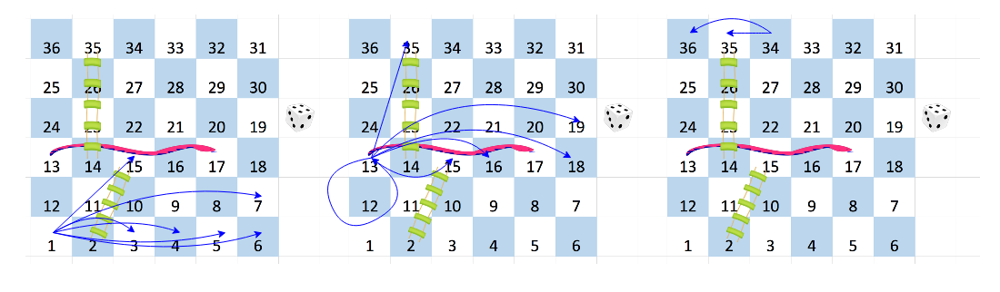

[TOC]

## Solution

---

### Overview

After carefully analyzing the problem, we can model the grid as a graph. Each square is a node. There are edges between squares within `6` of each other, and the snakes and ladders add new edges.

**The problem is asking us for the minimum number of moves, which suggests this is a shortest-path problem**

> Given an unweighted directed graph, the shortest path problem is the problem of finding a path from one vertex to another, such that the number of edges is the minimum possible.

We can consider our input as an unweighted directed graph. The edges are moves corresponding to the results of a 6-sided die roll.

Have a look at the example board.



In the left-most board there are $6$ edges outgoing from cell $1$.

* We roll $1$ on the die. Go to cell $2$. Use the ladder and go to cell $15$. We have an edge $1 \to 15$.

* We roll $2$ on the die. Move to cell $3$. We have an edge $1 \to 3$.

* We roll $3$ on the die. There is an edge $1 \to 4$.

* We roll $4$ on the die. There is an edge $1 \to 5$.

* We roll $5$ on the die. There is an edge $1 \to 6$.

* We roll $6$ on the die. There is an edge $1 \to 7$.

In the middle picture, we see that cell $13$ also has $6$ outgoing edges.

In the right-most picture, we see only $2$ outgoing edges: $34 \to 35$ and $34 \to 36$ because we can't go outside the board.

There is an algorithm for solving the shortest path problem in an unweighted graph – breadth-first search. It is feasible to implement during an interview.

>**Note.** If you are unfamiliar with this algorithm, we highly recommend you visiting the [Graph Explore Card](https://leetcode.com/explore/featured/card/graph/620/breadth-first-search-in-graph/3883/) and watch the video explanations to gain a general understanding as this is a standard graph algorithm which is used frequently in shortest path problems. We will focus on how to implement it.

---

### Approach 1: Breadth-first search

#### Intuition

Breadth-first search is an algorithm for finding the shortest path in *unweighted* graphs (directed or undirected).

This algorithm uses a queue. If this data structure is new to you, we encourage you to visit the [queue and stack explore card](https://leetcode.com/explore/learn/card/queue-stack/). The explore card will help you understand the data structure and practice using it before proceeding.

The queue data structure has two primary operations:

* `enqueue`: add an element to the end of the queue.

* `dequeue`: remove the first element in the queue.

C++, Java, Python and other programming languages have built-in queue implementations.

The breadth-first search operates as follows. It maintains a queue of vertices (nodes). It starts with only the starting vertex (cell `1` in this problem). Then it processes the vertices one by one in the queue. Let's say we are processing some vertex. There are (possibly zero) outgoing edges from this vertex. If these edges lead to unvisited vertices, push these vertices to the queue. The algorithm terminates when it has visited all vertices.

#### Algorithm

1. Find the cell $(\text{row}, \text{column})$ associated with each label from $1$ to $n^2$. Start from the bottom left cell and traverse the board alternately left to right and right to left. One can do this by maintaining the order of columns and reversing it after each row.

2. Maintain a queue of cells and an array to store distances to all cells from the first one. By distance to the cell, we mean the least number of moves required to reach it. The distance from the first cell to itself is $0$. Mark all other cells as initially unreachable from the first one (we denote the distance to such cells with $-1$). Push the first cell to the queue.

3. While the queue is not empty:

* Pop a cell from the queue. Let's say its label is $\text{curr}$. For each square $\text{next}$ with a label in the range $\text{curr} + 1$ to $\min(\text{curr} + 6, n^2)$ (as described by the problem), if $\text{next}$ has a snake or a ladder, set $\text{destination}$ to the destination of that snake or ladder. Otherwise, set $\text{destination}$ to $\text{next}$.

* If $\text{\text{dist}[destination]}$ is $-1$ (i.e. the $\text{destination}$ has not been visited yet) set $\text{\text{dist}[destination]}$ to $\text{\text{dist}[curr]} + 1$ (the number of moves to get to the current cell, plus one more move to get to $\text{destination}$) and push $\text{destination}$ on to the queue.

4. Return the distance to cell $n^2$. If it is unreachable, the result will be $-1$.

#### Implementation

```python
from collections import deque

class Solution:
    def snakesAndLadders(self, board: List[List[int]]) -> int:
        n = len(board)
        cells = [None] * (n**2 + 1)
        label = 1
        columns = list(range(0, n))
        for row in range(n - 1, -1, -1):
            for column in columns:
                cells[label] = (row, column)
                label += 1
            columns.reverse()
        dist = [-1] * (n * n + 1)
        q = deque([1])
        dist[1] = 0
        while q:
            curr = q.popleft()
            for next in range(curr + 1, min(curr + 6, n**2) + 1):
                row, column = cells[next]
                destination = (board[row][column] if board[row][column] != -1
                               else next)
                if dist[destination] == -1:
                    dist[destination] = dist[curr] + 1
                    q.append(destination)
        return dist[n * n]
```

#### Complexity Analysis

Let $n$ be the number of rows and columns.

* Time complexity: $O(n^2)$.

	We run BFS on a graph whose vertices are the board cells, and the edges are moves between them. There are $n^2$ vertices and no more than $6 n^2=O(n^2)$ edges.

	The time complexity of BFS is $O(|V| + |E|)$, where $|V|$ is the number of vertices and $|E|$ is the number of edges. We have $|V|=n^2$ and $|E| < 6 n^2$, thus the total time complexity for BFS is $O(7n^2) = O(n^2)$. We also spend some time associating each `(row, col)` with a label, but this also costs $O(n^2)$, so the overall time complexity is $O(n^2)$.

* Space complexity: $O(n^2)$.

	We maintain `cells` for each label from $1$ to $n^2$, `dist` for distances to all cells and a queue for BFS. The `columns` array takes only $O(n)$ space.

---

### Approach 2: Dijkstra's algorithm

>**Note.** For this approach, we assume that you already know the fundamentals of Dijkstra's algorithm and are figuring out how to apply it to a wide range of problems, such as this one. If you aren't yet at this stage, we recommend checking out our relevant [Explore Card content on Dijkstra's algorithm](https://leetcode.com/explore/featured/card/graph/622/single-source-shortest-path-algorithm/3862/) before coming back to this approach.

#### Intuition

BFS solves the shortest path problem for unweighted graphs, and Dijkstra's algorithm solves it for weighted graphs. We can treat an unweighted graph as a weighted graph where all the weights are equal to 1. Dijkstra's approach is harder to understand and slower than BFS. However, we are including this approach just for practice purposes. In an interview, BFS is the better option.

In an interview, you need to be careful. Going straight to Dijkstra's algorithm could make you come across as somebody who tends to [overengineer](https://en.wikipedia.org/wiki/Overengineering) code. After all, there is nothing wrong with the BFS approach.

Dijkstra's uses a priority queue/heap data structure for storing the vertices.

#### Algorithm

1. Find the cell $\text{(row, column)}$ associated with each label from $1$ to $n^2$. Start from the bottom left cell and traverse the board alternately left to right and right to left. One can do this by maintaining the order of columns and reversing it after each row. (The same as in the previous approach.)

2. Maintain distances to all cells from the first one. Also, maintain a priority queue of cells as pairs $\text{(distance, label)}$. By distance to the cell, we mean the least number of moves required to reach it. The distance from the first cell to itself is $0$. Mark all other cells as initially unreachable from the first one (we denote the distance to such cells with $-1$). Push the first cell ($\text{distance=0, label=1}$) to the priority queue.

3. While the priority queue is not empty:

* Pop the cell (the pair $\text{(distance, curr)}$) from the priority queue. If $\text{distance}$ is not equal to $\text{\text{dist}[curr]}$, the value $\text{distance}$ is outdated, so move on. Otherwise, choose a square $\text{next}$ with a label in the range $\text{curr} + 1$ to $\min(\text{curr} + 6, n^2)$. If $\text{next}$ has a snake or a ladder, set $\text{destination}$ to the destination of that snake or ladder. Otherwise, set $\text{destination}$ to $\text{next}$.

* If $\text{\text{dist}[destination]}$ is $-1$ (i.e. we haven't found a path to $\text{destination}$ yet) or $\text{\text{dist}[curr]} + 1$ is less than $\text{\text{dist}[destination]}$ (we've just found a shorter path) set $\text{\text{dist}[destination]}$ to $\text{\text{dist}[curr]} + 1$ and push the pair $(\text{\text{dist}[destination], destination})$ to the priority queue.

4. Return the distance to cell $n^2$. If it is unreachable, the result will be $-1$.

#### Implementation

```python
class Solution:
    def snakesAndLadders(self, board: List[List[int]]) -> int:
        n = len(board)
        cells = [None] * (n**2 + 1)
        label = 1
        columns = list(range(0, n))
        for row in range(n - 1, -1, -1):
            for column in columns:
                cells[label] = (row, column)
                label += 1
            columns.reverse()
        dist = [-1] * (n * n + 1)
        dist[1] = 0
        q = [(0, 1)]
        while q:
            d, curr = heapq.heappop(q)
            if d != dist[curr]:
                continue
            for next in range(curr + 1, min(curr + 6, n**2) + 1):
                row, column = cells[next]
                destination = (board[row][column] if board[row][column] != -1
                               else next)
                if dist[destination] == -1 or dist[curr] + 1 < dist[destination]:
                    dist[destination] = dist[curr] + 1
                    heapq.heappush(q, (dist[destination], destination))
        return dist[n * n]
```

#### Complexity Analysis

Let $n$ be the number of columns and rows of the board.

* Time complexity: $O(n^2 \cdot \log n)$.

	Dijkstra's algorithm with a binary heap works in $O(|V| + |E| \log |V|)$, where $|V|$ is the number of vertices and $|E|$ is the number of edges. As mentioned earlier in the BFS approach, in this problem, we have $|V| = n^2, |E| < 6n^2$.

* Space complexity: $O(n^2)$.

	The space complexity of Dijkstra's algorithm is $O(|V|)=O(n^2)$ because we need to store $|V|$ vertices in our data structure (we use a priority queue and an array of distances). Also, we have the `cells` of size $O(n^2)$ and `columns` of size $O(n)$.