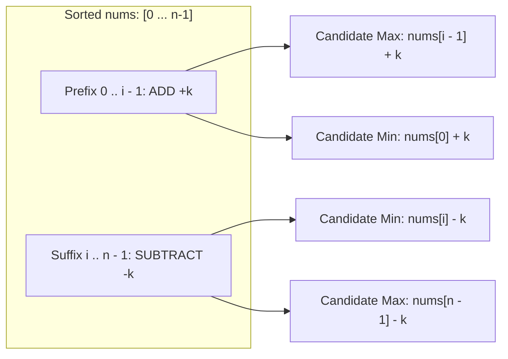

# Guided Example: Smallest Range II

We trace the step-by-step evaluation of the sorted prefix-raising / suffix-lowering breakpoint partition, prove why inverted sign assignments strictly worsen the bounding interval, and derive optimal extremal bounds on representative integer sequences:

- **Representative Instance 1 (Internal Split Optimization):**
  $$
  nums = [1, \; 3, \; 6], \quad k = 3
  $$
- **Required Output:** `3`
  - Baseline (uniform shift: all $+3$ or all $-3$):
    $$
    [4, 6, 9] \implies 9 - 4 = 5
    $$
  - Split at index $i = 1$ (raise prefix $[1]$, lower suffix $[3, 6]$):
    - Prefix: $1 + 3 = 4$
    - Suffix: $3 - 3 = 0, \; 6 - 3 = 3$
    - Modified array: $[4, 0, 3] \implies \max = 4, \min = 0 \implies \text{score} = 4 - 0 = 4$
  - Split at index $i = 2$ (raise prefix $[1, 3]$, lower suffix $[6]$):
    - Prefix: $1 + 3 = 4, \; 3 + 3 = 6$
    - Suffix: $6 - 3 = 3$
    - Modified array: $[4, 6, 3] \implies \max = 6, \min = 3 \implies \text{score} = 6 - 3 = \mathbf{3}$
  - Optimal score:
    $$
    \min(5, 4, 3) = \mathbf{3}
    $$

- **Representative Instance 2 (Boundary Gap):**
  $$
  nums = [0, \; 10], \quad k = 2 \implies [2, 8] \implies 8 - 2 = \mathbf{6}
  $$

---

## 1. Instance & Teaching Goal

Given an integer array `nums` and an integer $k$: for each index $i$, choose **either** $x_i = +k$ **or** $x_i = -k$, setting $nums'[i] = nums[i] + x_i$.
Find the minimum possible difference $\max(nums') - \min(nums')$.

```text
Sorted Array:      [ 1,   3,   6 ],  k = 3
All +3:            [ 4,   6,   9 ] -> diff = 9 - 4 = 5

Try Split at index 2 (Prefix [1, 3] gets +3, Suffix [6] gets -3):
  nums[0] = 1 + 3 = 4
  nums[1] = 3 + 3 = 6  <-- new candidate max (nums[i-1] + k)
  nums[2] = 6 - 3 = 3  <-- new candidate min (nums[i] - k)

Extremes for Split 2:
  min = min(nums[0] + k, nums[i] - k) = min(4, 3) = 3
  max = max(nums[i-1] + k, nums[-1] - k) = max(6, 3) = 6
  Score = 6 - 3 = 3 (Optimal!)
```

A brute-force search explores all $2^n$ sign assignments. For $n = 10{,}000$, $2^{10000}$ is astronomically large, causing exponential explosion.

The decisive pedagogical goal is to prove the **Prefix-Suffix Breakpoint Theorem**:
After sorting $nums$, any optimal sign assignment partitions the array into a prefix that receives $+k$ and a suffix that receives $-k$.
This reduces the search space from $2^n$ combinations down to testing exactly $n$ split points in $\mathcal{O}(n)$ time.

---

## 2. Conceptual Foundation & The Monotone Sign Partition Invariant



### The No-Crossing Sign Invariant

Suppose two elements in the sorted array satisfy $a \le b$.
- If we assign $-k$ to $a$ and $+k$ to $b$, their modified values become $a' = a - k$ and $b' = b + k$.
  Their separation becomes:
  $$
  b' - a' = (b + k) - (a - k) = (b - a) + 2k
  $$
  This strictly widens the gap between $a$ and $b$ by $2k$, pushing extremes further apart.
- In contrast, assigning $+k$ to $a$ and $-k$ to $b$ gives:
  $$
  b' - a' = (b - k) - (a + k) = (b - a) - 2k
  $$
  This compresses the distance between $a$ and $b$ by $2k$.
- **Conclusion:** In an optimal configuration, smaller elements must receive $+k$ and larger elements must receive $-k$. There is never a reason to assign $-k$ to a smaller element while assigning $+k$ to a larger element.
- Hence, the optimal assignment is always a **single split point** $i \in [1, n-1]$ where:
  - $nums[0 \dots i-1]$ all receive $+k$.
  - $nums[i \dots n-1]$ all receive $-k$.

---

## 3. Step-by-Step Worked Execution: $nums = [1, 3, 6], k = 3$

Array is already sorted: $nums = [1, 3, 6]$, $n = 3$.
Baseline score (no split, all shifted equally):
$$
ans = nums[2] - nums[0] = 6 - 1 = \mathbf{5}
$$

Now test all $n - 1 = 2$ internal breakpoints:

| Split Index $i$ | Raised Prefix ($+3$) | Lowered Suffix ($-3$) | Candidate Min: $\min(nums[0]+k, \; nums[i]-k)$ | Candidate Max: $\max(nums[i-1]+k, \; nums[-1]-k)$ | Calculated Spread $mx - mi$ | Running Minimum Score |
|:---:|:---:|:---:|:---:|:---:|:---:|:---:|
| **Baseline** | (All $+3$) | None | $1 + 3 = 4$ | $6 + 3 = 9$ | $9 - 4 = 5$ | $5$ |
| **$i = 1$** | $[1] \to [4]$ | $[3, 6] \to [0, 3]$ | $\min(1+3, \; 3-3) = \min(4, 0) = \mathbf{0}$ | $\max(1+3, \; 6-3) = \max(4, 3) = \mathbf{4}$ | $4 - 0 = \mathbf{4}$ | $\min(5, 4) = 4$ |
| **$i = 2$** | $[1, 3] \to [4, 6]$ | $[6] \to [3]$ | $\min(1+3, \; 6-3) = \min(4, 3) = \mathbf{3}$ | $\max(3+3, \; 6-3) = \max(6, 3) = \mathbf{6}$ | $6 - 3 = \mathbf{3}$ | $\min(4, 3) = \mathbf{3}$ |

Minimal score achieved across all configurations: $\mathbf{3}$.

---

## 4. Secondary Trace: $nums = [0, 4, 8], k = 3$

Baseline: $8 - 0 = 8$.

- **Split $i = 1$:** Prefix $[0] \to [3]$; Suffix $[4, 8] \to [1, 5]$.
  - $mi = \min(0 + 3, 4 - 3) = \min(3, 1) = 1$.
  - $mx = \max(0 + 3, 8 - 3) = \max(3, 5) = 5$.
  - Spread: $5 - 1 = \mathbf{4}$.
- **Split $i = 2$:** Prefix $[0, 4] \to [3, 7]$; Suffix $[8] \to [5]$.
  - $mi = \min(0 + 3, 8 - 3) = \min(3, 5) = 3$.
  - $mx = \max(4 + 3, 8 - 3) = \max(7, 5) = 7$.
  - Spread: $7 - 3 = \mathbf{4}$.

Optimal score: $\min(8, 4, 4) = \mathbf{4}$.

---

## 5. Algorithmic Correctness

### Soundness & Completeness
1. **Soundness:**
   For any breakpoint $i$, the prefix $nums[0 \dots i-1]$ receives $+k$ and suffix $nums[i \dots n-1]$ receives $-k$, which is a valid binary assignment.
   Because the prefix was sorted, its smallest element is $nums[0]+k$ and its largest is $nums[i-1]+k$.
   Because the suffix was sorted, its smallest element is $nums[i]-k$ and its largest is $nums[n-1]-k$.
   Therefore, the global minimum of the entire modified array is precisely $\min(nums[0]+k, nums[i]-k)$, and the global maximum is $\max(nums[i-1]+k, nums[n-1]-k)$.
2. **Completeness:**
   By the No-Crossing Sign Invariant, any optimal assignment can be rearranged into a prefix-raised and suffix-lowered partition without increasing the range. Because our loop tests every possible breakpoint $i \in [1, n-1]$ along with the uniform baseline, the global minimum spread is guaranteed to be evaluated.

---

## 6. Boundary Cases & Traps

| Scenario | Input | Behavior | Trapped Risk |
|---|---|---|---|
| Single Element | $nums = [1], k = 0$ | Loop for $i \in [1, 0]$ does not run; returns $0$. | Index out-of-bounds on $n = 1$. |
| $k = 0$ | Any array, $k = 0$ | $mx - mi$ matches original spread; returns $nums[-1] - nums[0]$. | Division by zero or negative spread calculations. |
| Uniform Identical Array | $[5, 5, 5], k = 2$ | Baseline returns $0$. Breakpoints produce $\ge 0$. Returns $0$. | Forcing a split when uniform shift is optimal. |
| Small vs Large $k$ | Small $k$: all $+k$ optimal; Large $k$: split optimal | The algorithm compares both and selects the minimum. | Assuming a split is always superior to uniform translation. |

---

## 7. Complexity Derivation

- **Time Complexity:** $\mathcal{O}(n \log n)$.
  - Sorting the array of length $n$ takes $\mathcal{O}(n \log n)$ comparisons.
  - Scanning through the $n - 1$ breakpoints evaluates $\mathcal{O}(1)$ min/max operations per index, requiring $\mathcal{O}(n)$ time.
  - Total runtime: strictly dominated by sorting $\mathcal{O}(n \log n)$, completing in $< 0.01\text{ s}$ for $n = 10{,}000$.
- **Auxiliary Space Complexity:** $\mathcal{O}(1)$ (or $\mathcal{O}(n)$ depending on whether sorting is performed in-place or copies the array).
  - Breakpoint tracking requires only scalar storage for $mi$, $mx$, and $ans$.
