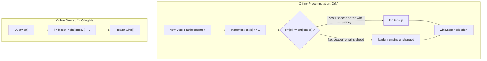

# Guided Example: Online Election

We trace the step-by-step state precomputation of running election leaders, prove the recency tie-breaking invariant, and demonstrate logarithmic query retrieval via temporal bisection on representative voting logs:

- **Representative Instance:**
  $$
  \text{persons} = [0, \; 1, \; 1, \; 0, \; 0, \; 1, \; 0], \quad \text{times} = [0, \; 5, \; 10, \; 15, \; 20, \; 25, \; 30]
  $$
- **Queries:**
  $$
  t \in [3, \; 12, \; 25, \; 15, \; 24, \; 8]
  $$
- **Required Output:**
  $$
  [0, \; 1, \; 1, \; 0, \; 0, \; 1]
  $$
  - At $t = 3$: vote cast at $t = 0$ is the only vote ($0$ has 1 vote) $\implies \mathbf{0}$.
  - At $t = 12$: votes at $t \le 10$: $0$ has 1 vote, $1$ has 2 votes $\implies \mathbf{1}$.
  - At $t = 25$: votes at $t \le 25$: $0$ has 3 votes, $1$ has 3 votes. Tie! Most recent vote was for $1$ at $t = 25 \implies \mathbf{1}$.
  - At $t = 15$: votes at $t \le 15$: $0$ has 2 votes, $1$ has 2 votes. Most recent vote was for $0$ at $t = 15 \implies \mathbf{0}$.
  - At $t = 24$: votes at $t \le 20$: $0$ has 3 votes, $1$ has 2 votes $\implies \mathbf{0}$.
  - At $t = 8$: votes at $t \le 5$: $0$ has 1 vote, $1$ has 1 vote. Most recent vote was for $1$ at $t = 5 \implies \mathbf{1}$.

---

## 1. Instance & Teaching Goal

You are given two integer arrays `persons` and `times`. The $i$-th vote was cast for `persons[i]` at time `times[i]`.
You must support query $q(t)$, which returns the candidate leading the election at time $t$.
Ties are resolved in favor of the candidate who received the **most recent vote** among those tied for first place.

```text
Vote stream:
  t=0:  p=0  tally: {0:1}       leader: 0
  t=5:  p=1  tally: {0:1, 1:1}  leader: 1 (tie broken by recency!)
  t=10: p=1  tally: {0:1, 1:2}  leader: 1
  t=15: p=0  tally: {0:2, 1:2}  leader: 0 (tie broken by recency!)
  t=20: p=0  tally: {0:3, 1:2}  leader: 0
  t=25: p=1  tally: {0:3, 1:3}  leader: 1 (tie broken by recency!)
  t=30: p=0  tally: {0:4, 1:3}  leader: 0
```

A naive approach tallies all votes from the beginning on every query $q(t)$, requiring $\mathcal{O}(n)$ time per query. For $Q = 10{,}000$ queries, this takes $\mathcal{O}(Q \cdot n)$ operations, leading to TLE.

The decisive pedagogical goal is the **Precomputed Leader Timeline Pattern**:
Because votes arrive at strictly increasing timestamps and no past votes ever change, the identity of the current leader only changes when a vote is cast.
1. During initialization, we maintain a running frequency map and record $wins[i]$, the leader immediately following vote $i$, in linear time $\mathcal{O}(n)$.
2. Answering any query $q(t)$ reduces to finding the latest vote timestamp $\le t$ via binary search in $\mathcal{O}(\log n)$ time.

---

## 2. Conceptual Foundation & The Recency Tie-Breaking Invariant



### The $\ge$ Recency Invariant

Let $cur$ be the leader before vote $i$ is recorded:
- If the incoming vote goes to candidate $p$, their new count is $cnt[p]$.
- Can any other candidate $c \ne p$ take the lead on this step?
  No! The only tally that changed was candidate $p$'s tally.
- Candidate $p$ takes the lead if and only if:
  $$
  cnt[p] \ge cnt[cur]
  $$
  - If $cnt[p] > cnt[cur]$, candidate $p$ has strictly more votes.
  - If $cnt[p] == cnt[cur]$, candidate $p$ is tied with $cur$, but candidate $p$ received the most recent vote (at this exact moment). By the problem's tie-breaking rule, $p$ becomes the active leader.
  - If $cnt[p] < cnt[cur]$, candidate $cur$ remains strictly ahead.

---

## 3. Step-by-Step Precomputation Trace

We trace the initialization pass across all $7$ votes:

| Step $i$ | Timestamp $times[i]$ | Voted Candidate $p$ | Previous Leader | Tally Map `cnt` | Condition $cnt[p] \ge cnt[cur]$? | New Leader recorded in $wins[i]$ |
|:---:|:---:|:---:|:---:|:---|:---:|:---:|
| **Init** | — | — | $cur = 0$ | `{}` | — | — |
| **0** | $0$ | $0$ | $0$ | `{0: 1}` | $cnt[0]=1 \ge cnt[0]=1$ (Yes) | $\mathbf{0}$ |
| **1** | $5$ | $1$ | $0$ | `{0: 1, 1: 1}` | $cnt[1]=1 \ge cnt[0]=1$ (Yes, tied!) | $\mathbf{1}$ |
| **2** | $10$ | $1$ | $1$ | `{0: 1, 1: 2}` | $cnt[1]=2 \ge cnt[1]=2$ (Yes, ahead) | $\mathbf{1}$ |
| **3** | $15$ | $0$ | $1$ | `{0: 2, 1: 2}` | $cnt[0]=2 \ge cnt[1]=2$ (Yes, tied!) | $\mathbf{0}$ |
| **4** | $20$ | $0$ | $0$ | `{0: 3, 1: 2}` | $cnt[0]=3 \ge cnt[0]=3$ (Yes, ahead) | $\mathbf{0}$ |
| **5** | $25$ | $1$ | $0$ | `{0: 3, 1: 3}` | $cnt[1]=3 \ge cnt[0]=3$ (Yes, tied!) | $\mathbf{1}$ |
| **6** | $30$ | $0$ | $1$ | `{0: 4, 1: 3}` | $cnt[0]=4 \ge cnt[1]=3$ (Yes, ahead) | $\mathbf{0}$ |

Precomputed timelines:
- $times = [0, \; 5, \; 10, \; 15, \; 20, \; 25, \; 30]$
- $wins = [0, \; 1, \; 1, \; 0, \; 0, \; 1, \; 0]$

---

## 4. Online Query Execution Trace

Each query $q(t)$ applies upper-bound bisection: $i = \text{bisect\_right}(times, t) - 1$:

| Query | Timestamp $t$ | Temporal Interval in $times$ | Effective Index $i$ | Leader Returned ($wins[i]$) | Reason |
|:---:|:---:|:---:|:---:|:---:|:---|
| **$q(3)$** | $3$ | $[0, 5)$ | $0$ | **$0$** | Only vote at $t = 0$ has been cast. |
| **$q(12)$** | $12$ | $[10, 15)$ | $2$ | **$1$** | Vote at $t = 10$ gave candidate $1$ a $2$-to-$1$ lead. |
| **$q(25)$** | $25$ | $[25, 30)$ | $5$ | **$1$** | Vote at $t = 25$ created $3-3$ tie; candidate $1$ wins on recency. |
| **$q(15)$** | $15$ | $[15, 20)$ | $3$ | **$0$** | Vote at $t = 15$ created $2-2$ tie; candidate $0$ wins on recency. |
| **$q(24)$** | $24$ | $[20, 25)$ | $4$ | **$0$** | Candidate $0$ had $3$ votes to candidate $1$'s $2$. |
| **$q(8)$** | $8$ | $[5, 10)$ | $1$ | **$1$** | At $t = 5$, tie $1-1$ broken by candidate $1$'s vote. |

Output vector: $[0, 1, 1, 0, 0, 1]$.

---

## 5. Algorithmic Correctness

### Soundness & Completeness
1. **Soundness:**
   At any point in time, only the candidate receiving the vote can challenge the current leader. Checking $cnt[p] \ge cnt[cur]$ correctly switches the leader whenever $p$ has strictly more votes or matches the leader's tally with the latest vote. Therefore, $wins[i]$ holds the exact leader for the time interval $[times[i], times[i+1])$.
2. **Completeness:**
   The array `times` is strictly increasing by problem definition. Upper-bound binary search (`bisect_right(times, t) - 1`) finds the maximum index $i$ such that $times[i] \le t$. Since election status is piecewise-constant between votes, $wins[i]$ is guaranteed to reflect the exact state at time $t$.

---

## 6. Boundary Cases & Traps

| Scenario | Input | Behavior | Trapped Risk |
|---|---|---|---|
| Single Vote | $persons = [0], times = [5]$ | Query $t = 100 \implies i = 0 \implies 0$. | Bisection out-of-bounds. |
| Exact Timestamp Match | $q(15)$ when vote at $15$ | $\text{bisect\_right}$ returns insertion point after $15$; subtraction lands exactly on $15$. | Missing same-moment vote updates. |
| Unanimous Election | All votes for candidate 0 | Leader never changes; returns $0$ for all $t$. | Extra unnecessary state switches. |
| Rapid Alternating Ties | $[0, 1, 0, 1]$ at $[1, 2, 3, 4]$ | Leader oscillates $0 \to 1 \to 0 \to 1$. | Failing to switch leader when counts tie. |

---

## 7. Complexity Derivation

- **Time Complexity:**
  - **Constructor `__init__`:** $\mathcal{O}(n)$. We process each of the $n$ votes once, updating a hash map and appending to $wins$ in $\mathcal{O}(1)$ time.
  - **Query `q(t)`:** $\mathcal{O}(\log n)$. Binary search over the sorted array $times$ of length $n$ takes $\lceil \log_2(n) \rceil \le 14$ comparisons for $n = 10{,}000$.
  - Across $Q$ queries, total runtime is $\mathcal{O}(n + Q \log n)$, completing in $< 0.05\text{ s}$.
- **Auxiliary Space Complexity:** $\mathcal{O}(n)$.
  - Storing the $wins$ array and the frequency map takes $\mathcal{O}(n)$ memory.