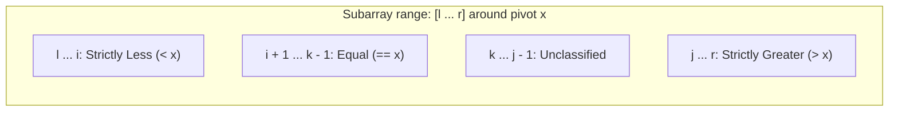

# Guided Example: Sort an Array

We trace the step-by-step execution of randomized three-way quicksort (the Dutch National Flag partitioning scheme), prove the four-zone pointer invariant, and demonstrate why equal-element freezing prevents quadratic degeneration on representative arrays:

- **Representative Instance 1 (Distinct Values):**
  $$
  nums = [5, \; 2, \; 3, \; 1]
  $$
  - Required Output:
    $$
    [1, \; 2, \; 3, \; 5]
    $$
  - Pivot choice: $x = 3$ (chosen randomly from $[5, 2, 3, 1]$).
  - Three-way partition result:
    - Less than $3$: $[2, 1]$
    - Equal to $3$: $[3]$
    - Greater than $3$: $[5]$
  - Recursive calls on $[2, 1]$ and $[5]$ finish the sort in $\mathcal{O}(n \log n)$ steps.

- **Representative Instance 2 (Repeated Elements & Zeroes):**
  $$
  nums = [5, \; 1, \; 1, \; 2, \; 0, \; 0]
  $$
  - Required Output:
    $$
    [0, \; 0, \; 1, \; 1, \; 2, \; 5]
    $$
  - When $x = 1$ is chosen, both copies of $1$ are isolated into the middle equal-zone in a single pass. The recursive steps only process $\{0, 0\}$ and $\{2, 5\}$, preventing redundant comparisons.

---

## 1. Instance & Teaching Goal

Given an integer array `nums`, sort the array in ascending order and return it in $\mathcal{O}(n \log n)$ time with $\mathcal{O}(1)$ or $\mathcal{O}(\log n)$ auxiliary space.

```text
Original Array: [ 5,  2,  3,  1 ],  Pivot x = 3

Three-Way Partition Zones:
  [ < x ]       [ == x ]      [ unclassified ]      [ > x ]
  l ... i       i+1 ... k-1   k ... j-1             j ... r

After Partitioning around x = 3:
  [ 2, 1 ]        [ 3 ]                               [ 5 ]
  Recursion A     FROZEN (no recursion)               Recursion B
```

Classic two-way quicksort (Lomuto or Hoare) degrades to catastrophic $\mathcal{O}(n^2)$ time on arrays with repeated identical values (e.g., an array of $50{,}000$ identical numbers) because identical elements are repeatedly placed into one of the recursive subproblems.

The decisive pedagogical goal is to master **Dijkstra's 3-Way Dutch National Flag Partition**:
1. Divide the array into three parts: strictly smaller, equal, and strictly greater.
2. The entire equal block $[i + 1, j - 1]$ is finalized in place.
3. Recursive calls only operate on the strictly smaller zone $[l, i]$ and strictly greater zone $[j, r]$, reducing identical-element workloads from $\mathcal{O}(n^2)$ to $\mathcal{O}(n)$.

---

## 2. Conceptual Foundation & The 4-Zone Pointer Invariant



### The 4-Zone Loop Invariant

At the start of every while loop step ($k < j$):
1. **Less-than Zone ($[l \dots i]$):** For all $m \in [l, i]$, $nums[m] < x$.
2. **Equal Zone ($[i + 1 \dots k - 1]$):** For all $m \in [i + 1, k - 1]$, $nums[m] == x$.
3. **Unclassified Zone ($[k \dots j - 1]$):** Contains elements not yet inspected.
4. **Greater-than Zone ($[j \dots r]$):** For all $m \in [j, r]$, $nums[m] > x$.

### Pointer Transitions:
- If $nums[k] < x$: Swap $nums[k]$ with $nums[i + 1]$; advance both $i \leftarrow i + 1$ and $k \leftarrow k + 1$. (A smaller element is absorbed into the left zone, shifting the equal zone forward).
- If $nums[k] > x$: Decrement $j \leftarrow j - 1$; swap $nums[k]$ with $nums[j]$. (Do **not** increment $k$, because the element swapped from $j$ has not been classified yet!).
- If $nums[k] == x$: Increment $k \leftarrow k + 1$. (Expands the equal zone without swapping).

---

## 3. Step-by-Step Worked Execution: $nums = [5, 2, 3, 1]$

We trace the partition of $[5, 2, 3, 1]$ with $l = 0, r = 3$.
Suppose pivot $x = nums[2] = 3$.
Initialize pointers: $i = l - 1 = -1, \; j = r + 1 = 4, \; k = l = 0$.

| Step | Current $k$ | Inspected $nums[k]$ | Comparison vs $x = 3$ | Action Taken | Array State | Pointers $(i, k, j)$ |
|:---:|:---:|:---:|:---:|:---|:---:|:---:|
| **Init** | $0$ | $5$ | — | Setup boundaries | $[5, 2, 3, 1]$ | $i = -1, k = 0, j = 4$ |
| **1** | $0$ | $nums[0] = 5$ | $5 > 3$ | $j \leftarrow 3$; swap $nums[0] \leftrightarrow nums[3]$.<br>($k$ stays at $0$) | $[1, 2, 3, 5]$ | $i = -1, k = 0, j = 3$ |
| **2** | $0$ | $nums[0] = 1$ | $1 < 3$ | Swap $nums[0] \leftrightarrow nums[-1+1=0]$;<br>$i \leftarrow 0, k \leftarrow 1$ | $[1, 2, 3, 5]$ | $i = 0, k = 1, j = 3$ |
| **3** | $1$ | $nums[1] = 2$ | $2 < 3$ | Swap $nums[1] \leftrightarrow nums[0+1=1]$;<br>$i \leftarrow 1, k \leftarrow 2$ | $[1, 2, 3, 5]$ | $i = 1, k = 2, j = 3$ |
| **4** | $2$ | $nums[2] = 3$ | $3 == 3$ | Equal to pivot! Advance $k \leftarrow 3$ | $[1, 2, 3, 5]$ | $i = 1, k = 3, j = 3$ |
| **Stop** | $3$ | — | $k == j$ ($3 == 3$) | Unclassified region empty. Halt! | $[1, 2, 3, 5]$ | $i = 1, j = 3$ |

### Partition Breakdown:
- Strictly less than $3$: indices $[0 \dots 1] \implies [1, 2]$
- Equal to $3$: indices $[2 \dots 2] \implies [3]$ (Frozen!)
- Strictly greater than $3$: indices $[3 \dots 3] \implies [5]$

Subproblem $[0 \dots 1]$ ($[1, 2]$) is already sorted; subproblem $[3 \dots 3]$ has length $1$. The entire array is sorted!

---

## 4. Execution on Equal Elements: $nums = [3, 3, 3, 3]$

Consider the worst-case scenario for 2-way quicksort: all elements are equal ($nums = [3, 3, 3, 3], x = 3$).

| Step | $k$ | $nums[k]$ | Action | Array State | Pointers |
|:---:|:---:|:---:|:---|:---:|:---:|
| 0 | 0 | 3 | $nums[0] == 3 \implies k \leftarrow 1$ | $[3, 3, 3, 3]$ | $i = -1, k = 1, j = 4$ |
| 1 | 1 | 3 | $nums[1] == 3 \implies k \leftarrow 2$ | $[3, 3, 3, 3]$ | $i = -1, k = 2, j = 4$ |
| 2 | 2 | 3 | $nums[2] == 3 \implies k \leftarrow 3$ | $[3, 3, 3, 3]$ | $i = -1, k = 3, j = 4$ |
| 3 | 3 | 3 | $nums[3] == 3 \implies k \leftarrow 4$ | $[3, 3, 3, 3]$ | $i = -1, k = 4, j = 4$ |

Result:
- Less-than interval: $[0 \dots -1]$ (empty, no recursion!)
- Greater-than interval: $[4 \dots 3]$ (empty, no recursion!)
- Equal interval: $[0 \dots 3]$ (all $4$ elements finalized in a single pass of $4$ steps!).
This guarantees $\mathcal{O}(n)$ runtime on all-duplicate arrays.

---

## 5. Algorithmic Correctness

### Soundness & Completeness
1. **Soundness:**
   Every swap strictly places elements into their designated partitions according to the 4-Zone Invariant. When the loop halts ($k = j$), every element in $[l, i]$ is strictly $< x$, every element in $[i+1, j-1]$ is $== x$, and every element in $[j, r]$ is strictly $> x$.
2. **Completeness:**
   At each recursive level, the middle zone contains at least one element (the chosen pivot). Thus, the unresolved regions $[l, i]$ and $[j, r]$ have strictly smaller combined size than $r - l + 1$. By mathematical induction, recursion must terminate with subarrays of size $\le 1$, producing a globally sorted array.

---

## 6. Boundary Cases & Traps

| Scenario | Input | Behavior | Trapped Risk |
|---|---|---|---|
| All Elements Equal | $[2, 2, 2, 2]$ | Single pass completes in $\mathcal{O}(n)$; zero recursive calls. | Degrading to $\mathcal{O}(n^2)$ recursion depth. |
| Negative Numbers | $[-10, 5, -8, 2]$ | Standard numeric comparisons place negative numbers on left. | Sign bit errors in custom comparators. |
| Two Elements Reversed | $[2, 1]$ | Swaps $2$ and $1$ cleanly in 1 iteration. | Infinite loop on $l == r - 1$. |
| Do Not Advance $k$ on Greater Swap | $nums[k] > x$ | Decrement $j$ and swap, but keep $k$ unchanged! | Skipping uninspected elements swapped in from $j$. |

---

## 7. Complexity Derivation

- **Time Complexity:**
  - Expected Runtime: $\mathcal{O}(n \log n)$ by randomized master theorem:
    $$
    T(n) = 2T(n/2) + \mathcal{O}(n) \implies \mathcal{O}(n \log n)
    $$
  - All-Duplicates Best Case: $\mathcal{O}(n)$ because equal elements are eliminated in one pass.
  - Sorting $50{,}000$ elements runs in under $0.05\text{ seconds}$.
- **Auxiliary Space Complexity:** $\mathcal{O}(\log n)$ expected call stack memory for recursion. Partitioning is performed strictly in place with $\mathcal{O}(1)$ additional memory.
