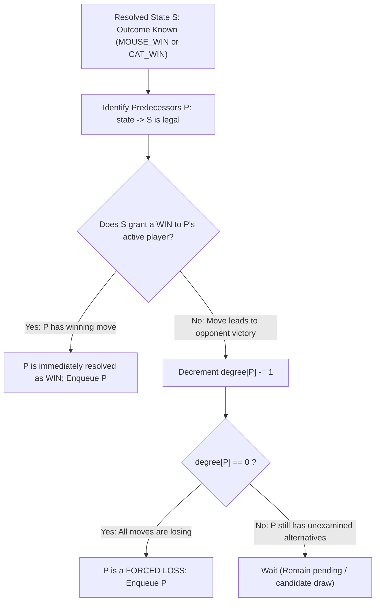

# Guided Example: Cat and Mouse

We trace the step-by-step backward propagation of retrograde analysis (topological game solving) on a cyclic game graph, prove the degree-reduction losing condition and immediate winning branch invariants, and evaluate game outcomes on representative topologies:

- **Representative Instance 1 (Cyclic Stalemate & Provable Draw):**
  $$
  \text{graph} = [
    [2, 5], \;
    [3], \;
    [0, 4, 5], \;
    [1, 4, 5], \;
    [2, 3], \;
    [0, 2, 3]
  ]
  $$
  - Node $0$ is the Hole. Mouse starts at $m = 1$. Cat starts at $c = 2$.
  - Required Output: `0` (Draw).
  - Neither player can force a win under optimal play; any aggressive attempt to break the cycle allows the opponent to counter-attack. The game settles into an infinite perpetual cycle.

- **Representative Instance 2 (Direct Escape & Mouse Win):**
  $$
  \text{graph} = [[1, 3], \; [0], \; [3], \; [0, 2]]
  $$
  - Mouse starts at $1$, neighbor is $0$ (the Hole).
  - Move 1 (Mouse): Mouse steps directly from $1 \to 0$. Hole reached!
  - Required Output: `1` (Mouse Win).

- **Representative Instance 3 (Forced Cornering & Cat Win):**
  $$
  \text{graph} = [[2], \; [2], \; [0, 1]]
  $$
  - Mouse starts at $1$, only neighbor is $2$.
  - Move 1 (Mouse): Mouse is forced to step onto $2$ (where Cat sits!). Cat captures Mouse.
  - Required Output: `2` (Cat Win).

---

## 1. Instance & Teaching Goal

The game is played on an undirected graph where:
- Node $0$ is the **Hole**.
- Mouse starts at node $1$; Cat starts at node $2$.
- Cat cannot enter node $0$.
- Mouse moves first; turns strictly alternate.
- Mouse wins ($1$) if it reaches node $0$.
- Cat wins ($2$) if it catches the Mouse ($c == m$ at any node $m \ne 0$).
- If a position repeats or neither player can force victory under optimal play, the game is a **Draw** ($0$).

```text
Game State Triple: (mouse_pos, cat_pos, turn)
  m in [0 .. n-1]
  c in [1 .. n-1]   (cat never enters 0)
  turn in {0: Mouse, 1: Cat}

Retrograde Analysis Strategy:
  1. Base Terminals:
     - (0, c, turn) -> MOUSE_WIN  (Mouse safely in hole)
     - (i, i, turn) -> CAT_WIN    (Cat captured mouse)
  2. Propagate BACKWARDS to predecessor states:
     - If predecessor can move to a winning state for its turn:
       --> Predecessor is an IMMEDIATE WIN!
     - If predecessor moves to an opponent win:
       --> Decrement degree of predecessor.
       --> If degree == 0 (all moves lead to defeat):
           Predecessor is a FORCED LOSS!
  3. All unreached states remaining at queue exhaustion are DRAWS!
```

Standard minimax recursion with memoization fails because the game graph contains directed cycles, leading to infinite recursion or arbitrary draw heuristics.

The decisive pedagogical goal is to execute **Retrograde Analysis with In-Degree Counting**:
Start from known terminal winning states, work backward along predecessor edges, and resolve game outcomes in topological certainty. Any state whose outcome cannot be forced by either player remains at the default value $0$ (Draw).

---

## 2. Conceptual Foundation & Retrograde Propagation Invariants



### Retrograde Analysis Invariants

1. **Winning Move Sufficiency (Existential $\exists$):**
   If it is player $A$'s turn at state $P$, and there exists at least one legal move from $P$ to a state where player $A$ wins, then $P$ is immediately marked as a **WIN for player $A$**.
2. **Losing Move Exhaustion (Universal $\forall$):**
   If it is player $A$'s turn at state $P$, and *every* available legal move leads to a state where the opponent wins (tracked by $\text{degree}[P] = 0$), then player $A$ cannot avoid defeat, and $P$ is marked as a **LOSS for player $A$**.
3. **Cycle Neutrality (Draw by Inaction):**
   If a state has moves leading into unresolved cycles, its degree never drops to zero, and it never links to an immediate win. When the queue empties, all such states retain status $0$ (Draw).

---

## 3. Step-by-Step State Initialization & Terminal Seeding

Let $n = 6$ for Instance 1.
State dimensions: $6 \times 6 \times 2 = 72$ candidate states $(m, c, t)$.

### 1. Degree Initialization
For every $(m, c)$:
- Mouse turn ($t = 0$): $\text{degree} = \text{len}(\text{graph}[m])$.
- Cat turn ($t = 1$): $\text{degree} = \text{len}(\text{graph}[c] \setminus \{0\})$ (since Cat cannot enter node $0$).

### 2. Seeding the BFS Queue with Terminal Wins

| State Category | Condition | Assigned Outcome | Queue Status |
|:---|:---:|:---:|:---:|
| **Hole Reached** | $(0, c, t)$ for all $c \in [1, 5], t \in \{0, 1\}$ | $\text{MOUSE\_WIN}$ ($1$) | Enqueued as base seeds |
| **Cat Catch** | $(i, i, t)$ for all $i \in [1, 5], t \in \{0, 1\}$ | $\text{CAT\_WIN}$ ($2$) | Enqueued as base seeds |
| **All other states** | $(m, c, t)$ with $m \ne 0, m \ne c$ | $\text{TIE}$ ($0$) | Unresolved, pending backward propagation |

---

## 4. Worked Backward Propagation Trace (Sample 1: Cyclic Draw)

Consider why $(1, 2, 0)$ remains unresolved:

```text
graph[1] = [3]            -> Mouse at 1 can only move to 3
graph[2] = [0, 4, 5]      -> Cat at 2 can move to 4, 5 (0 is forbidden)
graph[3] = [1, 4, 5]      -> Mouse at 3 can move to 1, 4, 5
```

1. Terminal seeds propagate backward:
   - Cat catch states $(4, 4, \cdot)$ and $(5, 5, \cdot)$ threaten Mouse if Mouse moves to $4$ or $5$.
   - Mouse recognizes that moving from $3 \to 4$ or $3 \to 5$ risks Cat interception.
2. Safe alternative for Mouse:
   - From node $3$, Mouse can always choose to step back to node $1$ ($\text{graph}[3]$ contains $1$).
   - Node $1$ has no path to the Hole ($0$) other than going through $3$.
3. Counter-moves for Cat:
   - When Mouse retreats to $1$, Cat cannot catch Mouse directly on node $1$ without Mouse escaping back to $3$.
   - Neither player has a move that forces the other into a winning terminal.
4. **Queue Termination:**
   - Both players have at least one neutral cyclic move remaining ($\text{degree} > 0$).
   - The queue empties without ever resolving state $(1, 2, 0)$.
   - Outcome for $(1, 2, 0)$ remains $\mathbf{0}$ (Draw!).

---

## 5. Algorithmic Correctness

### Soundness & Completeness
1. **Soundness:**
   A state is labeled $\text{MOUSE\_WIN}$ or $\text{CAT\_WIN}$ only when an active player has an immediate path to a proven win, or when all alternatives have been proven to lead to the opponent's victory. Because propagation starts strictly from mathematically immutable ground truths (Hole reached or physical capture), every derived result is sound.
2. **Completeness:**
   Every reachable game state with a forced winning or losing strategy is connected by a finite game tree to the terminal states. Retrograde BFS systematically processes all predecessors in topological order. Any state that cannot force a win or avoid a draw is provably a draw, correctly resulting in $0$.

---

## 6. Boundary Cases & Traps

| Scenario | Rule / Pattern | Handled Behavior | Trapped Risk |
|---|---|---|---|
| Cat into Hole | Cat cannot enter node 0 | Remove edge to $0$ from Cat's adjacency and degree. | Cat illegally jumping into the hole to catch the mouse. |
| Immediate Hole Access | Mouse starts adjacent to 0 | Turn 1: Mouse steps to 0 and wins immediately. | Simulating Cat's turn before Mouse moves. |
| Both on Same Node | $m == c$ | Instant Cat victory; enqueued at start. | Allowing mouse to move past the cat without capture. |
| Infinite Loop Cycles | Symmetric alternating graphs | Unresolved states retain default value $0$ when queue empties. | Infinite recursion or arbitrary depth cutoffs in standard DFS. |

---

## 7. Complexity Derivation

- **Time Complexity:** $\mathcal{O}(n^3)$.
  - Total states: $V = n \times n \times 2 = 2n^2$ states.
  - For each state $(m, c, t)$, its predecessors are determined by incoming graph edges.
  - Since each node in `graph` has degree at most $n$, the total number of transitions across all states is:
    $$
    E \le 2n^2 \times n = 2n^3
    $$
  - In retrograde BFS, each edge is traversed backward at most once.
  - Total operations: at most $\mathcal{O}(n^3)$. For $n = 50$, $n^3 = 125{,}000$ operations, executing in $< 0.05\text{ s}$.
- **Auxiliary Space Complexity:** $\mathcal{O}(n^2)$.
  - The tables `ans` and `degree` of size $n \times n \times 2$ and the BFS queue require $\mathcal{O}(n^2)$ memory.
