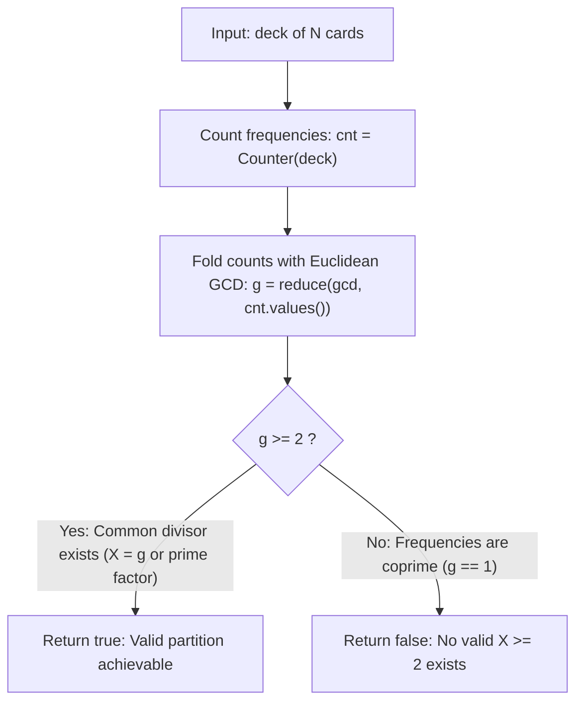

# Guided Example: X of a Kind in a Deck of Cards

We trace the step-by-step reduction of frequency multisets under the Euclidean greatest common divisor (GCD) fold, prove the common divisor partition theorem, and demonstrate feasibility tests on representative card decks:

- **Representative Instance 1 (Common Even Divisor):**
  $$
  \text{deck} = [1, \; 2, \; 3, \; 4, \; 4, \; 3, \; 2, \; 1]
  $$
- **Required Output:** `true`
  - Frequencies:
    - Card $1$: count $2$
    - Card $2$: count $2$
    - Card $3$: count $2$
    - Card $4$: count $2$
  - Cumulative GCD:
    $$
    \gcd(2, 2, 2, 2) = \mathbf{2} \ge 2
    $$
  - Feasible group size: $X = 2$.
  - Partition realization into pairs:
    $$
    [1, 1], \quad [2, 2], \quad [3, 3], \quad [4, 4]
    $$

- **Representative Instance 2 (Incompatible Coprime Frequencies):**
  $$
  \text{deck} = [1, \; 1, \; 1, \; 2, \; 2, \; 2, \; 3, \; 3]
  $$
  - Frequencies: $c_1 = 3$, $c_2 = 3$, $c_3 = 2$.
  - Cumulative GCD:
    $$
    \gcd(3, 3, 2) = \gcd(3, 2) = \mathbf{1} < 2
    $$
  - Required Output: `false` (no integer $X \ge 2$ divides both $3$ and $2$).

- **Representative Instance 3 (Composite Multiples $4$ and $6$):**
  $$
  \text{deck} = 4 \times \{1\}, \; 6 \times \{2\} \implies \gcd(4, 6) = \mathbf{2} \implies \mathbf{true}
  $$
  - Deck splits into two groups of $[1, 1]$ and three groups of $[2, 2]$.

---

## 1. Instance & Teaching Goal

Given an integer array `deck` where `deck[i]` represents the number on card $i$:
Determine whether the entire deck can be partitioned into $1$ or more groups such that:
1. Every group has exactly $X$ cards, with $X \ge 2$.
2. All cards in each group have the **exact same** number.

```text
Deck: [1, 2, 3, 4, 4, 3, 2, 1]
Frequencies: {1: 2, 2: 2, 3: 2, 4: 2}

Divisibility Requirement:
  To split each card's copies into groups of size X:
    X must divide count(1) = 2
    X must divide count(2) = 2
    X must divide count(3) = 2
    X must divide count(4) = 2
  Therefore: X must divide gcd(2, 2, 2, 2) = 2.
  Since gcd = 2 >= 2, choosing X = 2 works! Result: true.
```

A brute-force search guesses every possible $X \in [2, n]$ and tests divisibility across all frequencies, taking $\mathcal{O}(n \cdot u)$ time where $u$ is the number of unique card types.

The decisive pedagogical goal is to apply the **Fundamental Theorem of Common Divisors**:
A set of positive integers $\{c_1, c_2, \dots, c_k\}$ admits a common divisor $X \ge 2$ if and only if their Greatest Common Divisor satisfies:
$$
\gcd(c_1, c_2, \dots, c_k) \ge 2
$$
This reduces the entire problem to a single linear frequency tally followed by an iterative Euclidean GCD fold.

---

## 2. Conceptual Foundation & The Greatest Common Divisor Invariant



### The Common Divisor Partition Theorem

Let the unique values in `deck` have frequencies $c_1, c_2, \dots, c_k$.
1. **Intra-Group Homogeneity:**
   Because cards in each group must carry the same value, no group may mix different values.
2. **Frequency Division:**
   Every value $v_i$ must be cleanly partitioned into groups of size $X$. Therefore, the number of groups created for value $v_i$ is $c_i / X$, which is valid if and only if:
   $$
   c_i \equiv 0 \pmod X \iff X \mid c_i, \quad \forall i \in \{1, \dots, k\}
   $$
3. **Divisibility of the GCD:**
   By the fundamental property of the greatest common divisor in elementary number theory:
   $$
   X \mid c_i \quad (\forall i) \iff X \mid \gcd(c_1, c_2, \dots, c_k)
   $$
4. **Existence of $X \ge 2$:**
   An integer $X \ge 2$ dividing $G = \gcd(c_1, \dots, c_k)$ exists if and only if $G \ge 2$ (since any $G \ge 2$ has at least one prime divisor $p \ge 2$).

---

## 3. Step-by-Step Worked Execution: $\text{deck} = [1, 2, 3, 4, 4, 3, 2, 1]$

We trace the algorithm on the representative instance:

### Step 1: Frequency Hash Map Construction
Tally cards in linear scan:
- `'1'`: appears at indices $0, 7 \implies c_1 = 2$
- `'2'`: appears at indices $1, 6 \implies c_2 = 2$
- `'3'`: appears at indices $2, 5 \implies c_3 = 2$
- `'4'`: appears at indices $3, 4 \implies c_4 = 2$
Frequency list: $[2, \; 2, \; 2, \; 2]$.

### Step 2: Euclidean GCD Fold

| Fold Step | Incoming Frequency $c_i$ | Previous Running $\gcd$ | Operation $\gcd(\text{prev}, c_i)$ | Updated Running $\gcd$ |
|:---:|:---:|:---:|:---:|:---:|
| **Init** | $c_1 = 2$ | — | Base initialization | $2$ |
| **1** | $c_2 = 2$ | $2$ | $\gcd(2, 2) = 2$ | $2$ |
| **2** | $c_3 = 2$ | $2$ | $\gcd(2, 2) = 2$ | $2$ |
| **3** | $c_4 = 2$ | $2$ | $\gcd(2, 2) = 2$ | $\mathbf{2}$ |

Final cumulative GCD: $G = 2$.
Evaluation: $G \ge 2 \implies 2 \ge 2$ is **true**.
Output emitted: $\mathbf{true}$.

---

## 4. Secondary Trace: Coprime Rejection on $[1, 1, 1, 2, 2, 2, 3, 3]$

Frequencies: $c_1 = 3, c_2 = 3, c_3 = 2$.

| Step | Count $c_i$ | Prior GCD | Calculation | New GCD |
|:---:|:---:|:---:|:---:|:---:|
| 1 | $3$ | — | Base | $3$ |
| 2 | $3$ | $3$ | $\gcd(3, 3) = 3$ | $3$ |
| 3 | $2$ | $3$ | $\gcd(3, 2) = \mathbf{1}$ | $\mathbf{1}$ |

Final GCD is $1 < 2$. Output emitted: $\mathbf{false}$.

---

## 5. Algorithmic Correctness

### Soundness & Completeness
1. **Soundness:**
   If $G = \gcd(c_1, \dots, c_k) \ge 2$, we can choose $X = G$. Since $G$ divides every $c_i$, each card value $v_i$ is partitioned into exactly $c_i / G$ valid groups of size $G$, completely exhausting the deck without remainder.
2. **Completeness:**
   If $G = 1$, the frequencies share no common factor greater than $1$. Any choice of $X \ge 2$ must fail to divide at least one frequency $c_j$, meaning that value cannot be partitioned into groups of size $X$. Hence, no valid partition exists, and returning `false` is provably exhaustive.

---

## 6. Boundary Cases & Traps

| Scenario | Input Pattern | Behavior | Trapped Risk |
|---|---|---|---|
| Single Card | $\text{deck} = [5]$ | Frequency $c_1 = 1 \implies \gcd = 1 < 2$. Returns `false`. | Allowing $X = 1$ (forbidden by problem contract $X \ge 2$). |
| Two Identical Cards | $\text{deck} = [9, 9]$ | Frequency $c_1 = 2 \implies \gcd = 2 \ge 2$. Returns `true`. | Off-by-one minimum group size. |
| Zero as Card Value | $\text{deck} = [0, 0, 4, 4]$ | Frequencies are $\{0: 2, 4: 2\} \implies \gcd(2, 2) = 2$. | Misinterpreting card value $0$ as frequency $0$. |
| Prime Frequencies | Counts are $2$ and $3$ | $\gcd(2, 3) = 1 \implies$ returns `false`. | Assuming total deck size divisibility ($5$) matters rather than individual counts. |

---

## 7. Complexity Derivation

- **Time Complexity:** $\mathcal{O}(n + u \log(\min(c)))$, where $n = \text{len}(\text{deck})$ and $u$ is the number of distinct values ($u \le n$).
  - Tallying frequencies in a single pass takes $\mathcal{O}(n)$ time.
  - Computing the GCD fold across $u$ frequencies takes $\mathcal{O}(u \log(\max(c)))$ time via Euclidean division steps.
  - Total operations for $n = 10{,}000$: at most $10{,}000 + 10{,}000 \times 14 \approx 1.5 \times 10^5$, running in $< 0.005\text{ s}$.
- **Auxiliary Space Complexity:** $\mathcal{O}(u)$.
  - Storing the frequency map takes memory proportional to the number of distinct card labels ($u \le n$).
