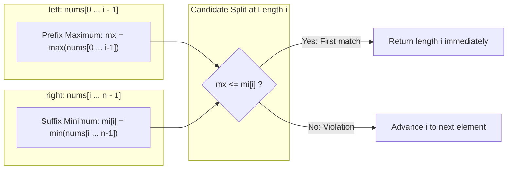

# Guided Example: Partition Array into Disjoint Intervals

We trace the step-by-step prefix-maximum / suffix-minimum boundary evaluation, prove the earliest-satisfaction minimality invariant, and evaluate boundary splits on representative integer arrays:

- **Representative Instance 1 (Interior Boundary Split):**
  $$
  nums = [5, \; 0, \; 3, \; 8, \; 6]
  $$
- **Required Output:** `3`
  - Valid partition with minimal left length:
    $$
    \text{left} = [5, \; 0, \; 3], \quad \text{right} = [8, \; 6]
    $$
  - Verification:
    $$
    \max(\text{left}) = \max(5, 0, 3) = 5
    $$
    $$
    \min(\text{right}) = \min(8, 6) = 6
    $$
    $$
    \max(\text{left}) \le \min(\text{right}) \iff 5 \le 6 \quad \text{(Valid!)}
    $$
  - Length of `left`: $\mathbf{3}$.

- **Representative Instance 2 (Late Zero Extends Left Partition):**
  $$
  nums = [1, \; 1, \; 1, \; 0, \; 6, \; 12] \implies \text{left} = [1, 1, 1, 0], \; \text{right} = [6, 12] \implies \text{length } \mathbf{4}
  $$
  - Here $\max(\text{left}) = 1 \le 6 = \min(\text{right})$.
  - Any split earlier than index $4$ forces $0$ into `right`, which violates $\max(\text{left}) \le \min(\text{right})$ since $\max(\text{left}) \ge 1 > 0$.

---

## 1. Instance & Teaching Goal

Given an integer array `nums`, partition it into two contiguous subarrays `left` and `right` such that:
1. Every element in `left` is less than or equal to every element in `right`:
   $$
   \max(\text{left}) \le \min(\text{right})
   $$
2. `left` and `right` are both non-empty.
3. The length of `left` is as **small as possible**.

```text
Array:        [  5,   0,   3, |  8,   6  ]
Indices:         0    1    2  |  3    4
Partition:       --- left --- | -- right -
Prefix Max:           5       |
Suffix Min:                   |     6
Condition:           5 <= 6   -> VALID SPLIT AT LENGTH 3!
```

A brute-force approach inspects all $n - 1$ split positions and computes the slice maximum and minimum on every step, taking $\mathcal{O}(n^2)$ time and causing TLE for $n = 100{,}000$.

The decisive pedagogical goal is the **Prefix-Max / Suffix-Min Duality**:
1. Precompute suffix minimums $mi[i] = \min(nums[i \dots n-1])$ in a single backward pass.
2. Scan forward, maintaining the running prefix maximum $mx = \max(nums[0 \dots i-1])$.
3. A split after $i$ elements is valid if and only if $mx \le mi[i]$.
4. The **very first** index $i$ that satisfies this condition is mathematically guaranteed to be the minimal valid length.

---

## 2. Conceptual Foundation & The Boundary Invariant



### Invariant of Earliest Satisfaction

- **Universal Separation Condition:**
  A split at length $i \in [1, n-1]$ partitions the array into $nums[0 \dots i-1]$ and $nums[i \dots n-1]$.
  The condition $\forall a \in \text{left}, \forall b \in \text{right}: a \le b$ is mathematically equivalent to:
  $$
  \max_{0 \le k < i} nums[k] \le \min_{i \le k < n} nums[k] \iff mx \le mi[i]
  $$
- **Minimality Guarantee:**
  Because the forward loop examines candidate lengths $i = 1, 2, \dots, n-1$ in strictly increasing order, the first index $i$ that satisfies $mx \le mi[i]$ minimizes $| \text{left} |$.

---

## 3. Step-by-Step Worked Execution: $nums = [5, 0, 3, 8, 6]$

Let $n = 5$.

### Phase 1: Suffix Minima Precomputation (Backward Pass)
We build array $mi$ where $mi[i] = \min(nums[i \dots 4])$:
- $i = 5: mi[5] = \infty$ (boundary sentinel)
- $i = 4: \min(nums[4], mi[5]) = \min(6, \infty) = \mathbf{6}$
- $i = 3: \min(nums[3], mi[4]) = \min(8, 6) = \mathbf{6}$
- $i = 2: \min(nums[2], mi[3]) = \min(3, 6) = \mathbf{3}$
- $i = 1: \min(nums[1], mi[2]) = \min(0, 3) = \mathbf{0}$
- $i = 0: \min(nums[0], mi[1]) = \min(5, 0) = \mathbf{0}$

Resulting array: $mi = [0, \; 0, \; 3, \; 6, \; 6, \; \infty]$.

---

### Phase 2: Forward Scan for Smallest Valid $i$

| Candidate Length $i$ | Appended Element $nums[i-1]$ | Updated Running Max $mx$ | Precomputed Suffix Min $mi[i]$ | Inequality Check ($mx \le mi[i]$) | Partition Validity | Action |
|:---:|:---:|:---:|:---:|:---:|:---:|:---|
| **1** | $nums[0] = 5$ | $\max(0, 5) = \mathbf{5}$ | $mi[1] = \mathbf{0}$ | $5 \le 0 \implies$ **False** | Invalid ($0 \in \text{right}$ is smaller than $5$) | Advance to $i = 2$ |
| **2** | $nums[1] = 0$ | $\max(5, 0) = \mathbf{5}$ | $mi[2] = \mathbf{3}$ | $5 \le 3 \implies$ **False** | Invalid ($3 \in \text{right}$ is smaller than $5$) | Advance to $i = 3$ |
| **3** | $nums[2] = 3$ | $\max(5, 3) = \mathbf{5}$ | $mi[3] = \mathbf{6}$ | $5 \le 6 \implies$ **True** | **VALID PARTITION!** | **Return length $3$ immediately!** |

Smallest length of `left`: $\mathbf{3}$.

---

## 4. Secondary Trace: Late Minimum ($nums = [1, 1, 1, 0, 6, 12]$)

$mi = [0, 0, 0, 0, 6, 12, \infty]$:

| $i$ | Element | Running Max $mx$ | Suffix Min $mi[i]$ | Valid? |
|:---:|:---:|:---:|:---:|:---:|
| 1 | $1$ | $1$ | $mi[1] = 0$ | $1 \le 0$ (False) |
| 2 | $1$ | $1$ | $mi[2] = 0$ | $1 \le 0$ (False) |
| 3 | $1$ | $1$ | $mi[3] = 0$ | $1 \le 0$ (False) |
| 4 | $0$ | $1$ | $mi[4] = 6$ | $1 \le 6$ (**True!**) |

Returns $\mathbf{4}$. Notice how the zero at index $3$ held back the boundary until $0$ was fully incorporated into `left`.

---

## 5. Algorithmic Correctness

### Soundness & Completeness
1. **Soundness:**
   At index $i$, $mx$ equals $\max(nums[0 \dots i-1])$ and $mi[i]$ equals $\min(nums[i \dots n-1])$. If $mx \le mi[i]$, then by transitivity:
   $$
   \forall u < i, \; \forall v \ge i: \quad nums[u] \le mx \le mi[i] \le nums[v]
   $$
   Thus, every element in `left` is $\le$ every element in `right`. Both sides are non-empty since $1 \le i \le n - 1$.
2. **Completeness:**
   Because the problem statement guarantees that at least one valid partition exists, and our forward loop examines lengths in strictly ascending order $1, 2, \dots$, the loop is guaranteed to terminate at the minimal valid length of `left`.

---

## 6. Boundary Cases & Traps

| Scenario | Input Pattern | Behavior | Trapped Risk |
|---|---|---|---|
| Minimum Array ($n = 2$) | $nums = [1, 2]$ | $i = 1$: $mx = 1 \le mi[1] = 2 \implies$ returns $1$. | Index bounds crash on length 2. |
| All Equal Elements | $[4, 4, 4, 4]$ | Equality is allowed ($\le$); $mx = 4 \le mi[1] = 4 \implies$ returns $1$. | Using strict inequality ($<$) instead of non-strict ($\le$). |
| Strictly Decreasing | $[3, 2, 1, 4]$ | $1$ forces $left$ to expand until $i = 3 \implies$ returns $3$. | Early invalid cuts before minimum is passed. |
| Empty Right Side Sentinel | $i = n$ | $right$ must be non-empty; loop halts at $n - 1$. | Allowing an empty $right$ partition. |

---

## 7. Complexity Derivation

- **Time Complexity:** $\mathcal{O}(n)$.
  - Backward pass: computes suffix minimums $mi$ in $n$ steps $\implies \mathcal{O}(n)$.
  - Forward pass: updates $mx$ and checks $mx \le mi[i]$ in at most $n - 1$ steps $\implies \mathcal{O}(n)$.
  - Total runtime: strictly linear $\mathcal{O}(n)$, completing in $< 0.01\text{ s}$ for $n = 100{,}000$.
- **Auxiliary Space Complexity:** $\mathcal{O}(n)$.
  - The suffix minimum array $mi$ uses $n + 1$ integers of storage.
