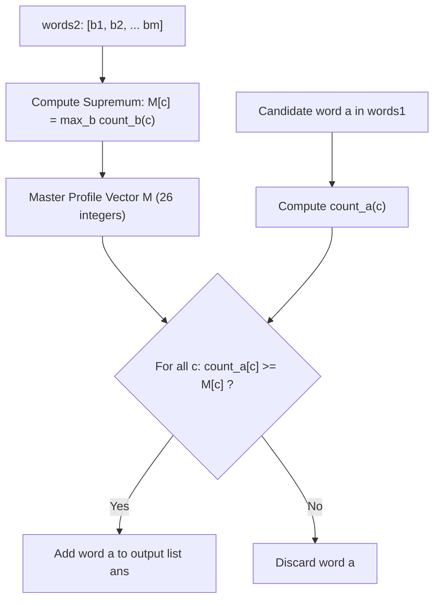

# Guided Example: Word Subsets

We trace the step-by-step compression of multi-query substring requirements into a componentwise maximal frequency profile, prove why multiset bounds use the supremum ($\max$) rather than summation, and demonstrate universal word filtering on representative vocabularies:

- **Representative Instance 1 (Distinct Required Letters):**
  $$
  words1 = [\text{"amazon"}, \; \text{"apple"}, \; \text{"facebook"}, \; \text{"google"}, \; \text{"leetcode"}]
  $$
  $$
  words2 = [\text{"e"}, \; \text{"o"}]
  $$
- **Required Output:**
  $$
  [\text{"facebook"}, \; \text{"google"}, \; \text{"leetcode"}]
  $$
  - Target frequency requirement: every universal word must contain at least one `'e'` and at least one `'o'`.
  - Evaluations:
    - `"amazon"`: `'e': 0 < 1`, `'o': 1` $\implies$ **Fails** (missing `'e'`).
    - `"apple"`: `'e': 1`, `'o': 0 < 1` $\implies$ **Fails** (missing `'o'`).
    - `"facebook"`: `'e': 1 \ge 1`, `'o': 2 \ge 1` $\implies$ **Passes**.
    - `"google"`: `'e': 1 \ge 1`, `'o': 2 \ge 1` $\implies$ **Passes**.
    - `"leetcode"`: `'e': 3 \ge 1`, `'o': 1 \ge 1` $\implies$ **Passes**.

- **Representative Instance 2 (Multiplicity Thresholds):**
  $$
  words2 = [\text{"c"}, \; \text{"cc"}, \; \text{"b"}]
  $$
  - Word `"c"` demands $1$ copy of `'c'`.
  - Word `"cc"` demands $2$ copies of `'c'`.
  - Word `"b"` demands $1$ copy of `'b'`.
  - Componentwise maximum profile:
    $$
    M = \{'c': \max(1, 2) = 2, \; 'b': 1\}
    $$
  - Only candidates with at least two `'c'`s and at least one `'b'` qualify!

---

## 1. Instance & Teaching Goal

A string $b$ is a subset of string $a$ if every letter in $b$ appears in $a$ with frequency at least that in $b$ (e.g. `"wrr"` is a subset of `"warrior"` because `"warrior"` has two `'r'`s and one `'w'`).
A word $a \in words1$ is **universal** if for **every** string $b \in words2$, $b$ is a subset of $a$.

Return all universal words in $words1$.

```text
Naive Approach:
  For each word a in words1:
    For each word b in words2:
      Verify if b is a subset of a.
  Total checks = |words1| * |words2| = 10,000 * 10,000 = 100,000,000 (TLE!)

Componentwise Max Profile:
  Compress ALL of words2 into a single vector M of length 26:
    M[c] = max(count_b(c) for b in words2)
  Then test each word a against M in 26 operations!
  Total checks = |words1| * 26 (Fast!)
```

The decisive pedagogical goal is to establish the **Supremum Reduction Theorem**:
Checking $\forall b \in words2: \text{count}_b(c) \le \text{count}_a(c)$ is mathematically equivalent to:
$$
\max_{b \in words2} (\text{count}_b(c)) \le \text{count}_a(c), \quad \forall c \in \Sigma
$$
We compress all $10{,}000$ requirement words into a single 26-dimensional profile vector $M$.

---

## 2. Conceptual Foundation & The Supremum Reduction Invariant



### Why Maximum, Not Sum?

A frequent point of confusion is whether to take the sum or the maximum:
- Suppose $words2 = [\text{"ab"}, \; \text{"ac"}]$.
- Does a universal word need two `'a'`s?
  **No!** The condition states that $a$ must be a superset of `"ab"` (needs at least one `'a'` and one `'b'`), and *also* a superset of `"ac"` (needs at least one `'a'` and one `'c'`).
- A word with a single `'a'`, one `'b'`, and one `'c'` (like `"abc"`) satisfies both conditions simultaneously!
- Therefore, the requirement for letter $c$ across multiple words is the **maximum** occurrence in any single word, not their sum:
  $$
  M[c] = \max_{b \in words2} \text{count}_b(c)
  $$

---

## 3. Step-by-Step Worked Execution

Given $words1 = [\text{"amazon"}, \text{"apple"}, \text{"facebook"}, \text{"google"}, \text{"leetcode"}]$ and $words2 = [\text{"e"}, \text{"o"}]$:

### Phase 1: Compress $words2$ into Master Profile $M$
- From $b = \text{"e"}$: $\text{count}('e') = 1 \implies M['e'] = \max(0, 1) = 1$.
- From $b = \text{"o"}$: $\text{count}('o') = 1 \implies M['o'] = \max(0, 1) = 1$.
- All other 24 alphabet characters: $M[c] = 0$.
- Master Profile: $M = \{'e': 1, \; 'o': 1\}$.

---

### Phase 2: Filter $words1$ against Profile $M$

| Candidate $a$ | Character Frequencies in $a$ | Check against $M['e'] = 1$ | Check against $M['o'] = 1$ | Universal Status | Appended to `ans`? |
|:---|:---|:---:|:---:|:---:|:---:|
| `"amazon"` | $\{a: 2, m: 1, z: 1, o: 1, n: 1\}$ | $0 < 1$ (Fail) | $1 \ge 1$ (Pass) | Not Universal | No |
| `"apple"` | $\{a: 1, p: 2, l: 1, e: 1\}$ | $1 \ge 1$ (Pass) | $0 < 1$ (Fail) | Not Universal | No |
| `"facebook"` | $\{f: 1, a: 1, c: 1, e: 1, b: 1, o: 2, k: 1\}$ | $1 \ge 1$ (Pass) | $2 \ge 1$ (Pass) | **Universal** | **Yes (`"facebook"`)** |
| `"google"` | $\{g: 2, o: 2, l: 1, e: 1\}$ | $1 \ge 1$ (Pass) | $2 \ge 1$ (Pass) | **Universal** | **Yes (`"google"`)** |
| `"leetcode"` | $\{l: 1, e: 3, t: 1, c: 1, o: 1, d: 1\}$ | $3 \ge 1$ (Pass) | $1 \ge 1$ (Pass) | **Universal** | **Yes (`"leetcode"`)** |

Final result: $[\text{"facebook"}, \; \text{"google"}, \; \text{"leetcode"}]$.

---

## 4. Secondary Trace: Multi-Character Words ($words2 = [\text{"lc"}, \text{"eo"}]$)

- $b_1 = \text{"lc"} \implies \{'l': 1, 'c': 1\}$.
- $b_2 = \text{"eo"} \implies \{'e': 1, 'o': 1\}$.
- Combined Profile: $M = \{'l': 1, 'c': 1, 'e': 1, 'o': 1\}$.

| Candidate | Missing Characters | Status |
|:---|:---|:---:|
| `"amazon"` | Missing 'l', 'c', 'e' | Rejected |
| `"apple"` | Missing 'c', 'o' | Rejected |
| `"facebook"` | Missing 'l' | Rejected |
| `"google"` | Missing 'c' | Rejected |
| `"leetcode"` | None (has 'l':1, 'c':1, 'e':3, 'o':1) | **Accepted!** |

Result: $[\text{"leetcode"}]$.

---

## 5. Algorithmic Correctness

### Soundness & Completeness
1. **Soundness:**
   If a candidate string $a$ satisfies $\text{count}_a(c) \ge M[c]$ for all $c \in \Sigma$, then for any word $b \in words2$, $\text{count}_b(c) \le M[c] \le \text{count}_a(c)$. By definition, $b$ is a subset of $a$ for every $b \in words2$, meaning $a$ is strictly universal.
2. **Completeness:**
   If $a$ is universal, then by definition $\text{count}_a(c) \ge \text{count}_b(c)$ for every $b \in words2$. Taking the maximum over all $b$ yields $\text{count}_a(c) \ge \max_{b} \text{count}_b(c) = M[c]$. Thus, no valid universal word can fail the profile comparison.

---

## 6. Boundary Cases & Traps

| Scenario | Pattern | Handled Behavior | Trapped Risk |
|---|---|---|---|
| Summing Counts | $words2 = [\text{"ab"}, \text{"ac"}]$ | Profile takes $\max(1, 1) = 1$ for 'a', requiring only 1 'a'. | Summing counts to demand 2 'a's. |
| Duplicate Requirement Words | $words2 = [\text{"ee"}, \text{"ee"}]$ | $M['e'] = \max(2, 2) = 2$. | Redundant array expansions. |
| Repeated Letters in Word | $words2 = [\text{"wrr"}]$ | $M['r'] = 2, M['w'] = 1$. | Using boolean sets and losing multiplicity. |
| Empty Universal Set | No word qualifies | Returns empty list `[]`. | Null reference or false positive on empty output. |

---

## 7. Complexity Derivation

- **Time Complexity:** $\mathcal{O}(L_1 + L_2 + |\Sigma| \cdot |words1|)$, where $L_1$ and $L_2$ are the total character counts of $words1$ and $words2$, and $|\Sigma| = 26$.
  - Building profile $M$: scans every character of $words2$ once $\implies \mathcal{O}(L_2)$.
  - Filtering $words1$: counts characters of each word $a$ ($\mathcal{O}(L_1)$ total) and checks $26$ entries against $M$ ($\mathcal{O}(26 \cdot |words1|)$).
  - Total operations: linear with respect to input text length, running in $< 0.05\text{ s}$ for $10{,}000$ words.
- **Auxiliary Space Complexity:** $\mathcal{O}(|\Sigma|) = \mathcal{O}(26) = \mathcal{O}(1)$.
  - The profile vector $M$ and temporary word frequency table require at most $26$ integer counters.
