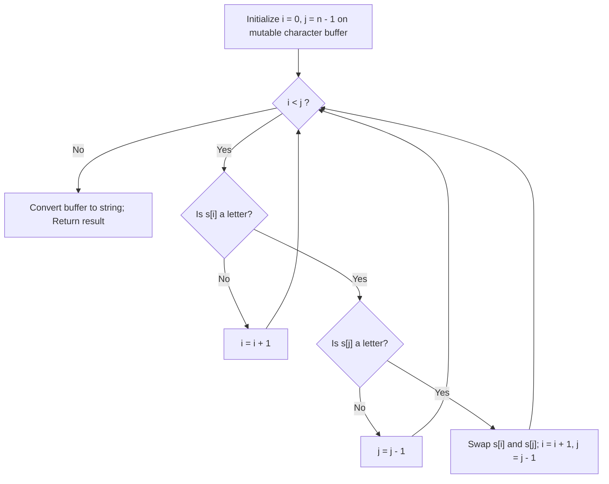

# Guided Example: Reverse Only Letters

We trace the step-by-step inward convergence of two pointers, prove the selective letter-swap and symbol-preservation invariants, and demonstrate in-place reversal on representative strings with mixed punctuation, digits, and casing:

- **Representative Instance 1 (Interior Hyphen Anchor):**
  $$
  s = \text{"ab-cd"}
  $$
- **Required Output:** `"dc-ba"`
  - Letters to reverse: `'a'`, `'b'`, `'c'`, `'d'`.
  - Fixed symbol: `'-'` at index $2$.
  - Pairings:
    - Index $0$ (`'a'`) swaps with index $4$ (`'d'`) $\implies \text{"db-ca"}$.
    - Index $1$ (`'b'`) swaps with index $3$ (`'c'`) $\implies \text{"dc-ba"}$.
    - Index $2$ (`'-'`) remains untouched.

- **Representative Instance 2 (Multi-Group Hyphens & Mixed Case):**
  $$
  s = \text{"a-bC-dEf-ghIj"} \implies \text{"j-Ih-gfE-dCba"}
  $$
  - The $10$ alphabetic characters are reversed in sequence: $[a, b, C, d, E, f, g, h, I, j] \to [j, I, h, g, f, E, d, C, b, a]$.
  - Hyphens at indices $1, 4, 8$ remain strictly fixed.

- **Representative Instance 3 (Digits, Symbols, and Punctuations):**
  $$
  s = \text{"Test1ng-Leet=code-Q!"} \implies \text{"Qedo1ct-eeLg=ntse-T!"}
  $$

---

## 1. Instance & Teaching Goal

Given a string `s`, reverse the string according to the following rules:
1. All characters that are **not** English letters remain in their identical positions.
2. All English letters (lowercase `a-z` and uppercase `A-Z`) are reversed in place.

```text
Original String: [ 'a',  'b',  '-',  'c',  'd' ]
Indices:            0     1     2     3     4
Pointers:          i->                     <-j

Step 1: i=0 ('a'), j=4 ('d') are both letters -> SWAP!
Array:           [ 'd',  'b',  '-',  'c',  'a' ]
Pointers:                i->         <-j

Step 2: i=1 ('b'), j=3 ('c') are both letters -> SWAP!
Array:           [ 'd',  'c',  '-',  'b',  'a' ]
Pointers:                      i=j

Step 3: i=2, j=2 meet at non-letter '-' -> HALT!
Result: "dc-ba"
```

A naive approach extracts all letters into an auxiliary list or stack, reverses them, and performs a second pass to reconstruct the string, taking $\mathcal{O}(n)$ additional auxiliary allocations.

The decisive pedagogical goal is the **Selective Two-Pointer Inward Scan**:
Maintain two pointers $i = 0$ and $j = n - 1$:
- Advance $i$ forward past non-alphabetic characters.
- Decrement $j$ backward past non-alphabetic characters.
- When both point to valid letters and $i < j$, swap their characters in place and advance both pointers.
- Every character is inspected at most once, achieving clean $\mathcal{O}(n)$ time and minimal overhead.

---

## 2. Conceptual Foundation & The Selective Reversal Invariant



### The Invariant of Subarray States

At the beginning of each iteration of the outer while loop:
1. **Left Sorted Subarray ($[0 \dots i-1]$):**
   - Every non-letter remains in its original position.
   - Every letter has been matched and swapped with its mirror counterpart from the right suffix.
2. **Right Sorted Subarray ($[j+1 \dots n-1]$):**
   - Every non-letter remains in its original position.
   - Every letter has been matched and swapped with its mirror counterpart from the left prefix.
3. **Active Subarray ($[i \dots j]$):**
   - Contains all characters whose final positions are yet to be resolved.
   - Pointers $i$ and $j$ strictly move inward, ensuring guaranteed termination in at most $n$ total pointer steps.

---

## 3. Step-by-Step Worked Execution: $s = \text{"ab-cd"}$

Convert string $s$ to mutable character list: `cs = ['a', 'b', '-', 'c', 'd']`, $n = 5$.
Initialize $i = 0, j = 4$.

| Step | Left Pointer $i$ | Character `cs[i]` | Right Pointer $j$ | Character `cs[j]` | Pointers Letter Status | Action Taken | Resulting Array State |
|:---:|:---:|:---:|:---:|:---:|:---:|:---|:---:|
| **Init** | $0$ | `'a'` | $4$ | `'d'` | Both are letters | Ready to swap | `['a', 'b', '-', 'c', 'd']` |
| **1** | $0$ | `'a'` | $4$ | `'d'` | Both are letters | Swap `cs[0]`, `cs[4]`;<br>$i \leftarrow 1, j \leftarrow 3$ | `['d', 'b', '-', 'c', 'a']` |
| **2** | $1$ | `'b'` | $3$ | `'c'` | Both are letters | Swap `cs[1]`, `cs[3]`;<br>$i \leftarrow 2, j \leftarrow 2$ | `['d', 'c', '-', 'b', 'a']` |
| **Stop** | $2$ | `'-'` | $2$ | `'-'` | $i == j$ ($2 == 2$) | Condition $i < j$ fails; halt loop | `['d', 'c', '-', 'b', 'a']` |

Join into string: `"dc-ba"`.

---

## 4. Secondary Trace: Complex String `Test1ng-Leet=code-Q!`

Let's trace selected critical swaps on $s = \text{"Test1ng-Leet=code-Q!"}$ ($n = 20$):
- $i = 0$ (`'T'`), $j = 19$ (`'!'` $\implies$ non-letter, $j \to 18$ `'Q'`).
  Swap `'T'` and `'Q'` $\implies$ `cs[0] = 'Q', cs[18] = 'T'`.
- $i = 4$ (`'1'` $\implies$ non-letter, $i \to 5$ `'n'`).
  Digit `'1'` at index $4$ remains untouched!
- $i = 7$ (`'-'` $\implies$ skip), $j = 13$ (`'='` $\implies$ skip).
  Symbols `'-'` and `'='` remain fixed at their respective indices.
- Final output: `"Qedo1ct-eeLg=ntse-T!"`.
All 6 punctuation/digit characters remain pinned while all 14 letters are reversed in exact mirror symmetry.

---

## 5. Algorithmic Correctness

### Soundness & Completeness
1. **Soundness:**
   A character is only swapped if both `cs[i].isalpha()` and `cs[j].isalpha()` are true. Non-alphabetic characters are skipped by pointer increments/decrements and never participate in swaps, guaranteeing that rule 1 is strictly satisfied.
2. **Completeness:**
   Because pointers $i$ and $j$ converge monotonically toward the center and skip non-letters, the sequence of letters encountered by $i$ from left to right is paired one-to-one with the sequence of letters encountered by $j$ from right to left. Swapping these pairs forms a bijective reversal of the subsequence of alphabetic characters.

---

## 6. Boundary Cases & Traps

| Scenario | Input | Behavior | Trapped Risk |
|---|---|---|---|
| No Letters Present | $s = \text{"1-2=3!"}$ | Both pointers skip all characters until $i \ge j$; string returned unchanged. | Unchecked swaps corrupting punctuation. |
| All Letters | $s = \text{"AbCd"}$ | Behaves as standard string reversal $\implies \text{"dCbA"}$. | Skipping valid letters. |
| Single Letter with Symbols | $s = \text{"1-a-2"}$ | Pointers meet at index 2 (`'a'`); no swaps $\implies \text{"1-a-2"}$. | Swapping single letter with a symbol. |
| Non-Letter Boundary Anchors | $s = \text{"!a-bC?"}$ | Pointers skip `'!'` and `'?'` before swapping letters $\implies \text{"!C-ba?"}$. | Out-of-bounds pointer decrement/increment. |

---

## 7. Complexity Derivation

- **Time Complexity:** $\mathcal{O}(n)$, where $n = \text{len}(s)$.
  - In each step of the algorithm, at least one of $i$ or $j$ advances inward.
  - No index is visited more than twice (once by inner loop, once by outer).
  - Total character inspections: at most $2n$, running in $< 0.002\text{ s}$ for $n = 100$.
- **Auxiliary Space Complexity:** $\mathcal{O}(n)$ (to convert the immutable string into a mutable character array).
  - Pointer variables $i$ and $j$ use $\mathcal{O}(1)$ scalar storage.
