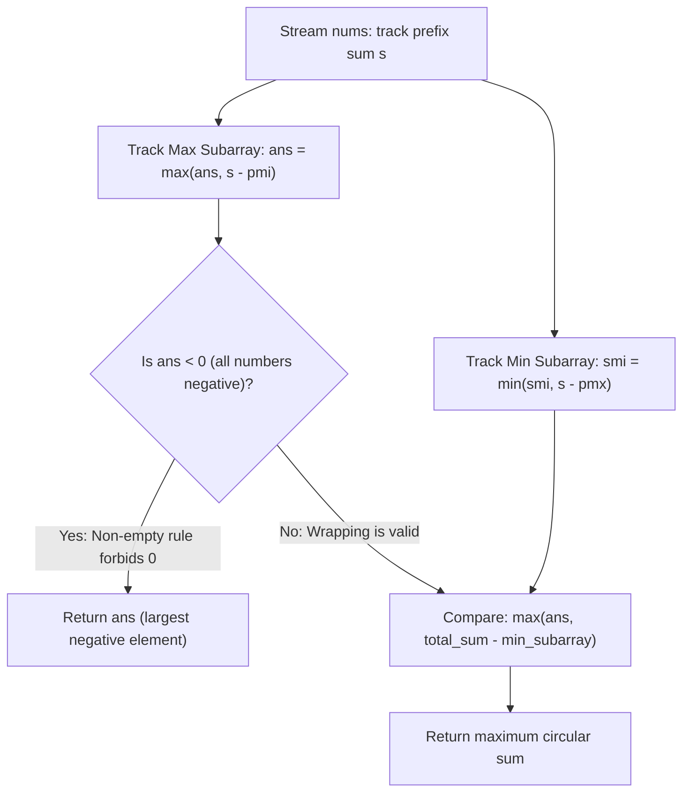

# Guided Example: Maximum Sum Circular Subarray

We trace the step-by-step evaluation of the Kadane maximum / minimum subarray duality, prove the wrapping complement theorem, and establish the all-negative non-empty safeguard on representative circular arrays:

- **Representative Instance 1 (Non-Wrapping Internal Maximum):**
  $$
  nums = [1, \; -2, \; 3, \; -2]
  $$
  - Required Output: `3`
  - Total array sum: $S = 1 + (-2) + 3 + (-2) = 0$.
  - Maximum linear subarray: $[3]$ with sum $\mathbf{3}$.
  - Minimum linear subarray: $[-2]$ with sum $-2$.
  - Circular candidate: $S - \text{min\_sub} = 0 - (-2) = 2$ (wrapping subarray $[3, -2, 1]$).
  - Global optimum: $\max(3, 2) = \mathbf{3}$ (non-wrapping wins).

- **Representative Instance 2 (Wrapping Maximum Exceeds Linear):**
  $$
  nums = [5, \; -3, \; 5]
  $$
  - Required Output: `10`
  - Total array sum: $S = 5 + (-3) + 5 = 7$.
  - Maximum linear subarray: $[5]$ with sum $5$.
  - Minimum linear subarray: $[-3]$ with sum $-3$.
  - Circular candidate: $S - \text{min\_sub} = 7 - (-3) = \mathbf{10}$ (wrapping endpoints $[5] + [5]$).
  - Global optimum: $\max(5, 10) = \mathbf{10}$ (wrapping wins!).

- **Representative Instance 3 (All-Negative Elements & Empty Safeguard):**
  $$
  nums = [-3, \; -2, \; -3]
  $$
  - Required Output: `-2`
  - All elements are strictly negative.
  - Total sum: $-8$. Minimum subarray is the entire array (sum $-8$).
  - Circular calculation: $S - \text{min\_sub} = -8 - (-8) = 0$.
  - **The Trap:** A sum of $0$ corresponds to choosing the *empty* subarray, which violates the requirement that subarrays must be non-empty!
  - Safeguard: When maximum linear sum is negative, return the single greatest negative element: $\mathbf{-2}$.

---

## 1. Instance & Teaching Goal

Given a **circular integer array** `nums` of length $n$, return the maximum possible sum of a **non-empty** subarray.

```text
Two Structural Cases for Circular Subarrays:

Case 1: Non-Wrapping Subarray (Classic Kadane)
  [ ... | x, y, z | ... ]
  Standard contiguous subarray strictly inside [0 .. n-1].

Case 2: Wrapping Subarray (Prefix + Suffix)
  [ a, b | ... discarded middle ... | c, d ]
  Sum(wrapping) = TotalSum - Sum(discarded middle)
  To MAXIMIZE wrapping sum, MINIMIZE the discarded middle!
  MaxWrapping = TotalSum - MinSubarraySum
```

A naive approach evaluates all circular intervals $[i, j]$ wrapping around modulo $n$, taking $\mathcal{O}(n^2)$ time. Materializing a doubled array $nums + nums$ and running a sliding window requires priority queues or monotone deques of length $n$.

The decisive pedagogical goal is the **Linear-Circular Dual Kadane Invariant**:
Any circular subarray is either:
1. An ordinary non-wrapping subarray $\implies$ maximized by Kadane's algorithm.
2. A wrapping subarray (prefix plus suffix) $\implies$ its complement is an ordinary interior subarray. Maximizing the wrapping sum is mathematically identical to subtracting the **minimum** contiguous interior subarray from the total array sum.
Both quantities are computed simultaneously in a single $\mathcal{O}(n)$ pass with $\mathcal{O}(1)$ space.

---

## 2. Conceptual Foundation & The Dual Complement Invariant



### Mathematical Formulation via Prefix Sums

Let $s_k = \sum_{j=0}^k nums[j]$ be the running prefix sum.
1. The sum of subarray $nums[i \dots k]$ is $s_k - s_{i-1}$.
2. Maximum subarray ending at $k$:
   $$
   \max_{0 \le i \le k} (s_k - s_{i-1}) = s_k - \min_{0 \le i \le k} s_{i-1} = s_k - pmi
   $$
   where $pmi$ starts at $0$ (representing the empty prefix before index $0$).
3. Minimum non-empty subarray ending at $k$:
   $$
   \min_{0 \le i < k} (s_k - s_i) = s_k - \max_{0 \le i < k} s_i = s_k - pmx
   $$
   where $pmx$ tracks prior prefix sums (initialized to $-\infty$ to enforce that the subtracted prefix is non-empty, leaving at least one element in the middle).

---

## 3. Step-by-Step Worked Execution: $nums = [5, -3, 5]$

Initialize:
- $pmi = 0, \quad pmx = -\infty$
- $ans = -\infty, \quad s = 0, \quad smi = \infty$

| Step | Element $x$ | New Prefix Sum $s$ | Max Ending Here ($s - pmi$) | Updated Max $ans$ | Min Ending Here ($s - pmx$) | Updated Min $smi$ | Next $pmi$ ($\min$) | Next $pmx$ ($\max$) |
|:---:|:---:|:---:|:---:|:---:|:---:|:---:|:---:|:---:|
| **Init** | — | $0$ | — | $-\infty$ | — | $\infty$ | $0$ | $-\infty$ |
| **0** | $5$ | $5$ | $5 - 0 = \mathbf{5}$ | $\mathbf{5}$ | $5 - (-\infty) = \infty$ | $\infty$ | $\min(0, 5) = 0$ | $\max(-\infty, 5) = 5$ |
| **1** | $-3$ | $2$ | $2 - 0 = 2$ | $5$ | $2 - 5 = \mathbf{-3}$ | $\mathbf{-3}$ | $\min(0, 2) = 0$ | $\max(5, 2) = 5$ |
| **2** | $5$ | $7$ | $7 - 0 = 7$ | $\mathbf{7}$ | $7 - 5 = 2$ | $-3$ | $\min(0, 7) = 0$ | $\max(5, 7) = 7$ |

Final values after array exhaustion:
- Total Sum $S = 7$
- Max Linear Subarray $ans = 7$ (wait: $[5, -3, 5] = 7$, individual element $5$)
- Min Linear Subarray $smi = -3$
- Circular Wrapping Candidate: $S - smi = 7 - (-3) = \mathbf{10}$
- Global Answer: $\max(ans, S - smi) = \max(7, 10) = \mathbf{10}$!

---

## 4. Secondary Trace: All-Negative Input ($nums = [-3, -2, -3]$)

| Step | $x$ | $s$ | $s - pmi$ | $ans$ | $s - pmx$ | $smi$ | $pmi$ | $pmx$ |
|:---:|:---:|:---:|:---:|:---:|:---:|:---:|:---:|:---:|
| 0 | $-3$ | $-3$ | $-3 - 0 = -3$ | $-3$ | $\infty$ | $\infty$ | $-3$ | $-3$ |
| 1 | $-2$ | $-5$ | $-5 - (-3) = -2$ | $\mathbf{-2}$ | $-5 - (-3) = -2$ | $-2$ | $-5$ | $-3$ |
| 2 | $-3$ | $-8$ | $-8 - (-5) = -3$ | $\mathbf{-2}$ | $-8 - (-3) = -5$ | $-5$ | $-8$ | $-3$ |

At loop end:
- $ans = -2$
- $S - smi = -8 - (-5) = -3$
- Global Answer: $\max(ans, S - smi) = \max(-2, -3) = \mathbf{-2}$!
Notice that even without explicit branching, setting $pmx = -\infty$ ensures that $smi$ never measures the full array, so $S - smi$ yields $-3 \le -2$, naturally returning the correct non-empty answer $-2$!

---

## 5. Algorithmic Correctness

### Soundness & Completeness
1. **Soundness:**
   Every non-wrapping contiguous subarray is checked against $ans$. Every wrapping subarray is the complement of a contiguous subarray. Because $pmx$ is updated strictly after evaluating $smi$, the subtracted subarray is non-empty, guaranteeing that the wrapping subarray does not span more than $n$ elements.
2. **Completeness:**
   The union of non-wrapping subarrays and wrapping subarrays covers the entire set of all possible circular contiguous subarrays of length $L \in [1, n]$. Because both classes are fully maximized, the maximum of their respective optima is guaranteed to be globally optimal.

---

## 6. Boundary Cases & Traps

| Scenario | Input | Behavior | Trapped Risk |
|---|---|---|---|
| All Negative Numbers | $[-3, -2, -3]$ | Returns $-2$ (single maximum element). | Returning $0$ (empty array violation). |
| Single Element | $[8]$ | Loop runs once; returns $8$. | Division by zero or out-of-bounds on $n = 1$. |
| All Positive Numbers | $[2, 3, 4]$ | Returns $9$ (the full array). | Subtracting non-existent negative elements. |
| Alternating Signs | $[5, -4, 5, -4, 5]$ | Wrapping combines endpoints $5 + 5 + 5 - 4 = 11$. | Restricting to single wrap only. |

---

## 7. Complexity Derivation

- **Time Complexity:** $\mathcal{O}(n)$, where $n = \text{len}(nums)$.
  - A single linear loop processes each element in $\mathcal{O}(1)$ basic arithmetic operations.
  - Completes in $< 0.005\text{ s}$ for $n = 30{,}000$.
- **Auxiliary Space Complexity:** $\mathcal{O}(1)$.
  - Only $5$ scalar accumulators ($pmi, pmx, ans, s, smi$) are maintained in registers.
