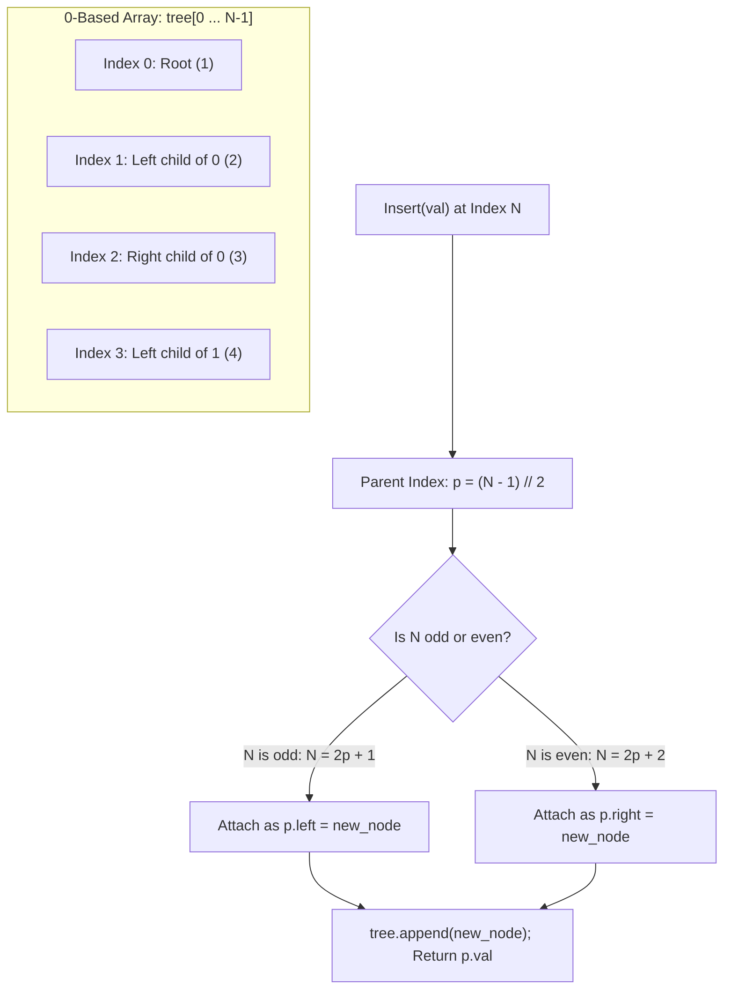

# Guided Example: Complete Binary Tree Inserter

We trace the step-by-step sequential node insertion into a Complete Binary Tree (CBT), prove the heap-style binary index parent-child invariant, and demonstrate $\mathcal{O}(1)$ time structural updates on representative tree instances:

- **Representative Instance:**
  - Initial Tree: `root = [1, 2]`
  - Operations Stream:
    1. `insert(3)`
    2. `insert(4)`
    3. `get_root()`
- **Required Output:** `[1, 2, [1, 2, 3, 4]]`
  - `insert(3)`: attaches as right child of node $1$. Returns parent value: **$1$**.
  - `insert(4)`: attaches as left child of node $2$. Returns parent value: **$2$**.
  - `get_root()`: returns reference to the root node (level-order: $[1, 2, 3, 4]$).

```text
Initial State:              After insert(3):             After insert(4):
      1                           1                            1
     /                           / \                          / \
    2                           2   3                        2   3
                                                            /
                                                           4
Array: [1, 2]               Array: [1, 2, 3]             Array: [1, 2, 3, 4]
Indices: 0  1               Indices: 0  1  2             Indices: 0  1  2  3
```

---

## 1. Instance & Teaching Goal

A **Complete Binary Tree** is a binary tree where every level, except possibly the last, is completely filled, and all nodes in the last level are as far left as possible.
You must design a data structure `CBTInserter` supporting:
1. `CBTInserter(TreeNode root)`: Initializes the data structure with the root of the CBT.
2. `insert(int v)`: Inserts a new `TreeNode` into the tree with value `v` so that the tree remains complete, and **returns the value of the parent** of the inserted node.
3. `get_root()`: Returns the root node of the tree.

A naive approach performs a BFS search from the root on every `insert(v)` call to locate the first node with a missing left or right child. This requires $\mathcal{O}(N)$ time per insertion. Over $Q$ insertions, this degrades to $\mathcal{O}(Q \cdot N)$ runtime.

The decisive pedagogical goal is the **Array-Backed Complete Binary Tree Invariant (Binary Heap Representation)**:
Because complete binary trees have a strict canonical topology, their nodes map bijectively to contiguous indices in an array:
- The next insertion position in an array of size $N$ is index $N$.
- Its parent is located at index $\lfloor (N - 1) / 2 \rfloor$.
- Whether it is a left or right child depends solely on the parity of $N$.
This achieves strictly $\mathcal{O}(1)$ insertion time and $\mathcal{O}(1)$ root retrieval.

---

## 2. Conceptual Foundation & The Heap-Index Parent Invariant



### The 0-Based Complete Binary Tree Bijection

For any complete binary tree stored in a 0-based array `tree`:
1. **Left Child Index:** For node at index $k$, its left child is at:
   $$
   \text{left}(k) = 2k + 1
   $$
2. **Right Child Index:** For node at index $k$, its right child is at:
   $$
   \text{right}(k) = 2k + 2
   $$
3. **Parent Index:** For any node at index $m > 0$, its unique parent is at index:
   $$
   \text{parent}(m) = \left\lfloor \frac{m - 1}{2} \right\rfloor
   $$
4. **Child Orientation:**
   - If $m \equiv 1 \pmod 2$, $m = 2p + 1 \implies$ node $m$ is the **left child** of $p$.
   - If $m \equiv 0 \pmod 2$, $m = 2p + 2 \implies$ node $m$ is the **right child** of $p$.

---

## 3. Step-by-Step Worked Execution

### Phase 1: Initialization (`__init__`)
Input: `root = [1, 2]`.
Run a standard BFS queue to collect existing nodes in level-order into array `tree`:
- Dequeue node $1$: `tree.append(node_1)`, enqueue left child $2$.
- Dequeue node $2$: `tree.append(node_2)`, children are null.
- Initial state:
  $$
  tree = [\text{node}(1), \; \text{node}(2)], \quad N = 2
  $$

---

### Phase 2: `insert(3)`
- Target insertion index: $N = 2$.
- Compute parent index:
  $$
  p = \lfloor (2 - 1) / 2 \rfloor = \lfloor 1 / 2 \rfloor = \mathbf{0}
  $$
- Look up parent node: $tree[0]$ (node with value $1$).
- Determine orientation:
  $$
  N = 2 \equiv 0 \pmod 2 \implies \text{Right Child!}
  $$
- Create `new_node = TreeNode(3)`.
- Link parent pointer:
  $$
  tree[0].\text{right} = \text{new\_node}
  $$
- Append to array: $tree = [1, 2, 3]$, new size $N = 3$.
- Return parent value: $tree[0].val = \mathbf{1}$.

---

### Phase 3: `insert(4)`
- Target insertion index: $N = 3$.
- Compute parent index:
  $$
  p = \lfloor (3 - 1) / 2 \rfloor = \lfloor 2 / 2 \rfloor = \mathbf{1}
  $$
- Look up parent node: $tree[1]$ (node with value $2$).
- Determine orientation:
  $$
  N = 3 \equiv 1 \pmod 2 \implies \text{Left Child!}
  $$
- Create `new_node = TreeNode(4)`.
- Link parent pointer:
  $$
  tree[1].\text{left} = \text{new\_node}
  $$
- Append to array: $tree = [1, 2, 3, 4]$, new size $N = 4$.
- Return parent value: $tree[1].val = \mathbf{2}$.

---

### Phase 4: `get_root()`
- Return `tree[0]` $\implies$ reference to root node with value $1$.
- Total output produced: $[1, 2, [1, 2, 3, 4]]$.

---

## 4. Operation Summary Table

| Step | Operation | Array Size $N$ | Parent Index $p = \lfloor(N-1)/2\rfloor$ | Parent Value | Parity of $N$ | Attached Side | Updated Array |
|:---:|:---:|:---:|:---:|:---:|:---:|:---:|:---|
| **Init** | `__init__([1, 2])` | $2$ | — | — | — | — | `[1, 2]` |
| **1** | `insert(3)` | $2$ | $0$ | **$1$** | Even ($2$) | Right (`1.right = 3`) | `[1, 2, 3]` |
| **2** | `insert(4)` | $3$ | $1$ | **$2$** | Odd ($3$) | Left (`2.left = 4`) | `[1, 2, 3, 4]` |
| **3** | `insert(5)` | $4$ | $1$ | **$2$** | Even ($4$) | Right (`2.right = 5`) | `[1, 2, 3, 4, 5]` |
| **4** | `insert(6)` | $5$ | $2$ | **$3$** | Odd ($5$) | Left (`3.left = 6`) | `[1, 2, 3, 4, 5, 6]` |

---

## 5. Algorithmic Correctness

### Soundness & Completeness
1. **Soundness:**
   A complete binary tree fills levels from left to right without skipping positions. The arithmetic index $p = \lfloor (N - 1) / 2 \rfloor$ precisely identifies the unique node that is missing the next sequential slot. Setting $p.left$ when empty or $p.right$ when $p.left$ is populated directly maintains the definition of a complete binary tree.
2. **Completeness:**
   Every newly inserted node is appended to the `tree` list and physically connected to its parent node. The array remains an exact level-order representation of the tree after every operation. `get_root()` returns the invariant element at index $0$.

---

## 6. Boundary Cases & Traps

| Scenario | Input | Behavior | Trapped Risk |
|---|---|---|---|
| Single Root Node | `root = [1]`, `insert(2)` | $N = 1 \implies p = 0$. Attaches as $1.left = 2$. | Index out-of-bounds on $(1 - 1) / 2$. |
| Level Transition | Filling rightmost node of level | Next insert automatically moves to left child of first node of next level. | Failing to start a new level cleanly. |
| Mixed Operations | Interleaved `get_root` and `insert` | `get_root()` operates without mutating array state. | Re-running BFS on each query. |
| Duplicate Values | Tree with multiple nodes of value $0$ | Identity is governed by node pointers and array positions, not values. | Hash map collisions on duplicate keys. |

---

## 7. Complexity Derivation

- **Time Complexity:**
  - `__init__`: $\mathcal{O}(N)$ where $N$ is the number of nodes in the initial tree (one BFS pass).
  - `insert`: $\mathcal{O}(1)$ strictly. Evaluating $\lfloor (N - 1) / 2 \rfloor$, array lookup, pointer assignment, and append are all constant-time operations.
  - `get_root`: $\mathcal{O}(1)$ strictly (returns `tree[0]`).
- **Auxiliary Space Complexity:** $\mathcal{O}(N + M)$ where $N$ is the initial node count and $M$ is the number of inserted nodes.
  - Storing references in the sequential array `tree` requires exactly one pointer per node.
