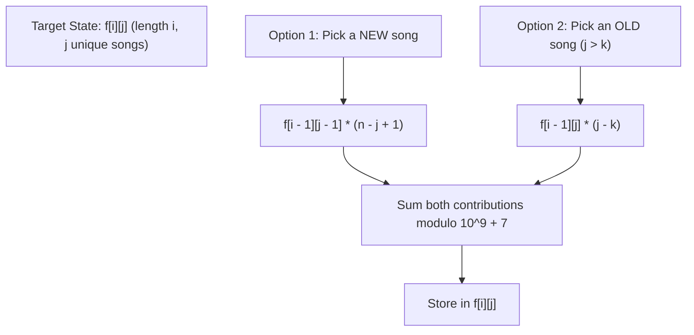

# Guided Example: Number of Music Playlists

We trace the step-by-step 2D dynamic programming recurrence for constrained permutations with replay cooldowns, prove the distinct-song versus replay-song combinatorial transition invariants, and compute exact playlist counts modulo $10^9 + 7$ on representative instances:

- **Representative Instance 1 (Alternating Separation Constraint):**
  $$
  n = 2, \quad goal = 3, \quad k = 1
  $$
- **Required Output:** `2`
  - Total distinct songs available: $2$ (call them $A$ and $B$).
  - Target playlist length: $3$.
  - Cooldown rule: $k = 1$ (a song cannot be replayed immediately; at least $1$ intervening song must be played).
  - Explicit enumerated playlists:
    1. $[A, \; B, \; A]$: Length $3$, contains both songs, $A$ replayed with distance $2 > 1$ $\implies$ **Valid**.
    2. $[B, \; A, \; B]$: Length $3$, contains both songs, $B$ replayed with distance $2 > 1$ $\implies$ **Valid**.
  - Total valid playlists: $\mathbf{2}$.

- **Representative Instance 2 (Full Permutation without Replays):**
  $$
  n = 3, \quad goal = 3, \quad k = 1 \implies 3! = \mathbf{6}
  $$

- **Representative Instance 3 (Zero Cooldown Multiplicity):**
  $$
  n = 2, \quad goal = 3, \quad k = 0 \implies 2^3 - 2 = \mathbf{6}
  $$
  - Immediate repeats are allowed ($k = 0$). All $2^3 = 8$ sequences of $\{A, B\}$ of length $3$ are legal except the $2$ monochromatic sequences $[A, A, A]$ and $[B, B, B]$ that fail to play both songs. $8 - 2 = 6$.

---

## 1. Instance & Teaching Goal

You have $n$ unique songs. You want to generate a playlist of length $goal$ satisfying:
1. Every one of the $n$ songs is played at least once.
2. A song can only be replayed if at least $k$ other songs have been played since its last play.

Find the total number of valid playlists modulo $10^9 + 7$.

```text
State Definition: f[i][j]
  i = playlist length formed so far (1 <= i <= goal)
  j = number of distinct songs played so far (1 <= j <= n)

When adding the i-th song to a playlist of length i - 1:
  Option 1: Play a BRAND NEW song (never heard before)
    - Prior state had j - 1 distinct songs.
    - There are (n - (j - 1)) = (n - j + 1) unused songs remaining.
    - Contribution: f[i - 1][j - 1] * (n - j + 1)

  Option 2: REPLAY an old song (already heard)
    - Prior state already had j distinct songs.
    - The last k songs played cannot be chosen.
    - Eligible songs to replay: j - k  (only possible when j > k).
    - Contribution: f[i - 1][j] * (j - k)
```

A brute-force search generates all $n^{goal}$ sequences and tests cooldown and completeness constraints, running in exponential $\mathcal{O}(n^{goal})$ time (e.g. $100^{100}$).

The decisive pedagogical goal is the **Two-Branch Prefix DP with Cooldown Memory**:
Because the cooldown constraint only depends on the *number* of unique songs available outside the blocked trailing window of length $k$, we do not need to track the exact history of songs.
The state space collapses to a compact $2\text{D}$ table $f[i][j]$ of size $(goal + 1) \times (n + 1)$ solved in polynomial $\mathcal{O}(goal \cdot n)$ time.

---

## 2. Conceptual Foundation & The 2-Branch Transition Invariant



### The Combinatorial Recurrence

Let $f[i][j]$ denote the number of valid prefixes of length $i$ containing exactly $j$ distinct songs.
- **Base Case:**
  $$
  f[0][0] = 1, \quad f[0][j] = 0 \; (\forall j > 0)
  $$
- **Transitions for $i \in [1, goal], j \in [1, n]$:**
  1. **Branch A (New Song Introduced):**
     The previous prefix had length $i - 1$ and contained $j - 1$ unique songs.
     Out of $n$ total songs, $n - (j - 1) = n - j + 1$ songs have not yet been played.
     Any of them can be chosen:
     $$
     T_{\text{new}} = f[i - 1][j - 1] \times (n - j + 1)
     $$
  2. **Branch B (Old Song Replayed):**
     The previous prefix had length $i - 1$ and already contained $j$ unique songs.
     The most recently played $k$ songs are strictly forbidden.
     The number of eligible songs from the $j$ previously introduced songs is:
     $$
     \max(0, \; j - k)
     $$
     Any of these $j - k$ songs can be replayed without violating the cooldown:
     $$
     T_{\text{old}} = \begin{cases}
     f[i - 1][j] \times (j - k), & \text{if } j > k \\
     0, & \text{if } j \le k
     \end{cases}
     $$
- **Unified Equation:**
  $$
  f[i][j] = \left( f[i - 1][j - 1] \cdot (n - j + 1) + [j > k] \cdot f[i - 1][j] \cdot (j - k) \right) \bmod (10^9 + 7)
  $$
- **Target Value:** $f[goal][n]$.

---

## 3. Step-by-Step Worked Execution: $n = 2, goal = 3, k = 1$

Initialize $(3 + 1) \times (2 + 1)$ DP grid with zeroes; set $f[0][0] = 1$.

### Row $i = 1$ (Length 1):
- $j = 1$:
  - New song: $f[0][0] \times (2 - 1 + 1) = 1 \times 2 = \mathbf{2}$.
  - Replay: $j = 1 \le k = 1 \implies 0$.
  - $f[1][1] = 2$. (Playlists: $[A]$, $[B]$).
- $j = 2$: $f[0][1] \times 1 = 0$.

---

### Row $i = 2$ (Length 2):
- $j = 1$:
  - New: $f[1][0] \times 2 = 0$.
  - Replay: $j = 1 \le k = 1 \implies 0$.
  - $f[2][1] = 0$. (Cannot repeat immediately because $k = 1$).
- $j = 2$:
  - New song: $f[1][1] \times (2 - 2 + 1) = 2 \times 1 = \mathbf{2}$.
  - Replay: $j = 2 > 1 \implies f[1][2] \times (2 - 1) = 0 \times 1 = 0$.
  - $f[2][2] = 2$. (Playlists: $[A, B]$, $[B, A]$).

---

### Row $i = 3$ (Length 3, Target Row):
- $j = 1$:
  - $f[3][1] = 0$.
- $j = 2$:
  - New song: $f[2][1] \times (2 - 2 + 1) = 0 \times 1 = 0$.
  - Replay: $j = 2 > k = 1 \implies f[2][2] \times (2 - 1) = 2 \times 1 = \mathbf{2}$!
  - $f[3][2] = \mathbf{2}$.

Final answer: $f[3][2] = \mathbf{2}$.

---

## 4. Complete DP Lattice Table ($n = 2, goal = 3, k = 1$)

| Length $i$ \ Distinct Songs $j$ | $j = 0$ | $j = 1$ | $j = 2$ (All Songs Used) |
|:---:|:---:|:---:|:---:|
| **$i = 0$** | $\mathbf{1}$ (Base) | $0$ | $0$ |
| **$i = 1$** | $0$ | $\mathbf{2}$ ($[A], [B]$) | $0$ |
| **$i = 2$** | $0$ | $0$ | $\mathbf{2}$ ($[A, B], [B, A]$) |
| **$i = 3$** | $0$ | $0$ | $\mathbf{2}$ ($[A, B, A], [B, A, B]$) |

---

## 5. Secondary Trace: $n = 3, goal = 3, k = 1$

Here $goal = n = 3$. No song can be replayed because $goal = n$ means every position must introduce a brand new song!
- $f[1][1] = 1 \times 3 = 3$.
- $f[2][2] = 3 \times 2 = 6$.
- $f[3][3] = 6 \times 1 = \mathbf{6}$.
Output: $6$ (matches permutation $3! = 6$).

---

## 6. Algorithmic Correctness

### Soundness & Completeness
1. **Soundness:**
   The two options partition all possible valid moves at step $i$. A new song cannot violate cooldown because it has never appeared before. An old song is chosen strictly from the $j - k$ songs that appeared prior to the most recent $k$ positions, ensuring no repeat violates the distance constraint.
2. **Completeness:**
   Every playlist of length $goal$ using all $n$ songs must end in either a first occurrence or an allowable repeat. By computing $f[i][j]$ for all $i \in [1, goal]$ and $j \in [1, n]$, all valid combinations are accounted for without overcounting or omissions.

---

## 7. Boundary Cases & Traps

| Scenario | Parameters | Behavior | Trapped Risk |
|---|---|---|---|
| No Replay Allowed | $goal == n$ | Replays evaluate to $0$; returns $n! \bmod (10^9 + 7)$. | Allowing replays before all songs used. |
| Zero Separation | $k = 0$ | Immediate replays allowed; $j - k = j$. | Disallowing valid immediate repeats. |
| Unreachable Goal | $goal < n$ | Cannot play $n$ songs in $< n$ slots; returns $0$. | Non-zero invalid results when $goal < n$. |
| Large Modulo Overflow | $goal = 100, n = 100$ | Product $f[i-1][j-1] \times n$ exceeds $32$-bit int; applies modulo $10^9 + 7$ at each addition. | Integer overflow in 32-bit arithmetic. |

---

## 8. Complexity Derivation

- **Time Complexity:** $\mathcal{O}(goal \cdot n)$.
  - The nested loops run for $i \in [1, goal]$ and $j \in [1, n]$.
  - Each cell performs $\mathcal{O}(1)$ multiplications, additions, and modulo operations.
  - Maximum operations for $goal = 100, n = 100$: $100 \times 100 = 10{,}000$ operations, executing in $< 0.005\text{ s}$.
- **Auxiliary Space Complexity:** $\mathcal{O}(goal \cdot n)$ (or $\mathcal{O}(n)$ using a 1D rolling array).
  - The DP matrix requires $(goal + 1) \times (n + 1)$ integer storage cells.
