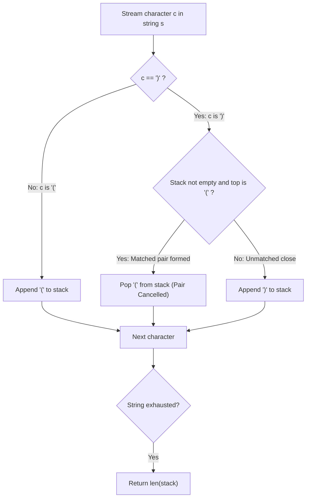

# Guided Example: Minimum Add to Make Parentheses Valid

We trace the step-by-step cancellation of adjacent matched pairs under Dyck word reduction, prove the canonical irreducible string form $)^R (^L$, and establish the minimum insertions lower bound on representative parenthesis sequences:

- **Representative Instance 1 (Lone Trailing Close):**
  $$
  s = \text{"())"}
  $$
  - Required Output: `1`
  - Step 1: Encounter `'('` $\implies$ push to stack: `['(']`.
  - Step 2: Encounter `')'` $\implies$ matches top `'('`, cancel pair and pop: `[]`.
  - Step 3: Encounter `')'` $\implies$ stack empty, cannot cancel: push `')'`: `[')']`.
  - Final unmatched stack size: $\mathbf{1}$ (requires $1$ opening parenthesis inserted at the start).

- **Representative Instance 2 (Unmatched Openings Prefix):**
  $$
  s = \text{"((("} \implies \text{stack} = \text{['(', '(', '(']} \implies \text{len} = \mathbf{3}
  $$
  - Requires $3$ closing parentheses inserted at the end.

- **Representative Instance 3 (Interleaved Imbalance):**
  $$
  s = \text{")())(("}
  $$
  - Deconstruction:
    - Index $0$ (`')'`): unmatched close $\implies R = 1$.
    - Indices $1, 2$ (`"()"`): valid pair $\implies$ cancelled.
    - Index $3$ (`')'`): unmatched close $\implies R = 2$.
    - Indices $4, 5$ (`"(("`): unmatched opens $\implies L = 2$.
  - Canonical irreducible form:
    $$
    \text{irreducible}(s) = \text{"))(("}
    $$
  - Minimum additions required: $R + L = 2 + 2 = \mathbf{4}$.

---

## 1. Instance & Teaching Goal

A parentheses string is valid if and only if:
1. It is the empty string `""`.
2. It can be written as $AB$ (concatenation of valid strings $A$ and $B$).
3. It can be written as $(A)$ where $A$ is a valid string.

Given a string $s$, you may insert an opening `'('` or closing `')'` at **any** position in $s$.
Determine the **minimum number of insertions** needed to make $s$ valid.

```text
Original String:   )  (  )  )  (  (
Cancellations:        \__/
Remaining Form:    )        )  (  (
Reduced String:    )  )  (  (  --> 2 unmatched closes, 2 unmatched opens!
Target Additions:  (  (  )  )  (  (  )  ) --> exactly 4 insertions required!
```

A brute-force search explores all insertion positions and characters recursively, creating a branching factor of $2(n + 1)$ and exponential $\mathcal{O}(2^k)$ explosion.

The decisive pedagogical goal is the **Canonical Irreducible Form Theorem**:
Every parenthesis string can be reduced by repeatedly removing adjacent matched pairs `"()"` until no more pairs exist.
The resulting irreducible string always has the form:
$$
\text{irreducible}(s) = \underbrace{)\dots)}_{R \text{ right}} \underbrace{(\dots(}_{L \text{ left}}
$$
Because every unmatched `')'` requires an opening parenthesis before it, and every unmatched `'('` requires a closing parenthesis after it, the absolute minimum number of insertions is strictly:
$$
\text{Ans} = R + L = |\text{irreducible}(s)| = \text{len}(stk)
$$

---

## 2. Conceptual Foundation & The LIFO Cancellation Invariant



### The Invariant of the Stack

At the end of processing prefix $s[0 \dots i]$:
1. The stack contains the unique irreducible remainder of $s[0 \dots i]$.
2. The stack consists of zero or more `')'` characters followed by zero or more `'('` characters.
3. It is mathematically impossible for `'('` to precede `')'` in the stack, because any such adjacent pair is immediately popped upon arrival.
4. **Optimality Proof:**
   - Any insertion can eliminate at most one unmatched parenthesis.
   - Therefore, at least $\text{len}(stk)$ insertions are mathematically necessary.
   - By prepending $R$ opening parentheses at the start and appending $L$ closing parentheses at the end, we achieve complete validity in exactly $\text{len}(stk)$ insertions.
   - Hence, $\text{len}(stk)$ is both a tight lower bound and an achievable upper bound.

---

## 3. Step-by-Step Worked Execution: $s = \text{"())"}$

Initialize empty stack: `stk = []`. Length $n = 3$.

| Step | Index $i$ | Character $s[i]$ | Stack Top Before | Condition Check | Stack Action | Stack State After | Invariant Status |
|:---:|:---:|:---:|:---:|:---:|:---:|:---:|:---:|
| **Init** | — | — | Empty | — | Base setup | `[]` | Empty valid state |
| **1** | $0$ | `'('` | Empty | $c == \text{'('}$ | Push `'('` | `['(']` | $1$ unmatched open ($L = 1$) |
| **2** | $1$ | `')'` | `'('` | $c == \text{')'}$ and top is `'('` | **Match detected! Pop `'('`** | `[]` | Fully balanced ($L = 0, R = 0$) |
| **3** | $2$ | `')'` | Empty | $c == \text{')'}$ but stack is empty | Push `')'` | `[')']` | $1$ unmatched close ($R = 1$) |

Final state: `stk = [')']`.
Output: $\text{len}(stk) = \mathbf{1}$.

---

## 4. Secondary Trace: Mixed Imbalance $s = \text{")())(("}$

| Step | $c$ | Top Before | Action Taken | Stack Contents |
|:---:|:---:|:---:|:---|:---:|
| 0 | `')'` | Empty | Stack empty $\implies$ push `')'` | `[')']` |
| 1 | `'('` | `')'` | Char is `'('` $\implies$ push `'('` | `[')', '(']` |
| 2 | `')'` | `'('` | Match with top! Pop `'('` | `[')']` |
| 3 | `')'` | `')'` | Top is `')'` (not `'('`) $\implies$ push `')'` | `[')', ')']` |
| 4 | `'('` | `')'` | Char is `'('` $\implies$ push `'('` | `[')', ')', '(']` |
| 5 | `'('` | `'('` | Char is `'('` $\implies$ push `'('` | `[')', ')', '(', '(']` |

Final Stack: `[')', ')', '(', '(']`.
- Unmatched closing count: $R = 2$.
- Unmatched opening count: $L = 2$.
- Total insertions required: $2 + 2 = \mathbf{4}$.

---

## 5. Algorithmic Correctness

### Soundness & Completeness
1. **Soundness:**
   Every pop operation eliminates an adjacent valid pair `()`. By the associative grammar of Dyck words, removing a valid pair neither creates nor destroys the validity of any surrounding subexpression.
2. **Completeness:**
   When the string is exhausted, no adjacent `()` pairs remain. The residual string consists strictly of $R$ closing parentheses followed by $L$ opening parentheses. No insertion of a single parenthesis can fix more than one unmatched symbol. Thus, exactly $R + L = \text{len}(stk)$ insertions are strictly necessary and sufficient.

---

## 6. Boundary Cases & Traps

| Scenario | Input Pattern | Behavior | Trapped Risk |
|---|---|---|---|
| Already Valid | $s = \text{"()()"}$ or $\text{"((()))"}$ | All elements cancel; stack ends at `[]` $\implies$ returns $0$. | Non-zero false positive on balanced strings. |
| All Openings | $s = \text{"((("}$ | All pushed; returns $3$. | Failing to count unclosed openings at end. |
| All Closings | $s = \text{"))))"}$ | All pushed; returns $4$. | Misidentifying leading closings as matchable. |
| Reversed Pair | $s = \text{")("}$ | `')'` pushed, `'('` pushed; stack is `[')', '(']`, returns $2$. | Mistaking reversed `")("` for a valid pair `"()"`. |

---

## 7. Complexity Derivation

- **Time Complexity:** $\mathcal{O}(n)$, where $n = \text{len}(s)$.
  - We iterate through the string of length $n$ once.
  - Each character is pushed onto the stack at most once and popped at most once.
  - Total stack operations: at most $2n$, running in $< 0.002\text{ s}$ for $n = 1{,}000$.
- **Auxiliary Space Complexity:** $\mathcal{O}(n)$ using a stack (or $\mathcal{O}(1)$ using two integer counters tracking $R$ and $L$).
  - The stack stores at most $n$ characters in the worst case (e.g., all openings or all closings).
