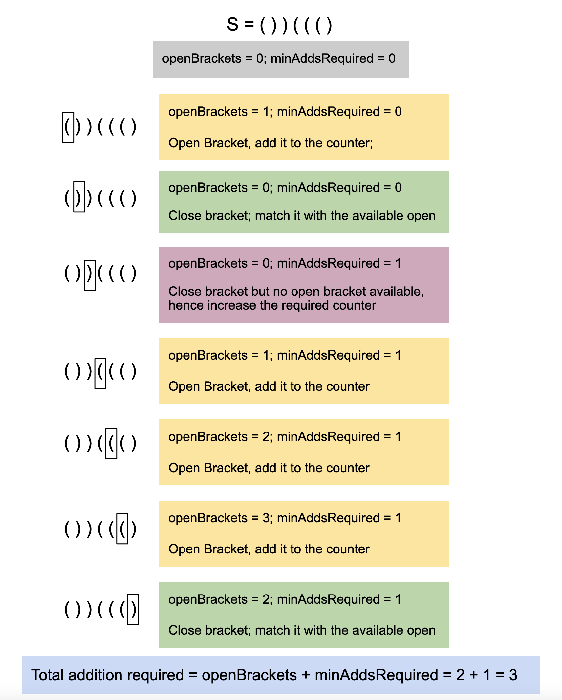

## Solution

---

### Approach: Open Bracket Counter

#### Intuition

We are given a string `s` that consists only of open (`(`) and close (`)`) parentheses. This string may not be valid, meaning that an open parenthesis might not have a corresponding close parenthesis, or vice versa. Our goal is to determine the minimum number of operations required to make the string valid. In each operation, we can add either an open or close parenthesis at any position in the string.

The key observation is to match as many parentheses as possible to minimize the number of additional parentheses needed. We will iterate over the string from left to right and track the parentheses as we encounter them. Open parentheses should appear before their corresponding close parentheses. We will keep a count of open parentheses, and when we encounter a close parenthesis, we check if there is an unmatched open parenthesis available. If there is, we match them by reducing the open parenthesis count.

If we encounter a close parenthesis but no open parenthesis is available to match it, this means that we need to add an open parenthesis to balance the string, so we increment the `minAddsRequired` counter. After iterating through the entire string, there may still be unmatched open parentheses left. In this case, we need to add a close parenthesis for each remaining unmatched open parenthesis. Therefore, the total number of operations required to make the string valid is the sum of `minAddsRequired` and the remaining unmatched open parentheses.

In problems involving parentheses matching, a stack is often useful for storing open parentheses, and when encountering a close parenthesis, we can check if a matching open parenthesis exists at the top of the stack. Although we could use a stack in this problem to find the remaining open parentheses by checking its size, a simpler approach is possible here. Since there is only one type of parenthesis, we can efficiently handle the matching process with a counter.

While the stack-based approach is more generic and preferred for cases involving multiple types of parentheses, it is not necessary here. We can use a counter variable, `openBrackets`, to track the number of unmatched open parentheses. We increment it for every open parenthesis and decrement it when encountering a close parenthesis. By the end, this counter will reflect the number of unmatched open parentheses.



#### Algorithm

1. Create two variables: `openBrackets` (to track unmatched open brackets) and `minAddsRequired` both initialized to `0`.
2. Loop through each character in the string `s`:
- If the current character is an open bracket `(`, increment the `openBrackets` counter, as it is unmatched for now.
- If the current character is a close bracket `)`:
- Check if there are any unmatched open brackets (`openBrackets` > 0).
- If an unmatched open bracket exists, decrement `openBrackets` to indicate that a matching pair has been formed.
- If no unmatched open brackets are available, increment `minAddsRequired` as we need to add an open bracket to make this close bracket valid.
3. The total number of additions required will be the sum of `minAddsRequired` and any remaining unmatched open brackets (`openBrackets`). Return this value as the result.

#### Implementation

```python
class Solution:
    def minAddToMakeValid(self, s: str) -> int:
        open_brackets = 0
        min_adds_required = 0

        for c in s:
            if c == "(":
                open_brackets += 1
            else:
                if open_brackets > 0:
                    open_brackets -= 1
                else:
                    min_adds_required += 1

        # Add the remaining open brackets as closing brackets would be required.
        return min_adds_required + open_brackets
```

#### Complexity Analysis
Here, $N$ is the number of characters in the string `s`.

- Time complexity: $O(N)$

  We iterate over each character in the string `s` once. For each character, we either increment, decrement, or compare a counter. These operations take constant time. Therefore, the overall time complexity is linear, $O(N)$.

- Space complexity: $O(1)$

  We use only two variables, `openBrackets` and `minAddsRequired`, to count unmatched brackets. These variables require constant space, and we do not use any extra data structures that depend on the input size. Thus, the space complexity is constant.

---