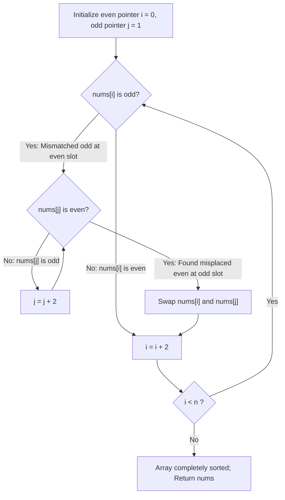

# Guided Example: Sort Array By Parity II

We trace the step-by-step in-place dual-pointer parity realignment, prove the conservation of parity mismatch cardinality, and demonstrate $\mathcal{O}(n)$ time and $\mathcal{O}(1)$ space array sorting on representative integer sequences:

- **Representative Instance 1 (Partial Parity Mismatch):**
  $$
  nums = [4, \; 2, \; 5, \; 7]
  $$
  - Required Output: `[4, 5, 2, 7]` (or any valid parity-matched permutation).
  - Parity Audit:
    - Index $0$ (even): $nums[0] = 4$ is even $\implies$ **Matched**.
    - Index $1$ (odd): $nums[1] = 2$ is even $\implies$ **Misplaced!**
    - Index $2$ (even): $nums[2] = 5$ is odd $\implies$ **Misplaced!**
    - Index $3$ (odd): $nums[3] = 7$ is odd $\implies$ **Matched**.
  - Swap misplaced pair: swap $nums[2]$ (odd at even slot) with $nums[1]$ (even at odd slot):
    $$
    nums = [4, \; 5, \; 2, \; 7]
    $$
  - Both parity violations are cured simultaneously in a single swap!

- **Representative Instance 2 (All Positions Misplaced):**
  $$
  nums = [1, \; 2, \; 3, \; 4] \implies [2, \; 1, \; 4, \; 3]
  $$
  - Index $0$ swaps with $1$; Index $2$ swaps with $3$.

---

## 1. Instance & Teaching Goal

Given an array of integers `nums` of length $n$, exactly half of the integers are **even** and half are **odd**.
Sort the array so that whenever `nums[i]` is even, `i` is even; and whenever `nums[i]` is odd, `i` is odd.
Return any valid configuration.
Achieve the modification **in-place** with $\mathcal{O}(1)$ auxiliary memory.

```text
Array:        [  4,    2,    5,    7  ]
Indices:         0     1     2     3
Target:        even   odd   even  odd

Pointer i (steps across evens: 0, 2, ...):
  i = 0: nums[0] = 4 (even) -> MATCH!
  i = 2: nums[2] = 5 (odd)  -> MISMATCH! Needs an even number!

Pointer j (steps across odds: 1, 3, ...):
  j = 1: nums[1] = 2 (even) -> FOUND EVEN AT ODD INDEX!

SWAP nums[i] and nums[j]:
  nums[2] <-> nums[1]
  Array becomes: [4, 5, 2, 7] (Both indices now correct!)
```

A naive approach allocates two auxiliary lists `evens` and `odds`, taking $\mathcal{O}(n)$ additional heap space.

The decisive pedagogical goal is the **Dual-Stride In-Place Pointer Invariant**:
- Scan even indices with pointer $i \in \{0, 2, 4, \dots, n - 2\}$.
- Whenever $nums[i]$ is odd, advance odd-pointer $j \in \{1, 3, 5, \dots, n - 1\}$ until an even number is found.
- Swap $nums[i]$ and $nums[j]$.
- Because $j$ only advances forward and never resets, each pointer traverses at most $n/2$ steps, running in $\mathcal{O}(n)$ time and strictly $\mathcal{O}(1)$ space.

---

## 2. Conceptual Foundation & The Conservation of Parity Mismatches



### The Invariant of Parity Conservation

1. **Cardinality Conservation:**
   The array contains exactly $n/2$ even numbers and $n/2$ odd numbers.
   Let $M_{\text{even}}$ be the number of misplaced elements at even indices (i.e. odd numbers at even indices).
   Let $M_{\text{odd}}$ be the number of misplaced elements at odd indices (i.e. even numbers at odd indices).
   Because the total count of evens is $n/2$, every even number missing from an even index must reside at an odd index. Therefore:
   $$
   M_{\text{even}} = M_{\text{odd}}
   $$
2. **Dual Correction per Swap:**
   Swapping a misplaced element at even index $i$ with a misplaced element at odd index $j$ simultaneously corrects both positions.
   Therefore, exactly $M_{\text{even}}$ swaps are executed, and the odd pointer $j$ is mathematically guaranteed never to exceed the array bounds $n$.

---

## 3. Step-by-Step Worked Execution: $nums = [4, 2, 5, 7]$

Initialize: $n = 4, \; j = 1$. Outer loop examines $i \in \{0, 2\}$.

### Iteration 1: $i = 0$
- Value: $nums[0] = 4$.
- Parity check: $4 \bmod 2 = 0$ (Even at even index).
- Status: Correctly placed. No action required.
- Array state remains: $[4, 2, 5, 7]$.

---

### Iteration 2: $i = 2$
- Value: $nums[2] = 5$.
- Parity check: $5 \bmod 2 = 1$ (Odd at even index $\implies$ **Mismatch!**).
- Inner search on odd pointer $j$:
  - Currently $j = 1$.
  - Inspect $nums[j] = nums[1] = 2$.
  - Parity check: $2 \bmod 2 = 0$ (Even at odd index $\implies$ Match for swap!).
  - While loop stops immediately at $j = 1$.
- **Execute Swap:**
  $$
  nums[2] \leftrightarrow nums[1] \implies 5 \leftrightarrow 2
  $$
- Resulting array:
  $$
  nums = [4, \; 5, \; 2, \; 7]
  $$
- Parity of index $2$: $nums[2] = 2$ (Even at even $\implies$ Correct).
- Parity of index $1$: $nums[1] = 5$ (Odd at odd $\implies$ Correct).

---

### Termination
Outer loop terminates because all even indices $\{0, 2\}$ have been visited and verified.
Returned array: $[4, 5, 2, 7]$.

---

## 4. Secondary Trace: All Elements Misplaced ($nums = [1, 2, 3, 4]$)

| Step | Index $i$ | $nums[i]$ | Parity Violation? | Odd Pointer $j$ | $nums[j]$ | Action Taken | Resulting Array |
|:---:|:---:|:---:|:---:|:---:|:---:|:---|:---:|
| **0** | $0$ | $1$ | Yes (odd at 0) | $1$ | $2$ (even at 1) | Swap $nums[0] \leftrightarrow nums[1]$ | $[2, 1, 3, 4]$ |
| **1** | $2$ | $3$ | Yes (odd at 2) | $1 \to 3$ | $4$ (even at 3) | Swap $nums[2] \leftrightarrow nums[3]$ | $[2, 1, 4, 3]$ |

Every index now satisfies index parity: $[2, 1, 4, 3]$.

---

## 5. Algorithmic Correctness

### Soundness & Completeness
1. **Soundness:**
   A swap only occurs between an even index $i$ containing an odd integer and an odd index $j$ containing an even integer. After the swap, $nums[i]$ is guaranteed even and $nums[j]$ is guaranteed odd. Thus, every swap strictly increases the number of correctly positioned elements by $2$.
2. **Completeness:**
   The outer loop verifies every even index $0, 2, \dots, n-2$. By the Conservation of Parity Mismatches ($M_{\text{even}} = M_{\text{odd}}$), whenever an even index requires an even number, there is guaranteed to exist at least one odd index $j \ge 1$ containing an even number. When the loop terminates, all even indices contain even numbers, which implies that all odd indices must contain odd numbers.

---

## 6. Boundary Cases & Traps

| Scenario | Input Pattern | Behavior | Trapped Risk |
|---|---|---|---|
| Already Sorted | $[2, 3]$ | $nums[0]=2$ is even; loop ends; returns $[2, 3]$. | Redundant swaps corrupting valid order. |
| Zero as Element | $[0, 1, 0, 1]$ | $0 \bmod 2 = 0$; zero is treated as an even integer. | Sign or zero-modulus logic error. |
| Minimum Array ($n = 2$) | $[3, 2]$ | Single swap fixes both positions $\implies [2, 3]$. | Off-by-one bounds crash on $n = 2$. |
| Duplicate Values | $[4, 4, 7, 7]$ | Handles duplicates seamlessly since only parity is checked. | Infinite loops on identical values. |

---

## 7. Complexity Derivation

- **Time Complexity:** $\mathcal{O}(n)$, where $n = \text{len}(nums)$.
  - Outer pointer $i$ visits $n/2$ even indices, moving strictly forward: $i \leftarrow i + 2$.
  - Inner pointer $j$ visits at most $n/2$ odd indices, moving strictly forward: $j \leftarrow j + 2$.
  - Neither pointer ever backtracks or resets.
  - Total index examinations: at most $n/2 + n/2 = n$ operations, executing in $< 0.005\text{ s}$ for $n = 20{,}000$.
- **Auxiliary Space Complexity:** $\mathcal{O}(1)$ strictly.
  - Sorting is performed directly in-place using only scalar pointer variables $i$ and $j$.
