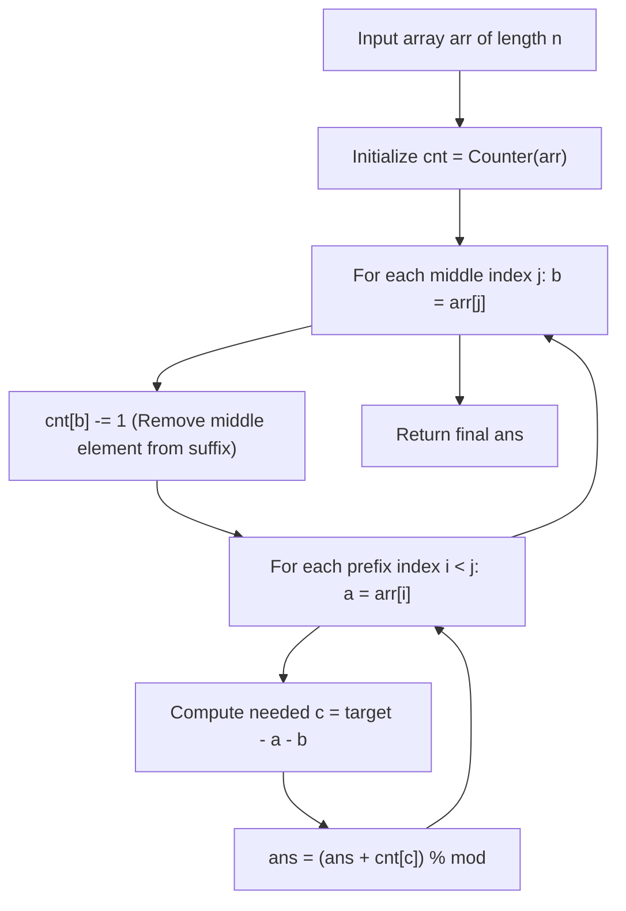

# Guided Example: 3Sum With Multiplicity

We trace the step-by-step middle-pivot traversal with dynamic suffix counting, prove the strict $i < j < k$ index-order partition invariant, and demonstrate multiplicity aggregation on representative multisets:

- **Representative Instance 1 (Mixed Value Multiplicities):**
  $$
  arr = [1, \; 1, \; 2, \; 2, \; 3, \; 3, \; 4, \; 4, \; 5, \; 5], \quad target = 8
  $$
- **Required Output:** `20`
  - Valid value triples summing to $8$:
    1. $\{1, 2, 5\}$: count is $2 \times 2 \times 2 = \mathbf{8}$ index triples.
    2. $\{1, 3, 4\}$: count is $2 \times 2 \times 2 = \mathbf{8}$ index triples.
    3. $\{2, 2, 4\}$: choose two $2$s and one $4$: $\binom{2}{2} \times 2 = 1 \times 2 = \mathbf{2}$ index triples.
    4. $\{2, 3, 3\}$: choose one $2$ and two $3$s: $2 \times \binom{2}{2} = 2 \times 1 = \mathbf{2}$ index triples.
  - Sum of index triples:
    $$
    8 + 8 + 2 + 2 = \mathbf{20}
    $$

- **Representative Instance 2 (Identical Pair Multiplicity):**
  $$
  arr = [1, \; 1, \; 2, \; 2, \; 2, \; 2], \quad target = 5
  $$
  - Target equation: $x + y + z = 5$.
  - The only valid value triple is $\{1, 2, 2\}$ ($1 + 2 + 2 = 5$).
  - Two choices for $1$, and choose $2$ out of four $2$s:
    $$
    \binom{2}{1} \times \binom{4}{2} = 2 \times \frac{4 \times 3}{2} = 2 \times 6 = \mathbf{12}
    $$
  - Required Output: `12`.

---

## 1. Instance & Teaching Goal

Given an integer array `arr` and an integer `target`, return the number of tuples $(i, j, k)$ such that $0 \le i < j < k < n$ and:
$$
arr[i] + arr[j] + arr[k] == target
$$
Because answer can be very large, return it modulo $10^9 + 7$.

```text
Target: 8, Array: [ 1, 1, 2, 2, 3, 3, 4, 4, 5, 5 ]

Fix Middle Element j:
  arr[:j]              arr[j]              arr[j+1:]
  Prefix Elements i    Middle b            Suffix Counter cnt[c]
  (all i < j)                              (counts occurrences with k > j)

For each a in arr[:j]:
  Required third value: c = target - a - b
  Number of valid indices k > j is exactly cnt[c]!
  Add cnt[c] to total combinations.
```

A brute-force three-nested loop checks all $\binom{n}{3} = \frac{n(n-1)(n-2)}{6}$ index triples, taking $\mathcal{O}(n^3)$ operations. For $n = 3{,}000$, this requires $4.5 \times 10^9$ operations, causing severe TLE.

The decisive pedagogical goal is the **Middle-Pivot with Dynamic Suffix Frequency Counter**:
- As middle index $j$ advances from $0$ to $n - 1$, the hash map `cnt` dynamically maintains the frequency of elements occurring strictly to the right ($k > j$).
- By decrementing `cnt[arr[j]]` before scanning the prefix $arr[0 \dots j-1]$, every pair $(i, j)$ with $i < j$ queries the suffix for the exact count of matching third elements in $\mathcal{O}(1)$ time.
- Total runtime is reduced to $\mathcal{O}(n^2)$ while naturally preserving strict index order.

---

## 2. Conceptual Foundation & The Strict Index Order Invariant



### The Suffix Counter Invariant

For every outer loop iteration $j$:
1. Prior to entering the inner loop, `cnt[arr[j]]` is decremented by $1$.
2. **Invariant:** At this moment, for any value $v$, `cnt[v]` equals the exact number of indices $k > j$ such that $arr[k] == v$.
3. The inner loop iterates over all $i \in [0, j - 1]$. For each $arr[i]$, the required third value is:
   $$
   c = target - arr[i] - arr[j]
   $$
4. Because every occurrence tallied in `cnt[c]` resides strictly at an index $k > j$, the tuple $(i, j, k)$ strictly satisfies $i < j < k$.
5. No tuple can be counted twice because each tuple $(i, j, k)$ has a uniquely defined middle index $j$ and left index $i$.

---

## 3. Step-by-Step Worked Execution: $[1, 1, 2, 2, 2, 2]$, $target = 5$

Let $arr = [1, 1, 2, 2, 2, 2]$, $n = 6, \; target = 5$.
Initial suffix counter: `cnt = {1: 2, 2: 4}`.

| Middle Index $j$ | $b = arr[j]$ | Decrement Action | Suffix `cnt` Remaining ($k > j$) | Prefix $i < j$ | $a = arr[i]$ | Needed $c = 5 - a - b$ | Suffix Count `cnt[c]` | Cumulative `ans` |
|:---:|:---:|:---|:---|:---:|:---:|:---:|:---:|:---:|
| **0** | $1$ | `cnt[1] -= 1` | `{1: 1, 2: 4}` | Empty | — | — | — | $0$ |
| **1** | $1$ | `cnt[1] -= 1` | `{1: 0, 2: 4}` | $i = 0$ | $1$ | $5 - 1 - 1 = 3$ | `cnt[3] = 0` | $0$ |
| **2** | $2$ | `cnt[2] -= 1` | `{1: 0, 2: 3}` | $i = 0$<br>$i = 1$ | $1$<br>$1$ | $5 - 1 - 2 = 2$<br>$5 - 1 - 2 = 2$ | `cnt[2] = 3`<br>`cnt[2] = 3` | $0 + 3 = 3$<br>$3 + 3 = \mathbf{6}$ |
| **3** | $2$ | `cnt[2] -= 1` | `{1: 0, 2: 2}` | $i = 0$<br>$i = 1$<br>$i = 2$ | $1$<br>$1$<br>$2$ | $2$<br>$2$<br>$5 - 2 - 2 = 1$ | `cnt[2] = 2`<br>`cnt[2] = 2`<br>`cnt[1] = 0` | $6 + 2 = 8$<br>$8 + 2 = 10$<br>$10 + 0 = \mathbf{10}$ |
| **4** | $2$ | `cnt[2] -= 1` | `{1: 0, 2: 1}` | $i = 0$<br>$i = 1$<br>$i = 2, 3$ | $1$<br>$1$<br>$2, 2$ | $2$<br>$2$<br>$1, 1$ | `cnt[2] = 1`<br>`cnt[2] = 1`<br>`cnt[1] = 0` | $10 + 1 = 11$<br>$11 + 1 = 12$<br>$12 + 0 = \mathbf{12}$ |
| **5** | $2$ | `cnt[2] -= 1` | `{1: 0, 2: 0}` | $i < 5$ | — | — | All `cnt = 0` | $\mathbf{12}$ |

Total combinations accumulated: $\mathbf{12}$.

---

## 4. Combinatorial Equivalence Breakdown

For $arr = [1, 1, 2, 2, 3, 3, 4, 4, 5, 5]$ with $target = 8$:

| Value Tuple $(x, y, z)$ | Formula Applied | Value Counts Available | Calculation | Tuples Generated |
|:---:|:---:|:---:|:---:|:---:|
| $\{1, 2, 5\}$ | All distinct: $C_1 \times C_2 \times C_5$ | $C_1=2, C_2=2, C_5=2$ | $2 \times 2 \times 2$ | $8$ |
| $\{1, 3, 4\}$ | All distinct: $C_1 \times C_3 \times C_4$ | $C_1=2, C_3=2, C_4=2$ | $2 \times 2 \times 2$ | $8$ |
| $\{2, 2, 4\}$ | Two equal: $\binom{C_2}{2} \times C_4$ | $C_2=2, C_4=2$ | $\binom{2}{2} \times 2 = 1 \times 2$ | $2$ |
| $\{2, 3, 3\}$ | Two equal: $C_2 \times \binom{C_3}{2}$ | $C_2=2, C_3=2$ | $2 \times \binom{2}{2} = 2 \times 1$ | $2$ |
| **Total** | Sum of all configurations | — | $8 + 8 + 2 + 2$ | $\mathbf{20}$ |

---

## 5. Algorithmic Correctness

### Soundness & Completeness
1. **Soundness:**
   Every match added to `ans` represents an index triple $(i, j, k)$. By construction, $i \in [0, j - 1] \implies i < j$, and $k$ is drawn from the suffix $k > j$. The sum satisfies $arr[i] + arr[j] + arr[k] == a + b + c = a + b + (target - a - b) = target$. Hence, every counted tuple is valid.
2. **Completeness:**
   Any valid index triple $(i, j, k)$ with $i < j < k$ and $arr[i] + arr[j] + arr[k] == target$ has a unique middle index $j$. When the outer loop reaches this $j$ and the inner loop reaches this $i$, $arr[k]$ is present in the suffix and counted in `cnt[arr[k]]`. Thus, all valid triples are counted exactly once.

---

## 6. Boundary Cases & Traps

| Scenario | Input Pattern | Behavior | Trapped Risk |
|---|---|---|---|
| All Three Values Equal | $arr = [2, 2, 2, 2], target = 6$ | Generates $\binom{4}{3} = 4$ tuples. | Overcounting identical elements as distinct. |
| Zero Elements | $[0, 0, 0, 1, 2], target = 0$ | Triple $(0, 0, 0)$ counted once: $\binom{3}{3} = 1$. | Zero identity confusion in hash map lookup. |
| No Matching Triple | Any array, target = 100 | Returns $0$. | Negative index access or key errors. |
| Modulo Overflow | Large duplicate arrays (e.g. 300 sevens) | Computes $ans \bmod (10^9 + 7)$ on each addition. | 32-bit integer overflow before modulo. |

---

## 7. Complexity Derivation

- **Time Complexity:** $\mathcal{O}(n^2)$, where $n = \text{len}(arr)$.
  - Outer loop runs $n$ times for middle index $j$.
  - Inner loop runs $j$ times for prefix index $i$, performing $\mathcal{O}(1)$ dictionary lookups and arithmetic additions.
  - Total operations: $\sum_{j=0}^{n-1} j = \frac{n(n - 1)}{2} \approx \frac{n^2}{2}$.
  - For $n = 3{,}000$, $\approx 4.5 \times 10^6$ operations, executing in $< 0.1\text{ s}$.
- **Auxiliary Space Complexity:** $\mathcal{O}(V)$, where $V$ is the number of distinct values in $arr$.
  - The frequency map stores at most $V \le \min(n, 101)$ unique keys.
