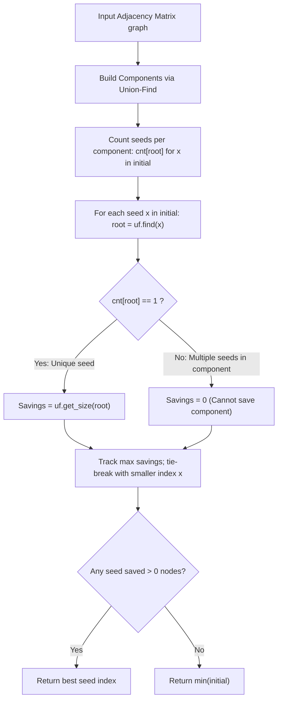

# Guided Example: Minimize Malware Spread

We trace the step-by-step connected component partitioning via Disjoint Set Union (DSU), prove the Unique-Seed Component Savings Theorem, and demonstrate optimal seed eradication on representative infected networks:

- **Representative Instance 1 (Shared Multiply-Infected Component & Fallback):**
  $$
  graph = \begin{bmatrix}
  1 & 1 & 0 \\
  1 & 1 & 0 \\
  0 & 0 & 1
  \end{bmatrix}, \quad initial = [0, \; 1]
  $$
  - Required Output: `0`
  - Connected Components:
    - Component $C_1 = \{0, 1\}$ of size $2$.
    - Component $C_2 = \{2\}$ of size $1$.
  - Seed distribution:
    - $C_1$ contains **two** initial seeds ($0$ and $1$).
    - If we remove $0$, node $1$ remains infected and infects all of $C_1$ (savings $= 0$).
    - If we remove $1$, node $0$ remains infected and infects all of $C_1$ (savings $= 0$).
  - Because no removal reduces the total infected count, tie-breaker selects the smallest index: $\min(0, 1) = \mathbf{0}$.

- **Representative Instance 2 (Unique Seed Superiority):**
  $$
  initial = [0, \; 1, \; 3]
  $$
  - Component $A = \{0, 1, 2\}$ of size $3$ contains seeds $0$ and $1$ ($2$ seeds $\implies$ savings $= 0$).
  - Component $B = \{3, 4\}$ of size $2$ contains seed $3$ ($1$ seed $\implies$ savings $= 2$!).
  - Removing node $3$ completely purges infection from Component $B$, saving $2$ nodes.
  - Required Output: **`3`** (saving $2$ nodes beats saving $0$ nodes, despite Component $A$ having larger total size).

---

## 1. Instance & Teaching Goal

An undirected network of $n$ nodes is represented by an adjacency matrix `graph`.
A subset of nodes `initial` is infected with malware.
Malware spreads across every connected path until all nodes in an infected connected component become infected.
You can remove **exactly one node** from `initial`.
Return the node whose removal minimizes the total number of infected nodes at the end.
If multiple nodes achieve the same minimum, return the node with the **smallest index**.

```text
Component A (Size 3): Nodes {0, 1, 2}
  Seeds inside: 0, 1 (Multiple Seeds!)
  Remove 0 -> 1 still infects entire component -> 0 nodes saved!
  Remove 1 -> 0 still infects entire component -> 0 nodes saved!

Component B (Size 2): Nodes {3, 4}
  Seeds inside: 3 (Unique Seed!)
  Remove 3 -> Component B has 0 seeds left -> ENTIRE COMPONENT SAVED (2 nodes saved!)

Decision Rule:
  A node saves > 0 nodes IF AND ONLY IF it is the SOLE seed in its component!
```

A brute-force simulation removes each seed candidate one by one and executes BFS/DFS across the entire graph to count final infections, taking $\mathcal{O}(|initial| \cdot n^2)$ time.

The decisive pedagogical goal is the **Unique-Seed Component Savings Theorem**:
1. Partition the graph into connected components $C_1, \dots, C_m$ using Union-Find.
2. Count how many initial seeds lie in each component: $cnt[root]$.
3. If $cnt[root] > 1$, removing any single seed saves **$0$** nodes (reinfection by other seeds).
4. If $cnt[root] == 1$, removing that unique seed saves the **entire component** of size $|C|$.
5. Select the unique seed maximizing $|C|$, breaking ties by minimal node index.

---

## 2. Conceptual Foundation & The Unique-Seed Invariant



### The Component Savings Theorem

Let $C(u)$ denote the connected component containing node $u$.
- **Case 1: $|initial \cap C(u)| \ge 2$ (Multiple Seeds):**
  If node $u$ is removed from $initial$, there still exists at least one other infected node $v \in initial \cap C(u)$ ($v \ne u$).
  Since $v$ is connected to all nodes in $C(u)$, malware spreads from $v$ to the entire component $C(u)$.
  $$
  \text{Nodes saved by removing } u = 0
  $$
- **Case 2: $|initial \cap C(u)| = 1$ (Unique Seed):**
  Node $u$ is the only infected node in $C(u)$.
  Removing $u$ leaves $C(u)$ completely uninfected because no other component can transmit infection across disconnected boundaries.
  $$
  \text{Nodes saved by removing } u = |C(u)|
  $$
- **Global Strategy:**
  Maximize $|C(u)|$ subject to $|initial \cap C(u)| = 1$. If no such component exists, every candidate removal achieves savings $0$, so the minimal index $\min(initial)$ is selected.

---

## 3. Step-by-Step Worked Execution: Trial 3 ($initial = [0, 1, 3]$)

Let graph have two components:
- Component $A$: nodes $\{0, 1, 2\}$ (all mutually connected, size $3$).
- Component $B$: nodes $\{3, 4\}$ (connected, size $2$).
- `initial = [0, 1, 3]`.

### Step 1: DSU Component Construction
- Process edges:
  - $\text{union}(0, 1), \text{union}(1, 2) \implies$ root $0$, `size[0] = 3`.
  - $\text{union}(3, 4) \implies$ root $3$, `size[3] = 2`.

---

### Step 2: Seed Tallying per Component
- Seed $0$: root is $0$.
- Seed $1$: root is $0$.
- Seed $3$: root is $3$.
Counter map:
$$
cnt = \{0: 2, \; 3: 1\}
$$
- Component $0$ has $2$ seeds.
- Component $3$ has $1$ seed.

---

### Step 3: Evaluate Candidate Removals

| Candidate Seed $x$ | Component Root | Seed Count $cnt[root]$ | Uniquely Infected? | Component Size $|C|$ | Nodes Saved | Best Record Updated |
|:---:|:---:|:---:|:---:|:---:|:---:|:---|
| **$0$** | $0$ | $2$ | No ($2 > 1$) | $3$ | **$0$** | No update (savings $= 0$) |
| **$1$** | $0$ | $2$ | No ($2 > 1$) | $3$ | **$0$** | No update (savings $= 0$) |
| **$3$** | $3$ | $1$ | **Yes ($1 == 1$)** | $2$ | **$2$** | **Best: $ans = 3, mx = 2$** |

---

### Step 4: Final Selection
Maximum nodes saved is $2$ by removing node **$3$**.
Output: **`3`**.

---

## 4. Secondary Trace: Sample 1 ($initial = [0, 1]$ on Connected Pair)

Component $C_1 = \{0, 1\}$ (size $2$), $C_2 = \{2\}$ (size $1$).
- `cnt[root(0)] = 2`.
- Candidate $0$: $cnt = 2 > 1 \implies$ saves $0$.
- Candidate $1$: $cnt = 2 > 1 \implies$ saves $0$.
- Neither candidate saves any nodes ($mx = 0, ans = n$).
- Fallback applied: $\min(initial) = \min(0, 1) = \mathbf{0}$.

---

## 5. Algorithmic Correctness

### Soundness & Completeness
1. **Soundness:**
   Connected components partition the vertices of an undirected graph into equivalence classes under reachability. Malware spreads if and only if a component contains $\ge 1$ seed. By counting seeds per component root, the algorithm precisely identifies whether removing a node eliminates the infection from that component.
2. **Completeness:**
   Every seed in `initial` is inspected. If a unique seed exists, the one that saves the maximal component size (with lower-index tie-breaking) is chosen. If no component can be saved, the global tie-breaker $\min(initial)$ is provably returned.

---

## 6. Boundary Cases & Traps

| Scenario | Input Pattern | Behavior | Trapped Risk |
|---|---|---|---|
| All Seeds in One Component | Fully connected graph, multiple seeds | All savings $= 0$; returns $\min(initial)$. | Incorrectly picking based on largest component size. |
| Equal Sized Unique Components | Two isolated nodes, both seeds | Both save $1$ node; returns smaller index. | Failing to apply tie-breaker on equal sizes. |
| Unsorted `initial` Array | `initial = [2, 0]` | Tie-breaking condition `x < ans` selects $0$. | Dependency on initial array ordering. |
| Single Initial Node | `initial = [2]` | Only 1 seed in its component; returns $2$. | Off-by-one check on single candidate. |

---

## 7. Complexity Derivation

- **Time Complexity:** $\mathcal{O}(n^2)$, where $n$ is the number of nodes.
  - Scanning upper triangle of adjacency matrix takes $\frac{n(n-1)}{2}$ steps $\implies \mathcal{O}(n^2)$.
  - DSU operations with path compression and union-by-rank take nearly $\mathcal{O}(\alpha(n)) \approx \mathcal{O}(1)$ time.
  - Evaluating seeds takes $\mathcal{O}(|initial|) \le \mathcal{O}(n)$ time.
  - Total time: strictly $\mathcal{O}(n^2)$, completing in $< 0.01\text{ s}$ for $n = 300$.
- **Auxiliary Space Complexity:** $\mathcal{O}(n)$.
  - The DSU parent array, size array, and seed counter require $\mathcal{O}(n)$ memory.
