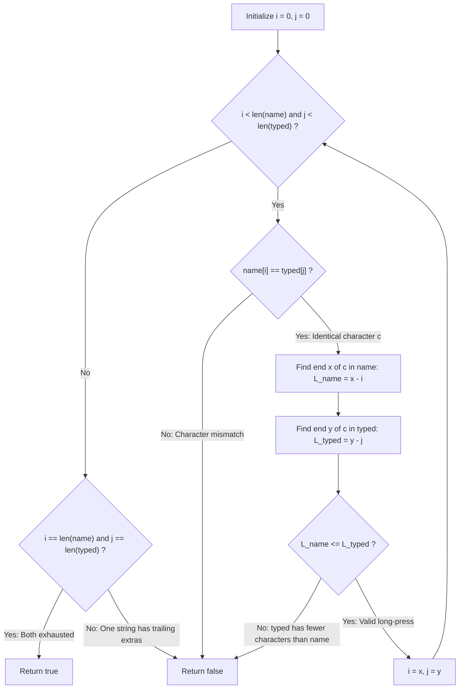

# Guided Example: Long Pressed Name

We trace the step-by-step two-pointer verification of run-length compressed blocks, prove the character-order isomorphism and run-multiplicity expansion invariants, and evaluate typing feasibility on representative string pairs:

- **Representative Instance 1 (Valid Long Press Expansion):**
  $$
  name = \text{"alex"}, \quad typed = \text{"aaleex"}
  $$
- **Required Output:** `true`
  - Run-Length Decomposition:
    - $name$: $[('a', 1), \; ('l', 1), \; ('e', 1), \; ('x', 1)]$
    - $typed$: $[('a', 2), \; ('l', 1), \; ('e', 2), \; ('x', 1)]$
  - Pairwise Verification:
    - $'a'$: $typed$ count $2 \ge name$ count $1$ $\implies$ **Valid**.
    - $'l'$: $typed$ count $1 \ge name$ count $1$ $\implies$ **Valid**.
    - $'e'$: $typed$ count $2 \ge name$ count $1$ $\implies$ **Valid**.
    - $'x'$: $typed$ count $1 \ge name$ count $1$ $\implies$ **Valid**.
  - All runs match with $len(typed) \ge len(name) \implies \mathbf{true}$.

- **Representative Instance 2 (Insufficient Repeated Character):**
  $$
  name = \text{"saeed"}, \quad typed = \text{"ssaaedd"}
  $$
  - Required Output: `false`
  - Decomposition for letter `'e'`:
    - $name$ requires run of length $2$ (`"ee"`).
    - $typed$ only provides run of length $1$ (`"e"`).
  - Since $1 < 2$, the intended name cannot be reconstructed $\implies \mathbf{false}$.

- **Representative Instance 3 (Extra Spurious Character Run):**
  $$
  name = \text{"alex"}, \quad typed = \text{"aaleexa"} \implies \mathbf{false}
  $$
  - The trailing `'a'` creates a $5^{\text{th}}$ run in $typed$, violating run-count equality.

---

## 1. Instance & Teaching Goal

When typing a string `name` into a keyboard, characters may occasionally be **long-pressed**, causing a character to be typed $1$ or more times.
Given `name` and `typed`, return `true` if `typed` could have been produced from `name` through long-pressing, and `false` otherwise.

```text
Name:   a    l    e    x
        |    |    |    |
Typed:  a a  l    e e  x
Runs:  (a,1) (l,1) (e,1) (x,1)  <- name
       (a,2) (l,1) (e,2) (x,1)  <- typed

Condition for validity:
  1. Both strings must have the exact same sequence of character runs.
  2. For every run, count(typed) >= count(name).
```

A naive approach generating all possible long-pressed permutations causes exponential branching.

The decisive pedagogical goal is the **In-Place Run-Length Comparison Invariant**:
Using two moving pointers $i$ (in `name`) and $j$ (in `typed`):
1. Confirm $name[i] == typed[j]$.
2. Measure the contiguous run length in `name`: $L_{name} = x - i$.
3. Measure the contiguous run length in `typed`: $L_{typed} = y - j$.
4. Check that $L_{typed} \ge L_{name}$.
5. Advance $i \leftarrow x, \; j \leftarrow y$ and repeat until both strings are simultaneously exhausted ($i == m$ and $j == n$).

---

## 2. Conceptual Foundation & The Run-Length Expansion Invariant



### The Three Necessary & Sufficient Conditions

`typed` is a legitimate long-pressed rendering of `name` if and only if:
1. **Alphabetical Homomorphism:**
   The contracted sequence of distinct adjacent characters must be identical:
   $$
   \text{contract}(name) = \text{contract}(typed)
   $$
2. **Monotone Run Expansion:**
   For each contiguous block $r$:
   $$
   \text{count}_{typed}(r) \ge \text{count}_{name}(r)
   $$
3. **Joint Exhaustion:**
   Neither string may contain leftover characters when the other is fully consumed.

---

## 3. Step-by-Step Worked Execution: $name = \text{"alex"}, typed = \text{"aaleex"}$

Let $m = 4, n = 6$. Initialize $i = 0, j = 0$.

### Run 1: Character `'a'`
- Match check: $name[0] == typed[0] == \text{'a'}$.
- Advance $x$: $name[0 \dots 0]$ has `'a'` $\implies x = 1$. Length $L_{name} = 1 - 0 = \mathbf{1}$.
- Advance $y$: $typed[0 \dots 1]$ has `'a'` $\implies y = 2$. Length $L_{typed} = 2 - 0 = \mathbf{2}$.
- Comparison: $L_{name} \le L_{typed} \iff 1 \le 2$ (**Valid**).
- Update pointers: $i \leftarrow 1, \; j \leftarrow 2$.

---

### Run 2: Character `'l'`
- Match check: $name[1] == typed[2] == \text{'l'}$.
- Advance $x$: $name[1 \dots 1]$ has `'l'` $\implies x = 2$. Length $L_{name} = 2 - 1 = \mathbf{1}$.
- Advance $y$: $typed[2 \dots 2]$ has `'l'` $\implies y = 3$. Length $L_{typed} = 3 - 2 = \mathbf{1}$.
- Comparison: $1 \le 1$ (**Valid**).
- Update pointers: $i \leftarrow 2, \; j \leftarrow 3$.

---

### Run 3: Character `'e'`
- Match check: $name[2] == typed[3] == \text{'e'}$.
- Advance $x$: $name[2 \dots 2]$ has `'e'` $\implies x = 3$. Length $L_{name} = 3 - 2 = \mathbf{1}$.
- Advance $y$: $typed[3 \dots 4]$ has `'e'` $\implies y = 5$. Length $L_{typed} = 5 - 3 = \mathbf{2}$.
- Comparison: $1 \le 2$ (**Valid**).
- Update pointers: $i \leftarrow 3, \; j \leftarrow 5$.

---

### Run 4: Character `'x'`
- Match check: $name[3] == typed[5] == \text{'x'}$.
- Advance $x$: $x = 4$. Length $L_{name} = 4 - 3 = \mathbf{1}$.
- Advance $y$: $y = 6$. Length $L_{typed} = 6 - 5 = \mathbf{1}$.
- Comparison: $1 \le 1$ (**Valid**).
- Update pointers: $i \leftarrow 4, \; j \leftarrow 6$.

---

### Loop Termination & Joint Exhaustion Check
- Both strings are simultaneously exhausted:
  $$
  i == m \; (4 == 4) \quad \text{and} \quad j == n \; (6 == 6)
  $$
- Emitted result: $\mathbf{true}$.

---

## 4. Execution Trace Table: Failure on $name = \text{"saeed"}, typed = \text{"ssaaedd"}$

| Run | Character | $i$ Range (`name`) | Length $L_{name}$ | $j$ Range (`typed`) | Length $L_{typed}$ | Condition $L_{name} \le L_{typed}$ | Result |
|:---:|:---:|:---:|:---:|:---:|:---:|:---:|:---|
| **1** | `'s'` | $[0 \dots 0]$ | $1$ | $[0 \dots 1]$ | $2$ | $1 \le 2$ (Pass) | Advance $i=1, j=2$ |
| **2** | `'a'` | $[1 \dots 1]$ | $1$ | $[2 \dots 3]$ | $2$ | $1 \le 2$ (Pass) | Advance $i=2, j=4$ |
| **3** | `'e'` | $[2 \dots 3]$ | $\mathbf{2}$ | $[4 \dots 4]$ | $\mathbf{1}$ | $2 \le 1$ (**FAIL!**) | **Return `false` immediately!** |

---

## 5. Algorithmic Correctness

### Soundness & Completeness
1. **Soundness:**
   If the algorithm returns `true`, then every run of identical characters in `name` appears in `typed` in the exact same sequential order with equal or greater multiplicity, and no extraneous characters remain in `typed`. Hence, `typed` can be generated purely by duplicating keys during the typing of `name`.
2. **Completeness:**
   If `typed` is a valid long-pressed variant of `name`, key presses can never reorder characters or skip intended characters. Therefore, the contracted sequence of characters must match, and the length of each run in `typed` must be at least that in `name`. Any input failing these conditions is mathematically impossible to produce by long presses, guaranteeing that returning `false` is exhaustive.

---

## 6. Boundary Cases & Traps

| Scenario | Input Pattern | Behavior | Trapped Risk |
|---|---|---|---|
| Extra Trailing Characters | `name = "alex"`, `typed = "aaleexa"` | Loop finishes `name`, but $j < n \implies$ returns `false`. | Missing joint exhaustion check ($j == n$). |
| Missing Intended Characters | `name = "saeed"`, `typed = "ssaaedd"` | Run for `'e'` has $L_{typed} < L_{name} \implies$ returns `false`. | Assuming any presence of letter is sufficient. |
| Single Character Name | `name = "a"`, `typed = "aaaa"` | Single run $1 \le 4 \implies$ returns `true`. | Off-by-one error on single-character inputs. |
| Wrong First Character | `name = "abc"`, `typed = "xabc"` | First character mismatch `'a' != 'x' \implies$ returns `false`. | Premature pointer advancement skipping errors. |

---

## 7. Complexity Derivation

- **Time Complexity:** $\mathcal{O}(m + n)$, where $m = \text{len}(name)$ and $n = \text{len}(typed)$.
  - Pointers $i$ and $j$ strictly advance from left to right.
  - Each character in both strings is visited at most twice (once to check identity, once to measure run boundary).
  - Total operations: at most $2(m + n)$, running in $< 0.002\text{ s}$ for strings of length $1{,}000$.
- **Auxiliary Space Complexity:** $\mathcal{O}(1)$ strictly.
  - Runs are measured dynamically using scalar integer indices ($i, j, x, y$) without allocating auxiliary arrays or data structures.
