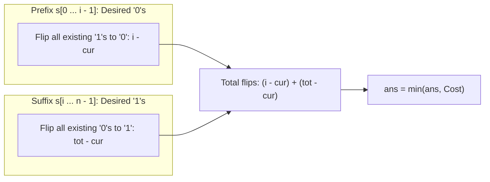

# Guided Example: Flip String to Monotone Increasing

We trace the step-by-step evaluation of binary split boundaries, prove the prefix-ones plus suffix-zeros cost invariant, and demonstrate minimal flip derivations on representative bitstrings:

- **Representative Instance 1 (Trailing Zero Inversion):**
  $$
  s = \text{"00110"}
  $$
- **Required Output:** `1`
  - Total zeros in string: $tot = 3$ (indices $0, 1, 4$). Total length $n = 5$.
  - Evaluate all $n + 1 = 6$ possible monotone partition points $i \in [0, 5]$:
    - Split $i = 0$ (all $1$s: `"11111"`): flips all $3$ zeros $\implies 3$.
    - Split $i = 1$ (`"01111"`): flips $2$ zeros in suffix $\implies 2$.
    - Split $i = 2$ (`"00111"`): prefix `"00"` has $0$ ones, suffix `"110"` has $1$ zero $\implies 0 + 1 = \mathbf{1}$.
    - Split $i = 3$ (`"00011"`): prefix `"001"` has $1$ one, suffix `"10"` has $1$ zero $\implies 1 + 1 = 2$.
    - Split $i = 4$ (`"00001"`): prefix has $2$ ones, suffix has $1$ zero $\implies 2 + 1 = 3$.
    - Split $i = 5$ (all $0$s: `"00000"`): flips all $2$ ones $\implies 2$.
  - Minimum flips required: $\min(3, 2, \mathbf{1}, 2, 3, 2) = \mathbf{1}$.

- **Representative Instance 2 (All-Zero Conversion vs Suffix $1$s):**
  $$
  s = \text{"00011000"} \implies \text{flips} = \mathbf{2}
  $$
  - Flipping the two internal `'1'`s at indices $3, 4$ to `'0'` gives `"00000000"` in $2$ flips.

---

## 1. Instance & Teaching Goal

A binary string is **monotone increasing** if it consists of some number of `0`'s (possibly none), followed by some number of `1`'s (possibly none), conforming to the regular pattern $0^*1^*$.
In one operation, you can flip any `0` to `1` or `1` to `0`.
Return the **minimum number of flips** to make string $s$ monotone increasing.

```text
Original String:   0   0   1   1   0
Indices:           0   1   2   3   4

Test Split at index 2 (Prefix of 2 zeros, Suffix of 3 ones):
  Desired Form:    0   0 | 1   1   1
  Original Bits:   0   0 | 1   1   0
  Prefix Ones to flip: 0 (indices 0..1 contain no '1's)
  Suffix Zeros to flip: 1 (index 4 contains '0')
  Total Flips = 0 + 1 = 1 (Optimal!)
```

A brute-force search explores all $2^n$ possible flipped binary strings, causing exponential $\mathcal{O}(2^n)$ explosion.

The decisive pedagogical goal is the **Prefix-Suffix Partition Boundary Invariant**:
Any monotone increasing string of length $n$ is uniquely determined by a single split point $i \in [0, n]$:
- Prefix $s[0 \dots i-1]$ consists entirely of `'0'`s.
- Suffix $s[i \dots n-1]$ consists entirely of `'1'`s.
For each split point $i$, the cost is:
$$
\text{flips}(i) = (\text{number of } 1\text{s in prefix } [0 \dots i-1]) + (\text{number of } 0\text{s in suffix } [i \dots n-1])
$$
By tracking the cumulative count of zeros $cur$, both terms are evaluated in $\mathcal{O}(1)$ time per split, solving the problem in $\mathcal{O}(n)$ time and $\mathcal{O}(1)$ auxiliary space.

---

## 2. Conceptual Foundation & The Boundary Cost Invariant



### Derivation of the Cost Equation

Let $tot$ be the total number of `'0'`s in $s$.
Let $cur$ be the number of `'0'`s in the prefix $s[0 \dots i-1]$.
1. **Length of prefix:** $i$.
2. **Number of `'1'`s in prefix:**
   $$
   \text{ones}_{\text{prefix}} = i - cur
   $$
   Each must be flipped from `'1'` to `'0'`.
3. **Number of `'0'`s in suffix:**
   $$
   \text{zeros}_{\text{suffix}} = tot - cur
   $$
   Each must be flipped from `'0'` to `'1'`.
4. **Total Flips for Boundary $i$:**
   $$
   \text{cost}(i) = (i - cur) + (tot - cur) = i + tot - 2 \cdot cur
   $$
5. Boundary condition $i = 0$ corresponds to making the entire string all `'1'`s: $\text{cost}(0) = tot$.

---

## 3. Step-by-Step Worked Execution: $s = \text{"00110"}$

Total zeros: $tot = 3$. Length $n = 5$.
Initialize: $ans = tot = 3, \; cur = 0$.

| Split Index $i$ | Processed Char $s[i-1]$ | Updated Prefix Zeros $cur$ | Prefix Ones: $i - cur$ | Suffix Zeros: $tot - cur$ | Total Flips at Split $i$ | Running Minimum $ans$ |
|:---:|:---:|:---:|:---:|:---:|:---:|:---:|
| **$0$ (Base)** | — | $0$ | $0$ | $3$ | $0 + 3 = 3$ | $3$ |
| **$1$** | $s[0] = \text{'0'}$ | $1$ | $1 - 1 = \mathbf{0}$ | $3 - 1 = \mathbf{2}$ | $0 + 2 = 2$ | $\min(3, 2) = 2$ |
| **$2$** | $s[1] = \text{'0'}$ | $2$ | $2 - 2 = \mathbf{0}$ | $3 - 2 = \mathbf{1}$ | $0 + 1 = \mathbf{1}$ | $\min(2, 1) = \mathbf{1}$ |
| **$3$** | $s[2] = \text{'1'}$ | $2$ | $3 - 2 = \mathbf{1}$ | $3 - 2 = \mathbf{1}$ | $1 + 1 = 2$ | $1$ |
| **$4$** | $s[3] = \text{'1'}$ | $2$ | $4 - 2 = \mathbf{2}$ | $3 - 2 = \mathbf{1}$ | $2 + 1 = 3$ | $1$ |
| **$5$** | $s[4] = \text{'0'}$ | $3$ | $5 - 3 = \mathbf{2}$ | $3 - 3 = \mathbf{0}$ | $2 + 0 = 2$ | $1$ |

Global minimum flips: $\mathbf{1}$ (achieved at split boundary $i = 2$).

---

## 4. Secondary Trace: $s = \text{"010110"}$

Total zeros: $tot = 3$ (at $0, 2, 5$). Length $n = 6$. Initial $ans = 3$.

| $i$ | Char | $cur$ | Prefix $1$s | Suffix $0$s | Flips | $ans$ |
|:---:|:---:|:---:|:---:|:---:|:---:|:---:|
| 0 | — | 0 | 0 | 3 | 3 | 3 |
| 1 | '0' | 1 | 0 | 2 | 2 | 2 |
| 2 | '1' | 1 | 1 | 2 | 3 | 2 |
| 3 | '0' | 2 | 1 | 1 | **2** | **2** |
| 4 | '1' | 2 | 2 | 1 | 3 | 2 |
| 5 | '1' | 2 | 3 | 1 | 4 | 2 |
| 6 | '0' | 3 | 3 | 0 | 3 | 2 |

Minimum flips: $\mathbf{2}$ (achieved at $i = 1$ as `"011111"` or at $i = 3$ as `"000111"`).

---

## 5. Algorithmic Correctness

### Soundness & Completeness
1. **Soundness:**
   For any chosen split index $i$, turning all characters before $i$ into `'0'` and all characters from $i$ onwards into `'1'` produces a string of the form $0^i 1^{n-i}$, which is strictly monotone increasing. The formula $(i - cur) + (tot - cur)$ counts the exact number of bit differences between $s$ and this target string.
2. **Completeness:**
   Every valid monotone increasing binary string of length $n$ has the form $0^i 1^{n-i}$ for some integer $i \in [0, n]$. Because our loop evaluates all $n + 1$ possible split points, no candidate monotone increasing string is overlooked. The minimum over all $i$ is mathematically guaranteed to be the global optimum.

---

## 6. Boundary Cases & Traps

| Scenario | Input | Behavior | Trapped Risk |
|---|---|---|---|
| Already Monotone | `"000111"` | At split point $i = 3$: flips $= 0 \implies$ returns $0$. | Non-zero false flips on valid strings. |
| All Zeros | `"0000"` | $tot = 4$. At $i = 4$: $cur = 4 \implies (4-4)+(4-4)=0$. Returns $0$. | Forcing a non-empty suffix of ones. |
| All Ones | `"1111"` | $tot = 0$. At $i = 0$: $cur = 0 \implies 0$. Returns $0$. | Forcing a non-empty prefix of zeros. |
| Single Character | `"0"` or `"1"` | String of length 1 is already monotone; returns $0$. | Index out-of-bounds on length 1. |

---

## 7. Complexity Derivation

- **Time Complexity:** $\mathcal{O}(n)$, where $n = \text{len}(s)$.
  - Counting total zeros: one pass $\implies \mathcal{O}(n)$.
  - Scanning split boundaries: one pass of $n$ iterations with $\mathcal{O}(1)$ arithmetic updates per step $\implies \mathcal{O}(n)$.
  - Total runtime: strictly linear $\mathcal{O}(n)$, running in $< 0.005\text{ s}$ for $n = 100{,}000$.
- **Auxiliary Space Complexity:** $\mathcal{O}(1)$ strictly.
  - Only $4$ scalar variables ($tot, cur, ans, i$) are stored.
