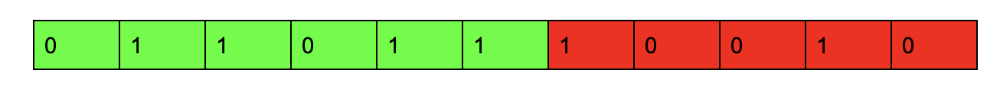

### Approach 1: Dynamic Windows

#### Intuition

The result monotone increasing string can be considered as 2 consecutive non-overlapping substrings, namely, the prefix only contains character '0' and the suffix only contains character '1'. Let's consider the 2 substrings as 2 windows on the original string. Initially, the left window is empty and the right window contains the whole string. At each step, the left window's size increases by one and the right window's size decreases by 1. We want to change all the characters in the left window into '0' and all the characters in the right window into '1'.

#### Algorithm

We enumerate each left-right window configuration, the number of flips to make the string monotone increasing is the sum of the number of '1's in the left window and the number of '0's in the right window. Save the smallest value.

<center>

</center>
<br>

For example, in the above configuration, the number of flips to make the string monotone increasing is 4 (flip the 4 '1's in the left/green window) + 3 (flip the 3 '0's in the right/red window) = 7.

Let `left1` be the number of '1's in the current left window and `right0` be the number of '0's in the current right window. When the left window increases and the right window shrinks by 1 character, it means we move a character `c` from right to left:

If `c` = '0', `left1` will be unchanged and `right0` will be decreased by 1, so the sum of them will be decreased by `1`.

If `c` = '1', `left1` will be increased by 1 and `right0` will be unchanged so the sum of them will be increased by `1`.

We only need to know the result of $left1 + right0$, so we don't need to maintain the 2 counters separately. We can use a variable `m` where $m = left1 + right0$ implicitly.

The algorithm works as follows:

* Scan the input string `s` to count the number of '0's in total, let it be `m`. This is the number of flips needed when the left window is empty and the right window is the whole string.
* Set `ans` = `m`.
* Scan the input string 's' again,
   * for each character '0', decrease `m` by 1 and replace `ans` with `m` if `m` is smaller.
   * for each character '1', increase `m` by 1.
* Return `ans`.

#### Implementation

```python
class Solution:
    def minFlipsMonoIncr(self, s: str) -> int:
        m = 0
        for c in s:
            if c == '0':
                m += 1
        ans = m
        for c in s:
            if c == '0':
                m -= 1
                ans = min(ans, m)
            else:
                m += 1
        return ans
```

#### Complexity Analysis

Here, $N$ is the length of the input string.

* Time Complexity:  $O(N)$, since the algorithm does 2 linear scans.

* Space Complexity:  $O(1)$, since the algorithm doesn't use extra space other than some integer variables.

### Approach 2: Dynamic Programming

#### Intuition

If a string is monotone increasing, any of its prefixes are also monotone increasing. To make a prefix of length `i` monotone increasing, we can make the prefix of length (i - 1) monotone increasing and consider whether to flip the last character. This implies the optimization of the sub-problems which is a characteristic of Dynamic Programming.

Let $\text{dp}[i]$ represent the minimum number of flips to make the prefix of `s` of length `i` (substring of indices `[0, i)`) monotone increasing.

The base case is $\text{dp}[0] = 0$, since an empty string is always monotone increasing.
Consider $\text{dp}[i]$ for `i > 0`,

If $s[i - 1] = '1'$, then we have $\text{dp}[i] = dp[i - 1]$, since we can always append a character '1' to the end of a monotone increasing string and it's still monotone increasing.

If $s[i - 1] = '0'$, let's consider whether we flip it or not.
* If we don't flip it, we have to flip all the '1's in `s` before it.
* If we flip it, then we can treat it as the above case where $s[i - 1] = '1'$ with one more flip.

In summary,

Let number `num` be the number of character `1`s in `s`' prefix of length `i`:

- $\text{dp}[i] = dp[i - 1]$ if $s[i - 1] = '1'$
- $\text{dp}[i] = min(num, dp[i - 1] + 1)$ otherwise.

The final answer should be `dp[s.length()]`

Since $\text{dp}[i]$ only depends on $dp[i - 1]$, we can use a simple int variable instead of an array to reduce the space complexity.

#### Algorithm
Let `ans` be the final answer and `num` be the number of character `1`s in the current prefix of `s`.

* Initialize `ans` and `num` to 0.
* For each character `c` in the input string `s`:
* If c is `0`,  set `ans` to the minimal value of `num` and $ans + 1$.
* otherwise c is `1`, increase `num` by `1`.
* Return `ans`.

#### Implementation

```python
class Solution:
    def minFlipsMonoIncr(self, s: str) -> int:
        ans = 0
        num = 0
        for c in s:
            if c == '0':
                ans = min(num, ans + 1)
            else:
                num += 1
        return ans
```

#### Complexity Analysis

Here, $N$ is the length of the input string.

* Time Complexity:  $O(N)$, since the algorithm does one linear scan.

* Space Complexity:  $O(1)$, since the algorithm doesn't use extra space other than some integer variables.

----