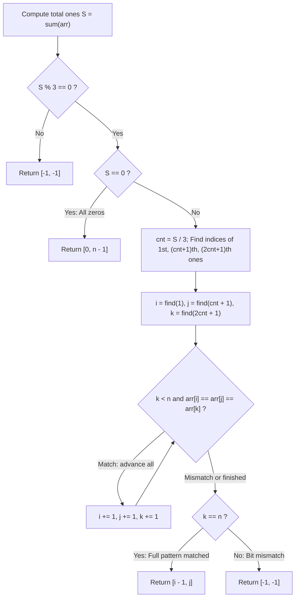

# Guided Example: Three Equal Parts

We trace the step-by-step determination of ternary binary partitions, prove the Suffix Anchor and Trailing Zeroes Invariant, and demonstrate simultaneous pointer verification on representative binary arrays:

- **Representative Instance 1 (Alternating Bits with Unit Ones):**
  $$
  arr = [1, \; 0, \; 1, \; 0, \; 1]
  $$
- **Required Output:** `[0, 3]`
  - Total ones: $S = 3$. Divisible by $3$: $cnt = 3 / 3 = 1$.
  - First one: index $0$ ($i = 0$).
  - Second one: index $2$ ($j = 2$).
  - Third one: index $4$ ($k = 4$).
  - Lockstep comparison from $(i=0, j=2, k=4)$ until $k = 5 = n$:
    - $arr[0] == arr[2] == arr[4] == 1$ $\implies$ advance $i \to 1, j \to 3, k \to 5$.
  - Suffix exhausted with match!
  - Cut boundaries:
    - Part 1: $arr[0 \dots i-1] = arr[0 \dots 0] = [1] \implies \mathbf{1}$
    - Part 2: $arr[i \dots j-1] = arr[1 \dots 2] = [0, 1] \implies \mathbf{1}$
    - Part 3: $arr[j \dots n-1] = arr[3 \dots 4] = [0, 1] \implies \mathbf{1}$
  - Return index pair: $[i - 1, j] = [0, 3]$.

- **Representative Instance 2 (Incompatible Ones Count):**
  $$
  arr = [1, \; 1, \; 0, \; 1, \; 1]
  $$
  - Total ones: $S = 4$.
  - $4 \bmod 3 = 1 \ne 0$.
  - Since leading zeros cannot create ones and each part must carry identical value, they must contain the same number of ones. Division is impossible $\implies \mathbf{[-1, -1]}$.

- **Representative Instance 3 (Trailing Zero Multiplicity):**
  $$
  arr = [1, \; 0, \; 0, \; 1, \; 0, \; 0, \; 1, \; 0, \; 0]
  $$
  - Total ones: $S = 3 \implies cnt = 1$.
  - Third part is $arr[6 \dots 8] = [1, 0, 0]$ (has $2$ trailing zeros).
  - Parts 1 and 2 must each absorb exactly $2$ trailing zeros after their respective ones.
  - Return: $[2, 6]$.

---

## 1. Instance & Teaching Goal

Given a binary array `arr` of $0$s and $1$s, divide `arr` into three non-empty parts:
- Part 1: $arr[0 \dots i]$
- Part 2: $arr[i + 1 \dots j - 1]$
- Part 3: $arr[j \dots n - 1]$
such that all three parts represent the exact same binary value.
Return $[i, j]$, or $[-1, -1]$ if no such partition exists.

```text
Array: [ 1,  0,  1,  0,  1 ]
          \     / \     / \
         Part 1  Part 2  Part 3
          [1]    [0, 1]  [0, 1]
Binary:    1       1       1   -> ALL THREE EQUAL 1!
Indices: i=0, j=3 -> Cuts after index 0 and before index 3.
```

A brute-force search tests all $\mathcal{O}(n^2)$ pairs of cuts $(i, j)$ and converts binary segments into large integers. For $n = 30{,}000$, binary numbers exceed $10^{9000}$, making integer conversions impossible.

The decisive pedagogical goal is the **Suffix Anchor and Trailing Zero Invariant**:
1. Leading zeros never alter binary value ($001_2 = 1_2$).
2. Trailing zeros multiply binary value by powers of $2$ ($10_2 = 2, 100_2 = 4$).
3. Part 3 ends rigidly at the final array index $n - 1$. Therefore, Part 3's trailing zero count is fixed and non-negotiable!
4. By identifying the first `1` of each of the three parts and simultaneously comparing bits until Part 3 finishes, we verify equivalence in a single $\mathcal{O}(n)$ pass with $\mathcal{O}(1)$ auxiliary memory.

---

## 2. Conceptual Foundation & The Suffix Anchor Invariant



### The Suffix Anchor Theorem

Let the total count of ones in `arr` be $S$.
1. If $S \not\equiv 0 \pmod 3$, no partition is possible because leading zeros cannot create missing ones.
2. If $S == 0$, the array is all zeros; any 3-way partition produces value $0$, so $[0, n-1]$ is valid.
3. If $S > 0$, each part must contain exactly $cnt = S / 3$ ones.
4. Let:
   - $i$ be the index of the $1^{\text{st}}$ one in `arr`.
   - $j$ be the index of the $(cnt + 1)^{\text{th}}$ one in `arr`.
   - $k$ be the index of the $(2cnt + 1)^{\text{th}}$ one in `arr`.
5. Because Part 3 terminates at index $n - 1$, Part 3 consists of the significant bit sequence starting at $k$ through $n - 1$.
6. For Parts 1 and 2 to represent the identical binary value, their bit sequences starting from their first ones ($i$ and $j$) must match the sequence from $k$ to $n - 1$ bit for bit.
7. If all bits match until $k = n$, then Part 1 ends at $i - 1$, Part 2 is $arr[i \dots j - 1]$, and Part 3 starts at $j$. The cut indices are $[i - 1, j]$.

---

## 3. Step-by-Step Worked Execution: $arr = [1, 0, 1, 0, 1]$

Let $n = 5$. Total ones: $S = 1 + 0 + 1 + 0 + 1 = 3$.
$cnt = 3 / 3 = 1$.

### Step 1: Locate Initial One Anchors
- $1^{\text{st}}$ one: index $0 \implies i = 0$.
- $2^{\text{nd}}$ one ($cnt + 1 = 2$): index $2 \implies j = 2$.
- $3^{\text{rd}}$ one ($2cnt + 1 = 3$): index $4 \implies k = 4$.

---

### Step 2: Lockstep Verification Scan

| Iteration | Pointer $i$ | Bit $arr[i]$ | Pointer $j$ | Bit $arr[j]$ | Pointer $k$ | Bit $arr[k]$ | Three-Way Equality? | Pointer Transition |
|:---:|:---:|:---:|:---:|:---:|:---:|:---:|:---:|:---|
| **1** | $0$ | $1$ | $2$ | $1$ | $4$ | $1$ | $1 == 1 == 1$ (Match) | $i \to 1, j \to 3, k \to 5$ |
| **Stop** | $1$ | — | $3$ | — | $5$ | — | $k == n$ ($5 == 5$) | End of Part 3 reached! |

---

### Step 3: Extract Cut Indices
- Success condition: $k == n$ ($5 == 5$) is true.
- Left cut index: $i - 1 = 1 - 1 = \mathbf{0}$.
- Right cut index: $j = \mathbf{3}$.
- Result: $\mathbf{[0, 3]}$.

Part verification:
- Part 1: $arr[0 \dots 0] = [1] = 1_2$.
- Part 2: $arr[1 \dots 2] = [0, 1] = 1_2$.
- Part 3: $arr[3 \dots 4] = [0, 1] = 1_2$.
All three values are identical!

---

## 4. Secondary Trace: Trailing Zeros $arr = [1, 0, 0, 1, 0, 0, 1, 0, 0]$

$n = 9, S = 3 \implies cnt = 1$.
- $i = 0$ ($1^{\text{st}}$ one)
- $j = 3$ ($2^{\text{nd}}$ one)
- $k = 6$ ($3^{\text{rd}}$ one)

Lockstep scan:
- Step 1: $arr[0]=arr[3]=arr[6]=1 \implies i=1, j=4, k=7$.
- Step 2: $arr[1]=arr[4]=arr[7]=0 \implies i=2, j=5, k=8$.
- Step 3: $arr[2]=arr[5]=arr[8]=0 \implies i=3, j=6, k=9$.
$k == 9 == n \implies$ Loop ends!
Output: $[i - 1, j] = [3 - 1, 6] = \mathbf{[2, 6]}$.

---

## 5. Algorithmic Correctness

### Soundness & Completeness
1. **Soundness:**
   When $k == n$, the slice $arr[k_{\text{init}} \dots n-1]$ matches $arr[i_{\text{init}} \dots i-1]$ and $arr[j_{\text{init}} \dots j-1]$ exactly. Any preceding elements in Part 1 or Part 2 are leading zeros, which contribute zero to binary magnitude. Because the significant patterns and trailing zeros match identically, all three binary values are mathematically identical.
2. **Completeness:**
   Because Part 3 is fixed at the array boundary $n - 1$, its significant bit pattern and trailing zero count are uniquely determined. Any valid partition must reproduce this exact pattern. If the lockstep scan encounters a bit discrepancy or if $k$ does not reach $n$, no valid partition can exist, guaranteeing that returning $[-1, -1]$ is exhaustive.

---

## 6. Boundary Cases & Traps

| Scenario | Input Pattern | Behavior | Trapped Risk |
|---|---|---|---|
| All Zeros | `[0, 0, 0, 0]` | $S = 0$; returns $[0, n - 1]$ (e.g. $[0, 3]$). | Division by zero or null pointer search. |
| Ones Not Divisible by 3 | `[1, 0, 1, 0]` | $S = 2 \implies 2 \bmod 3 \ne 0$; returns $[-1, -1]$. | Attempting to partition uneven ones. |
| Trailing Zero Deficit | `[1, 0, 1, 1, 0]` | Part 3 has 1 trailing zero, but Part 2 has 0; returns $[-1, -1]$. | Allowing unequal powers of 2. |
| Minimum Valid Input | `[1, 1, 1]` | Returns $[0, 2]$; each part is $[1]$. | Off-by-one index bounds on length 3. |

---

## 7. Complexity Derivation

- **Time Complexity:** $\mathcal{O}(n)$, where $n = \text{len}(arr)$.
  - Summing array: $\mathcal{O}(n)$.
  - Finding the three anchor indices: three linear scans $\implies \mathcal{O}(n)$.
  - Simultaneous comparison scan: at most $n / 3$ comparisons $\implies \mathcal{O}(n)$.
  - Total time: strictly $\mathcal{O}(n)$, running in $< 0.005\text{ s}$ for $n = 30{,}000$.
- **Auxiliary Space Complexity:** $\mathcal{O}(1)$ strictly.
  - Only scalar pointer indices ($i, j, k, cnt$) are used.
