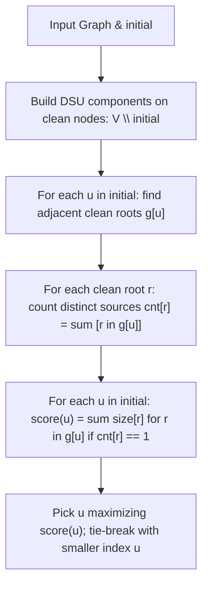

# Guided Example: Minimize Malware Spread II

We trace the step-by-step decomposition of the clean subgraph via Disjoint Set Union (DSU), prove the Unique-Contamination Invariant under full vertex-and-edge deletion, and demonstrate optimal malware mitigation on representative networks:

- **Representative Instance 1 (Bridge Node Eradication):**
  $$
  graph = \begin{bmatrix}
  1 & 1 & 0 \\
  1 & 1 & 1 \\
  0 & 1 & 1
  \end{bmatrix}, \quad initial = [0, \; 1]
  $$
- **Required Output:** `1`
  - Infected seeds: $\{0, 1\}$.
  - Clean subgraph ($V \setminus initial$): only node $\{2\}$.
  - Connectivity to clean nodes:
    - Node $0$ connects only to node $1$ (which is infected) $\implies$ touches no clean components: $g[0] = \emptyset$.
    - Node $1$ connects to clean node $2 \implies$ touches component $\{2\}$: $g[1] = \{\text{root}(2)\}$.
  - Contamination Tally:
    - Clean component $\{2\}$ is touched **only** by seed $1$ ($cnt[\text{root}(2)] = 1$).
  - Removal Outcomes:
    - If we remove node $0$: seed $1$ still infects node $2$ $\implies$ nodes saved $= 0$.
    - If we remove node $1$: node $1$ and its edges are deleted! Node $0$ has no path to node $2$. Component $\{2\}$ is completely spared $\implies$ **$1$ node saved!**
  - Optimal removal: node **`1`**.

- **Representative Instance 2 (No Differential Savings & Tie-Break):**
  $$
  graph = \begin{bmatrix}
  1 & 1 & 0 \\
  1 & 1 & 0 \\
  0 & 0 & 1
  \end{bmatrix}, \quad initial = [0, \; 1] \implies \text{output} = \mathbf{0}
  $$
  - Clean node $2$ is completely disconnected from both $0$ and $1$ and stays uninfected regardless of removal.
  - Both candidates save $0$ clean nodes; tie-breaker selects $\min(0, 1) = \mathbf{0}$.

---

## 1. Instance & Teaching Goal

You are given a network `graph` and an initial infected list `initial`.
Unlike Minimize Malware Spread I, here removing a node from `initial` **completely removes the node and all its incident edges** from the network!
Return the node whose total removal minimizes the final number of infected nodes.
If multiple nodes achieve the same minimum, return the node with the **smallest index**.

```text
Crucial Structural Difference:
  In Problem I: Removed node stays in graph (can be reinfected by neighbors).
  In Problem II: Removed node and ALL its incident edges are DESTROYED!

Clean Subgraph Strategy:
  1. Build components using ONLY uninfected (clean) nodes: V \ initial.
  2. For each infected node u in initial:
     Find which clean components u connects to.
  3. If a clean component is touched by EXACTLY ONE infected node u:
     --> Completely deleting u PERMANENTLY SAVES that clean component!
  4. If a clean component is touched by >= 2 infected nodes:
     --> Deleting u does NOT save it (the other infected nodes still reach it).
```

A naive simulation removes each infected node $u$, deletes its edges, runs BFS/DFS across the remaining $n - 1$ vertices, and repeats for all candidates, requiring $\mathcal{O}(|initial| \cdot n^2)$ time.

The decisive pedagogical goal is the **Clean Subgraph Boundary Contamination Invariant**:
By partitioning only the clean nodes $V \setminus initial$ into DSU components and mapping which infected seeds touch each clean component root, we evaluate the exact differential savings of every candidate in $\mathcal{O}(n^2)$ total time.

---

## 2. Conceptual Foundation & The Unique-Contamination Invariant



### The Invariant of Clean Component Preservation

Let $C_1, \dots, C_k$ be the connected components of the clean subgraph induced by $V \setminus initial$.
1. **Malware Transmission:**
   Because all internal edges inside $C_r$ are intact, if any node in $C_r$ receives infection from *any* remaining node in $initial$, the entire component $C_r$ becomes infected.
2. **Infection Multiplicity $cnt[r]$:**
   Let $g[u]$ be the set of clean component roots adjacent to seed $u$.
   Let $cnt[r]$ be the number of distinct seeds $u \in initial$ such that $r \in g[u]$.
3. **Savings Under Complete Deletion:**
   When node $u$ and its edges are deleted:
   - For any clean component $r \in g[u]$ with $cnt[r] == 1$:
     Node $u$ was the *sole bridge* transmitting infection into $C_r$.
     With $u$ deleted, zero infected nodes touch $C_r$, completely saving all $|C_r|$ nodes!
   - For any clean component $r \in g[u]$ with $cnt[r] > 1$:
     At least one other infected node $w \in initial$ still connects to $C_r$.
     $C_r$ will still be completely infected, yielding $0$ saved nodes.
4. **Total Saved Formula:**
   $$
   \text{saved}(u) = \sum_{r \in g[u], \; cnt[r] == 1} |C_r|
   $$

---

## 3. Step-by-Step Worked Execution: Instance 1 ($initial = [0, 1]$)

Adjacency matrix:
$$
graph = \begin{bmatrix}
1 & 1 & 0 \\
1 & 1 & 1 \\
0 & 1 & 1
\end{bmatrix}, \quad initial = [0, \; 1], \quad n = 3
$$
Set of infected nodes: $s = \{0, 1\}$.
Clean nodes: $V \setminus s = \{2\}$.

### Step 1: DSU on Clean Subgraph
- Clean node $2$ forms an isolated clean component: root $2$, size $|C_2| = 1$.

---

### Step 2: Map Seed-to-Clean Connections
- For seed $u = 0$:
  - Neighbors: $1$ (in $s$, ignored).
  - Connected clean roots: $g[0] = \emptyset$.
- For seed $u = 1$:
  - Neighbors: $0$ (in $s$, ignored), $2$ (clean node).
  - Connected clean roots: $g[1] = \{2\}$.

---

### Step 3: Tally Infection Sources per Clean Root
- Root $2$ appears only in $g[1]$:
  $$
  cnt[2] = 1
  $$
- Clean component $\{2\}$ has exactly **one** infection source (node $1$).

---

### Step 4: Calculate Differential Savings

| Candidate $u \in initial$ | Adjacent Clean Roots $g[u]$ | Unique Clean Roots ($cnt[r] == 1$) | Total Nodes Saved ($\sum \lvert C_r \rvert$) | Running Best $(ans, mx)$ |
|:---:|:---:|:---:|:---:|:---|
| **$0$** | $\emptyset$ | None | $\mathbf{0}$ | $ans = 0, mx = 0$ |
| **$1$** | $\{2\}$ | $\{2\}$ ($cnt[2] = 1$) | $\lvert C_2 \rvert = \mathbf{1}$ | $mx < 1 \implies \mathbf{ans = 1, mx = 1}$ |

Maximum savings achieved: $1$ node saved by removing node **`1`**.
Output: **`1`**.

---

## 4. Step-by-Step Worked Execution: Instance 2 (Tie-Break When Nothing Is Saved)

Instance 2 keeps both seeds but removes the bridge. Node $2$ carries only the
self-entry $graph[2][2] = 1$, so nothing connects it to either seed.

### Step 1: DSU on the Clean Subgraph

The clean subgraph is induced on $V \setminus initial = \{2\}$. Its only entry is
a self-loop, which creates no edge between distinct nodes, so the partition is a
single isolated component:

| Clean node | Neighbours inside the clean subgraph | Component representative | Component size |
|:---:|:---:|:---:|:---:|
| $2$ | none | $2$ | $\lvert C_2 \rvert = 1$ |

### Step 2: Map Seed-to-Clean Connections

Each seed keeps only its edges into $V \setminus initial$:

| Seed $u$ | Edges of $u$ | Neighbours in $V \setminus initial$ | Clean roots $g[u]$ |
|:---:|:---:|:---:|:---:|
| $0$ | $0 \leftrightarrow 1$ | none | $\emptyset$ |
| $1$ | $1 \leftrightarrow 0$ | none | $\emptyset$ |

### Step 3: Tally Infection Sources per Clean Root

A seed that is adjacent to a clean component increments that component's
counter. No seed reaches node $2$, so the tally stays empty and
$cnt[\text{root}(2)] = 0$.

### Step 4: Calculate Differential Savings

A component is rescued by seed $u$ only when that seed is its *sole* initial
neighbour, which requires both $cnt[r] = 1$ and $r \in g[u]$. The condition fails
for every candidate here, so neither removal saves anything:

| Candidate $u \in initial$ | Adjacent Clean Roots $g[u]$ | Uniquely Bridged Roots | Total Nodes Saved | Running Best $(ans, mx)$ |
|:---:|:---:|:---:|:---:|:---|
| $0$ | $\emptyset$ | none | $\mathbf{0}$ | $ans = 0, mx = 0$ |
| $1$ | $\emptyset$ | none | $\mathbf{0}$ | $mx < 0$ is false, so $ans$ stays $0$ |

No candidate improves on the running best, so the tie-break rule decides the
answer: the smallest index appearing in $initial$. Output: **`0`**.

---

## 5. Algorithmic Correctness

### Soundness & Completeness
1. **Soundness:**
   A clean node in $V \setminus initial$ is infected after removing $u$ if and only if its clean component is connected to at least one surviving node in $initial \setminus \{u\}$. Therefore, component $r$ avoids infection if and only if $u$ was its sole initial neighbor ($cnt[r] == 1$). Summing $|C_r|$ over all such uniquely bridged components rigorously computes the exact number of clean nodes rescued.
2. **Completeness:**
   Every seed in $initial$ is evaluated under the exact saved-nodes metric. The maximal saver is selected, with tie-breaking choosing the lowest node index. If every candidate has score $0$, the minimal index in $initial$ is chosen, satisfying all problem specifications.

---

## 6. Boundary Cases & Traps

| Scenario | Input Pattern | Behavior | Trapped Risk |
|---|---|---|---|
| Sole Initial Infection | $initial = [1]$, graph connected | Removing $1$ eliminates all infection sources; all clean nodes saved. | Overlooking single-seed global rescue. |
| Multiple Edges to Same Component | Seed $u$ has 3 edges into clean component $r$ | Set $g[u]$ adds root $r$ once $\implies cnt[r]$ incremented by 1. | Counting edge multiplicity instead of node presence. |
| Shared Clean Component | Two seeds connect to same clean node | $cnt[r] = 2 > 1 \implies$ savings $= 0$ for both. | Overestimating savings when component is shared. |
| All Nodes Initial | $initial = [0, 1, 2, 3]$ | Clean subgraph empty; returns $\min(initial)$. | Crash on empty clean node set. |

---

## 7. Complexity Derivation

- **Time Complexity:** $\mathcal{O}(n^2)$, where $n$ is the number of vertices in `graph`.
  - DSU on clean subgraph: scans at most $\frac{n(n-1)}{2}$ entries $\implies \mathcal{O}(n^2)$.
  - Mapping seed-to-clean edges: scans at most $|initial| \times n \le n^2$ edges $\implies \mathcal{O}(n^2)$.
  - Scoring candidates: evaluates component sizes across $initial$ in $\mathcal{O}(n)$ time.
  - Total time: strictly $\mathcal{O}(n^2)$, running in $< 0.01\text{ s}$ for $n = 300$.
- **Auxiliary Space Complexity:** $\mathcal{O}(n)$.
  - The DSU structures, clean root adjacency sets, and frequency counters store at most $\mathcal{O}(n)$ elements.
