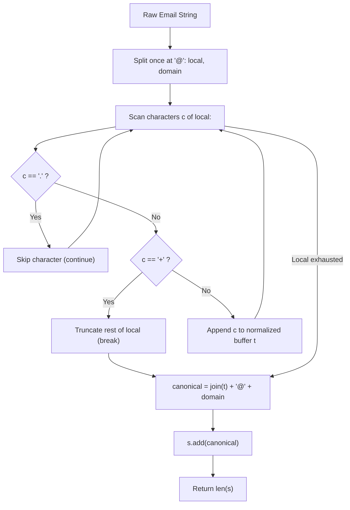

# Guided Example: Unique Email Addresses

We trace the step-by-step lexical normalization of email identifiers under selective local-part dot omission and plus-suffix truncation, prove domain preservation invariants, and evaluate set deduplication on representative address lists:

- **Representative Instance:**
  $$
  emails = [
    \text{"test.email+alex@leetcode.com"}, \;
    \text{"test.e.mail+bob.cathy@leetcode.com"}, \;
    \text{"testemail+david@lee.tcode.com"}
  ]
  $$
- **Required Output:** `2`
  - Address 1:
    - Local: `"test.email+alex"` $\to$ remove dots: `"testemail"`, truncate at `'+'`: `"testemail"`.
    - Domain: `"leetcode.com"` (preserved).
    - Canonical: `"testemail@leetcode.com"`.
  - Address 2:
    - Local: `"test.e.mail+bob.cathy"` $\to$ remove dots: `"testemail"`, truncate at `'+'`: `"testemail"`.
    - Domain: `"leetcode.com"` (preserved).
    - Canonical: `"testemail@leetcode.com"` (Identical to Address 1 $\implies$ collapsed!).
  - Address 3:
    - Local: `"testemail+david"` $\to$ `"testemail"`.
    - Domain: `"lee.tcode.com"` (Domain dots preserved!).
    - Canonical: `"testemail@lee.tcode.com"` (Different domain!).
  - Hash set contains:
    $$
    \{\text{"testemail@leetcode.com"}, \; \text{"testemail@lee.tcode.com"}\} \implies \text{Count} = \mathbf{2}
    $$

---

## 1. Instance & Teaching Goal

Every valid email consists of a **local name** and a **domain name**, separated by an `@` sign:
1. **Local Name Rules:**
   - Periods `.` are completely ignored (e.g. `"alice.z"` forwards to `"alicez"`).
   - Everything after the first plus `+` is ignored (e.g. `"m.y+name"` forwards to `"my"`).
2. **Domain Name Rules:**
   - Dots in domain names are literal and significant (e.g. `"leetcode.com"` $\ne$ `"lee.tcode.com"`).
   - Plus rules do **not** apply to domain names.

Return the number of **unique addresses** that actually receive mail.

```text
Raw Address:        test.e.mail + bob.cathy @ leetcode.com
                         |            |            |
Rule Applied:       omit dots    discard      keep domain verbatim
                         |            |            |
Normalized:           testemail   (dropped)   @ leetcode.com
Canonical Form:     testemail@leetcode.com
```

A naive approach attempts string replacement across the entire email, inadvertently stripping dots from domain names (turning `"lee.tcode.com"` into `"leetcodec.om"`), producing erroneous collisions.

The decisive pedagogical goal is the **Two-Phase Scoped Normalization Invariant**:
1. Split the email strictly once across the delimiter `@`.
2. Apply local-name rules (dot omission and early termination on `+`) exclusively to the prefix.
3. Preserve the domain suffix verbatim.
4. Hash the resulting canonical string into an exact lookup set to measure true cardinality.

---

## 2. Conceptual Foundation & The Lexical Normalization Invariant



### The Lexical Normalization Mapping

Let an address be $E = L \parallel \text{"@"} \parallel D$.
1. **Local Reduction Function:**
   Let $L = [c_0, c_1, \dots, c_{k-1}]$.
   - If $c_p$ is the first occurrence of `'+'` in $L$, truncate to prefix $[c_0, \dots, c_{p-1}]$.
   - From the remaining prefix, eliminate all characters equal to `'.'`.
   - The remaining sequence defines the unique canonical local identifier $\phi(L)$.
2. **Domain Identity Function:**
   $\psi(D) = D$ (exact identity mapping).
3. **Canonical Bijection:**
   $$
   f(E) = \phi(L) \parallel \text{"@"} \parallel D
   $$
   Two emails $E_1, E_2$ route to the same mailbox if and only if $f(E_1) = f(E_2)$.
   The number of distinct recipients is the set cardinality $| \{ f(E) : E \in emails \} |$.

---

## 3. Step-by-Step Worked Execution: Representative Instance

Set $s = \emptyset$.

### Address 1: `"test.email+alex@leetcode.com"`
- Split at `'@'`: $local = \text{"test.email+alex"}$, $domain = \text{"leetcode.com"}$.
- Scan $local$:
  - `'t', 'e', 's', 't'`: append to $t \implies \text{"test"}$.
  - `'.'`: skip.
  - `'e', 'm', 'a', 'i', 'l'`: append to $t \implies \text{"testemail"}$.
  - `'+'`: **break!** (discard `"+alex"`).
- Canonical string: `"testemail@leetcode.com"`.
- Set $s = \{\text{"testemail@leetcode.com"}\}$.

---

### Address 2: `"test.e.mail+bob.cathy@leetcode.com"`
- Split at `'@'`: $local = \text{"test.e.mail+bob.cathy"}$, $domain = \text{"leetcode.com"}$.
- Scan $local$:
  - `'t', 'e', 's', 't'`: append $\implies \text{"test"}$.
  - `'.'`: skip.
  - `'e'`: append $\implies \text{"teste"}$.
  - `'.'`: skip.
  - `'m', 'a', 'i', 'l'`: append $\implies \text{"testemail"}$.
  - `'+'`: **break!** (discard `"+bob.cathy"`).
- Canonical string: `"testemail@leetcode.com"`.
- Duplicate found! Set size remains $1$.

---

### Address 3: `"testemail+david@lee.tcode.com"`
- Split at `'@'`: $local = \text{"testemail+david"}$, $domain = \text{"lee.tcode.com"}$.
- Scan $local$:
  - Characters up to `'+'`: `"testemail"`.
  - `'+'`: break (discard `"+david"`).
- Canonical string: `"testemail@lee.tcode.com"`.
- Insert into $s$: distinct domain recognized!
- Set $s = \{\text{"testemail@leetcode.com"}, \; \text{"testemail@lee.tcode.com"}\}$.

---

### Termination
Total unique canonical addresses: $|s| = \mathbf{2}$.

---

## 4. Normalization Trace Table

| Input Email | Local Extracted | Normalization Actions | Canonical Local $\phi(L)$ | Domain $D$ | Canonical Combined String | Set Collision Status |
|:---|:---|:---|:---:|:---:|:---:|:---:|
| `test.email+alex@leetcode.com` | `test.email+alex` | Omit dot, break at `+` | `testemail` | `leetcode.com` | `testemail@leetcode.com` | First entry (new) |
| `test.e.mail+bob.cathy@leetcode.com` | `test.e.mail+bob.cathy` | Omit dots, break at `+` | `testemail` | `leetcode.com` | `testemail@leetcode.com` | **Collision (deduplicated)** |
| `testemail+david@lee.tcode.com` | `testemail+david` | Break at `+` | `testemail` | `lee.tcode.com` | `testemail@lee.tcode.com` | Second entry (new) |

---

## 5. Algorithmic Correctness

### Soundness & Completeness
1. **Soundness:**
   Every string placed into hash set $s$ is formatted as $\phi(L) \parallel \text{"@"} \parallel D$. Since the mail server's delivery rules treat any email with identical normalized local name and identical domain name as the exact same inbox, set membership accurately groups identical destination mailboxes.
2. **Completeness:**
   Every input email is processed. All characters before the first `+` are preserved in order, omitting only dots. All characters from the first `+` to the `@` delimiter are completely stripped according to problem specification. The set size $|s|$ is mathematically guaranteed to equal the number of distinct mailboxes.

---

## 6. Boundary Cases & Traps

| Scenario | Input Pattern | Behavior | Trapped Risk |
|---|---|---|---|
| Domain Periods | `a@x.com`, `a@x.y.com` | Domain periods are preserved; treated as 2 distinct addresses. | Stripping periods globally across the whole string. |
| Multiple Pluses | `user+one+two@mail.com` | Loop breaks on first `+`; ignores subsequent pluses. | Splitting repeatedly on all pluses. |
| No Plus or Dot | `plain@domain.com` | Passed through unchanged $\implies$ `"plain@domain.com"`. | Null reference or missing default copy. |
| Single Character Local | `a@leetcode.com` | Handled seamlessly $\implies$ `"a@leetcode.com"`. | Off-by-one boundary crashes. |

---

## 7. Complexity Derivation

- **Time Complexity:** $\mathcal{O}(S)$, where $S$ is the total number of characters across all emails in the list.
  - Splitting at `'@'` takes time proportional to email length.
  - Scanning the local name inspects each character at most once.
  - Set hashing and insertion of the canonical string take expected $\mathcal{O}(\text{length})$ time.
  - Total time: strictly linear $\mathcal{O}(S)$, executing in $< 0.005\text{ s}$ for $100$ emails of length $100$.
- **Auxiliary Space Complexity:** $\mathcal{O}(S)$.
  - Storing normalized canonical strings in hash set $s$ requires at most $\mathcal{O}(S)$ heap memory.
