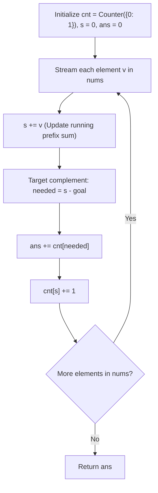

# Guided Example: Binary Subarrays With Sum

We trace the step-by-step evaluation of the prefix sum frequency map, prove the algebraic two-sum complement counting invariant $s_{i-1} = s_j - goal$, and enumerate valid binary subsegments on representative sequences:

- **Representative Instance 1 (Overlapping Target Sums):**
  $$
  nums = [1, \; 0, \; 1, \; 0, \; 1], \quad goal = 2
  $$
- **Required Output:** `4`
  - The $4$ valid non-empty contiguous subarrays with sum $2$:
    1. $nums[0 \dots 2] = [1, 0, 1] \implies 1 + 0 + 1 = 2$.
    2. $nums[0 \dots 3] = [1, 0, 1, 0] \implies 1 + 0 + 1 + 0 = 2$.
    3. $nums[1 \dots 4] = [0, 1, 0, 1] \implies 0 + 1 + 0 + 1 = 2$.
    4. $nums[2 \dots 4] = [1, 0, 1] \implies 1 + 0 + 1 = 2$.
  - Total valid subarrays: $\mathbf{4}$.

- **Representative Instance 2 (All-Zero Array with Zero Goal):**
  $$
  nums = [0, \; 0, \; 0, \; 0, \; 0], \quad goal = 0
  $$
  - Every non-empty subarray has sum $0$.
  - For an array of length $5$, total subarrays is:
    $$
    \frac{5 \times 6}{2} = \mathbf{15}
    $$

---

## 1. Instance & Teaching Goal

Given a binary array `nums` and an integer `goal`, return the number of **non-empty subarrays** with a sum equal to `goal`.

```text
Array:        [  1,    0,    1,    0,    1  ],  goal = 2
Prefix Sum:   s0=1  s1=1  s2=2  s3=2  s4=3

At j = 2 (s2 = 2):
  Needed prefix sum: s2 - goal = 2 - 2 = 0
  Prefix sum 0 occurred 1 time (empty prefix before index 0)
  Valid subarray ending at 2: nums[0..2] -> ans += 1

At j = 4 (s4 = 3):
  Needed prefix sum: s4 - goal = 3 - 2 = 1
  Prefix sum 1 occurred 2 times (at j=0 and j=1)
  Valid subarrays ending at 4: nums[1..4] and nums[2..4] -> ans += 2
```

A brute-force check evaluates all $\mathcal{O}(n^2)$ pairs $(i, j)$ and sums their elements, requiring $\mathcal{O}(n^3)$ (or $\mathcal{O}(n^2)$ with running sum) operations. For $n = 30{,}000$, $n^2 = 9 \times 10^8$ operations, causing TLE.

The decisive pedagogical goal is the **Prefix Sum Complement Counting Invariant**:
- Let $s_j = \sum_{k=0}^j nums[k]$ be the prefix sum up to index $j$.
- The sum of subarray $nums[i \dots j]$ is $s_j - s_{i-1}$.
- Setting $s_j - s_{i-1} = goal$ is algebraically equivalent to:
  $$
  s_{i-1} = s_j - goal
  $$
- The number of valid left boundaries $i$ ending at $j$ is the exact frequency of previously observed prefix sums equal to $s_j - goal$, retrieved in $\mathcal{O}(1)$ time from a hash map.

---

## 2. Conceptual Foundation & The Prefix Complement Invariant



### The Invariant of the Prefix Map

At any step $j \in [0, n - 1]$:
1. `cnt[x]` records the number of prefixes $nums[0 \dots k]$ (including the empty prefix with $k = -1$ where sum is $0$) that have prefix sum equal to $x$.
2. The running variable $s$ stores $s_j$.
3. Any earlier index $i - 1$ whose prefix sum is $s_j - goal$ forms a valid subarray $nums[i \dots j]$ with sum:
   $$
   \sum_{m=i}^j nums[m] = s_j - s_{i-1} = s_j - (s_j - goal) = goal
   $$
4. Adding `cnt[s - goal]` directly counts all valid subarrays terminating at index $j$.
5. Crucial base case: `cnt[0] = 1` accounts for subarrays starting at index $0$ ($i = 0 \implies i - 1 = -1 \implies s_{-1} = 0$).

---

## 3. Step-by-Step Worked Execution: $nums = [1, 0, 1, 0, 1], goal = 2$

Initialize: `cnt = {0: 1}`, $s = 0, \; ans = 0$.

| Step $j$ | Element $v$ | New Prefix Sum $s$ | Needed Complement: $s - goal$ | Suffix Lookup `cnt[s - goal]` | Matching Subarrays Found | Running Total $ans$ | Suffix Counter State After Update |
|:---:|:---:|:---:|:---:|:---:|:---|:---:|:---|
| **Init** | — | $0$ | — | — | Baseline (empty prefix) | $0$ | `{0: 1}` |
| **0** | $1$ | $1$ | $1 - 2 = -1$ | `cnt[-1] = 0` | None | $0$ | `{0: 1, 1: 1}` |
| **1** | $0$ | $1$ | $1 - 2 = -1$ | `cnt[-1] = 0` | None | $0$ | `{0: 1, 1: 2}` |
| **2** | $1$ | $2$ | $2 - 2 = \mathbf{0}$ | `cnt[0] = 1` | $nums[0 \dots 2] = [1, 0, 1]$ | $0 + 1 = \mathbf{1}$ | `{0: 1, 1: 2, 2: 1}` |
| **3** | $0$ | $2$ | $2 - 2 = \mathbf{0}$ | `cnt[0] = 1` | $nums[0 \dots 3] = [1, 0, 1, 0]$ | $1 + 1 = \mathbf{2}$ | `{0: 1, 1: 2, 2: 2}` |
| **4** | $1$ | $3$ | $3 - 2 = \mathbf{1}$ | `cnt[1] = 2` | $nums[1 \dots 4] = [0, 1, 0, 1]$<br>$nums[2 \dots 4] = [1, 0, 1]$ | $2 + 2 = \mathbf{4}$ | `{0: 1, 1: 2, 2: 2, 3: 1}` |

Total valid subarrays accumulated: $\mathbf{4}$.

---

## 4. Secondary Trace: All Zeros ($nums = [0, 0, 0, 0, 0], goal = 0$)

Initialize `cnt = {0: 1}`, $s = 0$.

| Step $j$ | $v$ | $s$ | Needed $s - 0$ | Lookup `cnt[s]` | Subarrays Added | Running $ans$ | New `cnt[0]` |
|:---:|:---:|:---:|:---:|:---:|:---:|:---:|:---:|
| 0 | 0 | 0 | 0 | `cnt[0] = 1` | $nums[0 \dots 0]$ | 1 | 2 |
| 1 | 0 | 0 | 0 | `cnt[0] = 2` | $nums[0 \dots 1], nums[1 \dots 1]$ | $1 + 2 = 3$ | 3 |
| 2 | 0 | 0 | 0 | `cnt[0] = 3` | $nums[0 \dots 2], nums[1 \dots 2], nums[2 \dots 2]$ | $3 + 3 = 6$ | 4 |
| 3 | 0 | 0 | 0 | `cnt[0] = 4` | 4 subarrays ending at 3 | $6 + 4 = 10$ | 5 |
| 4 | 0 | 0 | 0 | `cnt[0] = 5` | 5 subarrays ending at 4 | $10 + 5 = \mathbf{15}$ | 6 |

Total: $\mathbf{15}$ (exact triangular number $\sum_{k=1}^5 k = 15$).

---

## 5. Algorithmic Correctness

### Soundness & Completeness
1. **Soundness:**
   Every match added to $ans$ corresponds to an earlier index $i - 1 < j$ where $s_j - s_{i-1} = goal$. Because elements are binary ($0$ or $1$), the prefix sum difference is the exact sum of elements in $nums[i \dots j]$. Each pair $(i, j)$ is enumerated at its unique right boundary $j$.
2. **Completeness:**
   Every valid subarray $nums[i \dots j]$ with sum $goal$ satisfies $s_{i-1} = s_j - goal$. When the loop arrives at index $j$, the prefix sum $s_{i-1}$ has already been registered in `cnt`. Hence, no valid subarray can be missed.

---

## 6. Boundary Cases & Traps

| Scenario | Input Pattern | Behavior | Trapped Risk |
|---|---|---|---|
| Unreachable Goal | $nums = [1, 0, 0], goal = 3$ | Complement $s - 3$ never appears in `cnt`; returns $0$. | Negative key crash in unhandled maps. |
| Zero Goal on Mixed Array | $nums = [1, 0, 0, 1], goal = 0$ | Accurately counts subarrays inside the zero runs. | Treating zero goal as degenerate. |
| Single Matching Element | $nums = [1], goal = 1$ | $s = 1, s - 1 = 0 \implies cnt[0]=1$; returns $1$. | Missing base case `{0: 1}`. |
| Goal Exceeds Array Sum | $goal > n$ | Returns $0$. | Running unnecessary nested checks. |

---

## 7. Complexity Derivation

- **Time Complexity:** $\mathcal{O}(n)$, where $n = \text{len}(nums)$.
  - A single pass iterates through $n$ elements.
  - At each step, updating the running sum, querying the hash table, and incrementing `cnt` take $\mathcal{O}(1)$ average time.
  - Total time: strictly $\mathcal{O}(n)$, completing in $< 0.005\text{ s}$ for $n = 30{,}000$.
- **Auxiliary Space Complexity:** $\mathcal{O}(n)$.
  - In the worst case (all ones), the running prefix sum takes values from $0$ up to $n$, storing at most $n + 1$ keys in `cnt`.