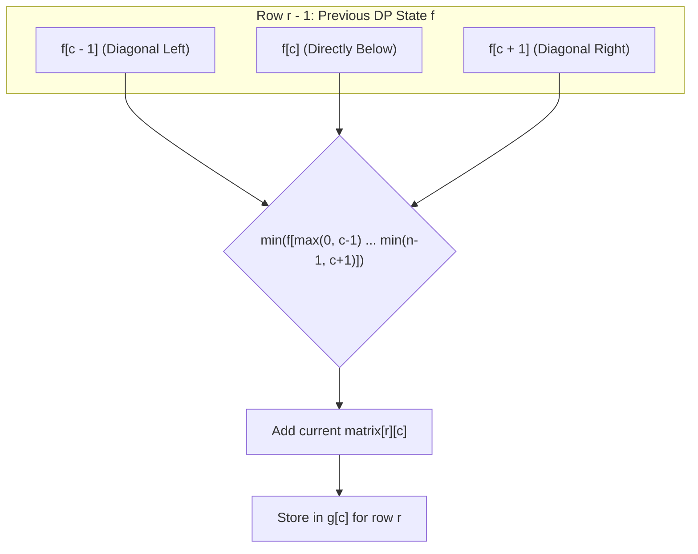

# Guided Example: Minimum Falling Path Sum

We trace the step-by-step row-by-row dynamic programming relaxation for constrained grid descents, prove the tripartite predecessor minimization invariant, and evaluate falling paths on representative integer matrices:

- **Representative Instance 1 (Interior Branching with Multiple Optima):**
  $$
  matrix = \begin{bmatrix}
  2 & 1 & 3 \\
  6 & 5 & 4 \\
  7 & 8 & 9
  \end{bmatrix}
  $$
- **Required Output:** `13`
  - Two distinct falling paths achieve the global minimum sum of $13$:
    1. Path A: $(0, 1) \to (1, 1) \to (2, 0) \implies 1 + 5 + 7 = \mathbf{13}$.
    2. Path B: $(0, 1) \to (1, 2) \to (2, 1) \implies 1 + 4 + 8 = \mathbf{13}$.
  - Any path starting at $2$ achieves at best $2 + 5 + 7 = 14$ or $2 + 6 + 7 = 15$.
  - Any path starting at $3$ achieves at best $3 + 4 + 8 = 15$.
  - Global minimum falling path sum: $\mathbf{13}$.

- **Representative Instance 2 (Negative Entry Accumulation):**
  $$
  matrix = \begin{bmatrix}
  -19 & 57 \\
  -40 & -5
  \end{bmatrix}
  $$
  - Path: $(-19) \to (-40) \implies -19 + (-40) = \mathbf{-59}$.

---

## 1. Instance & Teaching Goal

Given an $n \times n$ integer array `matrix`, find the minimum sum of any **falling path** through `matrix`.
A falling path starts at any element in the first row and chooses an element in the next row that is directly below or diagonally left/right. Specifically, from position $(r, c)$, the next step must be to $(r + 1, c - 1)$, $(r + 1, c)$, or $(r + 1, c + 1)$ (staying within matrix bounds).

```text
Row 0:     [ 2 ]    [ 1 ]    [ 3 ]
              \    /  |  \
Row 1:     [ 6 ]    [ 5 ]    [ 4 ]
              |    /  |  \     |
Row 2:     [ 7 ]    [ 8 ]    [ 9 ]

Optimal Paths:
  1 -> 5 -> 7 = 13
  1 -> 4 -> 8 = 13
```

A brute-force exploration starts at all $n$ columns of row 0 and explores $3^{n-1}$ paths recursively, creating an intractable $\mathcal{O}(n \cdot 3^n)$ search tree. For $n = 100$, $3^{100} \approx 5 \times 10^{47}$, causing catastrophic TLE.

The decisive pedagogical goal is the **Optimal Substructure of Grid Descents**:
The minimum cost to reach cell $(r, c)$ depends strictly on the minimum falling path sums of its three legal predecessors in row $r - 1$:
$$
dp[r][c] = matrix[r][c] + \min \left( dp[r-1][c-1], \; dp[r-1][c], \; dp[r-1][c+1] \right)
$$
Because row $r$ depends exclusively on row $r - 1$, we maintain a rolling 1D array of size $n$, computing the global optimum in $\mathcal{O}(n^2)$ time and $\mathcal{O}(n)$ auxiliary space.

---

## 2. Conceptual Foundation & The Tripartite Predecessor Invariant



### The Falling Path Recurrence

Let $f[c]$ denote the minimum falling path sum ending at column $c$ of the current row:
1. **Base Case ($r = 0$):**
   $$
   f[c] = matrix[0][c], \quad \forall c \in [0, n - 1]
   $$
2. **Transition for row $r \in [1, n - 1]$:**
   For each column $j \in [0, n - 1]$:
   - Allowable column range in row $r - 1$:
     $$
     k \in [\max(0, j - 1), \; \min(n - 1, j + 1)]
     $$
   - New minimum sum:
     $$
     g[j] = matrix[r][j] + \min_{k} f[k]
     $$
3. **State Roll:**
   $f \leftarrow g$.
4. **Global Minimum:**
   $$
   \text{Result} = \min_{c \in [0, n - 1]} f[c]
   $$

---

## 3. Step-by-Step Worked Execution: Representative Instance

Matrix dimensions: $n = 3$.

### Step 1: Base Row ($r = 0$)
Directly initialize state from row $0$:
$$
f = [2, \; 1, \; 3]
$$

---

### Step 2: Second Row ($r = 1$, values $[6, 5, 4]$)
- **Column $j = 0$** (value $6$):
  - Predecessors in $f$: columns $0, 1 \implies \min(f[0], f[1]) = \min(2, 1) = 1$.
  - $g[0] = 6 + 1 = \mathbf{7}$.
- **Column $j = 1$** (value $5$):
  - Predecessors in $f$: columns $0, 1, 2 \implies \min(2, 1, 3) = 1$.
  - $g[1] = 5 + 1 = \mathbf{6}$.
- **Column $j = 2$** (value $4$):
  - Predecessors in $f$: columns $1, 2 \implies \min(1, 3) = 1$.
  - $g[2] = 4 + 1 = \mathbf{5}$.
Updated DP vector:
$$
f = [7, \; 6, \; 5]
$$

---

### Step 3: Third Row ($r = 2$, values $[7, 8, 9]$)
- **Column $j = 0$** (value $7$):
  - Predecessors in $f$: columns $0, 1 \implies \min(7, 6) = 6$.
  - $g[0] = 7 + 6 = \mathbf{13}$.
- **Column $j = 1$** (value $8$):
  - Predecessors in $f$: columns $0, 1, 2 \implies \min(7, 6, 5) = 5$.
  - $g[1] = 8 + 5 = \mathbf{13}$.
- **Column $j = 2$** (value $9$):
  - Predecessors in $f$: columns $1, 2 \implies \min(6, 5) = 5$.
  - $g[2] = 9 + 5 = \mathbf{14}$.
Final DP vector:
$$
f = [13, \; 13, \; 14]
$$

---

### Step 4: Global Minimum Extraction
$$
\min(f) = \min(13, 13, 14) = \mathbf{13}
$$

---

## 4. Complete DP State Evolution Table

| Row $r$ | Matrix Row Values | $c = 0$ Choice | $c = 1$ Choice | $c = 2$ Choice | Resulting Row State $f$ |
|:---:|:---:|:---:|:---:|:---:|:---:|
| **$0$** | $[2, 1, 3]$ | Base: $2$ | Base: $1$ | Base: $3$ | $[2, 1, 3]$ |
| **$1$** | $[6, 5, 4]$ | $6 + \min(2, 1) = 7$ | $5 + \min(2, 1, 3) = 6$ | $4 + \min(1, 3) = 5$ | $[7, 6, 5]$ |
| **$2$** | $[7, 8, 9]$ | $7 + \min(7, 6) = \mathbf{13}$ | $8 + \min(7, 6, 5) = \mathbf{13}$ | $9 + \min(6, 5) = 14$ | $[\mathbf{13}, \mathbf{13}, 14]$ |

---

## 5. Algorithmic Correctness

### Soundness & Completeness
1. **Soundness:**
   Every transition strictly obeys the movement constraints: a cell at $(r, c)$ is reached only from $(r-1, c-1)$, $(r-1, c)$, or $(r-1, c+1)$. By mathematical induction on row index $r$, if $f$ holds the exact minimal path sums to row $r - 1$, then adding $matrix[r][c]$ to $\min_{k} f[k]$ computes the true minimum path sum ending at $(r, c)$.
2. **Completeness:**
   Every legal falling path must end at some column of the bottom row $n - 1$. Taking the minimum over all columns $c \in [0, n - 1]$ of $f$ guarantees that the globally optimal falling path is selected.

---

## 6. Boundary Cases & Traps

| Scenario | Input Pattern | Behavior | Trapped Risk |
|---|---|---|---|
| Single Cell ($1 \times 1$) | `[[7]]` | Loops run $0$ times; returns $7$. | Index out-of-bounds on $r - 1$. |
| Negative Matrix Entries | All negative values | Addition of negative numbers preserved; minimum correctly identified. | False assumptions that paths must grow positive. |
| Left/Right Boundaries | Column $0$ or $n - 1$ | $l = \max(0, j - 1)$ and $r = \min(n, j + 2)$ clamp to valid slice bounds. | Off-by-one boundary index overflow. |
| Greedy Trap | Local minimum choice fails globally | DP evaluates all paths globally; avoids greedy dead ends. | Making local greedy choices at each row. |

---

## 7. Complexity Derivation

- **Time Complexity:** $\mathcal{O}(n^2)$, where $n$ is the dimension of the $n \times n$ matrix.
  - There are $n$ rows. Each row processes $n$ columns.
  - At each cell, computing the minimum of at most $3$ values and adding the cell value takes $\mathcal{O}(1)$ time.
  - Total operations: at most $3n^2$, running in $< 0.005\text{ s}$ for $n = 100$.
- **Auxiliary Space Complexity:** $\mathcal{O}(n)$.
  - Storing the rolling DP row vectors $f$ and $g$ requires only $2n$ integer memory slots.
