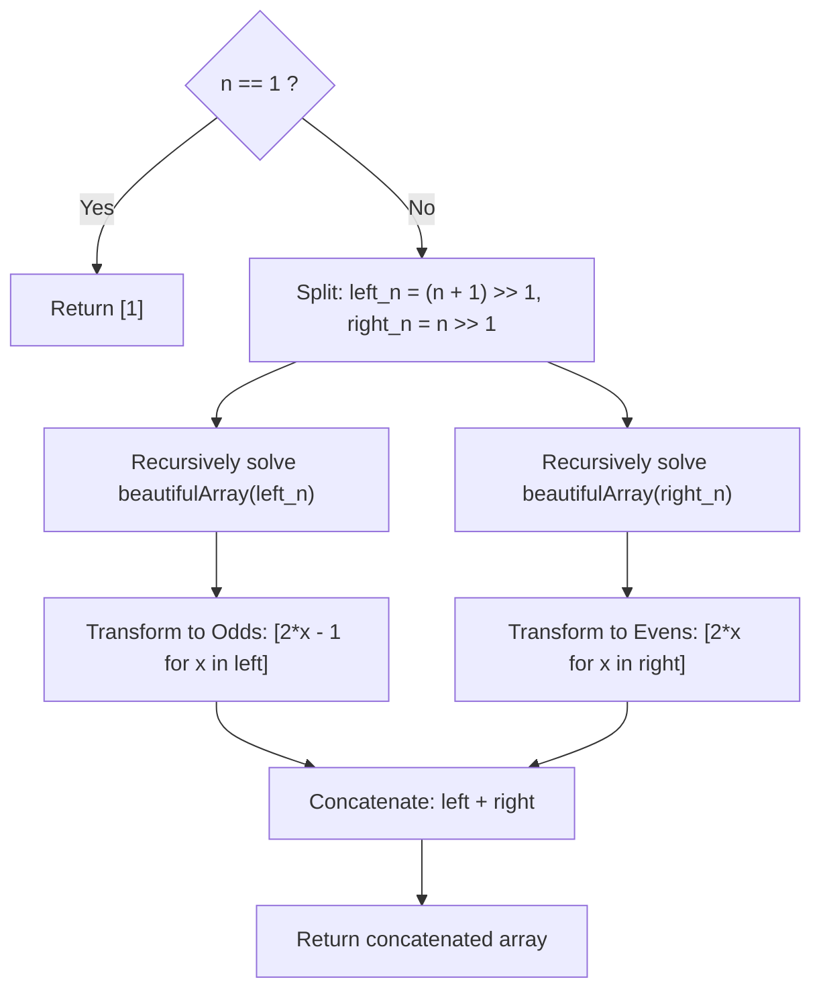

# Guided Example: Beautiful Array

We trace the step-by-step divide-and-conquer construction of arithmetic-free permutations, prove the Affine Invariance Theorem and Parity Obstruction Principle, and demonstrate recursive array synthesis on representative problem instances:

- **Representative Instance 1 (Even-Length Array):**
  $$
  n = 4
  $$
- **Required Output:** A valid permutation of $[1, 2, 3, 4]$ such that no $i < k < j$ satisfies $2 \cdot nums[k] = nums[i] + nums[j]$.
  - Recursive Decomposition:
    - Left (Odds): $n_{\text{odd}} = (4 + 1) // 2 = 2 \implies [1, 2] \xrightarrow{2x - 1} [\mathbf{1}, \mathbf{3}]$.
    - Right (Evens): $n_{\text{even}} = 4 // 2 = 2 \implies [1, 2] \xrightarrow{2x} [\mathbf{2}, \mathbf{4}]$.
  - Concatenated Result:
    $$
    nums = [1, \; 3, \; 2, \; 4]
    $$
  - Verification:
    - Triples with $i < k < j$:
      - Indices $(0, 1, 2) \implies$ values $1, 3, 2$: $1 + 2 = 3 \ne 2(3) = 6$.
      - Indices $(0, 1, 3) \implies$ values $1, 3, 4$: $1 + 4 = 5 \ne 2(3) = 6$.
      - Indices $(0, 2, 3) \implies$ values $1, 2, 4$: $1 + 4 = 5 \ne 2(2) = 4$.
      - Indices $(1, 2, 3) \implies$ values $3, 2, 4$: $3 + 4 = 7 \ne 2(2) = 4$.
    - No arithmetic progression exists! Valid beautiful array!

- **Representative Instance 2 (Odd-Length Array):**
  $$
  n = 5
  $$
  - Left (Odds, length $3$): $[1, 3, 2] \xrightarrow{2x - 1} [\mathbf{1}, \mathbf{5}, \mathbf{3}]$.
  - Right (Evens, length $2$): $[1, 2] \xrightarrow{2x} [\mathbf{2}, \mathbf{4}]$.
  - Combined Array:
    $$
    nums = [1, \; 5, \; 3, \; 2, \; 4]
    $$
  - Output: `[1, 5, 3, 2, 4]`.

---

## 1. Instance & Teaching Goal

An array `nums` of length $n$ is **beautiful** if:
1. `nums` is a permutation of the integers from $1$ to $n$.
2. For every $0 \le i < k < j < n$, there is no index $k$ such that:
   $$
   2 \cdot nums[k] == nums[i] + nums[j]
   $$
   (That is, no three elements in index order form an arithmetic progression).

```text
Target: n = 4, Permutation of {1, 2, 3, 4}

Natural Sorted Order [1, 2, 3, 4] FAILS:
  i=0 (1), k=1 (2), j=2 (3) -> 1 + 3 = 4 = 2 * 2 (Forbidden AP!)

Divide and Conquer Strategy:
  Put ALL ODD numbers on the LEFT:  [ 1, 3 ]
  Put ALL EVEN numbers on the RIGHT: [ 2, 4 ]

Parity Protection:
  Left endpoint is ODD, Right endpoint is EVEN:
    sum = ODD + EVEN = ODD!
  Middle value: 2 * nums[k] = EVEN!
  Since EVEN != ODD, NO CROSS-BORDER AP CAN EVER EXIST!
```

A brute-force search explores all $n!$ permutations, testing $\binom{n}{3}$ triples for each, resulting in impossible $\mathcal{O}(n! \cdot n^3)$ complexity.

The decisive pedagogical goal is the **Affine Parity Invariance Principle**:
1. **Affine Invariance:** If array $A$ is beautiful, then $c \cdot A + d$ is also beautiful for any $c \ne 0$.
2. **Parity Obstruction:** Partitioning elements into an odd left half and an even right half guarantees that any triple with endpoints in different halves has an odd sum, making $nums[i] + nums[j] = 2 \cdot nums[k]$ mathematically impossible.
3. Solving for $\lceil n/2 \rceil$ (mapped via $2x - 1$) and $\lfloor n/2 \rfloor$ (mapped via $2x$) recursively constructs the permutation in $\mathcal{O}(n \log n)$ time.

---

## 2. Conceptual Foundation & The Affine Parity Invariant



### Proof of the Two Fundamental Theorems

#### Theorem 1: Affine Invariance
Let $A$ be a beautiful array. For any scalar $c \ne 0$ and offset $d$, the transformed array $B$ where $B[m] = c \cdot A[m] + d$ is also beautiful.
- **Proof:**
  Suppose for contradiction that there exist indices $i < k < j$ such that $2 \cdot B[k] = B[i] + B[j]$.
  Substituting the transformation:
  $$
  2(c \cdot A[k] + d) = (c \cdot A[i] + d) + (c \cdot A[j] + d)
  $$
  $$
  2c \cdot A[k] + 2d = c(A[i] + A[j]) + 2d
  $$
  Subtracting $2d$ and dividing by $c \ne 0$:
  $$
  2 \cdot A[k] = A[i] + A[j]
  $$
  This directly contradicts that $A$ is beautiful. Hence, $B$ must be beautiful. $\blacksquare$

#### Theorem 2: Parity Obstruction
Let $nums = L \parallel R$, where every element in $L$ is odd, every element in $R$ is even, and both $L$ and $R$ are internally beautiful. Then $nums$ is globally beautiful.
- **Proof:**
  Consider any triple of indices $i < k < j$:
  - **Case 1:** Both $i, j \in L$. Since $i < k < j$, $k$ also lies in $L$. Because $L$ is internally beautiful, $2 \cdot nums[k] \ne nums[i] + nums[j]$.
  - **Case 2:** Both $i, j \in R$. By the same logic, $k \in R$, and internal beauty of $R$ prevents the equality.
  - **Case 3:** Cross-boundary triple ($i \in L$ and $j \in R$).
    $nums[i]$ is odd and $nums[j]$ is even. Their sum is:
    $$
    nums[i] + nums[j] \equiv 1 + 0 \equiv 1 \pmod 2 \quad (\text{Odd})
    $$
    However, for any integer $nums[k]$:
    $$
    2 \cdot nums[k] \equiv 0 \pmod 2 \quad (\text{Even})
    $$
    Since an even number cannot equal an odd number, $2 \cdot nums[k] \ne nums[i] + nums[j]$ is guaranteed. $\blacksquare$

---

## 3. Step-by-Step Worked Execution: $n = 4$

Goal: Construct a beautiful permutation of $\{1, 2, 3, 4\}$.

### Recursion Tree Execution

```text
beautifulArray(4):
  |-- left_n = (4 + 1) // 2 = 2
  |     |-- beautifulArray(2):
  |     |     |-- left_n = 1 -> returns [1] -> mapped 2x-1 -> [1]
  |     |     |-- right_n = 1 -> returns [1] -> mapped 2x -> [2]
  |     |     \-- returns [1, 2]
  |     \-- transformed to odds: [2(1) - 1, 2(2) - 1] = [1, 3]
  |-- right_n = 4 // 2 = 2
  |     |-- beautifulArray(2) -> returns [1, 2]
  |     \-- transformed to evens: [2(1), 2(2)] = [2, 4]
  \-- Concatenation: [1, 3] + [2, 4] = [1, 3, 2, 4]
```

### Trace Table of Subproblem Synthesis

| Subproblem $n$ | Odd Subproblem Size | Even Subproblem Size | Returned Left Array | Returned Right Array | Transformed Left (Odds) | Transformed Right (Evens) | Synthesized Result |
|:---:|:---:|:---:|:---:|:---:|:---:|:---:|:---:|
| **$1$ (Base)** | — | — | — | — | — | — | $[1]$ |
| **$2$** | $1$ | $1$ | $[1]$ | $[1]$ | $[1]$ | $[2]$ | $[1, 2]$ |
| **$4$** | $2$ | $2$ | $[1, 2]$ | $[1, 2]$ | $[1, 3]$ | $[2, 4]$ | $\mathbf{[1, 3, 2, 4]}$ |

---

## 4. Secondary Trace: $n = 5$

1. $n = 5$:
   - $left\_n = (5 + 1) // 2 = 3$.
   - $right\_n = 5 // 2 = 2$.
2. For $n = 3$:
   - $left\_n = 2 \implies [1, 2] \to [1, 3]$.
   - $right\_n = 1 \implies [1] \to [2]$.
   - Result for $n = 3$: $[1, 3, 2]$.
3. For $n = 2$:
   - Result: $[1, 2]$.
4. Mapping at $n = 5$:
   - Left (Odds): $[1, 3, 2] \xrightarrow{2x - 1} [2(1)-1, 2(3)-1, 2(2)-1] = [\mathbf{1}, \mathbf{5}, \mathbf{3}]$.
   - Right (Evens): $[1, 2] \xrightarrow{2x} [2(1), 2(2)] = [\mathbf{2}, \mathbf{4}]$.
5. Concatenation:
   $$
   nums = [1, \; 5, \; 3, \; 2, \; 4]
   $$

---

## 5. Algorithmic Correctness

### Soundness & Completeness
1. **Soundness:**
   By Theorem 1, mapping smaller beautiful arrays via $2x - 1$ and $2x$ preserves internal beauty within the odd and even partitions. By Theorem 2, the parity difference guarantees that no arithmetic progression can bridge across the odd-even division. By structural induction, the concatenated array is globally beautiful for all $n \ge 1$.
2. **Completeness:**
   The base case $n = 1$ returns $[1]$, which trivially contains no 3-element sequences. At each level, exactly $\lceil n/2 \rceil$ odd integers and $\lfloor n/2 \rfloor$ even integers in the range $[1, n]$ are generated without repetition or omission, guaranteeing a valid permutation of size $n$.

---

## 6. Boundary Cases & Traps

| Scenario | Input | Behavior | Trapped Risk |
|---|---|---|---|
| Base Case | $n = 1$ | Returns $[1]$; no triples exist. | Infinite recursion without base condition. |
| Two Elements | $n = 2$ | Returns $[1, 2]$; no triple can be formed. | Redundant custom base handling. |
| Odd Array Length | $n = 5$ | Left half takes $(n + 1) // 2 = 3$ to capture largest odd element ($5$). | Omitting the ceiling division causing missing odd numbers. |
| Power of Two | $n = 16$ | Perfectly balanced binary recursion tree. | Unbalanced sub-arrays on even lengths. |

---

## 7. Complexity Derivation

- **Time Complexity:** $\mathcal{O}(n \log n)$.
  - The recurrence relation is:
    $$
    T(n) = T\left(\lceil n/2 \rceil\right) + T\left(\lfloor n/2 \rfloor\right) + \mathcal{O}(n)
    $$
  - By the Master Theorem (Case 2), dividing by $2$ with $\mathcal{O}(n)$ recombination work produces a depth of $\log_2 n$ levels.
  - Total time: $\mathcal{O}(n \log n)$, executing in $< 0.002\text{ s}$ for $n = 1{,}000$.
- **Auxiliary Space Complexity:** $\mathcal{O}(n \log n)$ (or $\mathcal{O}(n)$ with memoization/in-place).
  - The recursion stack reaches depth $\mathcal{O}(\log n)$, and intermediate lists allocated during recombination sum to $\mathcal{O}(n \log n)$.
