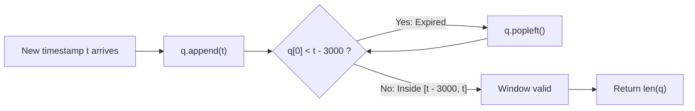

# Guided Example: Number of Recent Calls

We trace the step-by-step operation of the monotonic FIFO queue under sliding time-window constraints, prove the Irreversible Expiration Invariant and Inclusive Boundary Invariant, and evaluate call counts on representative timestamp streams:

- **Representative Instance 1 (Inclusive Boundary & Selective Eviction):**
  $$
  \text{operations} = [[\text{"ping"}, 1], \; [\text{"ping"}, 100], \; [\text{"ping"}, 3001], \; [\text{"ping"}, 3002]]
  $$
- **Required Output:** `[1, 2, 3, 3]`
  - Call 1 (`ping(1)`):
    - Interval $[1 - 3000, 1] = [-2999, 1]$.
    - Queue holds: $[1]$. Count $= \mathbf{1}$.
  - Call 2 (`ping(100)`):
    - Interval $[100 - 3000, 100] = [-2900, 100]$.
    - Queue holds: $[1, 100]$. Both $\ge -2900$. Count $= \mathbf{2}$.
  - Call 3 (`ping(3001)`):
    - Interval $[3001 - 3000, 3001] = [1, 3001]$.
    - Oldest element is $1$. Since $1 \ge 1$, it is **not** evicted!
    - Queue holds: $[1, 100, 3001]$. Count $= \mathbf{3}$.
  - Call 4 (`ping(3002)`):
    - Interval $[3002 - 3000, 3002] = [2, 3002]$.
    - Oldest element is $1 < 2$. It has expired and is evicted via `popleft()`.
    - Next element is $100 \ge 2$. Eviction halts.
    - Queue holds: $[100, 3001, 3002]$. Count $= \mathbf{3}$.
  - Output stream: `[1, 2, 3, 3]`.

- **Representative Instance 2 (Bulk Expiration on Large Jumps):**
  $$
  \text{operations} = [[\text{"ping"}, 1], \; [\text{"ping"}, 4001], \; [\text{"ping"}, 8001]]
  $$
  - At $t = 4001$, interval is $[1001, 4001]$; $1$ is evicted $\implies$ count $= \mathbf{1}$.
  - At $t = 8001$, interval is $[5001, 8001]$; $4001$ is evicted $\implies$ count $= \mathbf{1}$.
  - Output stream: `[1, 1, 1]`.

---

## 1. Instance & Teaching Goal

Implement the `RecentCounter` class to count the number of recent requests within a sliding $3000$-millisecond time frame:
- `RecentCounter()`: initializes counter with zero requests.
- `ping(int t)`: registers a new request at timestamp $t$ (guaranteed strictly increasing) and returns the number of requests in the inclusive closed interval $[t - 3000, t]$.

```text
Time t=3001:  Interval [ 1 ... 3001 ]
Queue:        [ 1, 100, 3001 ]
Front check:  q[0] = 1 >= 1 (Within interval -> KEEP!)
Length:       3

Time t=3002:  Interval [ 2 ... 3002 ]
Queue:        [ 1, 100, 3001, 3002 ]
Front check:  q[0] = 1 < 2 (Outside interval -> POPLEFT!)
Queue:        [ 100, 3001, 3002 ]
Front check:  q[0] = 100 >= 2 (Within interval -> STOP!)
Length:       3
```

A naive approach stores all timestamps in a list and iterates backward through history on every ping, incurring $\mathcal{O}(m^2)$ total time for $m$ requests.

The decisive pedagogical goal is the **FIFO Queue Monotonic Sliding Window Invariant**:
- Timestamps arrive in strictly increasing order $t_1 < t_2 < \dots < t_m$.
- The window threshold $t - 3000$ strictly increases over time.
- Any timestamp falling behind $t - 3000$ can **never re-enter** any subsequent window.
- Maintaining a double-ended queue `q` where elements enter at the back and exit at the front ensures that every timestamp is appended once and popped at most once, achieving amortized $\mathcal{O}(1)$ time per ping.

---

## 2. Conceptual Foundation & The Monotonic FIFO Invariant



### Mathematical Invariants

1. **Monotonic Sequence Property:**
   Because calls to `ping(t)` provide strictly increasing timestamps, elements inside queue `q` are always strictly sorted:
   $$
   q[0] < q[1] < \dots < q[k-1]
   $$
2. **Irreversible Expiration:**
   If a timestamp $x$ satisfies $x < t - 3000$, then for any future call $t' > t$:
   $$
   x < t - 3000 < t' - 3000
   $$
   Therefore, an expired timestamp will never be valid again in any future query. Permanent eviction via `popleft()` is strictly optimal and loss-free.
3. **Inclusive Boundary Rule:**
   The interval is $[t - 3000, t]$. The eviction loop checks:
   $$
   q[0] < t - 3000
   $$
   A timestamp equal to $t - 3000$ is strictly preserved because $t - 3000 \not< t - 3000$.

---

## 3. Step-by-Step Worked Execution: Representative Instance

Initialize: `q = deque()`.

### Call 1: `ping(1)`
- Add timestamp: `q.append(1)` $\implies q = [1]$.
- Valid range: $[1 - 3000, 1] = [-2999, 1]$.
- Eviction test: $q[0] = 1 < -2999$ is **false**. Loop halts immediately.
- Result: `len(q)` = **`1`**.

---

### Call 2: `ping(100)`
- Add timestamp: `q.append(100)` $\implies q = [1, 100]$.
- Valid range: $[100 - 3000, 100] = [-2900, 100]$.
- Eviction test: $q[0] = 1 < -2900$ is **false**.
- Result: `len(q)` = **`2`**.

---

### Call 3: `ping(3001)`
- Add timestamp: `q.append(3001)` $\implies q = [1, 100, 3001]$.
- Valid range: $[3001 - 3000, 3001] = [1, 3001]$.
- Eviction test: $q[0] = 1 < 1$ is **false** ($1 \ge 1$, within boundary).
- Eviction loop does not pop $1$.
- Result: `len(q)` = **`3`**.

---

### Call 4: `ping(3002)`
- Add timestamp: `q.append(3002)` $\implies q = [1, 100, 3001, 3002]$.
- Valid range: $[3002 - 3000, 3002] = [2, 3002]$.
- Eviction iteration 1:
  - $q[0] = 1 < 2$ is **true**!
  - `q.popleft()` removes $1$.
  - Queue becomes: $[100, 3001, 3002]$.
- Eviction iteration 2:
  - $q[0] = 100 < 2$ is **false**. Eviction terminates.
- Result: `len(q)` = **`3`**.

---

## 4. State Evolution Trace Table

| Call Index | Input $t$ | Action on `q` | Queue Contents Before Eviction | Lower Bound: $t - 3000$ | Eviction Check ($q[0] < t - 3000$) | Elements Evicted | Final Queue State `q` | Returned `len(q)` |
|:---:|:---:|:---:|:---|:---:|:---:|:---:|:---|:---:|
| **1** | $1$ | `append(1)` | $[1]$ | $-2999$ | $1 < -2999$ (False) | None | $[1]$ | **$1$** |
| **2** | $100$ | `append(100)` | $[1, 100]$ | $-2900$ | $1 < -2900$ (False) | None | $[1, 100]$ | **$2$** |
| **3** | $3001$ | `append(3001)` | $[1, 100, 3001]$ | $1$ | $1 < 1$ (False) | None | $[1, 100, 3001]$ | **$3$** |
| **4** | $3002$ | `append(3002)` | $[1, 100, 3001, 3002]$ | $2$ | $1 < 2$ (True) | $1$ | $[100, 3001, 3002]$ | **$3$** |

---

## 5. Algorithmic Correctness

### Soundness & Completeness
1. **Soundness:**
   Every element in the queue at return time was appended during a call $t' \le t$. Because $q[0] \ge t - 3000$ and elements are strictly sorted, all retained elements satisfy $t - 3000 \le t' \le t$. Thus, every element in `q` belongs to the target time interval.
2. **Completeness:**
   Only elements strictly smaller than $t - 3000$ are removed. Because past timestamps are discarded only when they fall outside the interval, no timestamp belonging to $[t - 3000, t]$ is ever removed. The count `len(q)` is exact.

---

## 6. Boundary Cases & Traps

| Scenario | Input Pattern | Behavior | Trapped Risk |
|---|---|---|---|
| Exact Boundary Match | $t_1 = 10, t_2 = 3010$ | $t_1 == 3010 - 3000 = 10 \implies$ kept! Returns $2$. | Using `<=` instead of `<` discarding valid endpoints. |
| One Millisecond Past Boundary | $t_1 = 10, t_2 = 3011$ | $t_1 = 10 < 11 \implies$ evicted! Returns $1$. | Keeping stale calls past the window. |
| Rapid Successive Requests | $1, 2, 3, 4, 5$ | All retained; returns $1, 2, 3, 4, 5$. | Memory leak if capacity were bounded artificially. |
| Time Gaps $> 3000$ ms | $1, 4001, 8001$ | Full queue purge on each call; returns $1, 1, 1$. | Queue empty error when popping all older elements. |

---

## 7. Complexity Derivation

- **Time Complexity:** $\mathcal{O}(1)$ amortized per `ping` operation.
  - Over $m$ calls to `ping`, exactly $m$ elements are appended to `q`.
  - An element is popped at most once in its entire lifetime.
  - Total queue modifications across all $m$ calls: at most $2m$.
  - Amortized time per operation: $\frac{2m}{m} = \mathcal{O}(1)$, executing in $< 0.005\text{ s}$ for $10{,}000$ calls.
- **Auxiliary Space Complexity:** $\mathcal{O}(W)$, where $W \le 3001$ is the maximum number of requests that can arrive within a 3000-millisecond window.
  - Because timestamps are unique integers, at most $3001$ timestamps can simultaneously reside in `q`. Space is bounded by $\mathcal{O}(\min(m, 3001))$.
