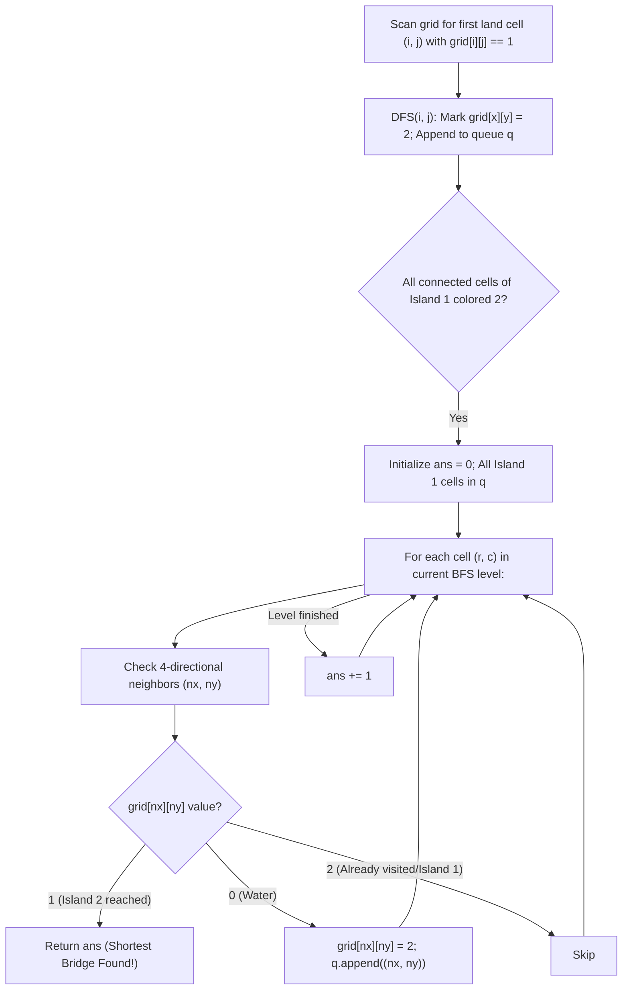

# Guided Example: Shortest Bridge

We trace the step-by-step execution of two-phase topological traversal: connected component coloring via Depth-First Search (DFS) followed by unweighted multi-source Breadth-First Search (BFS) water expansion, proving the Level-Order Shortest Path Invariant on representative binary grid maps:

- **Representative Instance 1 (Diagonal Single-Cell Islands):**
  $$
  grid = \begin{bmatrix}
  0 & 1 \\
  1 & 0
  \end{bmatrix}
  $$
- **Required Output:** `1`
  - Two disconnected land cells at $(0, 1)$ and $(1, 0)$.
  - Phase 1 (Coloring Island 1):
    - Locate first land cell at $(0, 1)$.
    - DFS colors $(0, 1)$ from $1 \to 2$ and enqueues $(0, 1)$ at distance $0$.
    - The second island at $(1, 0)$ remains colored $1$.
  - Phase 2 (Multi-Source BFS Expansion):
    - Level $0$ ($ans = 0$):
      - Expand neighbor of $(0, 1)$: cell $(0, 0)$ is water ($0$).
      - Color $(0, 0)$ to $2$ and enqueue at Level $1$.
    - Level $1$ ($ans = 1$):
      - Expand neighbor of $(0, 0)$: cell $(1, 0)$ has `grid[1][0] == 1`!
      - Target Island 2 touched!
  - Smallest number of flipped zeros: $\mathbf{1}$.

- **Representative Instance 2 (Separated Corners):**
  $$
  grid = \begin{bmatrix}
  0 & 1 & 0 \\
  0 & 0 & 0 \\
  0 & 0 & 1
  \end{bmatrix}
  $$
  - Island 1 at $(0, 1)$; Island 2 at $(2, 2)$.
  - Level 0 (Sources): $(0, 1)$.
  - Level 1 (Distance 1 water): $(0, 0), (0, 2), (1, 1)$.
  - Level 2 (Distance 2 water): $(1, 0), (1, 2), (2, 1)$.
  - From $(1, 2)$ or $(2, 1)$, adjacent neighbor $(2, 2)$ has `grid == 1`.
  - Required Output: $\mathbf{2}$.

---

## 1. Instance & Teaching Goal

You are given an $n \times n$ binary matrix `grid` where `1` represents land and `0` represents water.
An island is a 4-directionally connected group of `1`s.
The grid is guaranteed to contain **exactly two islands**.
You may change `0`s to `1`s to connect the two islands into a single connected component.
Return the **minimum number of 0's** you must flip to bridge the two islands.

```text
Initial Matrix:              Phase 1: Color Island 1 to 2     Phase 2: BFS Expanding Rings
  0   1   0                    0   [2]  0                       (1)  [2]  (1)
  0   0   0       ====>        0    0   0           ====>        0   (1)   0
  0   0   1                    0    0  [1]                      (2)  (2)  [1] -> Touched at dist 2!
```

A brute-force search computes the Manhattan distance between all pairs of cells $(u, v)$ where $u \in \text{Island}_1$ and $v \in \text{Island}_2$, costing up to $\mathcal{O}(n^4)$ time.

The decisive pedagogical goal is the **Two-Phase Decoupled Island Traversal Invariant**:
1. **Phase 1 (Component Isolation):** Use DFS starting at the first encountered `1` to color the entirety of Island 1 with value `2`, buffering all its cells into a FIFO queue. Island 2 remains uniquely identified by value `1`.
2. **Phase 2 (Multi-Source Wavefront BFS):** Treat all cells of Island 1 as simultaneous distance-0 sources. Expand layer by layer through water (`0`). The first time the wavefront encounters an untouched `1`, the current BFS depth $ans$ is guaranteed to be the minimum bridge length.

---

## 2. Conceptual Foundation & The Level-Order Shortest Path Invariant



### The Unweighted Multi-Source BFS Invariant

1. **Distance Metric Equivalence:**
   The number of flipped zeros to connect a water path between two land cells is exactly the number of intermediate water cells on that path:
   $$
   \text{flips} = \text{path\_length} - 1
   $$
2. **Multi-Source Zero-Initialization:**
   By pushing all cells of Island 1 into queue $q$ before beginning BFS, the shortest distance from *any* perimeter cell of Island 1 to surrounding water is initialized simultaneously to $0$.
3. **Optimality of First Contact:**
   In an unweighted graph, BFS explores nodes in strictly non-decreasing order of distance from the source set. Therefore, the first node $(x, y)$ popped whose neighbor has `grid[nx][ny] == 1` guarantees that $ans$ is the globally minimal number of water steps required.

---

## 3. Step-by-Step Worked Execution: Representative Instance 2

$$
grid = \begin{bmatrix}
0 & 1 & 0 \\
0 & 0 & 0 \\
0 & 0 & 1
\end{bmatrix}, \quad n = 3
$$

### Phase 1: DFS Coloring Island 1
- Scan row-major: first `1` found at $(0, 1)$.
- `dfs(0, 1)`:
  - `grid[0][1] = 2`.
  - Append $(0, 1)$ to $q$.
  - 4 neighbors of $(0, 1)$ are all `0` or out of bounds. DFS finishes.
- Grid state after Phase 1:
  $$
  grid = \begin{bmatrix}
  0 & \mathbf{2} & 0 \\
  0 & 0 & 0 \\
  0 & 0 & 1
  \end{bmatrix}, \quad q = [(0, 1)]
  $$

---

### Phase 2: Multi-Source BFS Water Expansion

#### Wavefront Level $0$ ($ans = 0$)
- Pop $(0, 1)$ from $q$.
- Examine 4-directional neighbors:
  - Up: $(-1, 1)$ (out of bounds).
  - Down: $(1, 1)$ $\to$ `grid == 0` $\implies$ mark `grid[1][1] = 2`, append $(1, 1)$.
  - Left: $(0, 0)$ $\to$ `grid == 0` $\implies$ mark `grid[0][0] = 2`, append $(0, 0)$.
  - Right: $(0, 2)$ $\to$ `grid == 0` $\implies$ mark `grid[0][2] = 2`, append $(0, 2)$.
- Level $0$ complete. Increment: $ans \leftarrow 1$.
- Queue now contains Level 1: $[(1, 1), (0, 0), (0, 2)]$.

---

#### Wavefront Level $1$ ($ans = 1$)
- Pop $(1, 1)$:
  - Neighbors: $(1, 0) \to 2$, $(1, 2) \to 2$, $(2, 1) \to 2$.
  - All three were water (`0`), marked `2` and enqueued.
- Pop $(0, 0)$:
  - Down neighbor $(1, 0)$ already visited (`2`).
- Pop $(0, 2)$:
  - Down neighbor $(1, 2)$ already visited (`2`).
- Level $1$ complete. Increment: $ans \leftarrow 2$.
- Queue now contains Level 2: $[(1, 0), (1, 2), (2, 1)]$.

---

#### Wavefront Level $2$ ($ans = 2$)
- Pop $(1, 0)$: neighbors checked.
- Pop $(1, 2)$:
  - Down neighbor $(2, 2)$:
  - Check cell value: `grid[2][2] == 1`!
  - **Island 2 reached!**
- Immediately return current distance: $ans = \mathbf{2}$.

---

## 4. BFS State Transition Trace Table

| BFS Level $ans$ | Dequeued Cell | Checked Neighbor $(x, y)$ | Cell Value Before Check | Action Taken | New Value | Queue State After Action |
|:---:|:---:|:---:|:---:|:---|:---:|:---|
| **$0$** | $(0, 1)$ | $(1, 1)$ | $0$ (Water) | Enqueue Level 1 | $2$ | $[(1, 1)]$ |
| **$0$** | $(0, 1)$ | $(0, 0)$ | $0$ (Water) | Enqueue Level 1 | $2$ | $[(1, 1), (0, 0)]$ |
| **$0$** | $(0, 1)$ | $(0, 2)$ | $0$ (Water) | Enqueue Level 1 | $2$ | $[(1, 1), (0, 0), (0, 2)]$ |
| **$1$** | $(1, 1)$ | $(1, 0)$ | $0$ (Water) | Enqueue Level 2 | $2$ | $[(0, 0), (0, 2), (1, 0)]$ |
| **$1$** | $(1, 1)$ | $(1, 2)$ | $0$ (Water) | Enqueue Level 2 | $2$ | $[\dots, (1, 2)]$ |
| **$1$** | $(1, 1)$ | $(2, 1)$ | $0$ (Water) | Enqueue Level 2 | $2$ | $[\dots, (2, 1)]$ |
| **$2$** | $(1, 2)$ | $(2, 2)$ | **$1$ (Island 2)** | **Target Reached!** | — | **Return $ans = 2$** |

---

## 5. Algorithmic Correctness

### Soundness & Completeness
1. **Soundness:**
   A sequence of $k$ BFS levels through water represents a connected path of $k$ flipped water cells joining Island 1 to Island 2. When the BFS detects a cell with `grid[nx][ny] == 1`, it has discovered a valid bridging configuration requiring exactly $ans$ flips.
2. **Completeness:**
   BFS on an unweighted grid processes cells in strict order of shortest distance from the source set. Because all cells of Island 1 serve as simultaneous sources, the first path to touch Island 2 is mathematically guaranteed to have minimal length. No shorter bridge can exist.

---

## 6. Boundary Cases & Traps

| Scenario | Input Pattern | Behavior | Trapped Risk |
|---|---|---|---|
| Adjacent Diagonals | `[[0, 1], [1, 0]]` | Distance 1 water cell bridges diagonally adjacent corners; returns $1$. | Allowing diagonal bridge connections without water flips. |
| Nested Ring Island | Ring enclosing interior island | BFS expands inward and outward; accurately detects shortest radial gap. | Trapping BFS within exterior boundaries. |
| Distant Opposite Corners | Islands at $(0, 0)$ and $(n-1, n-1)$ | Straight BFS expands across matrix; returns $2n - 3$. | Off-by-one distance errors. |
| In-Place Mutation | Grid modified from $0 \to 2$ | Avoids auxiliary visited set; saves memory. | Mutating target island prematurely. |

---

## 7. Complexity Derivation

- **Time Complexity:** $\mathcal{O}(n^2)$, where $n$ is the side length of the $n \times n$ matrix.
  - Phase 1 (DFS): visits each cell of Island 1 at most once $\implies \mathcal{O}(n^2)$.
  - Phase 2 (BFS): each water cell is colored `2` and enqueued at most once, and each land cell of Island 2 is inspected once $\implies \mathcal{O}(n^2)$.
  - Total time: strictly $\mathcal{O}(n^2)$, completing in $< 0.01\text{ s}$ for $n = 100$.
- **Auxiliary Space Complexity:** $\mathcal{O}(n^2)$.
  - The BFS queue and DFS recursion stack contain at most $n^2$ coordinates in the worst case.
